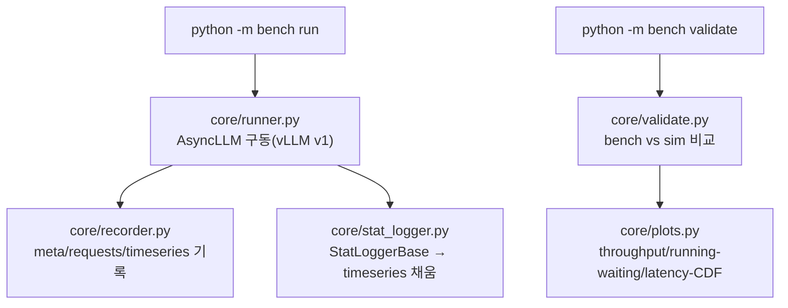

# `bench/__init__.py` 분석

**엔드투엔드 vLLM 벤치마크 + 시뮬레이터 검증 패키지 초기화**입니다. 실제 vLLM을
구동해 요청별 타임스탬프와 tick별 지표를 기록(`run`)하고, 완료된 벤치 결과를
동일 데이터셋의 시뮬레이터 출력과 비교(`validate`)합니다.

## 개요

| 항목 | 내용 |
| --- | --- |
| 역할 | 패키지 docstring(모듈 맵 + 출력 스키마) |
| 명령 | `python -m bench run` / `python -m bench validate` |
| 출력 | `bench/results/<run_id>/{meta.json, requests.jsonl, timeseries.csv}` |

## 블록 다이어그램

## 출력 스키마

| 파일 | 내용 |
| --- | --- |
| `meta.json` | 모델·vLLM 버전·engine kwargs·데이터셋 해시·시작/종료 시각 |
| `requests.jsonl` | 요청별 arrival/queued/scheduled/first_token/last_token, 입출력 토큰 수 |
| `timeseries.csv` | tick별 prompt/gen throughput, running/waiting, kv_cache_pct |

## 참고

- `run`은 실측 ground truth를, `validate`는 시뮬레이터 정확도 검증을 담당하는
  두 축입니다.
