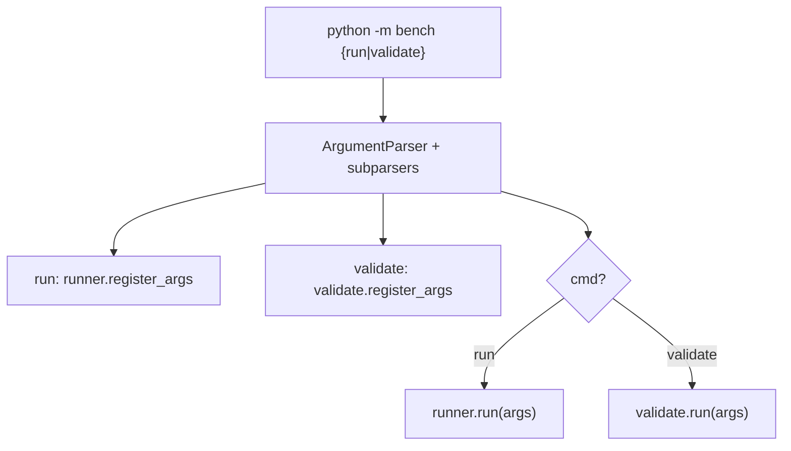

# `bench/__main__.py` 분석

**bench CLI 디스패치**입니다(`python -m bench {run,validate} ...`). `run`(vLLM
벤치마크 실행·기록)과 `validate`(벤치 결과를 시뮬레이터 출력과 비교) 두 서브커맨드로
분기합니다.

## 개요

| 항목 | 내용 |
| --- | --- |
| 역할 | run/validate 서브파서 구성 및 디스패치 |
| 진입 함수 | `main()` |
| 지연 임포트 | 서브커맨드 모듈을 필요 시점에만 임포트(vLLM 없이 --help/validate 동작) |

## 블록 다이어그램

## 주요 구성 요소

| 요소 | 역할 |
| --- | --- |
| `main` | 서브파서 구성, 인자 등록, 디스패치 |

## 참고

- 서브커맨드 모듈(`runner`/`validate`)의 `register_args`와 `run`을 지연 임포트하여,
  vLLM이 설치되지 않은 환경에서도 `validate`나 `--help`가 동작합니다.
