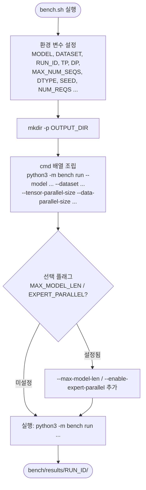

# `bench/bench.sh` 분석

**실제 vLLM 벤치마크를 실행**하는 호스트 측 래퍼입니다. 환경 변수로 설정된 값을 모아
`python -m bench run` 명령을 조립하고, 결과를 `bench/results/<run_id>/`에 기록합니다.

## 개요

| 항목 | 내용 |
| --- | --- |
| 목적 | 워크로드를 실제 vLLM으로 재실행하여 ground-truth 산출물 생성 |
| 실행 위치 | vLLM Docker 컨테이너(또는 베어메탈 venv) |
| 제어 방식 | 환경 변수(`${VAR:-기본값}`) |
| 출력 | `bench/results/<RUN_ID>/` (meta.json, requests.jsonl, timeseries.csv) |

## 블록 다이어그램

## 주요 변수

| 변수 | 기본값 | 의미 |
| --- | --- | --- |
| `MODEL` | `Qwen/Qwen3-32B` | 벤치할 모델 |
| `DATASET` | sharegpt-qwen3-32b-300-sps10.jsonl | 재실행할 워크로드 |
| `RUN_ID` | 타임스탬프 | 실행 식별자 |
| `TP` / `DP` | 2 / 1 | 텐서/데이터 병렬 차수 |
| `MAX_NUM_SEQS` / `MAX_NUM_BATCHED_TOKENS` | 128 / 2048 | 스케줄러 제한 |
| `DTYPE` / `KV_CACHE_DTYPE` | bfloat16 / auto | 정밀도 |
| `NUM_REQS` | 0(전체) | 재실행 요청 수 |
| `EXPERT_PARALLEL` | 0 | 1이면 MoE expert 병렬 활성화 |

## 단계별 분석

1. **경로 해석 + 변수 설정** — 저장소 루트로 이동하고 환경 변수 기본값을 설정합니다.
   `MAX_MODEL_LEN`은 빈 값이면 모델 기본값을 사용합니다.
2. **출력 디렉터리 생성** — `mkdir -p "$OUTPUT_DIR"`.
3. **명령 조립** — `cmd` 배열에 필수 인자를 채우고, `MAX_MODEL_LEN`이 비어있지
   않으면 `--max-model-len`을, `EXPERT_PARALLEL == 1`이면
   `--enable-expert-parallel`을 조건부로 추가합니다.
4. **실행** — 조립한 명령을 출력한 뒤 실행하고, 완료 시 결과 경로를 안내합니다.

## 참고

- 인라인 오버라이드 예: `MODEL=meta-llama/Llama-3.1-8B TP=1 ./bench/bench.sh`.
- 생성된 산출물은 이후 `bench/validate.sh`로 시뮬레이터 출력과 비교합니다.
