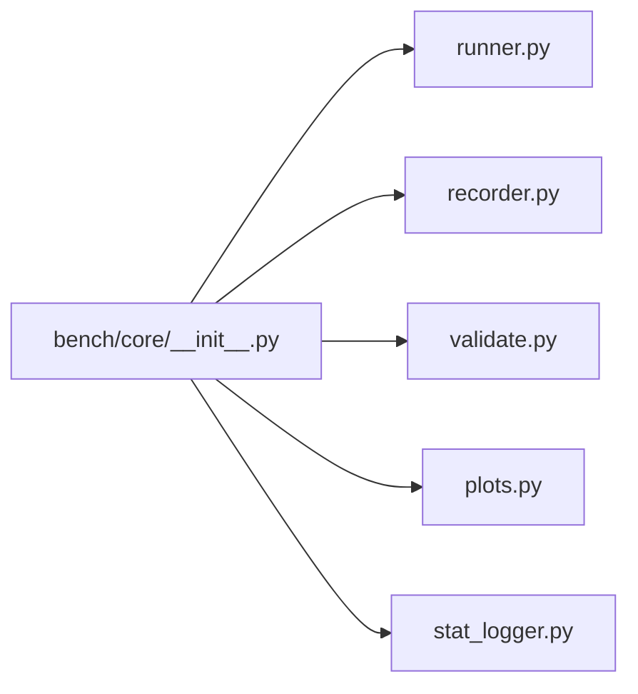

# `bench/core/__init__.py` 분석

**bench 내부 서브패키지 마커**입니다. vLLM runner·recorder·validate·plot 헬퍼 등
벤치마크 내부 구현을 담는 패키지의 초기화 파일입니다(docstring만).

## 개요

| 항목 | 내용 |
| --- | --- |
| 역할 | `bench.core` 서브패키지 선언 |
| 내용 | 실행 코드 없음 |

## 블록 다이어그램

## 참고

- 코드 없이 서브패키지 임포트를 가능하게 하는 표준 파일입니다.
