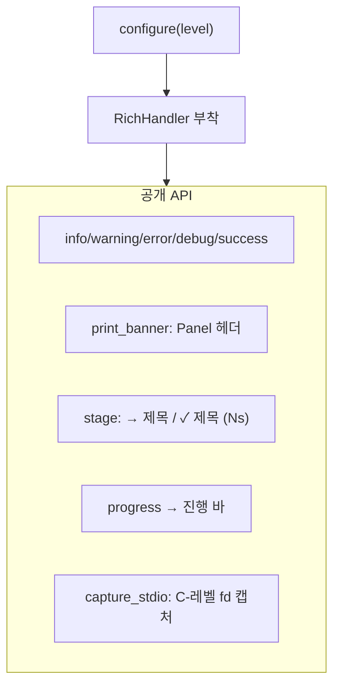

# `bench/core/logger.py` 분석

**bench 모듈용 로거 + 진행 UI**입니다. `profiler.core.logger`와 형태를 맞춰 세
모듈(profiler/bench/serving)이 동일한 룩앤필과 호출 패턴을 공유합니다. bench
패키지의 다른 코드는 `print()` 직접 호출이 금지되며, 모든 출력이 이 모듈을 거칩니다.

## 개요

| 항목 | 내용 |
| --- | --- |
| 역할 | 통합 로깅 + 진행 바 + vLLM stdio 캡처 |
| 기반 | 표준 `logging` + `rich` |
| 임포트 관례 | `from bench.core import logger as log` |

## 블록 다이어그램

## 주요 구성 요소

| 요소 | 역할 |
| --- | --- |
| `configure` | 로거 초기화(로그 레벨 = verbosity) |
| `info`/`warning`/`error`/`debug`/`success` | 레벨 래퍼 |
| `print_banner` | Rich Panel 시작 배너 |
| `stage` | 단계 브래킷(→/✓/✗) |
| `progress` | Rich 진행 바 |
| `capture_stdio` | vLLM 부팅 시 C-레벨 stdout/stderr 캡처 |

## 참고

- profiler/serving 로거와 동일한 패턴으로 세 모듈의 출력 룩앤필을 통일합니다.
- vLLM 워커는 C++/CUDA 초기화에서 출력하여 Python 스트림을 우회하므로
  `capture_stdio`가 fd 레벨로 캡처합니다.
