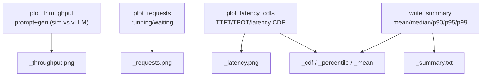

# `bench/core/plots.py` 분석

**`bench validate`용 플롯 헬퍼**입니다. 세 개의 matplotlib PNG와 평문 요약 표를
validation 출력 디렉터리에 기록합니다. matplotlib은 각 헬퍼 내부에서 지연
임포트하여 미설치 환경(예: `--help`)에서도 모듈 임포트가 가능합니다.

## 개요

| 항목 | 내용 |
| --- | --- |
| 역할 | throughput/requests/latency 플롯 + 요약 표 생성 |
| 산출 | `<prefix>_{throughput,requests,latency}.png`, `<prefix>_summary.txt` |
| 백엔드 | matplotlib Agg(지연 임포트) |

## 블록 다이어그램

## 주요 구성 요소

| 요소 | 역할 |
| --- | --- |
| `plot_throughput` | prompt/gen throughput 2단 플롯(sim vs vLLM) |
| `plot_requests` | running/waiting 요청 수 플롯 |
| `plot_latency_cdfs` | TTFT/TPOT/latency CDF 플롯 |
| `write_summary` | 지표별 mean/median/p90/p95/p99 텍스트 표 |
| `_cdf` / `_percentile` / `_mean` | CDF·백분위·평균 계산 헬퍼 |
| `_save_fig` / `_name` | figure 저장·파일명 헬퍼 |

## 참고

- matplotlib을 각 함수 내부에서 지연 임포트하여 미설치 환경에서도 모듈 임포트가
  가능합니다(`matplotlib.use("Agg")`로 헤드리스 렌더).
- 모든 플롯이 sim은 점선(C1), vLLM은 실선(C0)으로 일관되게 표시됩니다.
