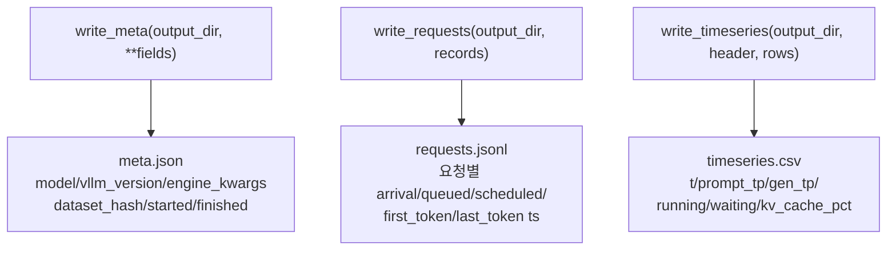

# `bench/core/recorder.py` 분석

**bench 출력 writer**입니다. 한 벤치 실행의 세 산출물(`meta.json`,
`requests.jsonl`, `timeseries.csv`)을 기록합니다. 스키마를 이곳에 두어 writer
(runner.py)와 reader(validate.py)가 별도 스키마 파일 없이 일관되게 유지됩니다.

## 개요

| 항목 | 내용 |
| --- | --- |
| 역할 | 벤치 결과 3종 파일 기록 + 스키마 정의 |
| 산출 | `meta.json` / `requests.jsonl` / `timeseries.csv` |
| 진입점 | `write_meta`, `write_requests`, `write_timeseries` |

## 블록 다이어그램

## 주요 구성 요소

| 요소 | 역할 |
| --- | --- |
| `write_meta` | 실행 메타데이터 JSON(스키마 버전 포함) |
| `write_requests` | 요청별 flat 레코드를 JSONL로 |
| `write_timeseries` | tick별 지표를 CSV로 |
| `META_SCHEMA_VERSION` | 메타 스키마 버전 상수 |

## 참고

- 스키마를 recorder에 집중시켜 runner(writer)와 validate(reader)의 정합을 유지합니다.
- `requests.jsonl`의 타임스탬프는 절대 epoch 초입니다.
