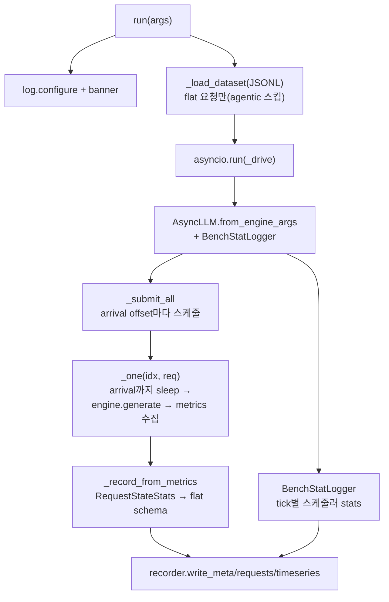

# `bench/core/runner.py` 분석

**vLLM 벤치마크 러너**입니다. LLMServingSim 형식 JSONL 워크로드를 읽어 각 요청을
`input_tok_ids`와 `output_toks`를 고정한 채 vLLM(AsyncLLM)으로 재생(strict replay)하여,
시뮬레이터가 보는 동일 워크로드와 bit-for-bit 비교 가능한 결과를 만듭니다.

## 개요

| 항목 | 내용 |
| --- | --- |
| 역할 | 데이터셋 엄격 재생 → 요청별 타임스탬프 + tick별 지표 기록 |
| 엔진 | `vllm.v1.engine.async_llm.AsyncLLM`(비동기) |
| 출력 | `<output-dir>/{meta.json, requests.jsonl, timeseries.csv}` |
| 재생 | `min_tokens=max_tokens=n_out`, `ignore_eos`로 출력 길이 정확 고정 |

## 블록 다이어그램

## 주요 구성 요소

| 요소 | 역할 |
| --- | --- |
| `register_args` | run 서브커맨드 인자(model/dataset/output-dir/tp/dp/engine 설정) |
| `run` | 로거 설정 + 데이터셋 로드 + async 드라이버 실행 |
| `_load_dataset` | JSONL 로드(agentic 세션 스킵, `input_tok_ids` 필수) |
| `_drive` | AsyncLLM 부팅 → 요청 제출 → 결과 persist |
| `_submit_all` / `_one` | arrival offset에 맞춰 각 요청 스케줄·생성·metrics 수집 |
| `_record_from_metrics` | `RequestStateStats`를 flat per-request 스키마로 투영 |
| `_engine_kwargs_for_meta` / `_hash_file` | meta용 엔진 kwargs·데이터셋 해시 |

## 참고

- strict replay: `ignore_eos`로 조기 종료를 막고 `min_tokens`로 async-scheduling
  early-exit도 막아 `n_out`을 정확히 고정합니다.
- vLLM 심볼은 지연 임포트하여 `validate`/`--help`가 vLLM 없이 동작하게 합니다.
- 데이터셋 자체는 수정하지 않습니다(생성은 `workloads/generators` 담당).
