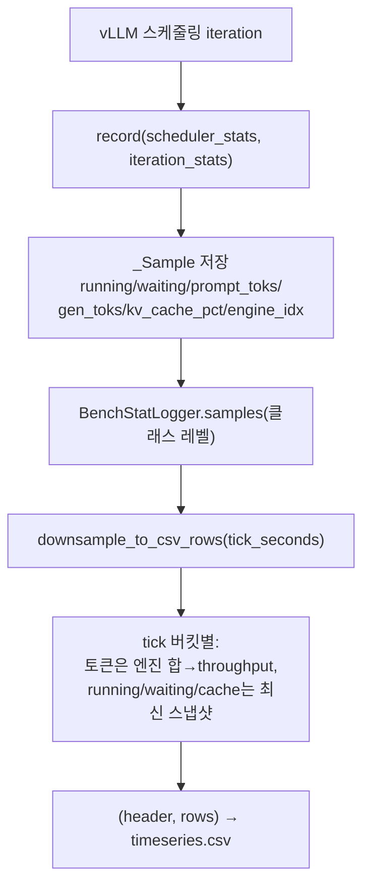

# `bench/core/stat_logger.py` 분석

**커스텀 vLLM stat 로거**입니다. `StatLoggerBase`를 상속하여 매 스케줄링
iteration의 스케줄러/iteration stats를 메모리에 저장하고, 러너가 종료 시 이를
`tick_seconds`로 다운샘플링하여 `timeseries.csv`로 기록합니다.

## 개요

| 항목 | 내용 |
| --- | --- |
| 역할 | vLLM 스케줄러/iteration stats를 tick별로 수집 |
| 클래스 | `BenchStatLogger`(StatLoggerBase), `_Sample`(dataclass) |
| 저장 | 클래스 레벨 `samples` 리스트(모든 DP 엔진 공유) |
| 다운샘플 | `record()`는 iteration마다 호출되므로 `tick_seconds`로 버킷팅 |

## 블록 다이어그램

## 주요 구성 요소

| 요소 | 역할 |
| --- | --- |
| `_Sample` | 한 iteration 스냅샷(t/running/waiting/prompt·gen 토큰/kv_cache_pct/engine) |
| `BenchStatLogger.record` | vLLM stats를 `_Sample`로 저장(DP 엔진별) |
| `reset` | 클래스 레벨 상태 초기화(실행 시작 시) |
| `downsample_to_csv_rows` | 원시 샘플을 tick 윈도우로 버킷팅 → CSV 행 |

## 다운샘플 규칙

- **토큰(throughput)**: 버킷 내 엔진 간 prompt/gen 합을 tick으로 나눠 tok/s.
- **running/waiting/cache**: 버킷 내 각 엔진의 **최신** iteration 스냅샷을 합/평균.

## 참고

- 한 인스턴스가 DP 엔진마다 생성되나 `samples`는 클래스 레벨로 공유되어 러너가
  하나의 timeseries로 기록합니다.
- vLLM은 벽시계 고정 주기가 아닌 iteration마다 `record()`를 호출하므로 다운샘플이
  파일 크기를 줄이면서 곡선 형태를 보존합니다.
