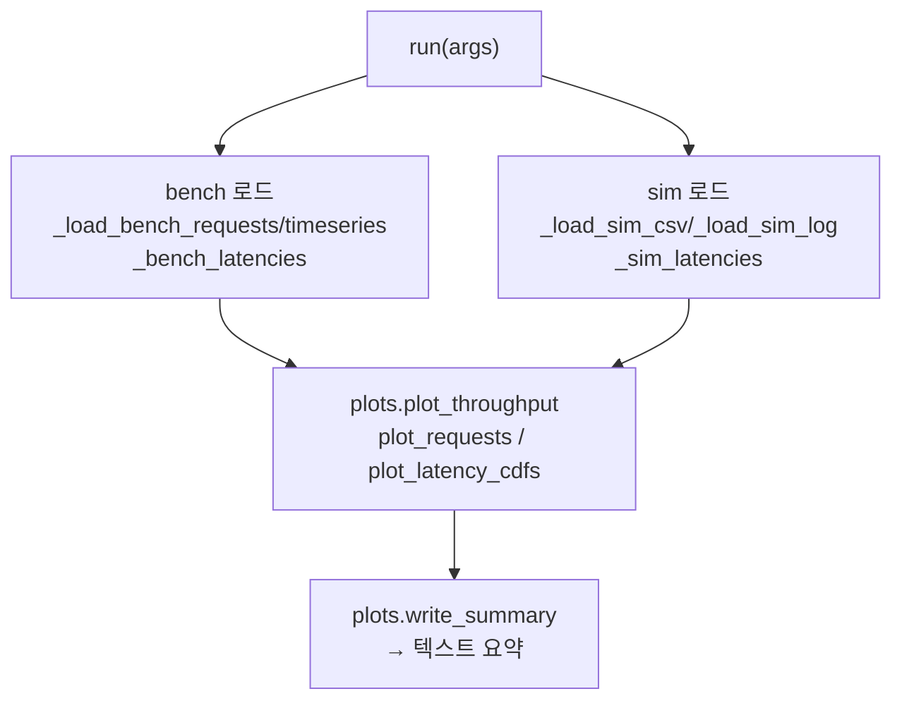

# `bench/core/validate.py` 분석

**벤치 실행 결과를 시뮬레이터 출력과 비교**합니다. `<bench_dir>`의 결과와
시뮬레이터의 `sim.csv`/`sim.log`를 읽어 양측에서 TTFT/TPOT/e2e latency를 유도하고,
플롯과 텍스트 요약을 `<bench_dir>/<output-subdir>/`에 기록합니다.

## 개요

| 항목 | 내용 |
| --- | --- |
| 역할 | bench vs sim 지표 비교 → 플롯 + 요약 |
| 진입점 | `register_args`, `run(args)` |
| 입력 | bench: requests.jsonl/timeseries.csv, sim: sim.csv/sim.log |
| 지표 정의 | 양측 동일(diff% 의미 있게) |

## 블록 다이어그램

## 주요 구성 요소

| 요소 | 역할 |
| --- | --- |
| `register_args` / `run` | validate 인자 등록, 로드·비교·플롯 오케스트레이션 |
| `_load_bench_requests` / `_load_bench_timeseries` | bench JSONL/CSV 파싱 |
| `_bench_latencies` | `RequestStateStats`에서 TTFT/TPOT/e2e(ms) 계산 |
| `_bench_arrival_ts` / `_same_time_domain` | arrival 타임스탬프의 시계 도메인 정합 처리 |
| `_load_sim_csv` / `_sim_latencies` | sim.csv(ns) 파싱 → ms 변환 |
| `_load_sim_log` | sim.log 정규식 파싱(tick별 running/waiting/throughput) |

## 지표 정의 (양측 일관)

- `TTFT = first_token_ts − arrival_time`(큐잉 포함).
- `TPOT = (last_token_ts − first_token_ts) / max(1, output_toks − 1)`.
- `e2e = last_token_ts − arrival_time`.

## 참고

- bench의 `requests.jsonl`은 혼합 시계 도메인(arrival은 epoch, lifecycle은
  monotonic)을 가질 수 있어, 불일치 시 `queued_ts`를 arrival 앵커로 사용합니다.
- sim.log의 여러 인스턴스 running/waiting을 tick마다 누적하여 한 행으로 방출합니다.
