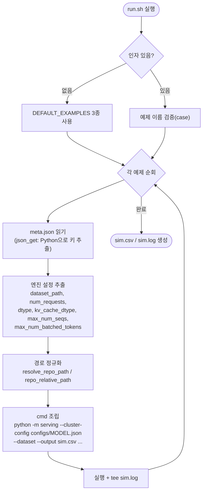

# `bench/examples/run.sh` 분석

번들된 **검증 예제**(Llama-3.1-8B, Qwen3-32B, Qwen3-30B-A3B)에 대해 **시뮬레이터
측을 재실행**하는 스크립트입니다. 각 예제의 `meta.json`(원본 vLLM 실행의 엔진 설정)을
읽어 동일한 설정으로 시뮬레이터를 구동합니다.

## 개요

| 항목 | 내용 |
| --- | --- |
| 목적 | 커밋된 vLLM bench와 동일 설정으로 시뮬레이터 재실행 → `sim.csv`/`sim.log` 생성 |
| 인자 | 예제 이름(없으면 3종 전체) |
| 핵심 로직 | `meta.json`에서 엔진 kwargs를 JSON 파싱하여 CLI 인자로 전달 |
| 경로 처리 | 절대/상대 경로를 저장소 루트 기준으로 정규화 |

## 블록 다이어그램

## 핵심 헬퍼 함수

| 함수 | 역할 |
| --- | --- |
| `json_get(path, key)` | Python heredoc으로 JSON 파일에서 점 표기 키(`engine_kwargs.dtype`)를 추출. bool은 `true`/`false` 문자열로 변환 |
| `resolve_repo_path(path)` | 상대 경로면 저장소 루트를 접두하여 절대 경로화 |
| `repo_relative_path(path)` | 절대 경로면 저장소 루트 기준 상대 경로로 변환(루트 밖이면 오류) |
| `run_example(model_dir)` | 위 함수들을 조합해 한 예제의 시뮬레이터 실행 전체를 수행 |

## 단계별 분석

1. **환경 설정** — `BLOCK_SIZE`, `LOG_LEVEL`, `NETWORK_BACKEND` 등 기본값을 정하고
   Rich 컬러 출력을 위해 `TERM`/`LANG`/`FORCE_COLOR`를 export합니다.
2. **예제 선택** — 인자가 없으면 `DEFAULT_EXAMPLES` 3종을, 있으면 `case`로 유효성을
   검증한 이름만 실행합니다(미지 이름은 `exit 2`).
3. **메타 파싱** — 각 예제의 `<model>/vllm/meta.json`과 `configs/<model>.json`
   존재를 확인하고, `json_get`으로 데이터셋 경로·요청 수·dtype·max_num_* 등을
   추출합니다.
4. **경로 정규화 + 실행** — 데이터셋/설정/출력 경로를 저장소 루트 기준으로 맞춘 뒤,
   저장소 루트에서 서브셸로 `python -m serving`을 실행하고 출력을 `sim.log`로
   `tee`합니다.

## 참고

- 이 스크립트는 vLLM을 다시 돌리지 않고 **커밋된 산출물의 설정만 재사용**하여
  시뮬레이터만 실행합니다. 실행 결과는 `bench/examples/validate.sh`로 비교합니다.
- 서브셸 `( cd "$REPO_ROOT"; ... )`로 작업 디렉터리 변경을 격리합니다.
