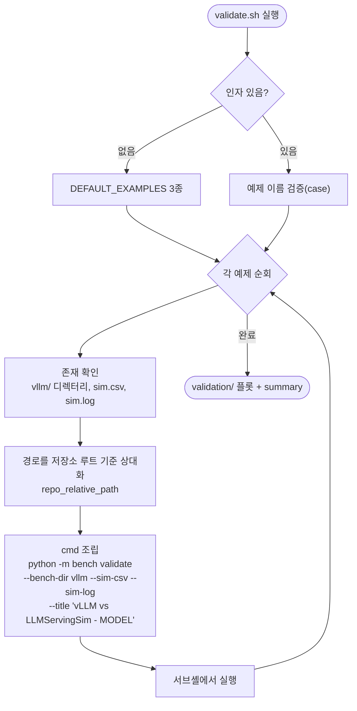

# `bench/examples/validate.sh` 분석

번들 예제 3종에 대해 **시뮬레이터 출력을 커밋된 vLLM 산출물과 비교**하는 상위
래퍼입니다. `run.sh`가 생성한 `sim.csv`/`sim.log`를 각 예제의 `vllm/` 참조와
대조하여 검증 플롯·요약을 만듭니다.

## 개요

| 항목 | 내용 |
| --- | --- |
| 목적 | 예제별 `python -m bench validate` 자동 실행(경로 자동 채움) |
| 인자 | 예제 이름(없으면 3종 전체) |
| 전제 | `run.sh`로 `sim.csv`/`sim.log`가 먼저 생성되어 있어야 함 |
| 출력 | `<model>/validation/` (플롯 + 요약) |

## 블록 다이어그램

## 단계별 분석

1. **환경 설정** — `OUTPUT_SUBDIR`(기본 `../validation`), `LOG_LEVEL`, `PREFIX`,
   `TITLE_PREFIX`를 정합니다.
2. **예제 선택** — 인자가 없으면 3종 전체, 있으면 `case`로 검증합니다.
3. **검증 실행(`validate_example`)** — 각 예제의 `vllm/` 디렉터리와
   `outputs/sim.csv`/`outputs/sim.log` 존재를 확인하고, 경로를 저장소 루트 기준
   상대 경로로 변환한 뒤 `python -m bench validate`를 조립합니다. 제목은
   `"<TITLE_PREFIX> - <model_dir>"` 형태이며, `PREFIX`가 있으면 `--prefix`를
   추가합니다. 저장소 루트에서 서브셸로 실행합니다.

## 참고

- `run.sh`와 대칭 구조(같은 헬퍼 `repo_relative_path`, 같은 예제 목록·검증 패턴)입니다.
- 반드시 `run.sh`를 먼저 실행해 시뮬레이터 출력을 생성해야 합니다.
