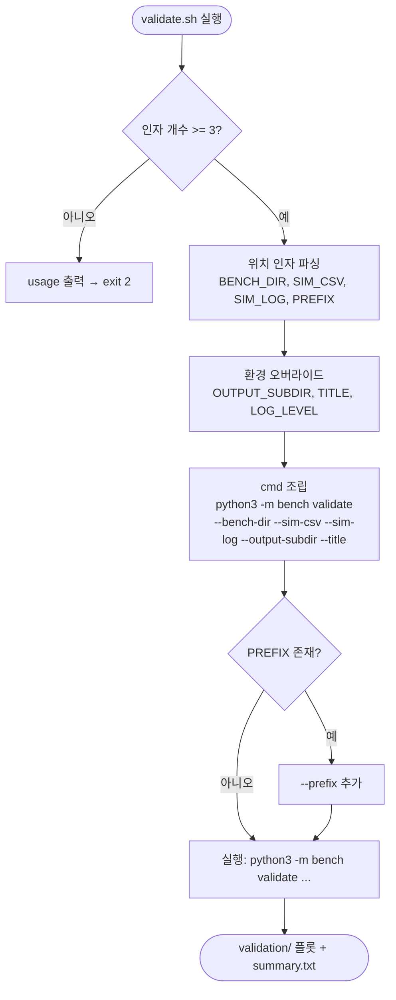

# `bench/validate.sh` 분석

완료된 bench 실행 결과를 **시뮬레이터 출력과 비교**하는 래퍼입니다. 위치 인자로
bench 디렉터리·시뮬레이터 CSV/로그를 받아 `python -m bench validate`를 호출합니다.

## 개요

| 항목 | 내용 |
| --- | --- |
| 목적 | vLLM bench 산출물 vs 시뮬레이터 출력 비교(플롯 + 수치 요약) |
| 사용법 | `./bench/validate.sh <bench_dir> <sim_csv> <sim_log> [prefix]` |
| 인자 검증 | 위치 인자 3개 미만이면 usage 출력 후 종료(exit 2) |
| 환경 오버라이드 | `OUTPUT_SUBDIR`, `TITLE`, `LOG_LEVEL` |

## 블록 다이어그램

## 단계별 분석

1. **인자 검증** — `$#`가 3 미만이면 usage를 stderr로 출력하고 `exit 2`합니다.
2. **인자 파싱** — 첫 3개 위치 인자를 `BENCH_DIR`/`SIM_CSV`/`SIM_LOG`로, 4번째
   선택 인자를 `PREFIX`로 받습니다. `OUTPUT_SUBDIR`/`TITLE`/`LOG_LEVEL`은 환경
   변수로 오버라이드 가능합니다.
3. **명령 조립 + 실행** — `cmd` 배열에 인자를 채우고, `PREFIX`가 비어있지 않으면
   `--prefix`를 추가한 뒤 실행합니다.

## 참고

- `bench/examples/validate.sh`는 번들 예제 3종에 대해 이 과정을 자동화한 상위 래퍼로,
  경로를 자동으로 채워 줍니다.
- 결과는 TTFT/TPOT/latency CDF·throughput 플롯과 diff% 요약(`summary.txt`)입니다.
