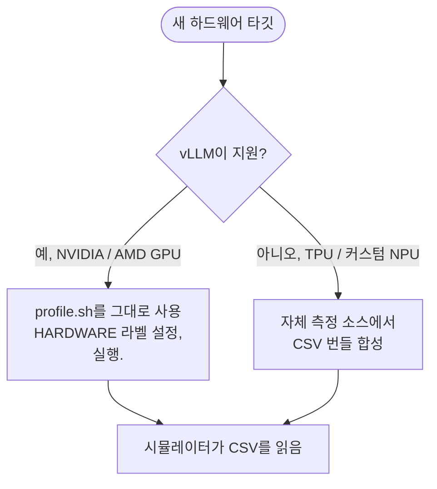

# 새 하드웨어 추가

이 페이지는 아직 `profiler/perf/<HARDWARE>/`에 프로파일 번들이 없는 완전히 새로운
하드웨어 타깃을 준비하는 워크플로우입니다. vLLM이 하드웨어를 지원하는지에 따라 두
가지 뚜렷한 경로가 있습니다:



**[출력 번들](./output-bundle)**에 설명된 CSV 번들 형식이 계약입니다. 하나를
생성하면, 데이터가 어떻게 수집되었든 시뮬레이터는 동일하게 동작합니다.

## 새 GPU 추가

이것이 쉬운 경우입니다. 프로파일러의 vLLM 기반 워크플로우가 이미 처리합니다. 세
단계:

### 1. vLLM 지원 확인

프로파일러는 기본적으로 vLLM `0.19.0`을 실행합니다(`scripts/docker-vllm.sh`가
`vllm/vllm-openai:v0.19.0`을 pull). vLLM의 릴리스 노트가 GPU를 언급하는지
확인하세요.

| GPU 계열 | vLLM 0.19.0 지원 |
| --- | --- |
| NVIDIA A100, H100, H200 | 예 |
| NVIDIA RTX PRO 6000, RTX 6000 Ada, L40S | 예 |
| NVIDIA Blackwell (B100, B200) | 예 (CUDA 13.x 이미지: `v0.19.0-cu130`) |
| NVIDIA Hopper SXM | 예 |
| AMD MI300X | 예 (ROCm 경로; `vllm/vllm-rocm` 필요) |
| AMD MI200 / 이전 | 제한적; vLLM 매트릭스 확인 |
| Intel Gaudi 3 | 제한적 (HPU 플러그인); 이 프로파일 경로로는 미지원 |

vLLM이 아직 지원하지 않으면 두 가지 옵션이 있습니다: vLLM이 지원을 추가하기를
기다리거나, vLLM upstream에 백엔드를 기여하기. 둘 다 빠르지 않습니다.

### 2. `profile.sh` 편집

```bash
HARDWARE="H100"                 # 또는 폴더 이름으로 원하는 무엇이든
TP_DEGREES="1,2,4,8"
MEASUREMENT_ITERATIONS=3
# ... 필요에 따라 다른 노브
```

`HARDWARE`는 단지 라벨입니다 — 기억할 만한 것을 선택하세요. 시뮬레이터는 나중에
`cluster_config.hardware`를 통해 이를 참조합니다.

특이한 GPU 유형의 경우 다음을 조정해야 할 수 있습니다:

- 메모리 제한에 대한 `MAX_NUM_BATCHED_TOKENS`와 `MAX_NUM_SEQS`
- KV cache 메모리가 유사 세대 HBM GPU보다 훨씬 작으면 `ATTENTION_MAX_KV`
- GPU가 bf16 지원이 없으면 `DTYPE`(최신 GPU에서는 드묾)

### 3. 실행

```bash
./profiler/profile.sh
```

기다리세요. 커피를 마시세요. 출력은 `profiler/perf/<HARDWARE>/<MODEL>/<variant>/`에
생성됩니다. 대략적 시간은 **[실행 → 예상 실행
시간](./running#expected-runtime)**을 참고하세요.

끝나면 시뮬레이터를 사용할 준비가 됩니다 — 추가 변경 없음. `cluster_config.json`을
`"hardware": "<HARDWARE>"`로 설정하고 실행하세요.

### AMD ROCm 참고

공식 `vllm/vllm-rocm` Docker 이미지가 AMD 상당물입니다. `scripts/docker-vllm.sh`를
편집하여 `vllm/vllm-openai` 대신 그 이미지를 pull하세요. 이미지 교체를 넘어서면
프로파일 워크플로우는 동일합니다.

`HARDWARE="MI300X"`(예를 들어): 말이 되는 것을 선택하세요.

## 비-GPU 하드웨어 추가

이것이 더 복잡한 경우입니다. vLLM 기반 프로파일러는 vLLM이 실행되지 않는
하드웨어(TPU, HPU 지원 없는 Intel Gaudi, 커스텀 NPU / 가속기)에는 동작하지 않습니다.
하지만 시뮬레이터는 데이터가 어떻게 생성되었는지가 아니라 **CSV 번들 형식**만
신경 씁니다.

전략: [출력 번들](./output-bundle) 형식으로 자체 측정 소스에서 CSV를 합성.

### 데이터를 위한 세 가지 소스

#### 1. 벤더 analytical / cycle-accurate 모델

대부분의 벤더는 자사 하드웨어에 대한 내부 성능 모델을 유지합니다. 접근 권한이
있으면:

- 벤더 모델을 사용하여 시뮬레이터의 아키텍처 YAML이 선언하는 레이어 유형(`qkv_proj`,
  `attention`, `down_proj` 등)의 커널 수준 지연을 계산.
- GPU 프로파일러가 하는 것과 같은 축을 스윕(`tokens`, `(prefill_chunk, kv_prefill,
  n_decode, kv_decode)`, `(tokens, activated_experts)`).
- **[출력 번들](./output-bundle)**에 문서화된 스키마로 CSV를 작성.

이는 레이어 간 상대 지연이 하드웨어의 실제 동작을 반영하므로 가장 정확한 시뮬레이터
예측을 생성합니다.

#### 2. 외부 시뮬레이터

analytical 계산 시뮬레이터(GEMM-perf, roofline, 또는 발표된 논문의 cycle-accurate
모델)가 있으면, 프로파일러가 프로파일했을 형상을 그것에 공급하고 같은 CSV 형식을
덤프하세요.

`profiler/models/<model_type>.yaml`의 아키텍처 YAML이 어떤 커널을 타이밍해야 하는지
선언합니다. `catalog:` 섹션의 각 항목에 대해 다음이 필요합니다:

- `dense` 카테고리: `tokens`의 함수로서의 지연.
- `per_sequence`: `sequences`의 함수로서의 지연.
- `attention`: `(prefill_chunk, kv_prefill, n_decode, kv_decode)`에 대한 4D 테이블.
- `moe`: `(local_tokens, activated_experts)`에 대한 2D 테이블.

#### 3. 데이터시트 / 공개 벤치마크에서 직접 작성

최후의 수단. 하드웨어에 대해 peak FLOP / 메모리 대역폭 / 지연 수치만 있으면:

1. 레이어 유형별 roofline 스타일 지연을 계산.
2. CSV를 작성. 거칠게 유지 — 축당 몇 행이면 1차 sanity check에 충분.
3. 같은 하드웨어 × 모델 조합에 대해 찾을 수 있는 공개 벤치마크에 대해 검증.

이는 (현실적인 커널 오버헤드 없는) 낙관적 예측을 생성하므로 신중하게 사용하세요.
다른 두 경로가 강력히 선호됩니다.

### `meta.yaml`에 넣을 것

합성할 때도 시뮬레이터의 런타임 경고가 제대로 동작하도록 `meta.yaml`을 작성하세요:

```yaml
profiler_version: "synthetic-v1"
vllm_version: "n/a"
gpu: "<HARDWARE>"
profiled_at: "<date>"

engine_effective:
  max_num_batched_tokens: <CSV가 커버하는 무엇이든>
  max_num_seqs: <동일>
  dtype: bfloat16
  kv_cache_dtype: auto

attention_grid:
  max_kv: <attention.csv가 커버하는 상한>
  chunks: "<콤마 구분 chunk 값>"
  n_decode: "<콤마 구분 값>"
  kv: "<콤마 구분 값>"

skew_fit:
  per_tp:
    1:
      method: "synthetic-constant"
      alpha_default: 0.3   # pooled 상수 폴백
```

skew 측정이 없으면(대부분의 비-GPU 경로는 없음), `skew.csv`와 `skew_fit.csv`를 완전히
**생략**하세요. 시뮬레이터가 그 부재를 감지하고 `meta.yaml`의 `alpha_default`를
상수 skew 보정으로 사용합니다.

### 건너뛸 수 있는 것

- 이기종 디코드 데이터가 없으면 `skew.csv`와 `skew_fit.csv`.
  `meta.yaml::skew_fit.per_tp.<TP>`에 `alpha_default`를 제공.
- 이 하드웨어에서 MoE를 모델링하지 않으면 `moe.csv`(MoE 모델 실행 시에만 필요).
- 시뮬레이션할 필요가 없는 TP 차수의 TP=N 폴더. 시뮬레이터는 클러스터 설정이
  요청하는 TP만 로드.

### 건너뛸 수 없는 것

- `dense.csv`: 모든 모델이 dense linear를 사용.
- `per_sequence.csv`: `lm_head`와 `sampler`는 항상 실행.
- `attention.csv`: 모든 모델에 어텐션이 있음.
- `meta.yaml`: 없으면 시뮬레이터가 variant를 해석할 수 없음.

### 검증

CSV 번들을 합성한 후:

1. **Smoke 테스트**: 작은 워크로드(`workloads/example_trace.jsonl`)와 새 `HARDWARE`를
   가리키는 단일 인스턴스 설정으로 시뮬레이터 실행.
2. **알려진 참조와 비교**: 하드웨어에 공개 모델의 발표된 지연 수치가 있으면, 일치하는
   워크로드를 실행하고 TTFT / TPOT가 합리적으로 일치하는지 확인.
3. **throughput 로그 sanity-check**: 반복별 `prompt_t`와 `decode_t` 값이 대략 말이
   되어야 함(10배 너무 높거나 낮지 않게).
4. 시작 시 **"extrapolation" 경고를 주시**. CSV가 너무 거칠면 시뮬레이터가 경고;
   정확도가 중요하면 관련 축을 촘촘하게.

## 이것이 사용되는 곳

CSV 번들이 `profiler/perf/<HARDWARE>/<MODEL>/<variant>/`에 있으면, 클러스터 설정이
일치하는 값을 명명할 때 시뮬레이터가 자동으로 선택합니다:

```json
{
  "hardware": "<HARDWARE>",
  "model_name": "<MODEL>",
  "tp_size": <N>
}
```

`--dtype`와 `--kv-cache-dtype` CLI 플래그는 `resolve_variant()`를 통해 올바른
`<variant>` 폴더로 해석됩니다(**[시뮬레이터 → 트레이스
생성](/docs/simulator/trace-generation#variant-resolution)** 참고).

## 다음 단계

- **[출력 번들](./output-bundle)**: 생성해야 하는(또는 프로파일러가 생성하게 하는)
  것의 스키마 레퍼런스.
- **[모델 아키텍처 추가](./adding-model-architecture)** — 별개의 관심사, 모델의
  `model_type`이 아직 `profiler/models/`에 없을 때만.
