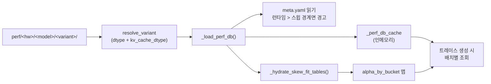

# 출력 번들

각 프로파일 실행은 `profiler/perf/<HARDWARE>/<MODEL>/<variant>/` 아래에 디렉터리
트리를 생성합니다. 이것이 **프로파일러와 시뮬레이터 사이의 계약**입니다: 올바른
형식으로 여기에 생성된 것은 무엇이든 생성 방법과 무관하게
`trace_generator._load_perf_db()`가 소비할 수 있습니다.

## 폴더 레이아웃

```
profiler/perf/<HARDWARE>/<MODEL>/<variant>/
├── meta.yaml
└── tp<N>/                        # 프로파일된 TP 차수당 폴더 하나
    ├── dense.csv
    ├── per_sequence.csv
    ├── attention.csv
    ├── moe.csv                   # MoE 모델 전용
    ├── skew.csv                  # skew 활성화 실행 전용
    └── skew_fit.csv              # skew 활성화 실행 전용
```

`<variant>`는 dtype 조합(`bf16`, `bf16-kvfp8`, `fp8-kvfp8`, …)에서 자동으로 이름
지어집니다: **[실행 → 출력 이름](./running#output-naming)** 참고. 같은 하드웨어 ×
모델에 대한 여러 variant는 형제로 존재합니다.

`tp<N>/`은 `TP_DEGREES`의 각 TP에 대해 존재합니다. 아키텍처 YAML에서 `tp_stable:
true`로 태그된 레이어(layernorm, sampler)는 TP=1에서 한 번 프로파일되고 writer에
의해 다른 TP 폴더로 **복제**됩니다.

## 시간은 마이크로초

모든 `time_us` 열은 **마이크로초** 단위입니다. 시뮬레이터가 로드 시 1000을 곱하고
나노초로 반올림합니다. CSV를 직접 작성한다면([비-GPU 하드웨어
추가](./adding-hardware#adding-non-gpu-hardware) 참고), μs를 사용하는 것을
기억하세요.

## `dense.csv`

```
layer,tokens,time_us
qkv_proj,128,42.3
qkv_proj,256,79.4
qkv_proj,512,154.2
o_proj,128,38.1
...
```

| 열 | 의미 |
| --- | --- |
| `layer` | 정식 레이어 이름(아키텍처 YAML의 catalog와 일치해야 함) |
| `tokens` | 이 shot의 `total_len` |
| `time_us` | 측정된 커널 지연, 마이크로초 |

시뮬레이터는 조회 시 **`tokens`에 대한 1D 선형 보간**을 합니다.

커버하는 레이어: `embedding`, `layernorm`, `qkv_proj`, `qk_norm`, `rotary_emb`,
`o_proj`, `gate_up_proj`, `act_fn`, `down_proj`, `final_layernorm`. (YAML의 catalog에서
카테고리 `dense`인 모든 것.)

## `per_sequence.csv`

```
layer,sequences,time_us
lm_head,1,18.4
lm_head,4,72.1
lm_head,16,289.2
sampler,1,6.7
...
```

| 열 | 의미 |
| --- | --- |
| `layer` | `lm_head` 또는 `sampler` |
| `sequences` | 이 shot의 `num_requests`(디코드 라운드는 시퀀스별로 작동) |
| `time_us` | 측정된 커널 지연 |

시뮬레이터: **`sequences`에 대한 1D 선형 보간**.

## `attention.csv`

4D 어텐션 테이블, pure-prefill, pure-decode, mixed 커널 형상을 커버:

```
prefill_chunk,kv_prefill,n_decode,kv_decode,time_us
0,0,1,128,12.4
0,0,1,256,18.7
0,0,4,128,32.1
512,2048,0,0,184.3
512,2048,4,128,221.6
...
```

| 열 | 의미 |
| --- | --- |
| `prefill_chunk` | 이 반복의 prefill chunk 토큰. `0` = pure decode |
| `kv_prefill` | prefill chunk가 어텐션하는 KV cache 히스토리 길이 |
| `n_decode` | 이 반복의 동시 디코드 요청 수. `0` = pure prefill |
| `kv_decode` | 디코드 요청이 어텐션하는 KV cache 히스토리 길이 |
| `time_us` | 측정된 어텐션 커널 지연 |

시뮬레이터는:

- `(prefill_chunk, n_decode)`에 대한 **최근접이웃**(이산 축)
- `(kv_prefill, kv_decode)`에 대한 **bilinear 보간**(연속)

그리드는 기하급수적입니다(기본 2배씩, `ATTENTION_CHUNK_FACTOR`와
`ATTENTION_KV_FACTOR`로 제어). 값이 작을수록 촘촘해짐; 클수록 약간의 정확도 비용으로
프로파일링을 빠르게 함.

## `moe.csv` (MoE 모델 전용)

```
tokens,activated_experts,time_us
1,8,4.2
4,8,12.8
8,8,21.4
1,16,7.1
...
```

| 열 | 의미 |
| --- | --- |
| `tokens` | dispatch 후 단일 랭크의 로컬 토큰 |
| `activated_experts` | 그 랭크에서 접촉된 구별되는 expert |
| `time_us` | 단일 랭크의 측정된 MoE 블록 지연 |

시뮬레이터: `(tokens, activated_experts)`에 대한 **2D 선형 보간**. **TP=1**에서만
프로파일 — TP를 늘려도 랭크별 expert 커널은 변하지 않음. 시뮬레이터는 재프로파일이
아니라 expert-to-rank 할당을 조정하여 `ep_size`를 처리.

## `skew.csv` (skew 활성화 실행)

원시 이기종 디코드 shot:

```
regime,n,nb,ratio,skew,pc,kp,kvs,kv_big,kv_mean,t_mean_us,t_max_us,t_skew_us,alpha
mixed,8,1,0.125,4.0,512,2048,512,2048,704,38.2,52.1,40.8,0.187
...
```

열은 각 bimodal 배치의 원시 형상과 세 측정을 캡처합니다:

| 열 | 의미 |
| --- | --- |
| `regime` | `pure`(디코드 전용) 또는 `mixed`(prefill chunk 포함) |
| `n` | 배치의 총 디코드 |
| `nb` | "big" 디코드 수(outlier KV 버킷) |
| `ratio` | `nb / n` |
| `skew` | big-KV 대 small-KV 비율(`kv_big / kvs`) |
| `pc` | prefill chunk 크기 |
| `kp` | prefill chunk의 KV 히스토리 |
| `kvs` | small-decode KV |
| `kv_big` | big-decode KV(`kvs * skew`) |
| `kv_mean` | `(nb * kv_big + (n-nb) * kvs) / n` |
| `t_mean_us` | 모든 디코드를 평균 kv로 균일하게 했을 때 지연 |
| `t_max_us` | 모든 디코드를 최대 kv로 균일하게 했을 때 지연 |
| `t_skew_us` | 실제 bimodal 혼합에서의 지연 |
| `alpha` | `(t_skew - t_mean) / (t_max - t_mean)` ∈ [0, 1] |

방법론: **[Skew & alpha 피팅](./skew-alpha-fit)**.

## `skew_fit.csv` (skew 활성화 실행)

시뮬레이터가 실제로 런타임에 소비하는 피팅된 버킷별 alpha 테이블:

```
pc,n_label,skew_rate_label,kv_big_label,kp_label,alpha,n_samples
0,n_8,sr_low,kvb_4096,kp_0,0.21,17
0,n_8,sr_low,kvb_4096,kp_2048,0.24,12
512,n_8,sr_high,kvb_8192,kp_2048,0.62,9
...
```

| 열 | 의미 |
| --- | --- |
| `pc` | prefill chunk 버킷(원본 값) |
| `n_label` | `n_decode` 버킷 라벨 |
| `skew_rate_label` | skew-rate 버킷 라벨(정규화 [0, 1] 방식) |
| `kv_big_label` | big-KV 버킷(log-4× bin) |
| `kp_label` | `kv_prefill` 버킷 라벨 |
| `alpha` | 이 버킷의 피팅된 weighted-LS alpha |
| `n_samples` | 기여한 `skew.csv` 행 수 |

버킷 축 정의는 `meta.yaml::skew_fit.bucket_axes`에 있으므로, 프로파일 스윕을
확장하면 시뮬레이터 코드 변경 없이 더 미세한 해상도가 자동으로 켜집니다.

## `meta.yaml`

`tp<N>/` 폴더의 형제. 세 그룹의 메타데이터:

```yaml
profiler_version: ...
vllm_version: 0.19.0
gpu: "RTXPRO6000"
profiled_at: "2026-04-30T14:23:11Z"

engine_effective:
  max_num_batched_tokens: 2048
  max_num_seqs: 256
  dtype: bfloat16
  kv_cache_dtype: auto

attention_grid:
  max_kv: 16384
  chunk_factor: 2.0
  kv_factor: 2.0
  chunks: "0, 32, 64, 128, 256, 512, 1024, 2048"
  n_decode: "0, 1, 2, 4, 8, 16, 32, 64, 128, 256"
  kv: "0, 32, 64, ..., 16384"

skew_profile:
  factors:
    n: 2.0
    pc: 2.0
    kp: 2.0
    kvs: 2.0
  grid:
    n: "..."
    ratio: "..."
    pc: "..."
    kp: "..."
    kvs: "..."
    skew: "1.5, 2.0, 4.0, 8.0, 16.0"

skew_fit:
  bucket_axes:
    n_label: ["n_2", "n_4", "n_8", "n_16", "n_32", "n_overflow"]
    skew_rate_label: ["sr_low", "sr_mid", "sr_high"]
    kv_big_label: ["kvb_1024", "kvb_4096", "kvb_16384", "kvb_overflow"]
    kp_label: ["kp_0", "kp_2048", "kp_8192", "kp_overflow"]
  per_tp:
    1:
      method: weighted_ls
      n_samples: 13247
      alpha_default: 0.34
      rel_err_p50: 0.027
      rel_err_p90: 0.148
      rel_err_p99: 0.31
      signed_mean: 0.004
      bucket_table: "tp1/skew_fit.csv"
    2:
      ...
```

시뮬레이터가 읽는 것:

- `engine_effective`: 런타임 값이 프로파일된 경계를 초과할 때 경고(조회가 외삽됨).
- `skew_fit.bucket_axes`: 런타임에 버킷 키를 빌드.
- `skew_fit.per_tp[tp].alpha_default`: 요청의 버킷이 `skew_fit.csv`에 없을 때 폴백.
- `attention_grid`와 `skew_profile`은 정보용(시뮬레이터가 소비하지 않음).

전체 버킷 → α 매핑은 `tp<N>/skew_fit.csv`에 있습니다. 시뮬레이터는 최초 로드 시 CSV를
인메모리 `alpha_by_bucket` 맵으로 로드합니다.

## 시뮬레이터가 이를 소비하는 방법



시뮬레이터 측 메커니즘은 **[시뮬레이터 → 트레이스
생성](/docs/simulator/trace-generation)**을 참고하세요.

## 함정

1. **시뮬레이션 결과를 "튜닝"하려고 CSV를 손으로 편집하지 마세요.** 시뮬레이터는 행에
   걸쳐 선형 보간합니다; 가짜 값은 디버그하기 어려운 비단조 동작을 생성합니다.
2. **`time_us`는 마이크로초입니다.** 외부 도구에서 CSV를 합성할 때 흔한 실수는
   나노초를 넣는 것입니다. 세 번 확인하세요.
3. **`dense.csv`의 레이어 이름은 아키텍처 YAML과 일치해야 합니다.** YAML에 레이어를
   추가하고 프로파일하지 않으면, 시뮬레이터가 일회성 경고를 하고(그 레이어에 0 지연을
   사용하여 조용히 결과를 손상). YAML 편집 후 프로파일을 재실행하세요.
4. **`tp<N>/` 폴더는 심링크가 아닙니다.** TP-stable 레이어는 writer가 물리적으로
   복사합니다. `tp1/dense.csv`를 편집해도 `tp2/`로 전파되지 않습니다.

## 다음 단계

- **[Skew & alpha 피팅](./skew-alpha-fit)**: `skew.csv`와 `skew_fit.csv` 뒤의
  방법론.
- **[비-GPU 하드웨어 추가](./adding-hardware#adding-non-gpu-hardware)** — 자체 측정
  소스에서 이 CSV 번들을 합성.
