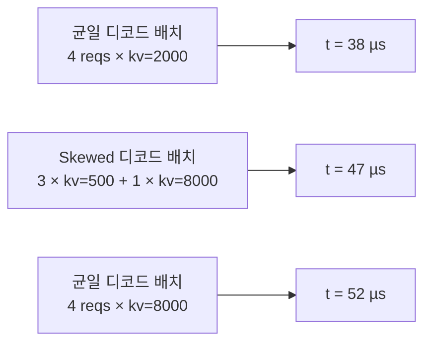

# Skew & alpha 피팅

균일 어텐션 스윕(`attention.csv`)은 모든 디코드가 하나의 KV 길이를 공유하는 배치를
프로파일합니다. 실제 서빙은 그렇지 않습니다 — 모든 반복은 높은 KV의 오래 실행되는
요청과 낮은 KV의 갓 도착한 요청을 섞습니다. FlashAttention의 varlen 커널은 그
이질성에 실제 페널티(타일 패딩 + SM 불균형)를 지불하며, 균일 그리드는 이를 볼 수
없습니다.

skew 스윕 + alpha 피팅이 시뮬레이터가 그 페널티를 올바르게 얻는 방법입니다.

## 한 그림으로 본 문제



같은 `n=4` 디코드와 같은 **평균** KV 2000(왼쪽과 가운데) 또는 **최대** KV
8000(가운데와 오른쪽)을 가진 세 배치. 가운데 배치의 지연은 두 균일 참조점 사이에
놓이지만, 정확히 어디인지는 KV 분포가 얼마나 skewed되었는지에 달려 있습니다.

순진한 보간 `t = t(mean_kv)`는 skewed 케이스를 과소평가합니다(예측 38 µs vs 실제 47
µs). `t(max_kv)`를 사용하면 과대평가합니다(52 µs vs 47 µs).

## 해결: 버킷별 alpha를 사용해 두 조회를 블렌딩

모든 skewed 배치 형상에 대해, 실제 지연을 측정하고 **더불어** 같은 형상에서
균일-평균과 균일-최대 지연이 무엇일지도 측정합니다. shot당 세 숫자:

| 심볼 | 배치 형상 |
| --- | --- |
| `t_mean` | 같은 `n`, 모든 디코드를 배치의 **평균** kv로 균일하게 |
| `t_max` | 같은 `n`, 모든 디코드를 배치의 **최대** kv로 균일하게 |
| `t_skew` | 실제 bimodal 혼합: `kv_big`의 `nb` 디코드 + `kvs`의 `(n - nb)` 디코드 |

이 셋으로부터:

```
alpha = (t_skew - t_mean) / (t_max - t_mean)   ∈ [0, 1]
```

Alpha는 **t_mean → t_max 선 위의 정규화된 위치**입니다:

- `alpha = 0` → 페널티 없음; skewed 배치가 균일-평균처럼 동작.
- `alpha = 1` → 완전 페널티; skewed 배치가 균일-최대처럼 동작.
- 일반적 값: 0.2–0.5.

시뮬레이션 시, 조회는 다음이 됩니다:

```
t_predicted = t_mean_lookup(batch.kv_decode_mean)
            + alpha(batch.shape) × (t_max_lookup(batch.kv_decode_max)
                                    - t_mean_lookup(batch.kv_decode_mean))
```

시뮬레이터는 **두 번의** 4D 어텐션 조회를 하고 블렌딩합니다. 그것이
`serving/core/trace_generator.py`의 `_lookup_attention_with_skew`입니다.

## 스윕 구조 (`skew.csv`)

skew 스윕은 `skew.csv` 행을 두 계층으로 생성합니다:

### Tier 1, (n, ratio, pc, kp, kvs)에 대한 factorial

하나의 대표 skew 계수(`_SKEW_REP = 4.0`)에서의 factorial 스윕. 대부분의 행을
제공하고 피팅이 구별하는 모든 `(pc, n_bin, kv_big_bin, kp_bin, skew_rate_bin)` 셀을
커버합니다.

축별:

- `n` ∈ `MAX_NUM_SEQS`까지의 고유 값
- `ratio = nb / n` ∈ 몇 개의 샘플 비율
- `pc` ∈ prefill chunk 그리드(0 = pure decode 포함)
- `kp` ∈ prefill-history 그리드
- `kvs` ∈ small-kv 그리드
- `skew` = 4.0 (고정)

### Tier 2, 앵커 피벗에서의 skew 축 스윕

몇 개의 앵커 피벗(Tier-1 셀의 고정 부분집합)에서 Tier 2는 `skew ∈ {1.5, 2.0, 4.0,
8.0, 16.0}`을 스윕합니다. 이는 `skew ≠ 4.0`인 행의 유일한 원천입니다; outlier KV가
늘어날 때 `alpha`가 어떻게 포화되는지 커버합니다.

Tier 2는 Tier 1 단독으로는 놓칠 "매우 긴 컨텍스트 디코드가 짧은 컨텍스트 배치에
합류" 실패 모드를 포착합니다.

## 밀도 노브

다섯 축 모두 `profile.sh`의 축별 기하 계수(기본 `2.0` = 2배씩)로 사용자가 제어
가능합니다:

| 변수 | 축 | 프로파일링 시간 영향 |
| --- | --- | --- |
| `SKEW_N_FACTOR` | `n` | 2배로 하면 shot이 절반 |
| `SKEW_PC_FACTOR` | `pc` | 동일 |
| `SKEW_KP_FACTOR` | `kp` | 동일 |
| `SKEW_KVS_FACTOR` | `kvs` | 동일 |

skew 스윕은 **케이스당 3 shot**(`t_mean`, `t_max`, `t_skew`)을 발사하므로, 성기게
하면 빠르게 복합됩니다. 어떤 계수든 `4.0`으로 올리면 그 축의 shot이 1/4이 됨; `8.0`은
다시 반으로.

유효 값은 `meta.yaml::skew_profile.factors`에 기록됩니다.

## 피팅 (`skew_fit.csv`)

원시 `skew.csv` 행은 런타임에 조회하기에 너무 세분화되어 있습니다 — 수백만 개의
`alpha`이며, 그중 어느 것도 런타임 배치 형상과 정확히 일치하지 않습니다. 후처리
피팅은 행을 다섯 축을 따라 **버킷**으로 그룹화하고 버킷별 가중 최소제곱 피팅을
실행합니다.

### 5축 버킷 키

| 축 | 버킷 방식 |
| --- | --- |
| `pc` | 고유한 `pc` 값당 하나의 버킷(원본) |
| `n_label` | 고유한 `n` 값당 하나의 버킷(`n=0` 센티널 + overflow) |
| `skew_rate_label` | 고정 정규화 [0, 1] 방식, `sr_low`, `sr_mid`, `sr_high` |
| `kv_big_label` | 관측된 최대까지 확장된 log-4× bin, `kvb_1024`, `kvb_4096`, `kvb_16384`, `kvb_overflow` |
| `kp_label` | 고유한 `kp` 값당 하나의 버킷 + overflow |

버킷 축 정의는 `meta.yaml::skew_fit.bucket_axes`에 기록되므로 시뮬레이터가 조회 시
같은 버킷 키를 빌드합니다. 프로파일 스윕을 확장하면 시뮬레이터 코드 변경 없이 더
미세한 해상도가 자동으로 켜집니다.

### 저장

- `skew_fit.csv`: 전체 버킷별 alpha 매핑. 일반적 스윕에 ~1000–5000 행.
- `meta.yaml::skew_fit.per_tp[tp]`: TP별 요약: `method`, `n_samples`,
  `alpha_default`, `rel_err_p50/p90/p99`, `signed_mean`, 그리고
  `tp<N>/skew_fit.csv`의 `bucket_table` 포인터.

이 분리는 `meta.yaml`을 variant당 ~3000+ 줄 대신 ~100 줄로 유지합니다.

### 번들된 프로파일의 피팅 정확도

번들된 모델의 RTXPRO6000 스윕 검증 결과:

| TP | n_samples | rel_err_p50 | rel_err_p90 | rel_err_p99 |
| --- | --- | --- | --- | --- |
| TP=1 | ~13 k | 2.7% | 14.8% | 31% |
| TP=2 | ~12 k | 3.5% | 16.4% | 32% |

p50과 p90은 held-out shot에 걸친 피팅된 alpha vs 측정된 alpha의 상대 오차입니다.
수치는 p50에서 이전 3축 피팅과 구별할 수 없지만 p90에서 ~10% 더 좋은데, 5축 버킷
방식이 Tier 2가 드러내는 `(skew_rate, kv_big)` 상호작용을 포착하기 때문입니다.

## Skip / refresh 모드

| 변수 | 효과 |
| --- | --- |
| `SKIP_SKEW=1` | 전체 skew 단계 건너뜀. `skew.csv`나 `skew_fit.csv` 생성 안 됨. 시뮬레이터는 런타임에 **pooled 상수 alpha**로 폴백 |
| `ONLY_SKEW=1` | skew 단계만 실행, `dense / per_seq / attention / moe` 미변경. 축 밀도 변경 후 skew 갱신에 유용 |

pooled 상수 alpha 폴백은 관측된 하드웨어에 걸쳐 대략 0.3입니다. skew 보정 없이는
이기종 디코드 워크로드에서 예측이 한 자릿수 퍼센트만큼 낮게 skew(허)됩니다 — 보통
1차 sanity check에는 괜찮습니다.

## 함정

1. **`skew_fit.csv`는 버킷 키**이지 원시 형상 키가 아닙니다. 일치하는 버킷이 없는
   런타임 배치는 `alpha_default`로 폴백합니다. 워크로드가 프로파일된 그리드 밖으로
   형상을 밀어내면 `alpha_default`가 지배할 것으로 예상하세요 — 더 넓은 그리드
   경계로 재프로파일하세요.
2. **`alpha < 0` 또는 `alpha > 1`은 피팅 시 잘립니다.** 측정 노이즈가 때때로 단일
   shot에서 범위 밖 원시 alpha를 생성합니다; 피팅은 이를 무시합니다.
3. **skew 보정은 사소하지 않은 배치에만 발사됩니다.** 순수 프리필(`n_decode == 0`)과
   순수 균일 디코드 배치는 보정이 필요 없습니다 — 균일 그리드가 이미 올바릅니다.
4. **MoE는 skew 보정을 받지 않습니다.** 시뮬레이터의 skew 경로는 어텐션 전용입니다.
   MoE 랭크별 지연은 2D `(tokens, activated_experts)` 테이블에서 직접 읽습니다.

## 다음 단계

- **[출력 번들 → `skew_fit.csv`](./output-bundle#skew_fitcsv-skew-enabled-runs)** —
  열별 레퍼런스.
- **[시뮬레이터 → 트레이스
  생성](/docs/simulator/trace-generation#heterogeneous-decode-skew-correction)** —
  alpha가 시뮬레이션 시 적용되는 방법.
