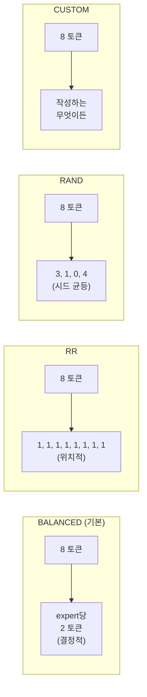

# MoE expert 라우팅

Mixture-of-Experts 모델의 경우, MoE 레이어를 방문하는 모든 토큰은 두 질문에 답이
필요합니다: **어떤 expert를 활성화하나**와 **어떤 EP 랭크가 그것을 보유하나**. 첫째는
모델의 gate 함수이고; 둘째는 시뮬레이터가 expert를 랭크에 할당하는 방법으로
결정됩니다. 이 페이지는 둘 다에 관한 것입니다.

> 설정 관점(`--expert-routing-policy` 플래그, 언제 어느 것을 쓸지)은 **[예제 →
> Expert parallel](/docs/examples/parallelism/expert-parallel)**에 있습니다. 이
> 페이지는 내부 메커니즘입니다.

## 이를 하는 조각: `GateRouter`

`serving/core/gate_function.py`가 `GateRouter`를 정의합니다. 트레이스 생성기가
시뮬레이션당 하나를 인스턴스화; 모든 MoE 블록에서 호출:

```python
GateRouter(
    num_local_experts=N,           # 모델의 총 expert
    num_experts_per_token=K,       # 토큰당 top-K 활성화
    routing_policy='BALANCED',     # 4개 정책 중 하나, 아래 참고
    seed=42,
    block_copy=True,
)

result = router.route(num_tokens=T, tp_rank=r, num_experts_per_token=K)
# → RoutingResult(local_tokens=[...], activated_experts=[...], source_tokens=[...])
```

`local_tokens[i]`는 dispatch 후 EP 랭크 `i`에 할당된 토큰 수. `activated_experts[i]`는
그 랭크에서 접촉된 구별되는 expert 수. 둘 다 랭크별 attention/MLP 지연 조회에
입력됩니다.

## 네 가지 정책



| 정책 | 결정성 | 모델링하는 것 | 언제 사용 |
| --- | --- | --- | --- |
| **BALANCED**(기본) | 결정적 | 이상화된 부하 균형 gate(aux-loss 학습 후) | 대부분의 연구 베이스라인 |
| **RR** | 결정적 | 순수 round-robin 할당 | Sanity / null-베이스라인 실행 |
| **RAND** | 시드 랜덤 | 토큰별 균등 랜덤 | 최악의 부하 불균형 연구 |
| **CUSTOM** | 플러그인 | 작성하는 무엇이든 | 실제 학습된 gate 가중치, ablation |

### BALANCED, 닫힌 형식 pigeonhole

BALANCED는 완벽하게 부하 균형된 gate가 생성할 *정확한* 토큰 분포를 계산합니다:
top-`K`를 가진 `T` 토큰과 `E` expert에 대해, 각 expert가 `T*K/E` 토큰을 얻습니다(정수로
반올림하기 위해 나머지가 expert에 걸쳐 결정적으로 분할됨).

이는 잘 학습된 보조 부하 균형 loss를 가진 모델이 기댓값으로 수렴하는 것입니다.
시뮬레이터의 기본값인 이유:

1. 실제 프로덕션 MoE 배포는 보조 loss를 사용 → 균형 분포가 현실적 베이스라인.
2. 결정적이므로 시뮬레이션이 재현 가능.
3. **block copy** 최적화를 활성화(아래 참고).

### RR, round-robin

토큰 *t*는 expert `t % num_local_experts`로 감. 토큰 내용과 무관하게 매 forward마다
같은 expert. sanity check나 "smart 라우팅 없음" 베이스라인을 원할 때 유용; 기댓값으로
BALANCED와 동일한 랭크별 토큰 수를 생성.

### RAND, 랜덤

토큰별 expert에 걸친 균등 랜덤(재현성을 위해 기본 `seed=42` 사용). 현실적 최악의 부하
불균형을 생성 — 일부 랭크가 다른 것보다 많은 토큰을 봄, 이는 *미학습* gate가 생성하는
것. 부하 불균형의 비용을 특별히 연구하려면 사용하세요.

### CUSTOM, 플러그인

`gate_function.py::GateRouter._custom_routing`을 편집하세요. 훅이 토큰 리스트를 받고
토큰별 expert 할당을 반환합니다. 실제 학습된 gate 가중치나 트레이스에서 학습된
모델로 라우팅을 구동하려면 사용하세요.

## Expert-to-rank 할당

어떤 정책이 "토큰 T는 expert E로 감"을 결정하든, 시뮬레이터는 "expert E는 어느 랭크에
사는가"도 알아야 합니다. 이는 **균등 파티셔닝**을 사용합니다:

```
rank_for_expert(e) = e * ep_size // num_experts
```

그래서 128 expert와 `ep_size=2`로, expert 0–63은 랭크 0에, 64–127은 랭크 1에 삽니다.
`ep_size=4`로, 각 랭크가 32 expert를 보유.

`GateRouter.route()` 출력은 토큰별 할당을 ASTRA-Sim이 트레이스의 `EXPERT {i}` 마커를
통해 소비하는 랭크별 토큰 수로 붕괴시킵니다.

## `block_copy`: 무엇을 의미하며 언제 안전한가

기본적으로 `block_copy=True`. 트레이스 생성기가 **첫 transformer 블록에 대해서만** 전체
트레이스를 생성하고 단일 `block_copy` Chakra 명령을 통해 모든 블록에 걸쳐 재생합니다.

다음에 **안전**:

- Dense 모델(MoE 없음, 모든 블록 동일).
- `BALANCED`를 가진 MoE(BALANCED가 결정적이고 무상태이므로 모든 블록이 같은 방식으로
  라우팅).

다음에 **근사**:

- `RR`을 가진 MoE(교대 round-robin 위치가 레이어별로 다름 — 실제로는 랭크별 수가 여전히
  거의 동일).
- `RAND`를 가진 MoE(블록별 랜덤성이 복사가 포착할 수 없는 분산을 생성).
- `CUSTOM`을 가진 MoE(작성한 것에 전적으로 의존).

블록별 분산이 중요한 연구의 경우, 트레이스 생성기에서 `enable_block_copy=False`를
설정하세요(또는 block_copy가 자동 비활성화되는 정책을 선택). 시뮬레이션이 더 느리게
실행되지만 블록별 트레이스를 생성합니다.

## 랭크별 지연 조회

모든 랭크의 MoE 블록 지연은 다음을 키로
`profiler/perf/<hw>/<model>/<variant>/tp1/moe.csv`에서 옵니다:

| 키 | 의미 |
| --- | --- |
| `local_tokens` | dispatch 후 이 랭크에 할당된 토큰 |
| `activated_experts` | 이 랭크가 접촉하는 *구별되는* expert 수 |

TP=1에서 프로파일(MoE에서 텐서 분할 없음, expert별 가중치가 이미 작음). 시뮬레이터는
두 축에 걸쳐 2D 선형 보간.

전체 MoE 블록 지연은 그다음 **max(rank_latencies)**인데, 랭크가 병렬로 실행되고
ALLTOALL 배리어에서 동기화하기 때문입니다. 가장 많은 토큰 × expert를 얻는 랭크가
지배합니다.

## MoE 블록을 둘러싼 ALLTOALL 비용

트레이스의 각 MoE 블록은 두 ALLTOALL collective 사이에 끼워집니다:

```
input_residue → dispatch ALLTOALL → expert compute → combine ALLTOALL → output_residue
```

- **Dispatch ALLTOALL**: 입력 activation을 각 랭크의 TP 샤드에서 할당된 expert를 보유한
  랭크로 라우팅.
- **Combine ALLTOALL**: expert 출력을 원래 랭크로 다시 모음.

둘 다 `comm_size = total_len * hidden_size * fp_size`(전체 activation 텐서; ASTRA-Sim이
랭크별로 나눔)를 가집니다.

**DP+EP** 토폴로지의 경우, `comm_size`가 DP 그룹에 걸친 최대로 동기화됩니다 — **[병렬화
메커니즘](./parallelism-mechanics)** 참고.

## 함정

1. **`block_copy`는 기본이 True**이며 비-BALANCED 정책에 대해 조용히 근사를 생성합니다.
   부하 불균형을 특별히 연구한다면 비활성화하세요.
2. **`activated_experts`는 토큰별이 아니라 랭크별입니다.** 8개 구별되는 expert를
   히트하는 100 토큰의 랭크는 `activated_experts = 8`을 보고하지 800이 아닙니다. 지연
   조회가 이 규약을 기대합니다.
3. **MoE는 TP=1에서 프로파일됩니다.** `tp_size`를 늘려도 MoE CSV 경로가 바뀌지
   않습니다. expert 가중치 분할은 `ep_size`를 통해 일어나며, 시뮬레이터가 재프로파일이
   아니라 rank-to-expert 매핑을 조정하여 처리합니다.
4. **`num_experts_per_tok`(top-K)**는 모델의 HF 설정에서 읽습니다. 학습된 값에서
   벗어나는 것은 시뮬레이션 시 괜찮지만 실제 모델의 동작과 일치하지 않습니다.
5. **DP 그룹의 dummy 배치도 gate를 통해 라우팅됩니다.** 1-토큰 dummy 배치가 실제 배치와
   정확히 같이 라우팅을 거치므로, DP+EP 결과가 wave에 걸쳐 일관됩니다.

## 다음 단계

- **[병렬화 메커니즘](./parallelism-mechanics)**: MoE 블록 주변의 ALLTOALL이 네트워크
  수준에서 어떻게 보이는지.
- **[예제 → Expert parallel](/docs/examples/parallelism/expert-parallel)** — 설정
  관점(언제 어느 `ep_size`를 쓸지).
- **[예제 → DP+EP MoE](/docs/examples/parallelism/dp-ep-moe)** — 다중 인스턴스 MoE.
