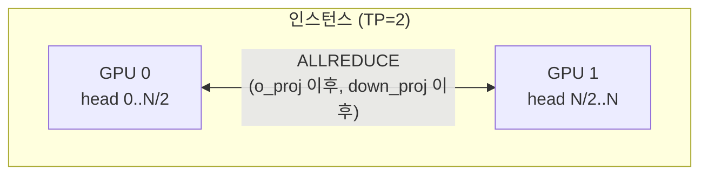
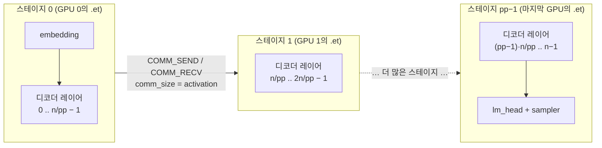
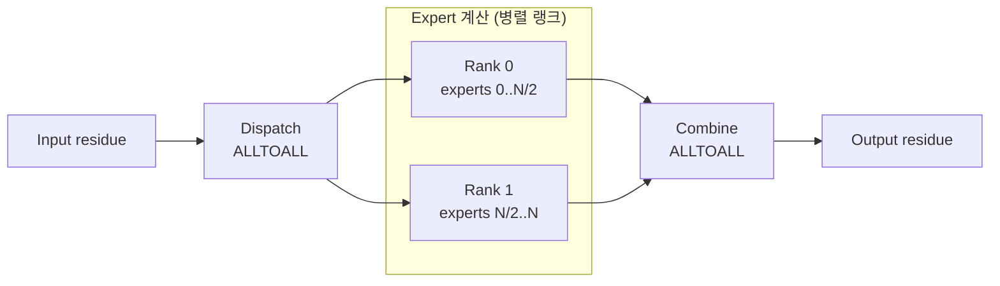
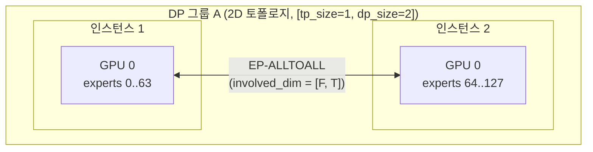
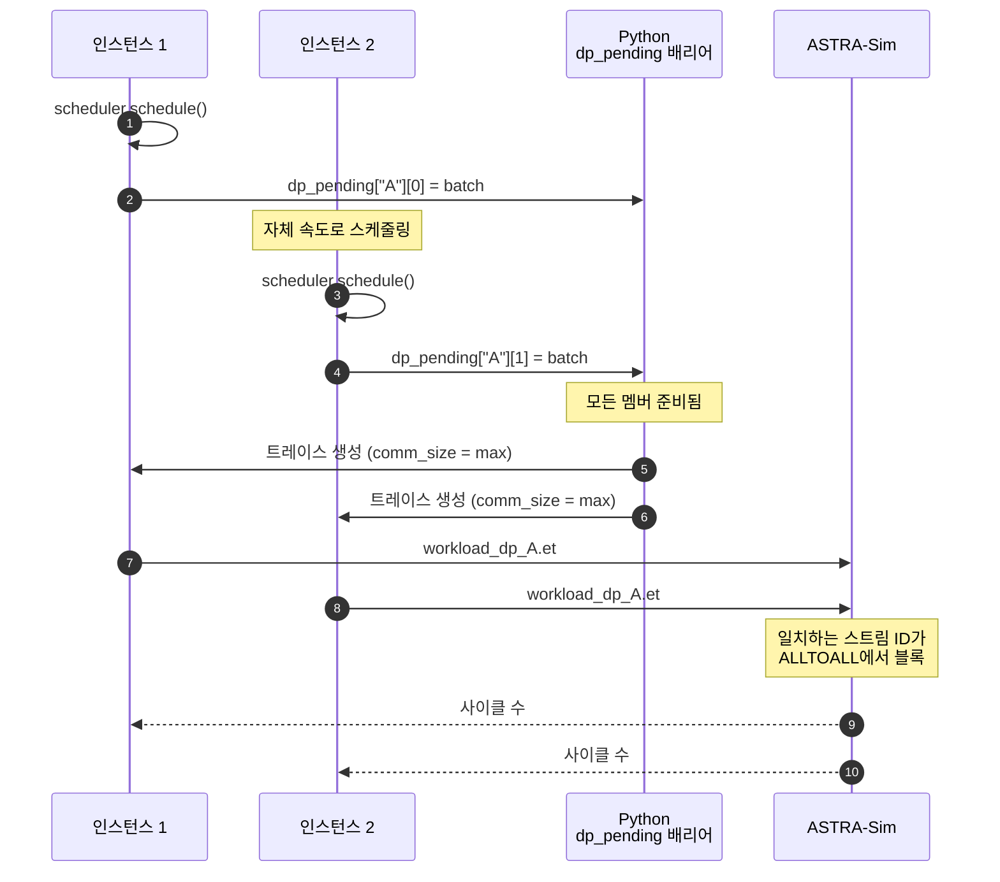

# 병렬화 메커니즘

이 페이지는 병렬화의 **런타임** 측면입니다: 배치가 ASTRA-Sim에 도달할 때, 어떤
collective가 어디서 발사되고, 다중 인스턴스 DP 그룹이 어떻게 동기화하는지. 클러스터
설정 관점(어떤 필드가 각각을 켜는지)은 **[예제 → 클러스터 설정
설명](/docs/examples/cluster-config-explained)**에 있습니다.

## 시뮬레이터가 모델링할 수 있는 것

| 방식 | 무엇이 병렬화되나 | Collective | 어디서 발사 |
| --- | --- | --- | --- |
| **TP**(텐서) | 선형 가중치를 head 차원으로 분할 | ALLREDUCE | `o_proj`와 `down_proj` 이후 |
| **PP**(파이프라인) | 디코더 레이어를 GPU 그룹에 걸쳐 분할 | (`inflight` 큐의 point-to-point) | 스테이지 경계에서 |
| **EP**(expert) | MoE expert를 랭크에 걸쳐 분할 | ALLTOALL | MoE 블록 주변 |
| **DP+EP** | 여러 인스턴스에 걸친 EP | ALLTOALL | 동일, 하지만 wave-sync로 인스턴스 경계를 넘어 |

TP와 EP는 같은 GPU를 공유할 수 있습니다. DP+EP는 클러스터 설정에 `dp_group`
식별자가 필요합니다.

## TP, 모든 dense 레이어의 ALLREDUCE



`tp_size > 1`일 때, 트레이스 생성기가 각 TP 인식 dense linear 이후에 ALLREDUCE
`COMM_COLL_NODE`를 부착합니다:

- `o_proj`(어텐션 출력 투영)
- `down_proj`(MLP 출력 투영)

이 둘은 각 TP 랭크가 출력의 다른 head 슬라이스를 보유하고 랭크에 걸쳐 합산해야 하는
두 레이어입니다.

각 ALLREDUCE의 `comm_size`는 전체 출력 텐서 크기입니다(랭크별이 아님 — ASTRA-Sim이
`nodes_in_ring`에 기반해 내부적으로 나눔).

`qkv_proj`, `gate_up_proj` 등은 입력을 head 차원으로 *분할*하므로 ALLREDUCE가 필요
없습니다 — 그 레이어의 출력이 이미 다음 레이어를 위해 올바르게 샤딩되어 있습니다.
TP의 collective 비용은 `o_proj` + `down_proj`, 즉 디코더 블록당 두 ALLREDUCE로
제한됩니다.

## PP, 파이프라인 스테이지와 `inflight`



`pp_size > 1`일 때, 스케줄러가 `pp_size` 항목으로 상한된 `inflight` 리스트를
유지합니다. 파이프라인이 가득 차면, `schedule()`이 `None`을 반환하고 ASTRA-Sim이
스테이지를 비우기를 기다립니다 — Megatron 스타일 1F1B와 같은 back-pressure 패턴.

트레이스 헤더에 `model_parallel_NPU_group: {pp_size}`가 찍힙니다. Chakra의
`llm_converter.py`가 반복별 레이어 리스트를 `pp_size`개 연속 그룹(`layers_per_group =
num_layers // pp_size`)으로 파티션하고 NPU당 하나의 `.et`를 생성합니다. 각 스테이지
경계에서 상류 NPU의 `COMM_SEND_NODE`를 하류의 일치하는 `COMM_RECV_NODE`와 짝지으며,
경계 activation 텐서로 크기를 정합니다.

따라서 스테이지 간 P2P 지연(링크 대역폭, hop 수, 경합)이 보고된 반복 시간의 일부이며,
진행 중 배치 간 파이프라인 오버랩이 각 NPU의 독립 `.et` 스케줄에서 나옵니다.

## EP, MoE 블록 주변의 ALLTOALL



MoE 모델의 경우, `trace_generator`가 MoE 블록을 두 ALLTOALL collective로 감쌉니다:

```
... → MoE dispatch ALLTOALL → expert compute → MoE combine ALLTOALL → ...
```

dispatch ALLTOALL은 각 토큰을 할당된 expert의 랭크로 라우팅합니다. combine ALLTOALL은
expert 출력을 원래 랭크로 모읍니다. 둘 다 EP 차원으로 스코핑됩니다.

각 EP 랭크는 **로컬** 토큰 수(dispatch 후)와 토큰당 **활성화된 expert**를 키로
`profiler/perf/<hw>/<model>/<variant>/tp1/moe.csv`에서 랭크별 지연을 얻습니다. 랭크가
병렬로 실행되고 ALLTOALL 배리어에서 동기화하며, 느린 랭크가 다른 것을 게이트합니다.

토큰 라우팅 결정은 `gate_function.py`에서 옵니다. 정책은 **[MoE expert
라우팅](./moe-expert-routing)**을 참고하세요.

## DP+EP, wave 동기화





여기서 시뮬레이터가 영리해집니다. 둘 이상의 인스턴스가 `dp_group`을 공유하면, 단일
조율된 wave를 형성합니다. 두 동기화 메커니즘이 함께 작동합니다:

### 1. Python 측 `dp_pending` 배리어

`__main__.py`에서, `dp_pending` dict가 현재 wave에 대해 어떤 DP 그룹 멤버가 배치를
스케줄했는지 추적합니다. 트레이스 생성은 모든 멤버가 스케줄할 때까지 **지연**됩니다.
마지막 멤버가 도착하면:

- 시뮬레이터가 그룹에 걸쳐 `dp_sum_total_len = sum(total_len)`과 `dp_max_total_len =
  max(total_len)`을 계산.
- `comm_size_alltoall`이 `dp_max_total_len * hidden_size * fp_size`로 설정됨: 그룹에
  걸친 *max*, 프로덕션 MoE 서빙의 CUDA-graph 패딩과 일치.
- 모든 멤버가 인스턴스별 `total_len`이 달라도 같은 `comm_size`로 트레이스를 생성.

한 DP 멤버에 대기 요청이 없으면, 스케줄러가 wave가 여전히 실행되도록 **dummy 배치**(1
디코드 토큰)를 합성합니다. 한 멤버의 실제 요청이 모두 끝났지만 다른 것은 아닐 때,
전체 그룹이 끝날 때까지 dummy 배치가 계속 흐릅니다.

### 2. ASTRA-Sim ALLTOALL 배리어

모든 DP 그룹 인스턴스의 `.et` 파일이 같은 워크로드 폴더(`dp_<group>_batch<bid>/llm.et`)를
공유하고 ALLTOALL collective에 **일치하는 스트림 ID**를 사용합니다. ASTRA-Sim의
런타임이 일치하는 ID를 보고 두 NPU가 collective에 도달할 때까지 블록하여, 네트워크
계층에서 wave-sync를 자연스럽게 구현합니다.

그래서 동기화의 양쪽, 즉 제출 시 Python 지연과 collective에서의 ASTRA-Sim 블록이
함께 결정적 wave-synchronous 스케줄을 생성합니다.

## 2D ASTRA-Sim 토폴로지와 `involved_dim`

`config_builder`는 DP 그룹이 있을 때 2D ASTRA-Sim 네트워크를 생성합니다. 토폴로지는
`npus_count: [tp_size, dp_group_size]`입니다. Collective는 각 `COMM_COLL_NODE`의
`involved_dim` BoolList를 통해 차원별로 스코핑됩니다:

- **TP-ALLREDUCE:** `involved_dim = [True, False]` — dim 0만.
- **EP-ALLTOALL:** EP가 DP 그룹에 걸칠 때 `involved_dim = [False, True]` — dim 1만;
  EP가 TP에도 걸치면 `[True, True]`.

`involved_dim`은 트레이스의 `comm_type` 필드에 `:dim0,dim1` 접미사로 인코딩됩니다:

```
ALLREDUCE:1,0     # TP만
ALLTOALL:0,1      # DP에 걸친 EP만
```

Chakra 변환기가 이를 `_parse_comm_type`으로 파싱하고 BoolList를 `.et` 파일에
씁니다. ASTRA-Sim의 `Workload::issue_comm`이 이를 읽고 관련 차원에서만 collective를
디스패치합니다.

`system.json` collective 구현은 토폴로지 차원당 하나의 항목이 필요하며,
`config_builder`가 이를 자동 생성합니다: 2D의 경우 `"all-to-all-implementation":
["ring", "ring"]`.

## 통신 크기 (ASTRA-Sim 의미론)

트레이스의 모든 `comm_size`는 NPU별이 아니라 **전체** 데이터 크기입니다. ASTRA-Sim이
ring 내 노드 수로 내부적으로 나눕니다(`msg_size = data_size / nodes_in_ring`).

그래서:

- `o_proj`의 ALLREDUCE: **전체 출력 텐서 크기**(`total_len * hidden_size *
  fp_size`) 전달.
- MoE의 ALLTOALL: **전체 activation 텐서 크기**(`total_len * hidden_size * fp_size`)
  전달.

트레이스 로그에서 놀랍도록 빠른 collective를 본다면, 실수로 랭크별 크기를 전달하고
있지 않은지 확인하세요 — 트레이스 생성기를 확장할 때 흔한 실수입니다.

## 언제 어느 것을 사용하나

대략적 결정 트리(*설정* 관점은 [예제 → 클러스터 설정
설명](/docs/examples/cluster-config-explained)에 있음):

- **단일 GPU가 모델에 맞음:** TP=1. 끝.
- **메모리를 위해 더 많은 GPU 필요:** TP로 시작. ALLREDUCE 비용이 `tp_size`와 함께
  커지므로, 4-8을 넘는 것은 좀처럼 가치가 없음.
- **처리량을 위한 여러 복제본:** `num_instances` 추가(`dp_group` 없음). 라우터 뒤의
  독립 인스턴스.
- **MoE 모델, 단일 인스턴스:** `ep_size = tp_size` 추가. 같은 GPU, MoE 블록에서
  EP-ALLTOALL이 TP-ALLREDUCE를 대체.
- **MoE, expert를 한 인스턴스의 GPU 너머로 확장하려면:** `dp_group`을 설정한 DP+EP.
  EP가 wave-sync를 통해 인스턴스에 걸침.

## 함정

1. **`ep_size > tp_size`는 `dp_group`이 필요합니다.** 그렇지 않으면 클러스터 설정
   빌더가 스펙을 거부합니다. EP는 단일 인스턴스의 GPU 수를 넘어 확장하려면 2D
   토폴로지가 필요합니다.
2. **Dummy 배치는 실제 ASTRA-Sim 작업입니다.** 유휴 인스턴스 하나를 가진 DP 그룹도
   dummy 배치에 ALLTOALL 비용을 지불합니다. 이것이 프로덕션의 모습입니다 — wave-sync는
   wave-sync입니다.
3. **`comm_size`는 max로 동기화됩니다.** 한 DP 멤버의 배치가 훨씬 작아도, ALLTOALL
   메시지 크기가 가장 큰 멤버와 일치합니다. 이는 *올바르며*(프로덕션 패딩과 일치)
   알아둘 가치가 있습니다.
4. **PP는 반복 내 마이크로 배치 분할이 아니라 send/recv를 통해 스테이지 간 forwarding을
   모델링합니다.** 스테이지 간 activation 전송은 ASTRA-Sim send/recv를 거치므로(링크
   대역폭과 경합이 결과에 나타남), 단일 반복은 여러 마이크로 배치로 청크되지
   않습니다 — 오버랩 이점은 최대 `pp_size`개 연속 반복을 동시에 실행하는 데서
   옵니다. 또한 파이프라인 스케줄(1F1B, interleaved 등)을 선택하는 노브도 없습니다.

## 다음 단계

- **[MoE expert 라우팅](./moe-expert-routing)**: dispatch ALLTOALL 전에 토큰이 EP
  랭크에 걸쳐 분배되는 방법.
- **[예제 → DP+EP MoE](/docs/examples/parallelism/dp-ep-moe)** — 이 전체 기계를
  사용하는 완성된 설정.
