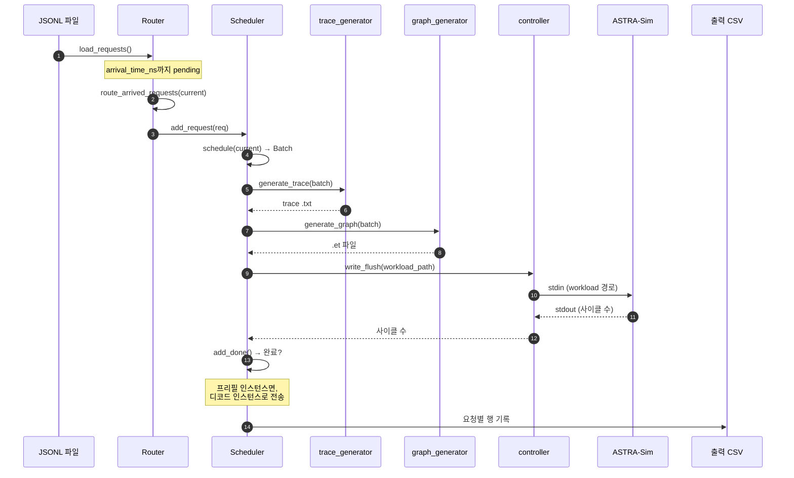

# 요청 생명주기

이 페이지는 단일 요청을 JSONL 파일에서 출력 CSV의 행까지 따라갑니다.
[아키텍처 개요](./architecture)와 같은 메인 루프지만, 요청의 관점에서입니다.

> *설정* 관점(각 기능을 활성화하는 방법)이 필요한가요? **[예제](/docs/examples)**를
> 참고하세요.



## 단계 1, Router로 로드됨

`python -m serving --dataset workloads/foo.jsonl`이 시작할 때,
`router.load_requests()`가 JSONL을 줄별로 파싱하고 `Request` 객체를 빌드합니다:

```python
class Request:
    id: int
    model: str
    arrival_time_ns: int
    input_tokens: int        # 프롬프트 길이
    output_tokens: int       # 최대 디코드 길이
    instance_id: int | None  # 라우팅 시 설정
    pd_type: str | None      # 라우팅되면 "prefill" 또는 "decode"
    session_id: str | None   # agentic 세션용
    sub_request_index: int   # flat은 0, 하위 요청은 증가
    input_tok_ids: list[int] | None   # prefix caching용
    # ...나중에 채워지는 지표: ttft_ns, first_token_time_ns 등
```

같은 파일에서 두 형식 지원:

- **Flat:** 하나의 JSONL 항목 = 하나의 독립 요청.
- **Agentic 세션:** 하나의 JSONL 항목 = 여러 체인 하위 요청을 가진 하나의 세션. 첫
  하위 요청만 큐잉; 나머지는 방출될 때까지 `Router._deferred_sessions`에 있음.

`arrival_time_ns > 0`인 요청은 아직 라우팅되지 **않습니다** — 도착 시각으로 정렬되어
`Router._pending_requests`에 들어갑니다.

## 단계 2, 도착 시각 대기

시뮬레이터 시계(`__main__.py`의 `current`, ns)는 ASTRA-Sim이 사이클 수를 반환하면서
앞으로 나아갑니다. `current >= request.arrival_time_ns`가 되면,
`router.route_arrived_requests(current)`가 요청을 `_pending_requests`에서 꺼냅니다.

모든 인스턴스가 유휴이지만 미래에 대기 요청이 있으면, `__main__.py`가 busy-loop을
피하기 위해 `current`를 다음 대기 도착 시각으로 직접 전진시킵니다.

## 단계 3, 인스턴스로 라우팅됨

라우터가 정책(`--request-routing-policy`)을 적용합니다:

| 정책 | 동작 |
| --- | --- |
| `LOAD`(기본) | vLLM 스타일: 가장 작은 `waiting * 4 + running` 점수의 인스턴스 선택 |
| `RR` | 순수 round-robin |
| `RAND` | 랜덤 균등 |
| `CUSTOM` | `serving/core/router.py`에서 플러그인 가능 |

**프리필/디코드 분리**의 경우, 라우터는 이 단계에서 프리필 인스턴스만 고려합니다.
디코드 인스턴스는 나중에 `transfer_prefill_request`를 통해 요청을 받습니다.

라우팅되면, 요청이 선택된 `Scheduler`의 waiting 큐(`scheduler.add_request(req)`)로
들어갑니다.

## 단계 4, 스케줄러가 집음

매 반복, `scheduler.schedule(current, sys)`가 다음 `Batch`에 포함할 요청을 결정합니다.
제약:

- `len(batch) <= --max-num-seqs`(시퀀스 수 상한)
- `sum(tokens_to_run) <= --max-num-batched-tokens`(토큰 예산)
- 요청별 `tokens_this_step <= --long-prefill-token-threshold` *(설정되면 청크 프리필을
  게이트)*

두 스케줄링 경로가 있습니다:

- **prefix caching 없이**(`schedule_base`): 순수 FIFO + 토큰 예산.
- **prefix caching 포함**(`schedule_with_prefix`): 동일 + 각 요청의 `hit_len`을
  반환하는 RadixCache 조회.

전체 메커니즘은 **[Continuous
batching](./scheduling/continuous-batching)**에 있습니다.

## 단계 5, Batch로 감쌈

`Batch`가 선택된 요청을 집계합니다:

```python
class Batch:
    batch_id: int
    instance_id: int
    fired: list[bool]    # NPU당 하나의 항목; 첫 NPU만 트레이스 생성
    total_len: int       # 이 반복의 토큰 합
    kv_len: int          # 이 스텝 후 KV-cache 토큰 합
    hit_len: int         # 요청에 걸친 prefix-cache 히트 합
    num_prefill: int
    num_decode: int
    q_list: list[int]    # 요청별 query 길이
    k_list: list[int]    # 요청별 KV 길이
    # ...
```

`fired` 리스트는 다중 NPU 인스턴스가 트레이스를 한 번만(랭크 0에서) 생성하도록
보장합니다; 다른 랭크는 단지 사이클 수를 읽어옵니다.

## 단계 6, 트레이스 생성됨

`trace_generator.generate_trace(batch, hardware, tp_size, ...)`가 모델의 아키텍처
YAML을 따라가며 프로파일 DB에서 레이어별 지연을 조회합니다:

- Dense 레이어(qkv, mlp 등) → `total_len`에 대한 1D 선형 조회.
- Per-sequence 레이어(`lm_head`, `sampler`) → `num_requests`에 대한 1D.
- Attention → `(prefill_chunk, kv_prefill, n_decode, kv_decode)`에 대한 4D 최근접이웃
  + bilinear. Skew 보정이 버킷별 `alpha`를 사용해 두 조회를 블렌딩.
- MoE → `(local_tokens, activated_experts)`에 대한 2D, TP=1에서 프로파일.

출력은
`astra-sim/inputs/runs/<run_id>/trace/<hw>/<model>/instance_{i}_batch_{b}.txt`의 탭
구분 텍스트 트레이스입니다. 텍스트 트레이스는 Chakra 변환기의 중간 입력이며,
`--no-cleanup-inputs`가 설정되지 않는 한 `.et` 그래프 생성 후 제거됩니다. 전체
메커니즘은 **[트레이스 생성](./trace-generation)**에 있습니다.

## 단계 7, Chakra 그래프로 변환됨

`graph_generator.generate_graph`가 Chakra의 텍스트→protobuf 변환기를 실행하여
`astra-sim/inputs/runs/<run_id>/workload/<hw>/<model>/instance_{i}_batch_{b}/llm.et`를
생성합니다. Chakra 워크로드는 ASTRA-Sim이 소비하는 동안 남아 있고;
`--no-cleanup-inputs`가 설정되지 않는 한 run 디렉터리가 시뮬레이션 성공 후 제거됩니다.

Chakra 변환기가 생성:

- 첫 레이어의 입력을 위한 `MEM_LOAD_NODE`(CPU → NPU).
- 각 계산 레이어를 위한 `COMP_NODE`.
- 마지막 레이어의 출력을 위한 `MEM_STORE_NODE`(NPU → CPU).
- ALLREDUCE / ALLTOALL collective를 위한 `COMM_COLL_NODE`, 다차원 토폴로지를 위한
  선택적 `involved_dim` BoolList 포함.

## 단계 8, ASTRA-Sim에 제출됨

`controller.write_flush(process, workload_path)`가 경로를 stdin으로 보냅니다.
ASTRA-Sim이 `.et` 파일을 읽고, 네트워크 토폴로지에 따라 계산 + 통신을 시뮬레이션하고,
방출:

```
Waiting <sys=0> id=42 cycle=178654321
```

`controller.read_wait`가 그 라인이 나타날 때까지 블록합니다.

**DP 그룹**의 경우, 두 인스턴스의 `.et` 파일이 같은 워크로드 폴더와 ALLTOALL
collective의 일치하는 스트림 ID를 공유합니다. ASTRA-Sim이 두 NPU가 collective에 도달할
때까지 블록하여 자연스럽게 wave-synchronize합니다.

## 단계 9, 완료 표시됨

`scheduler.add_done(npu_id, sys, current)`가 사이클 수를 소비합니다:

- 요청별 running 총계 갱신(이 반복에서 소요된 사이클을 `q_list`에 기반해 각 요청에
  귀속).
- 이 스텝에 디코딩을 끝낸 요청(`request.num_computed_tokens >= request.input +
  request.output`): `last_token_time_ns` 기록, `latency_ns` 계산, 완료 표시.
- 메인 루프에 `(prompt_throughput, decode_throughput, finished_requests)`를 반환.

프리필 인스턴스(`pd_type="prefill"`)의 경우, 완료된 요청이
`router.transfer_prefill_request`를 통해 디코드 인스턴스로 **전송**됩니다. KV cache
전송 비용은 KV 크기에 기반한 inter-link 대역폭으로 모델링됩니다.

## 단계 10, 출력

모든 요청이 끝나면(그리고 지연된 agentic 하위 요청이 없으면), 시뮬레이터가
`--output`으로 전달한 경로에 요청별 CSV를 씁니다. 요청당 한 행:

```
request_id, arrival_ns, first_token_ns, last_token_ns,
prompt_toks, decode_toks, ttft_ns, tpot_ns, latency_ns,
prefix_hit_len, npu_cache_hit, storage_cache_hit, instance_id,
session_id, sub_request_index
```

(정확한 열은 버전에 따라 다름. 검증 방법론과 열별 해석은 **[출력
읽기](./reading-output)**에 있음.)

## Agentic 세션: 단계 10이 끝이 아닐 때

agentic JSONL 항목(`sub_requests`를 가진 세션)의 경우, 하위 요청 *N*을 끝내면
`router.notify_request_completed`가 트리거되며:

1. 도착 시각 = `completion_time + tool_duration_ns`로 하위 요청 *N+1*을 스케줄.
2. `_pending_requests`에 삽입(도착으로 정렬).
3. 그 하위 요청에 대해 **단계 2**로 돌아감.

`Router.has_deferred_sessions()`는 세션이 여전히 진행 중인 동안 메인 루프가 일찍
종료하는 것을 막습니다.

## 다음 단계

- **[Continuous batching](./scheduling/continuous-batching)** — 단계 4 상세.
- **[트레이스 생성](./trace-generation)**: 단계 6 상세.
- **[병렬화 메커니즘](./parallelism-mechanics)**: TP / EP / DP+EP 설정에서 단계 7-8에
  일어나는 일.
