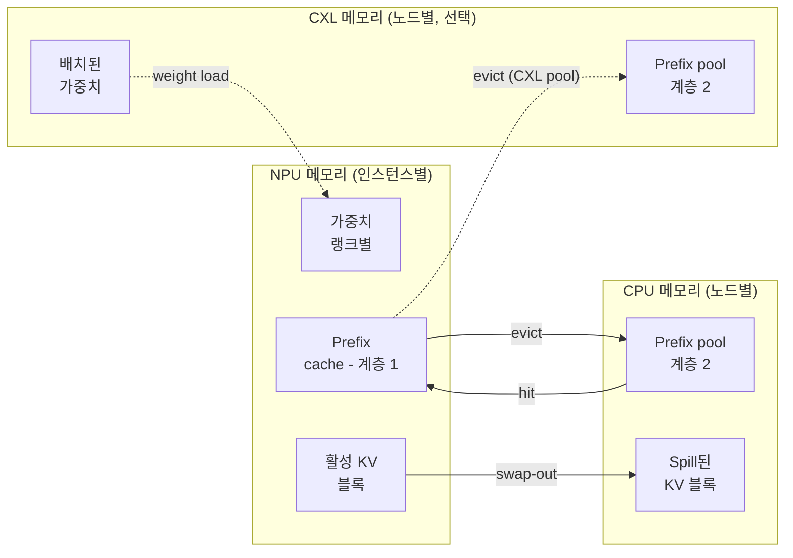

# KV cache & 메모리

각 `Scheduler`는 어떤 순간에든 NPU와 CPU(그리고 선택적으로 CXL) 메모리가 몇 바이트
사용 중인지 추적하는 `MemoryModel`을 소유합니다. 이것이 스케줄러에게 언제 새 요청
수락을 멈출지 알려주고 prefix-cache eviction을 트리거합니다.

> 메모리 계층 *설정*을 찾고 있나요? 배치 규칙은 **[예제 → CXL 확장
> 메모리](/docs/examples/memory-tiers/cxl-memory)**를, 2차 계층 pool은 **[예제 →
> Prefix caching](/docs/examples/memory-tiers/prefix-caching)**을 참고하세요. 이
> 페이지는 바이트 회계 측면입니다.

## 메모리 계층



세 계층, 각각 `MemoryModel`의 별도 카운터로 표현됩니다:

| 계층 | 객체 | 용량 출처 | 담는 것 |
| --- | --- | --- | --- |
| **NPU** | `npu_used` | `npu_mem.mem_size` × `num_npus` | 가중치(랭크별), 활성 KV cache, NPU prefix cache |
| **CPU** | `cpu_used` | `cpu_mem.mem_size`(노드별) | CPU prefix pool, 축출된 KV 블록, 모델 가중치 staging |
| **CXL** *(선택)* | `cxl_used[device_id]` | `cxl_mem.mem_size` × `num_devices` | 배치에 따라 CXL-상주 가중치 / KV / prefix pool |

용량은 클러스터 설정에서 옴; 사용량은 런타임에 추적됨. 시작 시 용량 초과(예:
`weight_per_gpu > npu_mem`)는 치명적 오류입니다. 런타임에 초과하면 (prefix cache에
대해) eviction이나 (활성 KV에 대해) 스케줄러 back-pressure를 트리거합니다.

## NPU 메모리에 있는 것

우선순위 순으로 두 큰 소비자:

### 1. 모델 가중치 (GPU별)

스케줄러 init 시 `MemoryModel.get_weight()`를 통해 계산됨. 크기는 모델의 전체
파라미터 수를 `tp_size`로 나눈 것(MoE의 경우: expert를 `ep_size`로 추가로 나눔)에
dtype 바이트 크기를 곱한 것:

```
weight_bytes_per_gpu = (
    dense_params / tp_size
    + moe_params / ep_size  # MoE면
) * fp_size_in_bytes
```

`fp_size`는 `bfloat16` / `float16`은 2바이트, `float32`는 4, `int8`과 `fp8`은 1.
실제 로딩은 `get_weight()`를 통해 이루어지며, 모델 설정을 읽고 공유 임베딩, tied
가중치 등을 고려합니다.

이 바이트 양은 시작 시 모든 NPU에 예약되고 결코 해제되지 않습니다. `weight_per_gpu >
npu_mem.mem_size`이면, 시뮬레이터가 명확한 오류 메시지로 종료합니다 — 일반적 해결은
`tp_size`를 올리거나, CXL 배치 규칙을 추가하거나, 더 작은 모델을 선택하는 것입니다.

### 2. 활성 KV cache

요청별 KV cache, 블록 단위로 추적됨. 블록 크기는 `--block-size` 토큰(기본 16):

```
bytes_per_block = (
    2                                         # K와 V
    * num_layers
    * num_key_value_heads / tp_size           # GQA는 TP로 샤딩
    * head_dim
    * block_size
    * kv_fp_size
)
```

여기서 `kv_fp_size`는:

- `--kv-cache-dtype auto`는 2바이트(`--dtype`에서 상속).
- **`--kv-cache-dtype fp8`은 1바이트**: KV 메모리를 절반으로.

스케줄러는 활성 요청당 `ceil(tokens / block_size)` 블록을 예약하고 요청이 완료되면
해제합니다(또는 청크 프리필 / prefix caching이 다른 생명주기를 가질 때, 아래 참고).

### 3. NPU prefix cache

원래 요청이 끝난 후에도 prefix cache가 유지하는 활성 KV 블록의 부분집합. 새 요청이
cache에 들어와 저장된 prefix와 매치하면, 그 블록들이 "재활성화"됩니다 — 재계산 없이
활성 KV에 다시 추가됨.

Eviction은 NPU 메모리 압박이 강제할 때 일어납니다: prefix cache가 블록을 해제하는 첫
번째 대상입니다. CPU나 CXL 2차 계층 pool이 존재하면, 축출된 블록이 사라지는 대신
거기로 **spill**됩니다.

전체 메커니즘: **[Prefix caching](./prefix-caching)**.

## CPU / CXL 메모리에 있는 것

노드별 CPU 메모리(그리고 장치별 CXL 메모리)는 다음을 담습니다:

- `--enable-prefix-sharing`이 켜지면 공유 **2차 계층 prefix cache**.
- NPU eviction에서 **spill된 KV 블록**(offloading 활성화 시).
- 클러스터 설정의 `placement` 필드를 통해 **명시적으로 거기 배치된 가중치**(예: 일부
  디코더 블록에 CXL 장치 0의 `"weights": "cxl:0"`). 배치 규칙 문법은 **[예제 → CXL
  메모리](/docs/examples/memory-tiers/cxl-memory)**를 참고하세요.

NPU 메모리와 달리 CPU/CXL 회계는 인스턴스별이 아니라 **노드별**입니다. 같은 노드의
여러 인스턴스가 같은 `cpu_used` 카운터를 공유합니다.

## 스케줄러가 이를 사용하는 방법

매 반복, 요청을 배치에 추가하기 전에, 스케줄러가 소비할 메모리를 추정합니다:

```python
new_kv_blocks_needed = (request.num_computed_tokens
                       + tokens_to_run_this_step
                       - already_reserved_blocks * block_size) / block_size
new_kv_bytes = new_kv_blocks_needed * bytes_per_block
if memory.npu_used + new_kv_bytes > npu_mem_total:
    # eviction 시도; 여전히 안 맞으면 이 요청 건너뜀
```

prefix cache가 eviction으로 충분한 블록을 해제할 수 있으면, 요청이 실행되고 cache가
일부 항목을 잃습니다. 그렇지 않으면, 스케줄러가 이 요청을 **건너뛰고** 큐의 다음
것을 시도합니다. 지연된 요청은 큐에 남아 다음 반복에서 재시도됩니다.

이것이 긴 컨텍스트 워크로드에서 보이는 버스트 메모리 사용 패턴을 만듭니다: cache가
차고, 축출하고, 다시 차며, 스케줄러의 유효 배치 크기가 사용 가능 메모리에 따라
진동합니다.

## 인스턴스별 vs 노드별 회계 (함정)

`npu_used`와 NPU prefix cache는 **인스턴스별**입니다. 같은 노드의 두 인스턴스는 같은
물리 GPU에 있어도 완전히 별개의 NPU 회계를 가집니다.

`cpu_used`는 **노드별**입니다. 같은 노드의 두 인스턴스가 하나의 CPU 메모리 예산을
공유합니다. 둘 다 prefix 블록을 CPU로 spill했으면, 같은 `cpu_mem.mem_size` 용량을
두고 경쟁합니다.

이는 다중 인스턴스 설정에 중요합니다: 각 인스턴스가 60 GB의 NPU 메모리를 예약하는
`num_instances: 4`는 각 인스턴스가 자체 GPU를 가짐을 의미합니다; 하지만 모두 노드의
`cpu_mem.mem_size` GB 호스트 메모리를 공유합니다.

## throughput 로그에서 메모리 읽기

`--log-interval` 초마다 방출되는 throughput 로그 라인이 실행 중 메모리 사용량을
보여줍니다:

```
[INFO] step=42 batch=8 prompt_t=1.2k tok/s decode_t=420 tok/s
       npu_mem=88.4 GB cpu_mem=12.4 GB
```

다중 인스턴스 설정의 경우 인스턴스별 NPU 사용량을 나열합니다:

```
       npu_mem=[88.4 GB, 87.9 GB] cpu_mem=24.8 GB
```

CXL을 사용하는 경우:

```
       npu_mem=12.4 GB cxl_mem=[3.2 GB, 3.1 GB, 3.1 GB, 3.2 GB]
```

(`12.4 GB`는 살아남은 NPU 활성 KV + cache이며, 가중치는 이제 CXL에 있음.)

## 함정

1. **시작 시 OOM**은 항상 가중치 대 NPU 용량 문제입니다. 오류 메시지가 정확한 바이트
   수를 가리킴; `tp_size`를 올리거나 모델 크기를 줄이세요.
2. **실행 중 OOM**은 드물지만 CXL 배치가 잘못 설정되면 가능합니다. throughput 로그의
   장치별 CXL 카운터를 확인하세요.
3. **`block_size`는 throughput이 아니라 메모리 단위에 중요합니다.** 블록이 작을수록 =
   더 세밀한 회계지만 요청당 오버헤드가 큼. 기본 16이 vLLM이 사용하는 것.
4. **FP8 KV cache는 KV 바이트 예산을 절반으로 하지만**, `*-kvfp8` variant(예:
   `bf16-kvfp8`)의 프로파일 번들도 필요합니다. 없으면 시뮬레이터가 variant-not-found
   메시지로 오류.
5. **가중치 메모리는 실행 동안 고정입니다.** 요청을 더 추가해도 커지지 않음; KV
   cache만 커집니다. throughput 로그 라인 상단에 보이는 "가중치 상한"은 상수로
   유지됩니다.

## 다음 단계

- **[트레이스 생성](../trace-generation)**: 메모리 상태가 *주어졌을 때* 각 반복의
  지연이 계산되는 방법.
- **[예제 → Prefix caching](/docs/examples/memory-tiers/prefix-caching)**과 **[CXL
  메모리](/docs/examples/memory-tiers/cxl-memory)**: 설정 관점.
