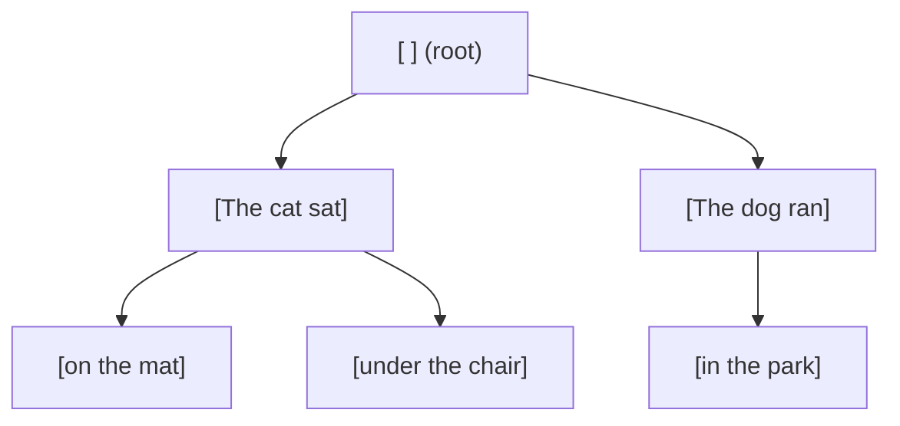
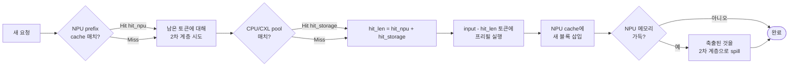

# Prefix caching

Prefix caching는 시뮬레이터의 RadixAttention 구현입니다([SGLang](https://github.com/sgl-project/sglang)에서
차용). 두 요청이 공통 토큰 prefix를 공유하면, 두 번째 요청의 그 prefix에 대한 프리필
작업을 완전히 건너뛸 수 있습니다 — 첫 요청에 대해 계산된 KV 블록이 재사용됩니다.

> "어떻게 활성화하나" / "어떤 플래그를 설정해야 하나"를 찾고 있나요?
> **[예제 → Prefix caching](/docs/examples/memory-tiers/prefix-caching)**를 참고하세요.
> 이 페이지는 기저 RadixCache 메커니즘을 설명합니다.

## 한 문단으로 본 RadixCache



**RadixCache**는 토큰 prefix 트리입니다. 각 노드는 하나의 연속된 토큰 run을 나타내고;
자식은 다음 토큰에서 갈라집니다. 삽입 시, 더 이상 확장할 수 없을 때까지 트리를
따라간 뒤, 필요에 따라 노드를 분할하거나 확장합니다. 조회 시, `match(token_list)`가
트리를 갈 수 있는 만큼 따라가고 `(matched_node, hit_length)`를 반환합니다 — 이미
트리에 있는 `token_list`의 가장 긴 prefix.

시뮬레이터는 실제 KV 텐서가 아니라 **블록 ID**(KV-cache 블록)를 저장합니다 — 블록
회계가 시뮬레이터의 통화입니다. 블록은 `block_size` 토큰(NPU에서 기본 16; CPU pool은
더 세분화, 아래 참고)을 담습니다.

## 두 계층

스케줄러는 인스턴스당 최대 두 개의 RadixCache를 가집니다:

| 계층 | 객체 | 위치 | 페이지 크기 | 필수? |
| --- | --- | --- | --- | --- |
| **NPU cache** | `MemoryModel.npu_prefix_cache` | NPU 메모리 | `--block-size`(기본 16) | `--enable-prefix-caching`(기본)이면 항상 켜짐 |
| **2차 계층 pool** | `MemoryModel.second_tier_prefix_cache` | CPU 또는 CXL | 1 | 선택, `--enable-prefix-sharing` |

NPU cache는 **인스턴스별**입니다: 인스턴스 B에 도착한 요청은 인스턴스 A에 캐시된
prefix를 재사용할 수 없습니다.

2차 계층 pool은 `--enable-prefix-sharing`이 켜지면 **같은 노드의 인스턴스 간에
공유**됩니다. 그것이 다중 인스턴스 배포에서 prefix caching을 유용하게 만듭니다 —
없으면 각 인스턴스가 자체 private cache를 가집니다.

`--prefix-storage`는 2차 계층 pool의 위치를 선택합니다:
- `None` → 2차 계층 없음(기본; NPU cache만).
- `CPU` → CPU 메모리(노드의 `cpu_mem` 예산 사용).
- `CXL` → CXL 메모리(클러스터 설정에 `cxl_mem` 블록 필요).

## 조회 흐름



스케줄러가 요청을 집을 때:

1. `input_hash_ids`를 계산: 입력 토큰의 블록별 해시. JSONL 로드 시 한 번 수행(
   `router.load_requests`에서).
2. **`npu_prefix_cache.match(token_list)`** → `(node, npu_hit)`.
3. 2차 계층 cache가 존재하면, **또한** 그것에 대해 매치:
   `second_tier_prefix_cache.match(remaining_tokens)` → `storage_hit`.
4. 총 `hit_len = npu_hit + storage_hit`.
5. 스케줄러가 실행해야 하는 프리필 토큰에서 `hit_len`을 뺌.

각 구성 요소는 `Request`에 기록됩니다:

```python
request.prefix_cache_hit   # 총 히트
request.npu_cache_hit      # 계층-1만
request.storage_cache_hit  # 계층-2만 (CPU 또는 CXL)
```

이들은 throughput 로그 라인과 요청별 CSV에 나타납니다.

## 삽입이 어떻게 보이나

스케줄러가 요청을 실행하기로 결정할 때:

1. 스케줄러가 *캐시되지 않은* 토큰의 KV 블록을 NPU 메모리에 예약(`hit_len` 토큰은
   이미 거기 있음).
2. 반복의 프리필 청크가 끝난 후, 갓 계산된 KV 블록이
   `npu_prefix_cache.add_prefix(token_list, node_id)`를 통해 NPU cache에 삽입됨.

그 삽입이 같은 prefix를 가진 *다음* 요청이 혜택을 받게 합니다. 첫 요청은 항상 전체
프리필 비용을 지불; 이후 것들은 그것이 생성한 것을 재사용.

## Eviction과 2차 계층 흐름

NPU 메모리 압박이 eviction을 강제할 때:

1. NPU cache의 LRU가 블록을 축출.
2. 2차 계층 pool이 존재하면, 축출된 블록이 그것으로 **spill**됨(CPU/CXL 쓰기로 지연
   모델링).
3. 미래 요청은 재계산 대신 2차 계층에서 spill된 블록을 히트할 수 있음.

2차 계층 pool 자체도 축출할 수 있습니다(`cpu_mem.mem_size`나 CXL 용량으로 제한됨).
그런 일이 생기면 블록이 사라지고, 다음 히트 시 재계산됩니다.

## 블록 이벤트 스트림

`RadixCache(enable_kv_cache_events=True)`는 모든 삽입 / 제거 / 클리어를 기록하는
이벤트 스트림을 방출합니다. 시뮬레이터는 이 이벤트를 두 가지에 사용합니다:

- **블록 인식 throughput 회계**: `prompt_t`가 cache 히트 토큰을 세며, vLLM과 일치.
- `--log-level DEBUG`에서 **선택적 디버깅 출력** — 반복별
  `npu_prefix_cache.format_prefix_info()`를 덤프.

prefix cache를 수정하거나 새 시각화를 구축한다면, 이벤트 스트림이 소비할 API입니다.

## 페이지 크기 차이

NPU cache와 CPU/CXL cache는 **다른 페이지 크기**를 사용합니다:

- NPU cache: `block_size`(기본 16). GPU 측의 실제 KV-블록 단위와 일치.
- CPU/CXL cache: 1. 2차 계층이 *부분* 매치를 제공할 때 이미 계산된 블록을 spill하는
  것이 정밀도를 잃지 않도록 더 세분화됨.

이는 단일 NPU 블록이 CPU pool의 최대 16개 항목에 대응할 수 있음을 의미합니다. 매치
로직이 이를 고려하므로, cache 자체를 수정하지 않는 한 이에 대해 추론할 필요가
없습니다.

## 무엇이 보고되나

모든 반복의 `add_done` 호출이 이 카운터를 갱신합니다:

| 카운터 | 위치 |
| --- | --- |
| 요청별 `prefix_cache_hit` | 요청별 CSV `prefix_hit_len` |
| 반복별 prompt-throughput 히트 | throughput 로그 `prefix_hit=...` |
| 인스턴스별 pool 크기 | throughput 로그 `prefix_pool=...`(`--enable-prefix-sharing`일 때) |
| 히트율 분석(NPU vs CPU) | throughput 로그 `prefix_hit=78% (npu=42%, cpu=36%)` |

## 함정

1. **Prefix caching은 기본으로 켜짐입니다.** 없는 베이스라인을 특별히 원하면(연구
   베이스라인 비교 등) `--no-enable-prefix-caching`을 사용하세요.
2. **해시는 입력 토큰 ID에 대한 것입니다.** 데이터셋이 원시 텍스트를 저장하고
   시뮬레이터가 추론 엔진과 다르게 토큰화하면, 히트가 일치하지 않습니다. 안정적
   해싱을 위해 사전 토큰화하세요(JSONL에 `input_tok_ids` 제공).
3. **NPU eviction은 메모리가 가득 차면 지연이 아니라 즉시 트리거됩니다.** 긴 실행 중
   놀라운 메모리 정체를 본다면, 그것이 NPU 메모리를 제한하는 eviction 정책입니다.
4. **CPU/CXL pool은 인스턴스 종료 시 스스로 해제하지 않습니다.** 이는
   의도적입니다(그래서 오래 실행되는 다단계 워크로드가 pool을 계속 재사용 가능),
   하지만 남은 항목은 최종 요약에서 보입니다.

## 다음 단계

- **[KV cache & 메모리](./kv-cache-and-memory)**: 기저 블록 회계가 작동하는 방법.
- **[예제 → Prefix caching](/docs/examples/memory-tiers/prefix-caching)** — 설정 /
  플래그 수준 설명.
