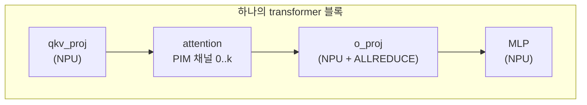

# PIM offload

Processing-in-memory(PIM)는 계산 유닛을 물리적으로 DRAM 내부에 두어, 전통적으로 메모리
대역폭 바운드인 커널을 데이터 경로 상의 계산 연산으로 바꿉니다. LLMServingSim은 PIM을
특별히 **어텐션**을 인수할 수 있는 별도 장치로 모델링하며, 레이어의 나머지는 여전히
GPU에서 실행됩니다.

이 페이지는 PIM 경로가 시뮬레이터 내부에서 어떻게 존재하는지 설명합니다. *설정*
관점(어떤 플래그를 전달할지, 클러스터 설정에서 PIM 장치를 어떻게 연결할지)은
**[예제 → PIM 어텐션 offload](/docs/examples/disaggregated/pim-attention-offload)**에
있습니다.

## 무엇이 offload되고, 무엇이 안 되나

`--enable-attn-offloading`이 켜지면:

| 레이어 | 실행 위치 |
| --- | --- |
| `embedding`, `layernorm`, `qkv_proj`, `qk_norm`, `rotary_emb` | NPU |
| `attention` | **PIM** |
| `o_proj`, `gate_up_proj`, `act_fn`, `down_proj` | NPU |
| `final_layernorm`, `lm_head`, `sampler` | NPU |
| MoE 블록(해당 시) | NPU |

그래서 어텐션 자체만 PIM으로 이동합니다. 어텐션을 위한 KV cache가 그것과 함께
이동합니다 — KV 블록이 NPU 메모리가 아니라 PIM 메모리에 살며, 이는 가중치나 더 큰 배치를
위해 NPU 메모리를 해방합니다.

토큰 스트림은 메모리 쓰기(입력 activation)를 통해 NPU에서 PIM으로 건너간 뒤, 메모리
읽기(어텐션 출력)를 통해 PIM에서 NPU로 돌아옵니다. 이 건넘은 트레이스에서 메모리
전송으로 모델링됩니다.

## 트레이스에서 어떻게 나타나나



`trace_generator._emit_sequence`가 아키텍처 YAML의 레이어 리스트를 따라갑니다.
`attention` 레이어를 보고 **또한** `enable_attn_offloading=True`이면, NPU 어텐션 커널
앞에 PIM 블록을 삽입합니다:

```
... qkv_proj_3 ... (NPU)
PIM 0
pim_attention_3   (PIM 장치, 모델링된 지연)
PIM END
... o_proj_3 ... (NPU, TP > 1이면 ALLREDUCE)
```

`PIM 0` / `PIM END` 마커는 포함된 연산이 채널 0의 PIM 장치에서 실행됨을 Chakra
변환기에 알립니다. 변환기는 PIM 기판을 반영하는 메모리 접근 패턴을 가진 PIM 계산을 위한
`COMP_NODE`를 생성합니다.

`pim_attention_<i>` 항목의 지연은 NPU 어텐션 CSV가 아니라 PIM 모델(아래 참고)에서
옵니다.

## PIM 모델

`serving/core/pim_model.py`가 `PIMModel`을 정의합니다. 클러스터 설정에
`cpu_mem.pim_config: "<config_name>"` 필드가 있을 때 노드별로 인스턴스화됩니다.
생성자가 `configs/pim/<config_name>/`의 DRAMSim3 INI 파일을 읽습니다:

```
configs/pim/DDR4_8GB_3200_pim/
├── DDR4_8Gb_x16.ini    # DRAM 장치 파라미터
├── system.ini          # 버스 / 채널 레이아웃
└── pim.ini             # PIM 계산 파라미터
```

INI 파일이 지정하는 것:

- **DRAM 타이밍**: `tCAS`, `tRCD`, `tRP`, refresh 간격 등.
- **레이아웃**: 칩당 bank, 채널 수, row 크기, column 크기.
- **PIM 계산**: bank당 사이클당 연산, 명령어 집합 상한.

`PIMModel`은 타이밍 파라미터를 트레이스 생성기에 노출하며, 트레이스 생성기가 이를
사용해 PIM에서 어텐션별 지연을 계산합니다. 모델은 의도적으로 단순합니다 —
cycle-accurate DRAM 모델은 아니지만, PIM-vs-NPU 어텐션 경로를 비교하기에 충분히 잘
대역폭, 병렬성(bank × 채널), 연산 throughput을 포착합니다.

## 여러 PIM 채널

노드의 PIM 장치는 여러 채널을 가질 수 있습니다. 각 채널은 자체 bank 수준 병렬성을
가지므로, 다른 어텐션 head가 다른 채널에서 병렬로 실행될 수 있습니다. 트레이스 생성기가
다음으로 어텐션 작업을 채널에 걸쳐 분배합니다:

```
channel_for_head(h) = h * num_channels // num_attention_heads
```

이것이 트레이스의 `PIM <channel>` 마커가 됩니다. ASTRA-Sim이 여러 `PIM 0`, `PIM 1`, ...
블록을 보고 병렬로 실행합니다.

## PIM 메모리의 KV cache

PIM offload가 켜지면, KV 블록이 NPU 메모리가 아니라 PIM 메모리(채널별)에 삽니다. 메모리
모델이 이를 고려합니다:

- `npu_used`가 KV-cache 풋프린트만큼 떨어짐.
- `pim_used`가 같은 양만큼 상승.
- KV eviction이 NPU → CPU 대신 PIM → CPU(또는 `kv_evict_loc`이 가리키는 곳)로 감.

이것이 긴 컨텍스트 워크로드에 PIM offload를 메모리 매력적으로 만드는 것입니다: GPU의
HBM이 더 큰 가중치나 더 많은 진행 중 요청을 담도록 해방됩니다.

## TPOT는 종종 개선되지만 TTFT는 악화되는 이유

- **디코드**는 메모리 대역폭 바운드입니다. PIM은 (계산이 바이트와 함께 위치하므로) 높은
  *집계* 대역폭을 가지며, 채널당 raw GB/s가 HBM보다 낮아도 그렇습니다. 긴 컨텍스트
  디코드에서, PIM 어텐션은 종종 GPU 어텐션을 이깁니다.
- **프리필**은 어텐션에서 compute-bound입니다(긴 시퀀스가 이차적으로 스케일). PIM의 채널당
  좁은 계산은 도움이 되지 않습니다 — 사실 해롭습니다. 주로 프리필 트래픽인 워크로드는
  PIM offload에서 악화됩니다.

표준 해결책은 **서브 배치 인터리빙**입니다: 배치의 한 절반에서 GPU 계산을 다른 절반의
PIM 어텐션과 오버랩. [예제 → 서브 배치
인터리빙](/docs/examples/advanced/sub-batch-interleaving) 참고.

## Throughput 로그 추가

PIM이 활성일 때, throughput 로그에 노드별 `pim_busy=` 필드가 추가됩니다:

```
[INFO] step=10 batch=8 prompt_t=1.1k tok/s decode_t=520 tok/s
       npu_mem=63.4 GB pim_busy=72%
```

`pim_busy`는 마지막 로그 간격에 PIM 장치가 어텐션 작업을 실행한 시뮬레이션 시간의
비율입니다. 이것이 100% 근처로 포화되면, PIM이 병목입니다 — 다중 채널 PIM을 시도하거나,
프리필 위주 단계에는 NPU 어텐션으로 되돌리세요.

## 함정

1. **PIM offload는 노드별입니다.** `cpu_mem.pim_config`는 인스턴스가 아니라 노드에
   있습니다. 같은 노드의 여러 인스턴스가 같은 PIM 장치를 공유합니다.
2. **`--enable-attn-offloading`은 CLI 기본값입니다.** 개별 인스턴스가 클러스터 설정의
   `enable_attn_offloading`으로 오버라이드할 수 있지만, PIM offload를 사용하는 노드는
   여전히 `cpu_mem.pim_config`가 필요합니다.
3. **PIM CSV 번들은 존재하지 않습니다.** NPU와 달리, PIM 어텐션 지연은 DRAMSim3
   파라미터와 `pim_model.py`의 산술에서 해석적으로 계산됩니다. 실제 PIM 장치 프로파일링은
   향후 작업입니다.
4. **서브 배치 인터리빙은 PIM offload가 필요합니다.** `--enable-attn-offloading` 없이,
   `--enable-sub-batch-interleaving`은 no-op입니다(모든 것이 NPU에 있어 오버랩할 것이
   없음).
5. **DRAMSim3 INI 조정은 다음 시작에 반영됩니다.** 시뮬레이터가 부팅 시 한 번 읽습니다.
   실행 중 파라미터 변경은 재시작이 필요합니다.

## 다음 단계

- **[예제 → PIM 어텐션 offload](/docs/examples/disaggregated/pim-attention-offload)** —
  설정 설명.
- **[전력 모델](./power-model)**: PIM은 노드 `power` 블록에 자체 idle / active 전력
  파라미터를 가집니다.
