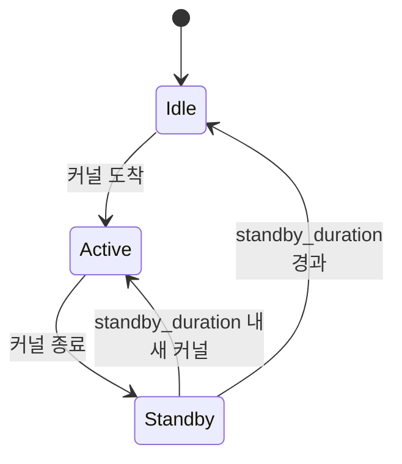

# 전력 모델

클러스터 설정의 노드에 `power:` 블록을 추가하면, 시뮬레이터가 시스템 전력을 구성 요소별로
추적하고 시뮬레이션 시간에 걸쳐 적분하여 최종 에너지 수치를 생성합니다. 이 페이지는 내부
메커니즘입니다; 설정 관점은 **[예제 → 전력 모델링](/docs/examples/advanced/power-modeling)**에
있습니다.

## 무엇이 모델링되나

`serving/core/power_model.py::PowerModel`은 여섯 카테고리에 걸쳐 노드별 전력을 추적합니다:

| 구성 요소 | 파라미터 | 언제 소비 |
| --- | --- | --- |
| **Base 노드** | `base_node_power`(W) | 항상(호스트 플랫폼 오버헤드) |
| **NPU** | `idle_power`, `standby_power`, `active_power`, `standby_duration`(하드웨어별) | 유휴 시 idle, 계산 후 `standby_duration` 동안 standby, 계산 중 active |
| **CPU** | `idle_power`, `active_power`, `util` | 연속적으로 `idle + (active - idle) × util` |
| **DRAM** | DIMM당 `dimm_size`, `idle_power`, `energy_per_bit` | idle 기준선 + 바이트당 접근 에너지 |
| **Link** | `num_links`, `idle_power`, `energy_per_bit` | idle + 바이트당 네트워크 트래픽 |
| **NIC** | `num_nics`, `idle_power` | 항상(idle 기준선) |
| **Storage** | `num_devices`, `idle_power` | 항상(idle 기준선) |

클러스터 설정의 각 노드별 `power:` 블록이 이 파라미터를 설정합니다. 전체 예제는 번들된
`single_node_power_instance.json`과 `single_node_pim_instance.json`을 참고하세요.

## 수식이 작동하는 방법

에너지는 시간에 걸친 전력의 적분입니다. 시뮬레이터는 이를 나노초 틱으로 합니다: 매
반복마다 마지막 전력 업데이트 이후 경과 시간을 계산하고, 현재 전력을 곱하며, running
에너지 총계에 더합니다:

```
ΔE = P(current_state) × Δt    [Joules = Watts × seconds]
total_energy += ΔE
```

핵심은 **구성 요소별 추적**입니다. NPU 전력은 커널을 활발히 실행 중인지(active_power),
최근 끝났는지(`standby_duration` ns 동안 standby_power, 그다음 idle로), 또는 유휴인지에
의존합니다. 모델이 NPU별 `last_compute_end_ns`를 추적하고 `current_ns -
last_compute_end_ns`에 기반해 올바른 와트를 적용합니다.

CPU, DRAM, link, NIC, storage는 더 단순합니다: 각각 상수 배경 소비에 트래픽 / 접근
바이트에 대한 이벤트별 에너지 증분을 더합니다.

## NPU 상태



NPU가 가장 미묘한 구성 요소입니다. 각각에 적용되는 전력 계수를 가진 세 상태:

| 상태 | 전력 | 언제 |
| --- | --- | --- |
| **Active** | `active_power` | 커널 실행 중 |
| **Standby** | `standby_power` | 마지막 커널 종료로부터 `standby_duration` ns 내 |
| **Idle** | `idle_power` | 마지막 커널로부터 `standby_duration` 초과 |

`standby_duration`(ns)은 계산이 끝난 후 NPU가 standby 상태에 머무는 시간을 제어합니다.
이는 장치가 idle로 돌아가기 전의 커널 후 오버헤드(FP32 결과 drain, DMA flush 등)를
모델링합니다. RTXPRO6000의 경우 번들 설정은 `standby_duration: 18` ns; H100의 경우 더
큼(예: ~30 ns).

새 커널이 `standby_duration` 내에 도착하면, NPU는 결코 idle에 도달하지 않습니다 —
standby에서 다시 active로 갑니다. 이는 NPU가 거의 항상 바쁜 정상 상태 워크로드에
중요합니다.

## 전력이 보고되는 곳

### 주기적 throughput 로그

`--log-interval` 초마다, throughput 로그 라인에 `power=` 필드가 추가됩니다:

```
[INFO] step=42 batch=8 prompt_t=1.2k tok/s decode_t=420 tok/s
       npu_mem=88.4 GB power=712 W
```

`power`는 **현재** 총 시스템 전력, 즉 이 순간 모든 구성 요소의 순간 와트 합입니다.

### 최종 요약

시뮬레이션이 끝나면, `power_model.print_power_summary()`가 노드별 에너지 분석을 씁니다:

```
─────── Power summary (node 0) ───────
   NPU active     :   12,453 J  (78%)
   NPU standby    :    1,012 J   (6%)
   NPU idle       :       89 J   (1%)
   CPU            :    1,233 J   (8%)
   DRAM           :      442 J   (3%)
   Link           :      388 J   (2%)
   Base + NIC + storage : 332 J  (2%)
   ─────────────────────────────────
   Total energy   :   15,949 J
```

이는 `--log-level`과 무관하게 방출됩니다. 이 분석이 전력 모델링을 에너지 효율성 연구에
유용하게 만드는 것입니다: 어떤 구성 요소가 지배하는지 볼 수 있습니다.

## 다중 노드 전력

각 노드는 자체 `power:` 블록을 가집니다. 시뮬레이터가 모든 노드 전력 모델을 병렬로
실행하고 throughput 로그 라인이 그것들을 함께 보여줍니다:

```
       power=[node0=712 W, node1=689 W]
```

최종 요약이 노드별 분석과 클러스터 총계를 출력합니다.

## NPU별 active 전력이 오는 곳

NPU별 `active_power`는 인스턴스의 `hardware:` 필드로 키됩니다:

```json
"power": {
  "npu": {
    "RTXPRO6000": {
      "idle_power": 35,
      "standby_power": 300,
      "active_power": 600,
      "standby_duration": 18
    }
  }
}
```

다중 하드웨어 클러스터의 경우, 여러 항목을 나열:

```json
"power": {
  "npu": {
    "RTXPRO6000": { ... },
    "H100": { ... }
  }
}
```

시뮬레이터가 `hardware:` 필드에 기반해 인스턴스별로 올바른 항목을 조회합니다. 설정이
일치하는 전력 항목이 없는 하드웨어 태그를 사용하면, 시뮬레이터가 그 NPU에 대한 전력
추적을 건너뜁니다(시작 시 경고와 함께).

## 함정

1. **`power:` 블록 없음 = 전력 모델 없음.** 시뮬레이터가 정상적으로 실행되지만 전력
   수치를 방출하지 않습니다. 활성화하려면 블록을 추가; 약간 더 빠른 실행을 위해서는
   제거하세요.
2. **전력 값은 추정치입니다.** *상대* 비교("PIM offload가 HBM 어텐션 대비 에너지를
   절약하나?")를 위한 것이지 절대 데이터센터 회계를 위한 것이 아닙니다.
3. **`standby_duration`은 생각보다 더 중요합니다.** 긴 유휴 간극을 가진 버스트 워크로드는
   많은 idle 상태 에너지를 보고, 정상 상태 워크로드는 active나 standby에 머무릅니다.
   수치가 놀라워 보이면, 최종 요약의 standby vs idle 분석을 확인하세요.
4. **이벤트별 에너지는 연산별이 아니라 바이트별입니다.** Link 에너지는 collective 수가
   아니라 트래픽 바이트로 스케일합니다. `comm_size`를 줄이는 것이 레버이지 collective
   빈도를 줄이는 것이 아닙니다.
5. **`--log-interval 0.1`은 전력 로그를 매우 시끄럽게 만듭니다.** 기본 `1.0`이 추세
   추적에 보통 맞습니다; 더 세밀한 간격은 더 긴 로그 파일의 비용으로 더 부드러운 곡선을
   생성합니다.

## 다음 단계

- **[예제 → 전력 모델링](/docs/examples/advanced/power-modeling)** — 설정 설명.
- **[PIM offload](./pim-offload)**: PIM은 이 모델과 통합되는 자체 active / standby 전력
  파라미터를 가집니다.
