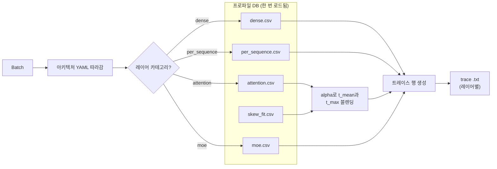

# 트레이스 생성

`trace_generator.generate_trace(...)`는 **프로파일된 지연 데이터베이스**(프로파일러가
생성한 CSV 파일)와 ASTRA-Sim이 소비하는 **배치별 실행 트레이스** 사이의 다리입니다.

"모델에 32개 디코더 블록이 있고, 각 블록에 qkv + attention + o_proj + mlp가 있다"가
"이 배치는 1.78 ms 걸린다"로 바뀌는 페이지입니다.

> 트레이스 파일 형식 스펙을 찾고 있나요? **[레퍼런스 → 트레이스 파일
> 형식](/docs/reference/trace-format)**을 참고하세요. 프로파일러가 애초에 지연
> 데이터베이스를 어떻게 *생성*하는지 찾고 있나요? **[프로파일러 → 출력
> 번들](/docs/profiler/output-bundle)**을 참고하세요. 이 페이지는 시뮬레이터가 그것을
> 어떻게 *소비*하는지에 관한 것입니다.



## 시뮬레이터가 소비하는 데이터

프로파일러는 다음에 카테고리별 CSV를 씁니다:

```
profiler/perf/<hardware>/<model>/<variant>/tp<N>/{
  dense.csv,
  per_sequence.csv,
  attention.csv,
  moe.csv,           # MoE 모델 전용
  skew.csv,          # 이기종 디코드 스윕이 켜지면
  skew_fit.csv       # 동일, 피팅된 alpha 테이블
}
meta.yaml
```

여기서 `<variant>`는 dtype 조합을 인코딩합니다, 예: `bf16` 또는 `bf16-kvfp8` 또는
`fp8-kvfp8`. 시뮬레이터는 `resolve_variant(dtype, kv_cache_dtype, model_config)`를 통해
런타임에 variant를 해석합니다.

CSV는 `time_us`(마이크로초)를 담습니다. 시뮬레이터가 로드 시 1000을 곱하고 ns로
반올림합니다 — 모든 내부 지연은 ns입니다.

## perf DB 로딩

`_load_perf_db(hardware, model, variant)`는 시뮬레이터 수명 동안 고유한 `(hardware,
model, variant)` 삼중조당 한 번 호출됩니다; 결과는 `_perf_db_cache`에 캐시됩니다. 매
배치마다 호출하면 너무 느립니다.

최초 로드 시, 시뮬레이터는 또한:

1. `meta.yaml`을 읽고 런타임의 `--max-num-batched-tokens`와 `--max-num-seqs`를 프로파일된
   스윕 경계와 비교. 초과하면, 조회가 클램프가 아니라 **외삽**할 것이라는 일회성 경고를
   받음.
2. `skew_fit.csv`에서 skew_fit 테이블(`alpha_by_bucket` 맵)을 로드.

## 카테고리별 조회

모델의 아키텍처 YAML의 각 레이어는 **카테고리**로 태그됩니다: dense, per_sequence,
attention, 또는 moe. 각 카테고리는 자체 조회 함수를 가집니다:

| 카테고리 | 조회 함수 | 키 | 보간 |
| --- | --- | --- | --- |
| `dense` | `_lookup_dense` | `total_len`(배치의 토큰 합) | 1D 선형 |
| `per_sequence` | `_lookup_per_sequence` | `num_requests` | 1D 선형 |
| `attention` | `_lookup_attention` | `(prefill_chunk, kv_prefill, n_decode, kv_decode)` | `(pc, n_dec)`에 최근접이웃, `(kv_pre, kv_dec)`에 bilinear |
| `moe` | `_lookup_moe` | `(local_tokens, activated_experts)`(랭크별, TP=1에서 프로파일) | 2D 선형 |

모든 조회는 프로파일된 그리드 밖에서 **외삽**합니다(선형 확장을 통해), 그래서 가장 큰
프로파일 샘플보다 큰 런타임 값이 실패하지 않고 (덜 신뢰할 수 있는) 외삽된 지연을
생성합니다. 위의 시작 경고가 이것이 일어나는 때를 알려줍니다.

각 그리드 포인트의 `time_us` 값은 로드 시 ns로 변환되므로, 조회가 직접 ns를 산출합니다.

## Variant 해석

`resolve_variant(dtype, kv_cache_dtype, model_config)`는 프로파일러의
`effective_variant`를 반영합니다:

```
dtype           CLI의 dtype 또는 모델 설정의 torch_dtype
                  (기본 'bfloat16')

kv_cache_dtype  CLI 값, 기본 'auto' (dtype에서 상속)

variant         f"{short(dtype)}"                       # kv_cache_dtype == 'auto'이면
                f"{short(dtype)}-kv{short(kv_cache_dtype)}"  # 그렇지 않으면
```

그래서:

- `--dtype bfloat16` → `bf16`
- `--dtype bfloat16 --kv-cache-dtype fp8` → `bf16-kvfp8`
- `--dtype fp8 --kv-cache-dtype fp8` → `fp8-kvfp8`

해석된 폴더가 `profiler/perf/...` 아래에 없으면, 시뮬레이터가 누락된 variant를 가리키는
명확한 `FileNotFoundError`를 발생시킵니다. 프로파일러에서 `--variant <name>`으로 그
조합을 프로파일하거나, 다른 dtype 조합을 선택하세요.

## 이기종 디코드 skew 보정

FlashAttention의 varlen 커널은 디코드 배치의 KV 길이가 균일하지 않을 때 타일 패딩과 SM
불균형 비용을 지불합니다. 평범한 어텐션 그리드는 이를 볼 수 없습니다 — shot당 균일
`kv_decode`로 프로파일됩니다. 그래서 프로파일러가 bimodal 배치(`skew.csv`)에 대해 **두
번째 스윕**을 실행하고, skewed 배치가 mean→max 선을 따라 어디에 놓이는지 말하는
버킷별 **alpha** ∈ [0, 1]을 피팅합니다:

```
alpha = (t_skew - t_mean) / (t_max - t_mean)
```

런타임에, `_lookup_attention_with_skew`가 **두 번의** 4D 어텐션 조회를 합니다 — 하나는
배치의 `kv_decode_mean`에서, 하나는 `kv_decode_max`에서 — 그리고 블렌딩:

```
t_attention = t_mean + alpha * (t_max - t_mean)
```

버킷 키는 다섯 축에서 빌드됩니다:
`pc | n_label | skew_rate_label | kv_big_label | kp_label`

- `pc`: prefill chunk 크기(프로파일 값당 버킷).
- `n_label`: `n_decode` 값(프로파일 값당 버킷).
- `skew_rate_label`: 정규화된 skew rate, 고정 [0,1] 방식.
- `kv_big_label`: 긴 KV의 log-4× bin.
- `kp_label`: `kv_prefill` 값(프로파일 값당 버킷).

버킷 축 정의는 `meta.yaml::skew_fit.bucket_axes`에 있으므로, 프로파일 스윕을 확장하면
시뮬레이터 코드 변경 없이 더 미세한 해상도가 켜집니다.

skew 스윕이 실행되지 않았으면(프로파일 시 `SKIP_SKEW=1`), 시뮬레이터가 pooled 상수
alpha로 폴백합니다. skew 보정의 프로파일 관점은 **[프로파일러 → Skew & alpha
피팅](/docs/profiler/skew-alpha-fit)**에 문서화되어 있습니다.

## 아키텍처 YAML 따라가기

각 모델은 `profiler/models/<model_type>.yaml`(예: `llama.yaml`, `qwen3_moe.yaml`)에
아키텍처 YAML을 가집니다. YAML은:

- 정식 레이어 이름(예: `qkv_proj`, `attention`, `moe`)을 vLLM 클래스 이름에 매핑하는
  `catalog:`.
- 반복별 레이어 순서를 기술하는 `sequence:`:
  `prologue → pre_attn → post_attn → (mlp_dense | mlp_moe) → head`.

`trace_generator._emit_sequence`가 시퀀스 리스트를 따라가며 레이어당 하나의 트레이스
행을 생성합니다. 또한:

- `tp_size > 1`일 때 `o_proj`와 `down_proj` 이후에 **TP-ALLREDUCE** 부착.
- MoE가 활성일 때 MoE 블록을 **EP-ALLTOALL** 마커로 감쌈.
- `--enable-attn-offloading`이 켜지면 NPU 어텐션 커널 앞에 PIM 어텐션 삽입.
- 시퀀스 레이어가 프로파일 CSV에 없을 때 일회성 경고(그래서 프로파일을 확장할지 알
  수 있음).

## DP 그룹이 바꾸는 것

인스턴스가 `dp_group`에 있을 때, 트레이스 생성은 모든 DP 멤버가 현재 반복에 대해
배치를 스케줄할 때까지 **지연**됩니다. 시뮬레이터가 각 멤버의 `total_len`을 모으고,
그룹에 걸친 **max**를 취하며, 그것을 EP-ALLTOALL `comm_size`에 사용합니다:

```
comm_size_alltoall = max(total_len_per_member) * hidden_size * fp_size
```

각 멤버의 트레이스는 여전히 dense와 attention 커널에 자체 인스턴스별 `total_len`을
사용하며, ALLTOALL만 동기화됩니다. 이는 프로덕션 MoE 서빙이 하는 것과 일치합니다(wave
내 max로의 vLLM CUDA-graph 패딩).

전체 DP+EP wave-sync 메커니즘은 **[병렬화 메커니즘](./parallelism-mechanics)**에
있습니다.

## Block copy 최적화

`num_hidden_layers > 1`인 모델(즉, 모두)의 경우, 트레이스의 transformer 블록은 레이어
인덱스를 제외하고 동일합니다. 각 레이어의 행을 별도로 생성하는 것은 낭비이므로,
기본적으로 `enable_block_copy=True`:

- **블록 0에 대해서만** 전체 트레이스 생성.
- 블록 1..N-1에 대해, 조정된 레이어 인덱스로 블록 0의 계산 패턴을 재생하는 단일 Chakra
  `block_copy` 명령을 생성.

이는 dense 모델에 **항상** 안전합니다. `--expert-routing-policy BALANCED`(기본)를 가진
MoE의 경우, 정책이 결정적이고 모든 레이어가 같은 `(local_tokens, activated_experts)`
쌍을 생성하므로 역시 안전합니다. `RR` / `RAND`의 경우, 배치가 포화되면 레이어별 분산이
작으므로 block-copy가 무해한 근사로 남습니다; 레이어별 분산이 필요한 `CUSTOM` 정책은
gate 라우터 생성자에서 `block_copy=False`로 비활성화할 수 있습니다.

## MoE의 랭크별 지연

MoE는 트레이스에서 `EXPERT {i}` / `EXPERT END` 마커를 사용하며, EP 랭크당 하나의
`COMP_NODE`를 가집니다. 각 랭크의 지연은 **로컬** 토큰 수와 활성화된 expert를 키로 MoE
CSV에서 옵니다(TP=1에서 프로파일). 랭크가 병렬로 실행되고 ALLTOALL 배리어에서
동기화합니다.

Expert-to-rank 할당은 균등 파티셔닝을 사용합니다: `expert_id * ep_size // num_experts`.

## 함정

1. **CSV의 `time_us`는 마이크로초입니다.** 시뮬레이터가 로드 시 ns로 변환합니다. CSV
   행을 시뮬레이터 로그 라인과 교차 참조한다면, 1000을 곱하세요.
2. **캘리브레이션 스케일링 없음.** 프로파일된 지연을 재스케일 없이 직접 사용합니다.
   프로파일이 어긋나 보이면 "스케일 계수"를 조정하는 대신 재프로파일하세요 — 그런 것은
   없습니다.
3. **최초 로드가 느립니다**(perf DB 파싱); 이후 로드는 `_perf_db_cache`를 히트합니다.
   시뮬레이터를 재시작하면 파싱 비용을 다시 지불합니다.
4. **Variant 폴더가 존재해야 합니다.** 불일치 dtype + KV 조합 → `FileNotFoundError`. 그
   조합을 프로파일하거나 다른 `--dtype` / `--kv-cache-dtype` 쌍을 선택하세요.
5. **Skew 보정은 skew 스윕이 프로파일되었을 때만 발사됩니다.** 그렇지 않으면 단일
   pooled alpha를 얻으며, 이는 평균적으로는 올바르지만 이질성 민감도를 잃습니다.

## 다음 단계

- **[병렬화 메커니즘](./parallelism-mechanics)**: TP-ALLREDUCE / EP-ALLTOALL이 트레이스에서
  실제로 어떻게 보이는지.
- **[레퍼런스 → 트레이스 파일 형식](/docs/reference/trace-format)** — 이 페이지가
  생성하는 텍스트 트레이스의 필드별 스펙.
