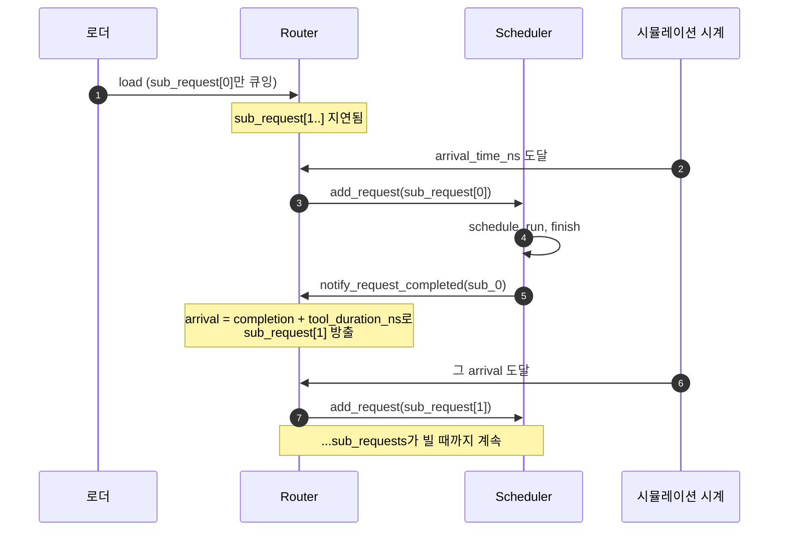

# Agentic 세션

ShareGPT 같은 표준 추론 벤치마크는 *독립적인* 프롬프트를 모델링합니다: 각 요청은
하나의 프롬프트 → 하나의 응답이고, 다음 요청은 이전 것과 무관합니다. **에이전트**의
실제 프로덕션 트래픽은 이렇지 않습니다.

코딩 에이전트(Cursor, Aider, 또는 SWE-bench 솔버)는 타이트한 루프를 실행합니다:
LLM에게 무엇을 할지 묻기 → 도구 실행(컴파일, 테스트, 검색) → 결과를 다시 공급 →
LLM에게 다음 것을 묻기 → 또 다른 도구 실행 → ... "1000개 SWE-bench 문제"에 대한
요청 예산은 실제로는 1000개의 *세션*이며, 각각 5~50개의 체인 연결된 LLM 호출과 그
사이의 도구 대기를 가집니다.

그것이 **agentic** 워크로드 형식의 용도입니다.

## 형식

각 JSONL 줄은 하나의 세션입니다:

```json
{
  "session_id": "session_42",
  "arrival_time_ns": 4059740,
  "sub_requests": [
    {"input_toks": 1472, "output_toks": 133, "tool_duration_ns": 127348767},
    {"input_toks": 1582, "output_toks": 125, "tool_duration_ns": 197295027},
    {"input_toks": 1734, "output_toks": 77,  "tool_duration_ns": 0}
  ]
}
```

각 사이에 `tool_duration_ns`를 갖는 세 개의 하위 요청 — 이는 LLM 호출 사이에 도구
(테스트 러너, 웹 fetch, 파일 검색)를 실행하는 데 소요된 시뮬레이션 시간입니다.
시뮬레이터는 도구 자체를 시뮬레이션하지 않고 단지 기다립니다.

전체 스키마 레퍼런스는 **[JSONL 형식 → Agentic
형식](./jsonl-format#agentic-format)**에 있습니다.

## 시뮬레이터가 의존성 체인을 처리하는 방법

워크로드가 로드될 때 각 세션의 **첫 하위 요청만**
`Router._pending_requests`에 추가됩니다. 나머지는 세션 id를 키로
`Router._deferred_sessions`에 있습니다.



`Router.has_deferred_sessions()`는 세션이 여전히 활성인 동안 메인 루프가 종료되는
것을 막습니다(그렇지 않으면 긴 최종 tool_duration을 가진 워크로드가 하위 요청
사이에서 조기 종료할 수 있음).

전체 생명주기는 **[시뮬레이터 → 요청
생명주기](/docs/simulator/request-lifecycle#agentic-sessions-when-stage-10-is-not-the-end)**를
참고하세요.

## 번들된 SWE-bench 예제

저장소는 `workloads/swe-bench-qwen3-30b-a3b-50-sps0.2.jsonl`을 제공합니다:
`Qwen3-30B-A3B-Instruct-2507`에 대한 50개 SWE-bench 세션, 초당 0.2 세션으로 도착.

이 파일의 일반적인 세션은 1000~3000 토큰 범위의 입력 길이와 50~300 ms의 도구
지속 시간(pytest 실행 등을 기다리는 시간)을 가진 8~15개의 하위 요청을 가집니다.

번들된 DP+EP MoE 설정으로 실행:

```bash
python -m serving \
  --cluster-config 'configs/cluster/single_node_moe_dp_ep_instance.json' \
  --dtype bfloat16 --block-size 16 \
  --dataset 'workloads/swe-bench-qwen3-30b-a3b-50-sps0.2.jsonl' \
  --output 'outputs/swebench_run.csv' \
  --num-req 1
```

`--num-req 1`은 하나의 *세션*(8~15개의 하위 요청으로 확장됨)을 의미합니다. 더 긴
실행을 위해 올리세요.

## 자신의 agentic 워크로드 구축

agentic 형식을 위한 번들 생성기는 없습니다 — 체인 추출은 데이터 소스에 따라
다릅니다. 패턴:

1. **트레이스 소스에서 세션을 추출.** SWE-bench의 경우 문제당 하나의 세션;
   브라우저 에이전트 트레이스의 경우 사용자 작업당 하나의 세션.
2. **각 세션에 대해 호출별 (프롬프트, 응답) 쌍과 도구 지속 시간을 추출.** 도구
   지속 시간은 트레이스에서 어시스턴트 메시지와 다음 사용자 메시지 사이의 벽시계
   시간.
3. 시뮬레이터의 대상 모델 토크나이저로 **프롬프트를 토큰화**. 다운스트림 분석을
   원하면 응답도 선택적으로 토큰화.
4. [JSONL 형식 → Agentic](./jsonl-format#agentic-format)의 스키마로 **세션당 하나의
   JSONL 줄을 작성**.

최소 Python 스케치:

```python
import json
from transformers import AutoTokenizer

tok = AutoTokenizer.from_pretrained("Qwen/Qwen3-30B-A3B-Instruct-2507")

with open("workloads/my-agentic.jsonl", "w") as f:
    for session_id, calls in extract_sessions_from_my_data():
        sub_requests = []
        for prompt, response, next_call_delay_ns in calls:
            ids_in = tok.encode(prompt)
            ids_out = tok.encode(response)
            sub_requests.append({
                "input_toks": len(ids_in),
                "output_toks": len(ids_out),
                "input_tok_ids": ids_in,
                "output_tok_ids": ids_out,
                "tool_duration_ns": next_call_delay_ns,
            })
        # 마지막 하위 요청은 후속이 없음
        if sub_requests:
            sub_requests[-1]["tool_duration_ns"] = 0

        f.write(json.dumps({
            "session_id": session_id,
            "arrival_time_ns": session_start_ns(session_id),
            "sub_requests": sub_requests,
        }) + "\n")
```

`extract_sessions_from_my_data()`와 `session_start_ns()`를 데이터셋에 맞게
조정하세요.

## 도착 속도 선택

agentic 워크로드는 각 세션이 시뮬레이터 시간에서 훨씬 오래 지속되기 때문에, 도착
속도에서 보통 ShareGPT 스타일 워크로드보다 **훨씬 성깁니다**:

| 워크로드 | 일반적 sps | 이유 |
| --- | --- | --- |
| ShareGPT | 5-20 | 각 요청이 1~5초에 끝남; 높은 도착 속도가 스케줄러를 바쁘게 유지 |
| Agentic SWE-bench | 0.1-0.5 | 각 세션이 30~120초 실행 가능; 0.2 sps만으로도 많은 세션이 겹침 |

번들된 SWE-bench 파일은 `sps=0.2`를 사용합니다. 250 시뮬레이터-초에 걸쳐 도착하는
50개 세션과 각각 ~60초 실행으로, ~12개 세션이 동시에 활성이 됩니다 — 현실적인
부하입니다.

## 한 파일에 flat + agentic 혼합

로더가 줄별 자동 감지를 처리하므로 다음이 가능합니다:

```jsonl
{"input_toks": 100, "output_toks": 50, "arrival_time_ns": 0}
{"session_id": "s0", "arrival_time_ns": 1000000, "sub_requests": [{"input_toks": 200, "output_toks": 100, "tool_duration_ns": 0}]}
{"input_toks": 150, "output_toks": 80, "arrival_time_ns": 2000000}
```

agentic 세션과 혼합된 독립 프롬프트의 sanity 베이스라인을 원할 때 유용합니다.

## 함정

1. **마지막 하위 요청의 `tool_duration_ns`는 0이어야 합니다**(또는 생성기에서 0을
   기본으로 취급하면 그냥 생략). 0이 아니면 세션이 실제 종료를 지나 "살아있게"
   유지되어 시뮬레이터가 불필요하게 기다립니다.
2. **세션 arrival_time_ns는 *첫* 하위 요청을 위한 것입니다.** 이후 하위 요청은
   런타임에 `previous_completion + tool_duration_ns`로 도착 시각이 계산됩니다.
3. **prefix caching을 위해 사전 토큰화하세요.** agentic 세션은 보통 하위 요청 간
   *매우* 높은 prefix 중복을 가집니다(각 호출이 system prompt + 이전 턴을 공유).
   `input_tok_ids` 없이는 절약의 대부분을 잃습니다.
4. **세션은 *각* 하위 요청의 방출 시점에 가장 부하가 적은 인스턴스로
   스케줄됩니다.** 긴 에이전트 실행은 다중 인스턴스 설정에서 인스턴스 사이를 옮겨
   다닐 수 있습니다. 고정 세션-인스턴스 affinity를 원하면 `CUSTOM` 라우팅을
   사용하세요(`serving/core/router.py` 참고).

## 다음 단계

- **[시뮬레이터 → 요청 생명주기](/docs/simulator/request-lifecycle)** — 시뮬레이터가
  세션을 처리할 때 런타임에 무슨 일이 일어나는지.
- **[예제 → DP+EP MoE](/docs/examples/parallelism/dp-ep-moe)** — 번들된 SWE-bench
  agentic 워크로드를 사용.
