# LLMServingSim Markdown Bundle

This file concatenates all tracked Markdown (`*.md`) files in this repository.

## Table of Contents

- [AGENTS.md](#source-1-agentsmd)
- [CHANGELOG.md](#source-2-changelogmd)
- [CLAUDE.md](#source-3-claudemd)
- [CONTRIBUTORS.md](#source-4-contributorsmd)
- [README.md](#source-5-readmemd)
- [bench/README.md](#source-6-bench-readmemd)
- [configs/cluster/README.md](#source-7-configs-cluster-readmemd)
- [configs/model/README.md](#source-8-configs-model-readmemd)
- [configs/pim/README.md](#source-9-configs-pim-readmemd)
- [docs/AGENTS.md](#source-10-docs-agentsmd)
- [docs/README.md](#source-11-docs-readmemd)
- [docs/docs/artifact-evaluation.md](#source-12-docs-docs-artifact-evaluationmd)
- [docs/docs/contributor/codebase-tour.md](#source-13-docs-docs-contributor-codebase-tourmd)
- [docs/docs/contributor/conventions.md](#source-14-docs-docs-contributor-conventionsmd)
- [docs/docs/contributor/intro.md](#source-15-docs-docs-contributor-intromd)
- [docs/docs/contributor/pr-workflow.md](#source-16-docs-docs-contributor-pr-workflowmd)
- [docs/docs/contributor/validating-changes.md](#source-17-docs-docs-contributor-validating-changesmd)
- [docs/docs/examples/advanced/power-modeling.md](#source-18-docs-docs-examples-advanced-power-modelingmd)
- [docs/docs/examples/advanced/sub-batch-interleaving.md](#source-19-docs-docs-examples-advanced-sub-batch-interleavingmd)
- [docs/docs/examples/memory-tiers/fp8-kv-cache.md](#source-20-docs-docs-examples-memory-tiers-fp8-kv-cachemd)
- [docs/docs/examples/parallelism/pipeline-parallel.md](#source-21-docs-docs-examples-parallelism-pipeline-parallelmd)
- [docs/docs/getting-started/installation/prerequisites.md](#source-22-docs-docs-getting-started-installation-prerequisitesmd)
- [docs/docs/getting-started/quickstart.md](#source-23-docs-docs-getting-started-quickstartmd)
- [docs/docs/getting-started/troubleshooting.md](#source-24-docs-docs-getting-started-troubleshootingmd)
- [docs/docs/profiler/adding-hardware.md](#source-25-docs-docs-profiler-adding-hardwaremd)
- [docs/docs/profiler/adding-model-architecture.md](#source-26-docs-docs-profiler-adding-model-architecturemd)
- [docs/docs/profiler/output-bundle.md](#source-27-docs-docs-profiler-output-bundlemd)
- [docs/docs/profiler/running.md](#source-28-docs-docs-profiler-runningmd)
- [docs/docs/profiler/skew-alpha-fit.md](#source-29-docs-docs-profiler-skew-alpha-fitmd)
- [docs/docs/reference/cli-flags.md](#source-30-docs-docs-reference-cli-flagsmd)
- [docs/docs/reference/cluster-config.md](#source-31-docs-docs-reference-cluster-configmd)
- [docs/docs/reference/model-config.md](#source-32-docs-docs-reference-model-configmd)
- [docs/docs/reference/pim-config.md](#source-33-docs-docs-reference-pim-configmd)
- [docs/docs/reference/trace-format.md](#source-34-docs-docs-reference-trace-formatmd)
- [docs/docs/simulator/moe-expert-routing.md](#source-35-docs-docs-simulator-moe-expert-routingmd)
- [docs/docs/simulator/parallelism-mechanics.md](#source-36-docs-docs-simulator-parallelism-mechanicsmd)
- [docs/docs/simulator/reading-output.md](#source-37-docs-docs-simulator-reading-outputmd)
- [docs/docs/simulator/request-lifecycle.md](#source-38-docs-docs-simulator-request-lifecyclemd)
- [docs/docs/simulator/scheduling/continuous-batching.md](#source-39-docs-docs-simulator-scheduling-continuous-batchingmd)
- [docs/docs/simulator/scheduling/kv-cache-and-memory.md](#source-40-docs-docs-simulator-scheduling-kv-cache-and-memorymd)
- [docs/docs/simulator/scheduling/prefix-caching.md](#source-41-docs-docs-simulator-scheduling-prefix-cachingmd)
- [docs/docs/simulator/specialized/pim-offload.md](#source-42-docs-docs-simulator-specialized-pim-offloadmd)
- [docs/docs/simulator/specialized/power-model.md](#source-43-docs-docs-simulator-specialized-power-modelmd)
- [docs/docs/simulator/trace-generation.md](#source-44-docs-docs-simulator-trace-generationmd)
- [docs/docs/validation.md](#source-45-docs-docs-validationmd)
- [docs/docs/workloads/agentic-sessions.md](#source-46-docs-docs-workloads-agentic-sessionsmd)
- [docs/docs/workloads/jsonl-format.md](#source-47-docs-docs-workloads-jsonl-formatmd)
- [docs/docs/workloads/sharegpt-generators.md](#source-48-docs-docs-workloads-sharegpt-generatorsmd)
- [docs/src/pages/changelog.md](#source-49-docs-src-pages-changelogmd)
- [profiler/README.md](#source-50-profiler-readmemd)
- [profiler/v0/README.md](#source-51-profiler-v0-readmemd)
- [scripts/README.md](#source-52-scripts-readmemd)
- [serving/README.md](#source-53-serving-readmemd)
- [workloads/README.md](#source-54-workloads-readmemd)


---

<a id="source-1-agentsmd"></a>

## Source: `AGENTS.md`

# AGENTS.md

Guidelines for AI coding agents (Claude Code, Cursor, Copilot, etc.) working in this repository.

## Project Context

LLMServingSim 2.0 is a cycle-level LLM serving simulator. It combines a Python frontend
(`serving/`, run as `python -m serving`) with ASTRA-Sim (C++ analytical network simulator)
as the backend. The profiling pipeline (`profiler/`) generates per-hardware latency data
that drives the simulation, and the bench module (`bench/`) runs vLLM end-to-end to
validate the simulator against ground truth.

### Repository structure

```
LLMServingSim/
├── serving/                    # Simulator (`python -m serving`)
│   ├── __main__.py             # Simulation entry point + main loop
│   ├── core/                   # Internals
│   │   ├── scheduler.py        # vLLM-style continuous batching scheduler
│   │   ├── trace_generator.py  # Builds execution traces from profiled latencies
│   │   ├── memory_model.py     # Memory tracking, KV cache, tensor sizes
│   │   ├── graph_generator.py  # Chakra protobuf graph generation
│   │   ├── controller.py       # IPC with ASTRA-Sim subprocess
│   │   ├── router.py           # Request routing across instances
│   │   ├── gate_function.py    # MoE expert token routing
│   │   ├── config_builder.py   # Cluster config → ASTRA-Sim input files
│   │   ├── power_model.py      # Power/energy estimation
│   │   ├── pim_model.py        # PIM device model
│   │   ├── request.py          # Request/Batch data classes
│   │   ├── radix_tree.py       # Prefix cache radix tree (from SGLang)
│   │   ├── logger.py           # Rich-based logger + stdio capture
│   │   └── utils.py            # Model config loading, formatting
│   └── run.sh                  # Example invocations across cluster configs
├── configs/
│   ├── cluster/                # Cluster topology configs (hardware, memory, instances)
│   ├── model/                  # Model architecture configs (subset of HF config.json)
│   └── pim/                    # PIM device configs (DRAMSim3 INI format)
├── workloads/                   # Request trace datasets (.jsonl)
│   └── generators/             # ShareGPT/etc → JSONL workload generators
├── profiler/                   # vLLM-based layerwise profiler (`python -m profiler`)
│   ├── __main__.py             # CLI dispatch (profile / slice)
│   ├── core/                   # internals
│   │   ├── runner.py           # Orchestration (spin_up → categories → spin_down)
│   │   ├── config.py           # Architecture / ProfileArgs / engine defaults
│   │   ├── engine.py           # vLLM lifecycle (tmpdir-based local config load)
│   │   ├── categories.py       # Dense / PerSequence / Attention / Expert
│   │   ├── skew.py             # Heterogeneous-decode skew sweep
│   │   ├── fit_alpha.py        # 5-axis weighted-LS alpha fit
│   │   ├── writer.py           # CSV + meta.yaml writer, TP-stable replication
│   │   ├── logger.py           # Rich-based logger + stdio capture
│   │   └── hooks/              # vLLM-internal-API touchpoints (worker ext, MoE patch, etc.)
│   ├── models/                 # Architecture yamls, one per HF `model_type`
│   ├── power/                  # nvidia-smi / IPMI power-logging helpers
│   ├── perf/                   # Output: perf/<hw>/<model>/<variant>/tp<N>/{dense,per_sequence,attention,moe,skew,skew_fit}.csv
│   ├── v0/                     # Legacy (pre-rewrite) profiler, kept for reference
│   ├── profile.sh              # Editable user template (MODEL / HARDWARE / TP_DEGREES / …)
│   └── profile-all.sh          # Helper: sweeps several MODELs × TP degrees
├── bench/                      # vLLM end-to-end benchmark + sim validation (`python -m bench`)
│   ├── __main__.py             # CLI dispatch (run / validate)
│   ├── core/                   # internals
│   │   ├── runner.py           # AsyncLLM driver, captures RequestStateStats
│   │   ├── recorder.py         # writes meta.json / requests.jsonl / timeseries.csv
│   │   ├── stat_logger.py      # custom vLLM StatLoggerBase that fills timeseries
│   │   ├── validate.py         # bench-vs-sim comparison entry point
│   │   ├── plots.py            # throughput / running-waiting / latency-CDF plot helpers
│   │   └── logger.py           # Rich-based logger + stdio capture
│   ├── results/                # output: bench/results/<run_id>/
│   ├── bench.sh                # host-side wrapper for `python -m bench run`
│   └── validate.sh             # host-side wrapper for `python -m bench validate`
├── scripts/                    # Shared shell entry points (env / build, not module-specific)
│   ├── docker-vllm.sh          # vLLM container (profiler + bench)
│   ├── docker-sim.sh           # simulator container
│   ├── install-vllm.sh         # bare-metal vLLM install (uv venv)
│   └── compile.sh              # ASTRA-Sim + Chakra build
└── astra-sim/                  # ASTRA-Sim C++ backend (submodule)
    ├── inputs/                 # Generated configs (network, memory, system)
    └── extern/graph_frontend/chakra/  # Chakra trace converter
```

Per-paper artifact evaluation scripts (the previous `evaluation/`
directory) live on dedicated branches (`ispass26-artifact`, etc.) and
are not part of the main branch's tree.

### Simulation flow

1. `serving/__main__.py` parses CLI args and cluster config
2. `config_builder.py` generates ASTRA-Sim input files (network.yml, system.json, memory_expansion.json)
3. ASTRA-Sim subprocess is launched
4. Per iteration:
   - `scheduler.py` forms a batch under memory and token budget constraints
   - `trace_generator.py` looks up profiled latencies and emits a text trace
   - `graph_generator.py` converts the trace to a Chakra protobuf graph
   - `controller.py` feeds the graph path to ASTRA-Sim, reads back cycle count
   - `scheduler.py` updates request state, marks completions
5. Results are printed and optionally saved to CSV

### Key data flow

```
profile.csv (profiled latencies)
    ↓ _load_perf_db() + _lookup_latency_ns()
trace_generator.py → text trace file
    ↓ Chakra converter
graph_generator.py → .et protobuf file
    ↓ stdin/stdout IPC
ASTRA-Sim (C++) → cycle count
    ↓
scheduler.py → next iteration
```

## Code Style & Formatting

- **Python**: 4-space indentation, snake_case for functions/variables, PascalCase for classes
- **No enforced formatter** — match surrounding code style in the file you're editing
- **CLI flags**: use hyphens (`--cluster-config`, `--max-num-seqs`)
- **Internal Python**: use underscores (`max_num_seqs`, `enable_chunked_prefill`)
- **JSON config filenames**: descriptive snake_case (`single_node_pim_instance.json`)
- **Imports**: keep minimal and consistent; `serving/` modules use relative imports
- **Comments**: use English only — no Korean or other non-English text in comments, docstrings, or log messages

## Architecture Patterns

### Profiler (`profiler/`)
The profiler uses vLLM's built-in `layerwise_profile()` via a worker extension class to
capture per-layer CUDA kernel timings from real vLLM execution paths. Architecture is
dispatched by the HF config's `model_type` field against YAML catalogs under
`profiler/models/<model_type>.yaml`, which bind canonical layer names (dense /
per-sequence / attention / moe) to vLLM class names.

Every TP degree is profiled on a **single GPU**: the engine is always booted with
`tensor_parallel_size=1`, and per-rank shapes are emulated by dividing `SHARD_FIELDS`
(e.g. `hidden_size`, `num_attention_heads`) by TP via `hf_overrides`. Collective
timings are left to ASTRA-Sim. The model's full `config.json` (read from
`configs/model/<org>/<name>.json`, or auto-fetched from the HF Hub on first run)
is written to a tmpdir at spin-up so vLLM never needs Hub access.

Attribution: the base layerwise-profile methodology (worker-extension hook into
vLLM's `layerwise_profile()`, single-GPU TP emulation via `hf_overrides`) is
adapted from [@waneon](https://github.com/waneon). The unified 4D attention
sweep, the heterogeneous-decode skew sweep in `profiler/core/skew.py`, and
the 5-axis weighted-LS alpha fit in `profiler/core/fit_alpha.py` are
developed in this repo.

Each run produces a per-category CSV bundle:

```
perf/<hw>/<model>/<variant>/
  meta.yaml                              profiler/vLLM version, effective engine kwargs, GPU,
                                         timestamps, compact sweep specs, skew_fit summary
  tp<N>/
    dense.csv                            layer, tokens, time_us
    per_sequence.csv                     layer, sequences, time_us
    attention.csv                        prefill_chunk, kv_prefill, n_decode, kv_decode, time_us
    moe.csv                              tokens, activated_experts, time_us   (MoE only)
    skew.csv                             raw heterogeneous-decode shots        (skew enabled)
    skew_fit.csv                         fitted per-bucket alpha table         (skew enabled)
```

`<variant>` is auto-derived from weight + KV dtype (e.g. `bf16`, `bf16-kvfp8`,
`fp8-kvfp8`) unless `--variant` is set. Times are in **microseconds**. Layers marked
`tp_stable: true` in the yaml (layernorms, sampler) are profiled once at TP=1 and
replicated into other `tp<N>/` folders by the writer.

The profiler Docker uses **vLLM v0.19.0** (`vllm/vllm-openai:v0.19.0` or
`v0.19.0-cu130` for CUDA 13.x). The MoE hook patches `FusedMoE.forward_native` for
forced expert routing — method name is version-specific.

### Skew profiling & alpha fit
FlashAttention's varlen kernel pays tile-padding + SM-imbalance costs when a
decode batch has non-uniform kv lengths. The uniform attention grid can't see
that (every shot uses a single kv_decode value), so `skew.py` runs a second
sweep on bimodal batches and measures three latencies per case — `t_mean`
(all decodes at the batch mean), `t_max` (all at the max), and `t_skew` (the
actual bimodal mix). The normalised alpha ∈ [0, 1],
`alpha = (t_skew − t_mean) / (t_max − t_mean)`, tells the simulator how far
along the mean→max line a skewed batch lands.

- **Sweep structure**: Tier 1 is a factorial over `(n, ratio, pc, kp, kvs)`
  at `_SKEW_REP = 4.0`; Tier 2 adds a skew-axis sweep at a handful of anchor
  pivots (`skew ∈ {1.5, 2, 4, 8, 16}`). Any CLI `SKEW_<axis>_FACTOR`
  (default 2.0) coarsens that axis geometrically — higher = faster, lower
  = denser. Factors and grid specs land in `meta.yaml::skew_profile`.
- **Fit**: `fit_alpha.py` groups rows by the 5-axis key
  `pc | n_label | skew_rate_label | kv_big_label | kp_label` and runs a
  weighted least-squares fit per cell. Axis ablation on the widened
  ~13k-sample dataset picked the 5-axis scheme (test p50/p90 ≈ 2.7% / 14.8%
  on TP=1 vs 3.5% / 16.4% for the previous 3-axis fit).
- **Data-driven bucket axes**: `n` and `kp` get one bucket per unique
  profiled value (`kp=0` sentinel + overflow), `kv_big` uses log-4x bins
  extended to the observed max, `skew_rate` is a fixed normalised [0, 1]
  scheme, and `pc` is keyed raw. Derived axes are written to
  `meta.yaml::skew_fit.bucket_axes`; the simulator reads them from there
  so widening the profile sweep lights up finer resolution without any
  simulator code change.
- **Storage**: the full (bucket → alpha) mapping spills to
  `tp<N>/skew_fit.csv` with columns `pc, n_label, skew_rate_label,
  kv_big_label, kp_label, alpha, n_samples`. `meta.yaml::skew_fit.per_tp[tp]`
  keeps only a summary (`method`, `n_samples`, `alpha_default`,
  `rel_err_p50/p90/p99`, `signed_mean`, `bucket_table` pointer). This
  turns meta.yaml from ~3100 lines into ~100 lines per variant. The
  simulator hydrates the CSV back into memory on `_load_perf_db()`.
- **Disable**: `SKIP_SKEW=1` skips the sweep entirely (simulator falls
  back to a pooled constant alpha). `ONLY_SKEW=1` skips every other
  category and refreshes just `skew.csv` + `skew_fit.csv`.

### Feasibility bounds shared by attention and skew
Both the uniform attention sweep and the skew sweep cap `n_reqs > max_num_seqs`
(strict `>`, not `>=`) so that `n = MSQ` **pure** cases (no prefill chunk) fit.
This uses vLLM V1's `input_batch` buffer exactly up to `MSQ`. Mixed cases at
`n = MSQ` need `MSQ + 1` requests and are still filtered. If a runtime workload
needs mixed-regime data at `n = X`, profile with `MAX_NUM_SEQS ≥ X + 1`.

### Canonical layer names (simulator ↔ profiler, unified)
The simulator consumes the profiler's per-category CSVs directly. Canonical
layer names match vLLM's own attribute names. `trace_generator` walks the
`sequence:` section of `profiler/models/<model_type>.yaml`; the table below
lists where each layer appears in the profiler CSVs and how the simulator keys
the lookup.

| Layer | Category (CSV) | Key semantics |
|-------|----------------|---------------|
| `embedding` | dense | `tokens = total_len` |
| `layernorm` | dense (tp_stable) | `tokens = total_len` |
| `qkv_proj` | dense | `tokens = total_len` |
| `qk_norm` | dense (tp_stable; Qwen3 only) | `tokens = total_len` |
| `rotary_emb` | dense | `tokens = total_len` |
| `attention` | attention | `(prefill_chunk, kv_prefill, n_decode, kv_decode)` |
| `o_proj` | dense + ALLREDUCE after (TP>1) | `tokens = total_len` |
| `gate_up_proj` | dense | `tokens = total_len` |
| `act_fn` | dense | `tokens = total_len` |
| `down_proj` | dense + ALLREDUCE after (TP>1) | `tokens = total_len` |
| `final_layernorm` | dense (tp_stable) | `tokens = total_len` |
| `lm_head` | per_sequence | `sequences = num_requests` |
| `sampler` | per_sequence (tp_stable) | `sequences = num_requests` |
| `moe` | moe (always profiled at tp=1; wrapped in EP ALLTOALL) | `(local_tokens, activated_experts)` |

### Trace generator structure
`trace_generator.py` walks the architecture yaml's `sequence:` section to emit
each iteration. Composable helpers:
- `resolve_variant()` / `_load_perf_db()` / `_load_architecture()` — resolve
  the variant folder, load meta.yaml, load per-category CSVs, and attach the
  architecture catalog + sequence.
- `_lookup_dense()` / `_lookup_per_sequence()` / `_lookup_attention()` /
  `_lookup_moe()` — category-specific lookups. Attention uses 4D lookup
  (nearest-neighbour on `prefill_chunk, n_decode`, bilinear on
  `kv_prefill, kv_decode`).
- `_emit_sequence()` — walks a list of canonical names from the yaml, attaches
  TP ALLREDUCE to `o_proj`/`down_proj`, swaps in PIM attention before the
  NPU attention kernel when offloading is enabled, and one-shot-warns when a
  sequence layer is missing from the profile CSVs.
- `_emit_prologue()` / `_emit_pre_attn_layers()` / `_emit_post_attn_layers()` /
  `_emit_final_layers()` — thin wrappers over `_emit_sequence`.
- `_synthesize_interleaved_trace()` — alternates two `BatchCtx` objects for
  sub-batch interleaving.
- `_emit_final_layers()` — final_layernorm → lm_head → sampler (sampler output goes to REMOTE)

### Trace file format
Each trace is a tab-separated text file consumed by the Chakra converter:

```
COLOCATED		model_parallel_NPU_group: {npu_group}
{num_layers}
Layername    comp_time    input_loc    input_size    weight_loc    weight_size    output_loc    output_size    comm_type    comm_size    misc
embedding_0  5621         REMOTE:0     40            LOCAL         1050673152     LOCAL         81920          NONE         0            NONE
...
sampler_291  25933        LOCAL        2565120       LOCAL         0              REMOTE:0      40             NONE         0            NONE
```

- `comp_time`: latency in nanoseconds (from profile.csv, converted at load time)
- `input_loc`/`weight_loc`/`output_loc`: `LOCAL` (NPU), `REMOTE:{node_id}` (CPU), `CXL:{id}`
- `comm_type`: `NONE`, `ALLREDUCE`, `ALLTOALL`, or with dimension scoping `ALLREDUCE:1,0`, `ALLTOALL:0,1`
  (the `:dim0,dim1` suffix maps to ASTRA-Sim's `involved_dim` BoolList for multi-dimensional topologies)
- `misc`: `NONE` or batch tag for sub-batch interleaving (`BATCH_1`, `BATCH_2`)
- First layer (embedding) input comes from `REMOTE` (CPU → NPU), last layer (sampler) output goes to `REMOTE` (NPU → CPU)
- MoE uses `EXPERT {i}` / `EXPERT END` markers (comm_type on EXPERT line can include dimension scoping)
- PIM uses `PIM {channel}` / `PIM END` markers

### Performance DB and latency lookup
The simulator loads per-category CSVs via `_load_perf_db()` and dispatches
lookups by catalog category: `_lookup_dense` (1D linear over tokens),
`_lookup_per_sequence` (1D linear over sequences), `_lookup_attention` (4D:
nearest-neighbour on `(prefill_chunk, n_decode)` + bilinear on `(kv_prefill,
kv_decode)`), and `_lookup_moe` (2D over `(tokens, activated_experts)`,
profiled at tp=1). All lookups extrapolate (time_us is linearly
extended) rather than clamping. Latencies are stored as microseconds in the
CSVs and converted to nanoseconds at load time. No calibration scaling —
profiled latencies are used directly.

Attention with skew correction: `_lookup_attention_with_skew` does two 4D
lookups (at `kv_decode_mean` and `kv_decode_max`) and blends them using
`alpha` resolved from `meta.yaml::skew_fit` by `_skew_alpha`. The bucket key
is `pc={pc}|{n_label}|{sr_label}|{kvb_label}|{kp_label}`, built against
`skew_fit.bucket_axes` from the meta (falling back to module defaults for
older profiles). `_hydrate_skew_fit_tables()` reads each TP's `skew_fit.csv`
into the in-memory `alpha_by_bucket` map on first load.

Profile CSV path: `profiler/perf/<hardware>/<model>/<variant>/tp<N>/{dense,
per_sequence,attention,moe,skew,skew_fit}.csv` (resolved as
`../profiler/perf/...` from the `astra-sim/` working directory).

Variant resolution: `trace_generator.resolve_variant(dtype, kv_cache_dtype,
model_config)` mirrors the profiler's `effective_variant` — weight dtype is
the CLI value or `torch_dtype` from the model config (default `bfloat16`),
KV dtype appends a `-kv<short>` suffix when not `auto`. Runtime lookups verify
the resulting folder exists; a mismatch raises a clear `FileNotFoundError`
pointing at the missing variant.

FP8 KV cache (`--kv-cache-dtype fp8`) resolves to a `<dtype>-kvfp8` variant
folder (e.g. `bf16-kvfp8`). The `kv_cache_dtype` parameter is threaded through
`generate_trace` → `resolve_variant` → `_load_perf_db`. In `memory_model.py`,
`kv_fp` is 1 byte for fp8 (vs `fp` for others), halving KV cache memory usage.

Runtime vs. profiled warnings: on first load of a `(hardware, model, variant)`,
the simulator compares the CLI's `--max-num-batched-tokens` and `--max-num-seqs`
against `meta.yaml`'s `engine_effective` values and logs a one-shot warning
when the runtime exceeds the profiler's sweep bounds (lookups will extrapolate).

### Agentic session support (dependency chains)
The simulator supports closed-loop agentic workloads (SWE-bench, tool-calling agents)
where LLM calls within a session form a dependency chain interleaved with tool calls.

**Dataset format:** Each JSONL line is a session with `sub_requests[]`. Each sub-request
has `input_toks`, `output_toks`, `tool_duration_ns` (wait time after this LLM call before
the next can start). Flat requests (no `sub_requests` key) are also supported for backward
compatibility. Both formats can coexist in the same file.

**Router dependency tracking** (`router.py`):
- `load_requests()` auto-detects flat vs agentic format. For agentic sessions, only the
  first sub-request is queued; the rest are stored in `_deferred_sessions`
- `notify_request_completed(request_id, completion_time_ns)` releases the next sub-request
  at `completion_time + tool_duration_ns` and inserts it sorted into `_pending_requests`
- `has_deferred_sessions()` prevents premature simulation exit while sessions are in-flight
- `scheduler.add_request()` uses `bisect.insort` (not `append`) to maintain arrival-time
  sort order when dynamically released sub-requests enter the queue

**Time advancement:** When all instances are idle but deferred sub-requests have future
arrival times (tool calls still running), `serving/__main__.py` advances `current` to the next pending
arrival time to avoid busy-looping.

### Scheduler and memory model
- `scheduler.py` implements vLLM-style continuous batching with chunked prefill (default on)
- Token budget controlled by `--max-num-batched-tokens` (default 2048) and `--max-num-seqs` (default 128)
- `--long-prefill-token-threshold` caps per-request tokens per step for chunked prefill
- KV cache is managed in blocks of `--block-size` tokens (default 16)
- Prefix caching via RadixAttention is enabled by default (`--enable-prefix-caching`)
- Memory tracking in `memory_model.py` covers NPU, CPU, and CXL tiers
- `calculate_sizes(parallel=)` computes per-layer tensor sizes — `parallel` is TP for dense
  layers and EP for MoE experts. Uses `head_dim`, `q_dim`, `kv_dim`
- MoE expert weights are sharded by `ep_size` (not `tp_size`)
- Prompt throughput (`prompt_t` in `add_done()`) includes prefix cache hit tokens,
  not just actually computed prefill tokens. This matches vLLM's reported prompt
  throughput which counts all input tokens including cached ones

### CLI argument conventions
CLI flags follow vLLM naming where applicable:
- `--dtype` (`float16`, `bfloat16`, `float32`, `int8`) — model weight precision
- `--skip-prefill` — skip the prefill phase (decode only)
- `--request-routing-policy` (`LOAD`, `RR`, `RAND`, `CUSTOM`) — request routing across instances
- `--expert-routing-policy` (`BALANCED`, `RR`, `RAND`, `CUSTOM`) — expert token routing for MoE
  (block-copy optimization is controlled separately via `--enable-block-copy`, default on)
- Boolean flags use `argparse.BooleanOptionalAction` (e.g., `--enable-prefix-caching` /
  `--no-enable-prefix-caching`)

### Head dimension
Some models (e.g., Qwen3) have `head_dim != hidden_size // num_attention_heads`. Always use:
```python
head_dim = config.get('head_dim', n_embd // n_head)
q_dim = n_head * head_dim        # NOT n_embd
kv_dim = kv_head * head_dim      # NOT n_embd // group
```

### Model configs
Model architecture configs live in `configs/model/{org}/{model}.json`. These are subsets
of HuggingFace `config.json` containing fields the simulator needs (`hidden_size`,
`num_attention_heads`, `num_hidden_layers`, `num_key_value_heads`, `intermediate_size`,
`vocab_size`, `head_dim`, `num_local_experts`, `num_experts_per_tok`).

The simulator loads these via `get_config(model_name)` in `utils.py`.

### Cluster configs
Cluster configs in `configs/cluster/` define hardware topology. Key instance fields:
- `hardware`: must match a directory name in `profiler/perf/<hardware>/`
- `model_name`: must match a config in `configs/model/{model_name}.json`
- `num_npus`: total GPUs for the instance (optional, inferred from `tp_size * pp_size`)
- `tp_size`: tensor parallel degree (required or inferred)
- `pp_size`: pipeline parallel degree (optional, default 1)
- `ep_size`: expert parallel degree (optional, default `tp_size` for MoE, 1 for dense)
- `dp_group`: DP group ID string (optional, instances with same string share experts)
- `npu_mem.mem_bw`: NPU memory bandwidth (also set as `local-mem-bw` in system.json)
- `cpu_mem.mem_bw`: CPU memory bandwidth (set as remote memory in memory_expansion.json)
- `link_bw`: inter-node bandwidth in GB/s (set in network.yml)
- `link_latency`: inter-node link latency in ns

Parallelism inference: users may provide partial info (e.g., `num_npus=4, tp_size=2`)
and `config_builder.py` infers the rest (`pp_size=2`). Validation ensures
`num_npus = tp_size * pp_size` and `ep_size` divides `num_local_experts`.

TP and EP share the same GPUs: non-MoE layers use TP (ALLREDUCE), MoE layers use EP
(ALLTOALL). DP is achieved via multiple instances with the same `dp_group`.

`config_builder.py` reads the cluster config and generates three ASTRA-Sim input files:
- `astra-sim/inputs/network/network.yml` — topology and bandwidth
- `astra-sim/inputs/system/system.json` — scheduling policy and memory bandwidth
- `astra-sim/inputs/memory/memory_expansion.json` — remote (CPU) memory config

### Working directory
`serving/__main__.py` changes cwd to `astra-sim/` early in execution. All relative paths in the simulator
resolve from `astra-sim/`, not the repo root. Paths to `configs/`, `workloads/`, `profiler/`
are relative to the repo root and prefixed with `../` in code.

### Communication sizes for ASTRA-Sim
ASTRA-Sim expects the **total** data size for collectives (not per-NPU). It divides by N
internally (`msg_size = data_size / nodes_in_ring`).
- ALLREDUCE on `o_proj` and `down_proj`: pass full output tensor size
- ALLTOALL for MoE: pass full activation tensor size

### Multi-dimensional topology and `involved_dim`
For DP+EP configurations, the network topology is 2D: `npus_count: [tp_size, dp_group_size]`.
Collectives are scoped to specific dimensions via the `involved_dim` BoolList attribute
on COMM_COLL_NODE protobuf nodes:
- ALLREDUCE (TP): `involved_dim=[True, False]` — dim 0 only
- ALLTOALL (EP): `involved_dim=[False, True]` — dim 1 only (or `[True, True]` if EP spans TP+DP)

The `involved_dim` is encoded in the trace `comm_type` field as `ALLTOALL:0,1` (parsed by
the Chakra converter's `_parse_comm_type`). ASTRA-Sim's `Workload::issue_comm()` reads this
and passes it to `generate_all_to_all()`, which skips dimensions where `involved_dim` is false.

The `system.json` collective implementations must have one entry per topology dimension
(e.g., `"all-to-all-implementation": ["ring", "ring"]` for 2D). `config_builder.py`
generates this automatically based on whether DP groups are present.

### MoE expert blocks
Expert blocks use `EXPERT {i}` / `EXPERT END` markers for ASTRA-Sim. Each EP rank
gets a per-rank latency from profiled data based on its local token count and activated
experts (`key_0=local_tokens, key_1=activated_experts`, profiled at tp=1). Ranks execute
in parallel and sync at the ALLTOALL barrier. Expert-to-rank assignment uses even
partitioning: `expert_id * ep_size // num_experts`.

### DP+EP wave synchronization
For DP groups (instances with the same `dp_group`), wave synchronization is achieved
through two mechanisms:
1. **Python-side dp_pending barrier**: trace generation is deferred until all DP group
   members have scheduled their batches. The ALLTOALL `comm_size` is synchronized to
   `max(total_len) * hidden_size * fp` across the group.
2. **ASTRA-Sim ALLTOALL barrier**: all DP group instances' `.et` files are placed in a
   shared workload folder. The ALLTOALL collectives in both files have matching stream
   IDs, causing ASTRA-Sim to block until both NPUs reach the collective.

When one DP instance is idle (no requests), a dummy batch (1 decode token) is created
so it can participate in the ALLTOALL sync. When one instance finishes all requests,
it continues generating dummy batches until all DP group members are done.

### Chakra graph converter
The Chakra converter (`astra-sim/extern/graph_frontend/chakra/src/converter/llm_converter.py`)
transforms text traces into protobuf `.et` files. It creates:
- `MEM_LOAD_NODE` for the first layer's input (from REMOTE/CPU memory)
- `COMP_NODE` for each computation layer
- `MEM_STORE_NODE` for the last layer's output (to REMOTE/CPU memory)
- `COMM_COLL_NODE` for ALLREDUCE/ALLTOALL (with optional `involved_dim` BoolList attribute)

The converter parses `comm_type` strings like `ALLTOALL:0,1` via `_parse_comm_type()`,
splitting into `comm_type="ALLTOALL"` and `involved_dim=[False, True]`.

The MEM_STORE node uses the **last layer's** `output_memory_loc`. This is why the sampler
(not lm_head) must have `output_loc=REMOTE:{node_id}`.

Memory location types: `LOCAL` (NPU) = 1, `REMOTE` (CPU) = 2, `CXL` = 3, `STORAGE` = 4.
These must match the C++ enum in `astra-sim/astra-sim/system/AstraMemoryAPI.hh`.

### Docker environments
- **vLLM container** (used by `python -m profiler`, `python -m bench`, and
  `python -m workloads.generators`): `vllm/vllm-openai:v0.19.0` (or
  `v0.19.0-cu130` for CUDA 13.x)
  - Launched via `scripts/docker-vllm.sh`
  - Mounts the **LLMServingSim repo root** as `/workspace`; container cwd
    is `/workspace`, so `python -m profiler …` etc. work directly
  - Pre-installs `datasets` and `matplotlib` on first start (extra deps
    used by the workload generator and bench plots; vLLM brings the rest)
  - Set `HF_TOKEN` in `scripts/docker-vllm.sh` for gated-config auto-download
- **Simulator container**: `astrasim/tutorial-micro2024` + Python deps
  - Launched via `scripts/docker-sim.sh`
  - Mounts the repo root at `/app/LLMServingSim`; ASTRA-Sim + Chakra are
    built inside via `scripts/compile.sh` on first use

## README and docs split

The repo has two documentation surfaces with deliberate scope:

- **`README.md`** — minimal front door. About / Getting Started / Publications /
  Citation only. Logo + link bar (Website / Documentation / Contribute /
  Contact / Changelog) point everything else out to the website. **Do not
  re-add detailed content (CLI flag tables, dataset schema, profiler
  walkthroughs, validation plots, etc.) to the README** — it lives on the
  website now.
- **`docs/`** — the public docs site (Docusaurus 3, deployed at
  `https://llmservingsim.ai`). All long-form content lives here. See
  `docs/AGENTS.md` for site-specific conventions.

When you add a new feature with user-visible behavior, document it on the
website (not the README).

## Commit & Pull Request Guidelines

- Short imperative commit messages: `Fix incorrect evict_size accumulation`,
  `Add Qwen3 model support`
- Keep commits focused — one logical change per commit
- Include the exact command used for validation and note any output CSV path in PRs
- Describe which simulation mode is affected and the config/dataset used

## Testing & Validation

No dedicated unit-test suite. Validate by:
1. Running the smallest relevant `python -m serving …` scenario and inspecting
   the per-request CSV.
2. For end-to-end accuracy checks against real vLLM, use `python -m bench run`
   followed by `python -m bench validate` (see `bench/README.md`).
3. For profiler changes: edit `MODEL` / `HARDWARE` in `profiler/profile.sh`
   and run `./profiler/profile.sh` from the repo root inside the vLLM container.

## Common Pitfalls

- **Don't edit `astra-sim/`** unless the change targets simulator integration
  (e.g., `llm_converter.py`, `Workload.cc`, input configs)
- **Don't commit large files**: generated traces, output CSVs, `.et` files are gitignored
- **Don't use machine-specific absolute paths** in configs or code — use relative paths
  rooted at the repo
- **Don't add `getattr` fallbacks** for Request attributes — initialize all attributes
  in `Request.__init__` and access directly
- **Don't assume `hidden_size == num_heads * head_dim`** — use explicit `head_dim` from config
- **Use canonical vLLM layer names** (`qkv_proj`, `o_proj`, `gate_up_proj`,
  `act_fn`, `down_proj`, `rotary_emb`, `qk_norm`, `attention`, `layernorm`,
  `final_layernorm`, `embedding`, `lm_head`, `sampler`, `moe`). Every name the
  simulator emits must also appear in the architecture yaml's catalog.
- **Profiler CSVs store microseconds** (`time_us` column) — the simulator
  multiplies by 1000 and rounds to nanoseconds at load time
- **First and last trace layers must use REMOTE** — the Chakra converter creates a MEM_LOAD
  node from the first layer's input_loc and a MEM_STORE node from the last layer's output_loc;
  if either is LOCAL without local_mem configured, ASTRA-Sim crashes
- **memory_expansion.json only has remote_mem by default** — local_mem is not configured unless
  `--enable-local-offloading` is used; weight loads from LOCAL go through compute time, not memory
- **`config_builder.py` regenerates ASTRA-Sim inputs on every run** — don't manually edit
  `astra-sim/inputs/` files expecting them to persist

---

<a id="source-2-changelogmd"></a>

## Source: `CHANGELOG.md`

# Changelog

All notable changes to this project are documented in this file.
This project follows [Keep a Changelog](https://keepachangelog.com/en/1.0.0/) conventions.

## [Unreleased]

### Added
- Public Docusaurus 3 documentation site at
  [llmservingsim.ai](https://llmservingsim.ai), built from `docs/` and
  deployed via GitHub Actions Pages. Replaces the old `docs/index.html`
  placeholder and shifts long-form content (CLI flag tables, dataset
  schema, profiler walkthroughs, validation plots, etc.) off the README.
  The repo's `README.md` is now a minimal front door (About / Getting
  Started / Publications / Citation) that links to the website. The
  `README and docs split` policy is documented in `AGENTS.md` /
  `CLAUDE.md`.
- Local search on the docs site via
  `@easyops-cn/docusaurus-search-local`. Indexes all `/docs/*` and
  top-level page routes (Contact, Changelog) at build time. Access via
  the navbar input or Ctrl/Cmd-K once the production build runs (dev
  mode does not generate the index — `pnpm build && pnpm serve` to test
  locally).
- Module helper `full_cluster_kv_bytes_per_token(model, fp, kv_cache_dtype)`
  in `serving/core/memory_model.py`. Computes full-cluster KV bytes per
  token directly from a HuggingFace-style config, avoiding the per-rank
  floor-division roundoff in `MemoryModel.get_kv(1) * num_npus`. Used by
  `__main__.py` to size shared prefix pools at startup, before any
  `MemoryModel` exists.

### Changed
- Trace-level PP modeling write-up overhauled in
  `docs/docs/simulator/parallelism-mechanics.md` — explicitly describes
  the Chakra layer split + `COMM_SEND` / `COMM_RECV` between stages,
  with a stage-split figure. Replaces the previous
  "scheduling-only / lower bound" framing which underdescribed what
  the simulator actually models.
- `--expert-routing-policy` default documented as `BALANCED`
  everywhere (expert-parallel example, troubleshooting,
  trace-generation, `AGENTS.md`) — the earlier docs referenced a
  non-existent `COPY` default. `CUSTOM` listed under both request- and
  expert-routing options; `--enable-block-copy` decoupled from routing
  policy in the docs.
- `LOAD` request-routing scoring (`waiting * 4 + running`) documented
  in the multi-instance example. Policy lists reformatted into bullets
  across affected pages.
- `MemoryModel.get_weight` now divides the transformer-block weight by
  `pp_size` (heaviest-rank conservative bound:
  `embedding + n_layer//pp × per_block + final_layernorm + lm_head`).
  Required adding a `pp_size` parameter to `MemoryModel.__init__`
  (threaded through from `Scheduler`). PP=1 behavior unchanged — fix
  only affects future PP > 1 runs (no current cluster config exercises
  PP > 1).
- `MemoryModel.apply_kv_cache_events` now drains the second-tier event
  queue for CXL prefix storage and CPU + prefix-sharing modes (in
  addition to the previously-handled CPU non-sharing case). The CPU
  non-sharing branch keeps bridging events into `cpu_used`; the other
  paths just drain the queue (no accounting impact — pool memory usage
  is already tracked via `total_size * kv_size` in `total_memory_usage`).
  Prevents unbounded growth of the event queue over the simulation
  lifetime.

### Fixed
- Chunked prefill double-counted prefix-cache hits. In
  `schedule_with_prefix`, `chunk_size = original_input - num_computed_tokens`
  already excludes prefix-cached tokens (because `num_computed_tokens`
  is bumped to `prefix_cache_hit` on the first `prefix_match`). The
  scheduler then accumulated `hit_len += prefix_hit` on top of that,
  and `_build_batch_ctx` (trace_generator.py) subtracted the prefix
  hit a second time — collapsing `total_len` to 1 for any prefill
  chunk with prefix caching on. Dense-layer latency and TP collective
  sizing were both being looked up at 1 token instead of `chunk_size`.
  Fix: drop the second subtraction; sub-batch interleaving and the
  `Batch.hit_len` field were removed as part of the cleanup.
- `_make_sub_batch` (sub-batch interleaving) was not chunked-prefill
  aware: it used `req.is_init` (later chunks have `is_init=False` and
  would be misclassified as decode), `req.input` (full prompt length
  instead of this step's chunk), and `prefill_k_list=0` (ignoring KV
  already produced by prior chunks). It also failed to reset
  `prefill_q_list` / `prefill_k_list` / `decode_k_list` between the
  two sub-batches, leaking batch1 state into batch2. Now reads
  `batch.scheduled_tokens` (set by the scheduler), keys off
  `req.is_prefill()`, and uses `req.num_computed_tokens` for KV
  already in cache.
- `MemoryModel.evict_prefix_cache` over-evicted the second-tier
  (CPU/CXL) cache by `num_npus`× because `space_needed` was computed
  with the per-rank `self._bytes_per_token` while each second-tier
  token represents full-cluster bytes (`per-rank × num_npus`). Now
  uses the cache's own `kv_size` for the per-token bytes (per-rank for
  NPU, full-cluster for second-tier). TP=1 unaffected; TP>1 prefix
  hit rates were collapsing as the storage tier was over-evicted on
  every spill.
- `MemoryModel.evict_prefix_cache` early-return guard required *both*
  `not enable_prefix_caching` AND `bytes <= 0`. Changed to `or` — the
  intent is to return early if either condition holds.
- NPU→CPU offload alloc/free in `scheduler.py` used per-rank bytes
  while prefix-cache events tracked full-cluster bytes
  (`get_kv(tlen) * num_npus`). At TP>1 `cpu_used` drifted between
  the two paths. Offload paths now scale by `num_npus` to match the
  existing CPU accounting convention so `cpu_used` is consistently
  full-cluster bytes per instance.
- `MemoryModel.storage_cache_evicted_req` called
  `npu_prefix_cache.inc_lock_ref(new_last_node)` where
  `new_last_node` belongs to the **second-tier** prefix tree.
  Walking up parents from a foreign-tree node never reaches
  `npu_prefix_cache.root_node` and ultimately dereferences `None`,
  crashing the simulator when evicting from NPU to CPU/CXL storage
  with prefix caching on. Now uses the correct tree (PR #25).
- `MemoryModel.avail_size` returned `RadixCache.avail_size() *
  self._bytes_per_token`, but `RadixCache.avail_size()` already
  returns bytes (`capacity - total_memory_usage()`). The extra
  multiplication produced a meaninglessly large value, making
  scheduler decisions based on it (e.g.
  `avail_size + evictable_size`) under-conservative even at TP=1.
  Now passes the byte value through unchanged (PR #25).
- Hardcoded `131072` bytes-per-token (Llama-3.1-8B bf16-specific)
  in five sites in `serving/__main__.py` (prefix-pool creation +
  CPU/CXL usage display) replaced with model-aware values: pools
  now build via `full_cluster_kv_bytes_per_token` at startup, and
  display lines use each `RadixCache`'s own `kv_size`. Fixes
  utilization readout for non-Llama-3.1-8B models (Qwen3 family,
  etc.).
- Tuple-unpacking crash in the CXL + prefix-sharing display path:
  `for i, cxl_id, cxl_pool in enumerate(prefix_pools):` would
  raise `ValueError: not enough values to unpack` because
  `enumerate()` yields 2-tuples. Replaced with proper 2-element
  unpacking.
- Refreshed validation baselines + website plots after the
  chunked-prefill + prefix-cache fix. Means / P99s now slightly
  over-predict vLLM instead of slightly under-predicting (the
  prior under-prediction came from dense layers being looked up
  at 1 token whenever a prefill chunk had any prefix-cache hit).
  All three bundled configurations still land within ~2.5% on
  TTFT / TPOT / latency means.

### Security
- Bump `fast-uri` to ≥3.1.2 (CVE-2026-6321 path traversal via
  percent-encoded dot segments + CVE-2026-6322 host confusion via
  percent-encoded authority delimiters, both rated High). Pinned in
  `pnpm.overrides` since the package ships as a transitive
  Docusaurus dependency.
- Bump `@babel/plugin-transform-modules-systemjs` to ≥7.29.4
  (GHSA-fv7c-fp4j-7gwp, CVE-2026-44728, High). Arbitrary code
  generation when compiling malicious input; affects 7.12.0–7.29.3.
  We shipped 7.29.0 via `@docusaurus/preset-classic`. Pinned in
  `pnpm.overrides`.
- Bump `serialize-javascript` to ≥7.0.5 (Dependabot, XSS via
  deferred function / regexp serialization). Pulled in transitively
  by `copy-webpack-plugin` and `css-minimizer-webpack-plugin` in
  Docusaurus 3.10.
- Bump `uuid` to ≥14.0.0 (Dependabot, missing buffer bounds check
  in v3/v5/v6 when `buf` is provided). Replaces both transitive
  8.3.2 (via `sockjs`) and 11.1.1.

## [v1.1.0] - 2026-04-26

### Added
- New vLLM-based layerwise profiler (`profiler/`) replacing the old `llm_profile/`
  module. Uses vLLM's built-in `layerwise_profile()` via a worker extension class to
  capture per-layer CUDA kernel timings from real vLLM execution paths. Architecture
  is dispatched by the HF config's `model_type` against YAML catalogs under
  `profiler/models/`, and each run emits a per-category CSV bundle
  (`dense.csv`, `per_sequence.csv`, `attention.csv`, and `moe.csv` for MoE) under
  `perf/<hw>/<model>/<variant>/tp<N>/`, with latencies in microseconds.
  The base layerwise-profile methodology — driving a real vLLM engine via a worker
  extension class and emulating TP=N on a single GPU by sharding `hf_overrides` — is
  adapted from [@waneon](https://github.com/waneon).
- Unified 4D attention profiling (`attention.csv`) replacing the earlier
  prefill/decode-separated scheme with a single table over
  `prefill_chunk × kv_prefill × n_decode × kv_decode` that matches what
  vLLM's chunked-prefill scheduler actually produces each step.
  Geometric axes with `ATTENTION_CHUNK_FACTOR` / `ATTENTION_KV_FACTOR`
  (default 2.0 = doubling) tune density against profile time
- Skew profiling + 5-axis alpha fit for heterogeneous-decode attention
  (`profiler/core/skew.py`, `fit_alpha.py`). The sweep fires bimodal
  decode batches and measures `(t_mean, t_max, t_skew)` per case; `fit_alpha`
  then groups rows by a 5-axis key `pc | n_label | skew_rate_label |
  kv_big_label | kp_label` and runs weighted least-squares per cell.
  At query time the simulator blends two uniform-attention lookups via the
  fitted alpha to recover the FlashAttention tile-padding / SM-imbalance
  penalty the uniform grid can't see (`serving/core/trace_generator.py`
  `_lookup_attention_with_skew` / `_skew_alpha`). Axis ablation on the
  widened ~13k-sample dataset picked the 5-axis scheme over the earlier
  3-axis fit (test p50/p90 ≈ 2.7% / 14.8% vs 3.5% / 16.4% on TP=1)
- Data-derived bucket axes for the skew fit. `n` and `kp` buckets are one
  per unique profiled value (+ `kp=0` sentinel + overflow); `kv_big` uses
  log-4x bins adapted to the observed max; `skew_rate` is a fixed
  normalised [0, 1] scheme; `pc` is keyed raw. Derived axes are written
  to `meta.yaml::skew_fit.bucket_axes` and the simulator reads them from
  there, so widening `MAX_NUM_SEQS` or `ATTENTION_MAX_KV` lights up finer
  resolution without any simulator code change
- Per-axis skew density knobs: `SKEW_N_FACTOR` / `SKEW_PC_FACTOR` /
  `SKEW_KP_FACTOR` / `SKEW_KVS_FACTOR` (CLI: `--skew-*-factor`, default
  2.0 = doubling). Crank higher to coarsen a given axis and cut profile
  time; effective values land in `meta.yaml::skew_profile.factors`
- Per-TP `skew_fit.csv` file spills the full per-bucket alpha table out
  of `meta.yaml` so the latter stays readable (~100 lines vs ~3100 lines
  for Qwen3-32B at 2 TPs). `meta.yaml::skew_fit.per_tp[tp].bucket_table`
  points at `tp<N>/skew_fit.csv`; the simulator hydrates it back into
  `alpha_by_bucket` on `_load_perf_db()`
- Compact `attention_grid` / `skew_profile` grid specs in `meta.yaml`
  (e.g. `"0, 16-2048 x2"` instead of the full value list)
- RTXPRO6000 (NVIDIA RTX PRO 6000 Blackwell) hardware support: 96 GB, 1597 GB/s,
  600W TDP
- DP+EP (Data Parallel + Expert Parallel) support with ASTRA-Sim ALLTOALL synchronization
  via `involved_dim` dimension scoping. Instances with the same `dp_group` share a single
  ASTRA-Sim process; the 2D topology `[tp_size, dp_group_size]` enables per-dimension
  collective routing (ALLREDUCE on TP dim, ALLTOALL on DP dim)
- Wave synchronization for DP groups: Python-side `dp_pending` barrier ensures all instances
  schedule before trace generation. ALLTOALL `comm_size` synchronized to `max(total_len)`
  across the group. Dummy batches keep idle instances participating in ALLTOALL sync
- `single_node_moe_dp_ep_instance.json` cluster config for MoE with DP+EP
  (2 instances, TP=1, EP=2, same DP group)
- Agentic session support for closed-loop workloads (e.g., SWE-bench). The new JSONL
  format uses `sub_requests` arrays with `tool_duration_ns` to model dependency chains
  where each LLM call waits for the previous one to complete plus tool execution time.
  The router dynamically releases sub-requests as their predecessors finish, enabling
  accurate simulation of multi-step agentic workflows
- `--num-reqs` CLI argument (replaces `--num-req`), default changed from 100 to 0
  (load all entries from dataset). For agentic datasets, counts sessions not sub-requests
- Example SWE-bench agentic dataset (`workloads/swe-bench-qwen3-30b-a3b-50-sps0.2.jsonl`)
- Qwen3-32B and Qwen3-30B-A3B-Instruct-2507 model configs with explicit `head_dim`
  support for models where `head_dim != hidden_size // num_attention_heads`
- FP8 KV cache simulation support (`--kv-cache-dtype fp8`): selects `profile_fp8.csv`
  for compute latency lookup and halves KV cache memory usage in the memory model
- FP8 KV cache profiling support (`kv_cache_dtype: "fp8"` in receipts, outputs
  `profile_fp8.csv`)
- Chunked prefill support (enabled by default, matching vLLM v1) with
  `--long-prefill-token-threshold` for per-request token cap per step
  (chunked prefill core by [@HyunsuYEE](https://github.com/HyunsuYEE))
- Chunked prefill compatible with prefix caching (RadixAttention)
- Prefix cache lock tracking (`_prefix_locked`) to prevent incorrect eviction during
  multi-chunk prefill
- Non-Docker vLLM installer (`scripts/install-vllm.sh`) using `uv` with
  precompiled vLLM 0.19.0 wheels ([@junwha](https://github.com/junwha))
- End-to-end vLLM benchmark + simulator validation suite (`bench/`,
  invoked as `python -m bench {run,validate}`). `bench run` replays a
  workload through a real vLLM `AsyncLLM` engine with `output_toks`
  pinned via `SamplingParams(min_tokens=N, max_tokens=N, ignore_eos=True)`
  so results are bit-for-bit comparable to the simulator's view of the
  same dataset. A custom `vllm.v1.metrics.loggers.StatLoggerBase` writes
  per-tick scheduler / iteration stats; `RequestStateStats` from
  `vllm.v1.metrics.stats` lands in `requests.jsonl`. `bench validate`
  loads a finished run plus the simulator's `sim.csv` / `sim.log` and
  emits throughput, running/waiting, and TTFT/TPOT/latency-CDF plots
  plus a numeric diff% summary
- Workload generators (`workloads/generators/`, invoked as
  `python -m workloads.generators sharegpt …`). Multi-turn ShareGPT
  parser with running context accumulation; default source
  `shibing624/sharegpt_gpt4`. Runs in tokenizer-only mode by default
  (output IDs from the assistant turn) or with `--use-vllm` to drive an
  offline batched `vllm.LLM` for free-generated outputs at maximum
  throughput. Optional `--fix-len` (random fixed-length tokens) and
  `--pulse` (bursty arrivals) modes
- Per-model invocation templates under `workloads/examples/`
  (`gen-llama-3.1-8b.sh`, `gen-qwen3-30b-a3b.sh`, `gen-qwen3-32b.sh`)
- Module READMEs for `bench/`, `scripts/` (top-level wrappers for the
  vLLM and simulator container launchers, the bare-metal vLLM installer,
  and the ASTRA-Sim build)
- Rich-backed logger shared between simulator, profiler, and bench
  (`serving/core/logger.py`, `profiler/core/logger.py`,
  `bench/core/logger.py`).
  Keeps the original `[HH:MM:SS.mmm] [Component] [node=X,inst=Y] LEVEL msg`
  line shape via a custom ``_RichSimHandler`` (public API unchanged —
  ``configure_logger`` / ``get_logger`` / the ``ComponentLoggerAdapter``
  still work for every existing call site) and adds:
  - ``.success()`` (green ✓ at INFO) and ``.summary()`` (verbatim,
    no prefix) on the adapter, plus module-level ``print_banner()`` /
    ``print_input_config()`` / ``print_markup()`` / ``print_rule()``
    and ``stage(title)`` / ``progress(label, total)`` context managers
    mirroring the profiler's helpers.
  - Rich theme + ``soft_wrap=True`` so colour renders in interactive
    terminals, long lines stay on one logical row, and redirected
    files (``> out.log``, ``nohup`` …) get clean plain-text logs
    with no stray ANSI escape bytes. ``FORCE_COLOR=1`` still forces
    colour when an IDE terminal doesn't self-identify as a TTY.
  - Banner / logo / input-config / simulation-results blocks in
    `serving/__main__.py` migrated to the new helpers (with `bench/__main__.py`
    using the same banner / stage / progress conventions); heartbeat status tree
    (``├─`` / ``└─``) now builds each line as a string and emits
    via Rich markup for consistent colouring.
  - ``RadixCache.format_prefix_info()``,
    ``Scheduler.print_result()``, and
    ``PowerModel.print_power_summary()`` rewritten around the new
    helpers. ``serving/utils.py`` loses its ANSI colour
    wrappers (``cyan`` / ``bold`` / ``ANSI_*`` / …) and the logo /
    input-config renderers now live in ``logger.py``
- READMEs for `configs/model/`, `configs/pim/`, `workloads/`, `serving/`
- `.gitignore` entries for AI agent cache files (`.claude/`, `.cursor/`, `.copilot/`,
  `.codex/`, `.aider*`, `.continue/`)

### Fixed
- Skew sweep feasibility filter used strict `n_reqs >= max_num_seqs` and
  dropped every `n = MSQ` case (including the pure-decode corner the
  attention sweep was already allowing). Relaxed to `>` to match
  attention and unlock pure `n = MSQ` shots. Mixed-regime `n = MSQ`
  (requires MSQ+1 requests) still filtered; profile with `MAX_NUM_SEQS`
  one above runtime MSQ to cover that corner too
- Missing `prefix_match` call on non-chunked prefill path: prefix cache hits were not
  detected for full prefill requests, preventing prefix caching benefits when chunked
  prefill was disabled ([@junwha](https://github.com/junwha))
- Typo in timer reference in legacy Mixtral profiler model
  ([@junwha](https://github.com/junwha))
- Prompt throughput now includes prefix cache hit tokens. Previously only actually
  computed prefill tokens were counted, making throughput appear lower than vLLM's
  reported prompt throughput when prefix caching was active
- Prefix cache `is_init` never cleared for full prefix cache hits, causing
  `total_requested_tokens` to inflate on every decode step and `lock_ref` leaks
- Prefix cache `lock_prefix` not called for full prefix hits, causing memory leaks
  at simulation end
- MoE expert latency aggregated both EP ranks onto one GPU (2x overestimate);
  now each GPU uses only its own rank's tokens and activated experts
- MoE weight calculation in `memory_model.py` now uses `ep_size` (not `tp_size`)
  for expert weight sharding
- Status print timing: only prints on start NPU to avoid transient "0 running" states
- `system.json` collective implementations now match topology dimensions (2 entries
  for 2D topologies) — previously 1 entry caused ASTRA-Sim to create only 1 dimension
- DP group termination: instances wait for all DP members to finish before marking done
- `argparse` `allow_abbrev=False` to prevent silent prefix matching of wrong arguments
- Add missing `return parser.parse_args()` in legacy profiler layers/main.py
  (reported and fixed by [@junwha](https://github.com/junwha), [@gleb-kun](https://github.com/gleb-kun))

### Changed
- `--fp` flag replaced with `--dtype` (vLLM-style: `float16`, `bfloat16`, `float32`,
  `int8`)
- `--gen` flag replaced with `--skip-prefill` for clarity
- `--request-routing-policy` default changed from `RR` to `LOAD` (vLLM-style weighted
  least-loaded). Requests are now routed in real-time based on current system state
  instead of upfront assignment
- `--expert-routing-policy` `FAST` renamed to `COPY` for clarity (enables block copy)
- Cluster config: `npu_num`/`npu_group` replaced with `tp_size`/`pp_size`/`ep_size`/`dp_group`.
  Partial configs supported (e.g., `num_npus=4, tp_size=2` infers `pp_size=2`).
  TP and EP share the same GPU set; DP via multiple instances with same `dp_group`
- MoE modeling: per-EP-rank latency lookup (`key_0=local_tokens, key_1=activated_experts`),
  even expert-to-rank partitioning, ASTRA-Sim ALLTOALL with `involved_dim` for cross-DP sync
- MoE `calculate_sizes`: uses `moe_intermediate_size` (per-expert FFN dim) separate from
  `intermediate_size` (dense FFN dim)
- `calculate_sizes` parameter renamed: `tp` → `parallel` (generic for TP or EP)
- Trace `comm_type` now supports dimension scoping: `ALLREDUCE:1,0`, `ALLTOALL:0,1`
- Network topology for DP groups: `npus_count: [tp_size, dp_group_size]` with per-dimension
  collective implementations in `system.json`
- Removed analytical ALLTOALL workaround functions (`_inflate_comm_size`,
  `_ring_alltoall_time_ns`, `_bw_gb_to_bpns`) — replaced by native ASTRA-Sim ALLTOALL
- `link_bw`/`link_latency` removed from `TraceCtx` and `generate_trace` (no longer needed
  for analytical fallback)
- Latency lookup extrapolates beyond profiled range instead of clamping for improved
  accuracy on large batch sizes
- Profiler rewritten from PyTorch Profiler + scikit-learn predictor to direct vLLM
  `layerwise_profile()` approach. Architecture yamls live in `profiler/models/`
  keyed on the HF config's `model_type`; CLI flags match vLLM (`--dtype`,
  `--kv-cache-dtype`, `--max-num-batched-tokens`, `--max-num-seqs`, `--tp`,
  `--variant`). Docker pinned to vLLM v0.19.0 (`vllm/vllm-openai:v0.19.0` or
  `v0.19.0-cu130` for CUDA 13.x)
- Old profiler preserved under `profiler/v0/` for reference
- Layer names unified between profiler and simulator: `qkv_projection`, `o_projection`,
  `ffn1`, `ffn2`, `attention`, `layernorm` (old names removed)
- `memory_model.py` updated to use explicit `head_dim` and `q_dim`/`kv_dim` for correct
  tensor size computation on models like Qwen3
- `trace_generator.py` rewritten with composable helpers (`TraceCtx`, `BatchCtx`,
  `_emit_layer`, `_emit_pre_attn_layers`, `_emit_post_attn_layers`) and unified profile
  CSV lookup with 2D bilinear interpolation
- Sampler output location changed to `REMOTE` (was on `lm_head`) to match Chakra
  converter's MEM_STORE node placement
- Removed `--enable-attn-prediction` flag (scikit-learn predictor replaced by direct
  profiled latency lookup)
- Cluster configs updated to RTXPRO6000 hardware specs
- `AGENTS.md` expanded with full repo structure, simulation flow, trace format
  documentation, and additional pitfalls
- `--max-batch` renamed to `--max-num-seqs` (default: 128, matching vLLM);
  now limits total running requests across inflight batches
- `--enable-chunked-prefill` now enabled by default (matching vLLM v1);
  use `--no-enable-chunked-prefill` to disable
- `--enable-prefix-caching` now enabled by default (matching vLLM v1);
  use `--no-enable-prefix-caching` to disable
- Scheduler rewritten to use vLLM-style token-budget-based allocation for both
  chunked and non-chunked prefill paths (`schedule_base`, `schedule_with_prefix`)
- KV cache block allocation uses vLLM-style cumulative ceiling division
- Radix tree `cache_unfinished_req` now uses `num_computed_tokens` instead of
  `req.input`, enabling correct incremental caching across chunks
- Prefix cache memory accounting changed to free-before-allocate order
- Hash-to-length map in `memory_model.py` changed from `{hash: tlen}` to
  `{hash: [tlen, refcount]}` to handle duplicate block hashes
- All `Request` attributes now properly initialized in `__init__`; removed
  `getattr` fallbacks throughout scheduler and radix tree
- Directory restructuring:
  - `cluster_config/` → `configs/cluster/`
  - `model_config/` → `configs/model/`
  - `pim_config/` → `configs/pim/`
  - `dataset/` → `workloads/` (the directory holds ShareGPT-style
    request workloads consumed by the simulator and bench)
  - `output/` → `outputs/`
  - `script/` → `scripts/`
  - `llm_profile/` → `profiler/legacy_profiler/` (later moved to `profiler/v0/`)
- Top-level package layout finalized as Python-style sibling modules:
  - `inference_serving/` → `serving/` with internals under `serving/core/`
    (every `.py` previously at the package root now lives one directory
    deeper); entrypoint `main.py` becomes `serving/__main__.py` and is
    invoked as `python -m serving …`.
  - `llm_profiler/` → `profiler/` (collapses the duplicated
    `llm_profiler/profiler/` package layer) with internals under
    `profiler/core/` and `profiler/core/hooks/`.
  - `bench/` added with the same shape (`bench/core/`).
  - `workloads/` ships the ShareGPT generator under
    `workloads/generators/sharegpt.py` (invoked as
    `python -m workloads.generators sharegpt …`) with per-model
    invocation templates under `workloads/examples/`. The package
    deliberately avoids the name `datasets/` so the HuggingFace
    `datasets` library imports cleanly.
  - Module-specific shell scripts live at the module home (e.g.
    `profiler/profile.sh`, `bench/bench.sh`, `serving/run.sh`); only
    cross-cutting environment / build helpers stay in `scripts/`
    (`docker-vllm.sh`, `docker-sim.sh`, `install-vllm.sh`, `compile.sh`).
- Evaluation configs moved from `config/` to `configs/` subdirectories within each
  figure folder
- `run.sh` updated with reorganized examples and commented out unavailable MoE config

### Removed
- `internal/` directory (debug docs and scheduler tests moved or removed)
- `scripts/` batch experiment scripts (superseded by `run.sh` examples)
- `evaluation/` directory (preserved on `ispass26-artifact` branch)
- `--enable-attn-prediction` flag and scikit-learn attention predictor
- `--fp` flag (replaced by `--dtype`)
- `--gen` flag (replaced by `--skip-prefill`)
- `--expert-routing-policy FAST` (renamed to `COPY`)
- `serving/attn_utils.py` (stale scikit-learn attention feature helper)
- `npu_num`/`npu_group` config fields (replaced by `tp_size`/`pp_size`/`ep_size`)
- `--num-req` flag (replaced by `--num-reqs`)
- Analytical ALLTOALL workaround functions (`_inflate_comm_size`, `_ring_alltoall_time_ns`)
- `evaluation/` directory (preserved on `ispass26-artifact` branch)

---

## [v1.0.0] - 2026-02-25

### Added
- Multi-instance simulation with configurable request routing policies (Round Robin, Random, Custom)
- Prefill/Decode (P/D) disaggregation support across instances
- Mixture of Experts (MoE) support with expert parallelism, expert offloading, and configurable
  routing policies (Round Robin, Random, Fast, Custom)
- Prefix caching using RadixAttention (based on SGLang), with support for second-tier prefix cache
  pooling across CPU and CXL memory (`--enable-prefix-caching`, `--enable-prefix-sharing`)
- Sub-batch interleaving to overlap prefill and decode phases within an iteration
  (`--enable-sub-batch-interleaving`)
- Attention latency predictor using scikit-learn for real-time per-request estimation
  (`--enable-attn-prediction`)
- Power and energy modeling per node covering NPU, CPU, DRAM, interconnect, NIC, and storage
- CXL memory expansion support with configurable bandwidth and latency
- Enhanced PIM (Processing-In-Memory) model with per-device INI configuration (`configs/pim/`)
- Cluster-level configuration system (`configs/cluster/*.json`) that consolidates all hardware,
  topology, and placement parameters into a single file
- Per-layer weight, KV cache, and expert placement rules in cluster config
- Additional latency metrics: ITL (Inter-Token Latency) and p99 for TTFT, TPOT, ITL
- Hardware performance profiles for TPU-v6e-1
- Batch experiment scripts for systematic evaluation (`scripts/`)
- Artifact evaluation scripts and reference results (`evaluation/`)
- `llm_profile` integrated as a local module with support for MoE models and power profiling

### Changed
- All hardware and topology parameters are now specified via `cluster_config` JSON files;
  per-invocation hardware arguments (`--model_name`, `--hardware`, `--npu_num`, etc.) are removed
- Command-line argument style changed from underscore to hyphen (e.g., `--cluster-config`,
  `--num-req`, `--block-size`)
- Dataset format changed from `.tsv` to `.jsonl`
- Build process consolidated into `./compile.sh` and `./docker.sh`
- Performance model directory relocated from `perf_model/` to `llm_profile/perf_models/`
- `serving/` modules renamed for clarity:
  - `control.py` → `controller.py`
  - `generate_graph.py` → `graph_generator.py`
  - `generate_trace.py` → `trace_generator.py`
  - `config_generator.py` → `config_builder.py`
  - `pim.py` → `pim_model.py`
- Fix incorrect `evict_size` accumulation

### Removed
- `trace_test/` directory (superseded by `evaluation/` scripts)
- Direct per-invocation hardware arguments (`--model_name`, `--hardware`, `--npu_num`,
  `--npu_group`, `--npu_mem`, `--remote_bw`, `--link_bw`)

---

## [v0.2.1] - 2025-07-18

### Added
- `llm_profile` module with PyTorch Profiler for GPU layer and attention latency measurement
- Llama-3.1-8B-Instruct model support (replaces GPT-3 6.7B as the default model)
- Hugging Face model configuration support for easy addition of new models

### Changed
- Function names standardized to snake_case (e.g., `createNetworkConfig` → `create_network_config`,
  `calculateSizes` → `calculate_sizes`)
- Model configuration files updated to Llama-3.1-8B-Instruct format

### Fixed
- Collective operation stall caused by unresolved dependencies in the ASTRA-Sim workload graph
- Network dimension calculation for full pipeline parallelism (`npus_per_dim` formula corrected)

---

## [v0.2.0] - 2025-06-04

### Changed
- ASTRA-Sim submodule updated to latest version (branch `v0.2.0`)
- Chakra updated to latest version
- Network configuration format changed from JSON to YAML
- `local_bw` and `remote_bw` parameters replaced with `link_latency`
- Conda environment dependencies updated and simplified

---

## [v0.1.0] - 2025-01-03

### Added
- GPU performance model based on TensorRT-LLM profiling (replaces NPU simulator)
- Auto config generator for network and memory configurations
- New parameters: `--hardware`, `--local_bw`, `--remote_bw`, `--link_bw`, `--fp`
- Additional metrics: `queuing_delay`, TTFT, TPOT
- Verbose logging option for detailed execution output

### Changed
- ASTRA-Sim submodule branch updated from `artifact` to `v0.1.0`
- Output format changed from TSV to CSV

### Removed
- Polymath and codelets_src submodules (NPU simulator components replaced by performance model)

---

## [artifact] - 2024-06-23

### Added
- Initial project release as IISWC 2024 artifact: "LLMServingSim: A HW/SW Co-Simulation Infrastructure for LLM Inference Serving at Scale"
- NPU simulator-based co-simulation infrastructure (ASTRA-Sim + Polymath + codelets_src)
- Evaluation scripts and benchmark results
- Conda environment configuration (`environment.yml`)

---

<a id="source-3-claudemd"></a>

## Source: `CLAUDE.md`

# AGENTS.md

Guidelines for AI coding agents (Claude Code, Cursor, Copilot, etc.) working in this repository.

## Project Context

LLMServingSim 2.0 is a cycle-level LLM serving simulator. It combines a Python frontend
(`serving/`, run as `python -m serving`) with ASTRA-Sim (C++ analytical network simulator)
as the backend. The profiling pipeline (`profiler/`) generates per-hardware latency data
that drives the simulation, and the bench module (`bench/`) runs vLLM end-to-end to
validate the simulator against ground truth.

### Repository structure

```
LLMServingSim/
├── serving/                    # Simulator (`python -m serving`)
│   ├── __main__.py             # Simulation entry point + main loop
│   ├── core/                   # Internals
│   │   ├── scheduler.py        # vLLM-style continuous batching scheduler
│   │   ├── trace_generator.py  # Builds execution traces from profiled latencies
│   │   ├── memory_model.py     # Memory tracking, KV cache, tensor sizes
│   │   ├── graph_generator.py  # Chakra protobuf graph generation
│   │   ├── controller.py       # IPC with ASTRA-Sim subprocess
│   │   ├── router.py           # Request routing across instances
│   │   ├── gate_function.py    # MoE expert token routing
│   │   ├── config_builder.py   # Cluster config → ASTRA-Sim input files
│   │   ├── power_model.py      # Power/energy estimation
│   │   ├── pim_model.py        # PIM device model
│   │   ├── request.py          # Request/Batch data classes
│   │   ├── radix_tree.py       # Prefix cache radix tree (from SGLang)
│   │   ├── logger.py           # Rich-based logger + stdio capture
│   │   └── utils.py            # Model config loading, formatting
│   └── run.sh                  # Example invocations across cluster configs
├── configs/
│   ├── cluster/                # Cluster topology configs (hardware, memory, instances)
│   ├── model/                  # Model architecture configs (subset of HF config.json)
│   └── pim/                    # PIM device configs (DRAMSim3 INI format)
├── workloads/                   # Request trace datasets (.jsonl)
│   └── generators/             # ShareGPT/etc → JSONL workload generators
├── profiler/                   # vLLM-based layerwise profiler (`python -m profiler`)
│   ├── __main__.py             # CLI dispatch (profile / slice)
│   ├── core/                   # internals
│   │   ├── runner.py           # Orchestration (spin_up → categories → spin_down)
│   │   ├── config.py           # Architecture / ProfileArgs / engine defaults
│   │   ├── engine.py           # vLLM lifecycle (tmpdir-based local config load)
│   │   ├── categories.py       # Dense / PerSequence / Attention / Expert
│   │   ├── skew.py             # Heterogeneous-decode skew sweep
│   │   ├── fit_alpha.py        # 5-axis weighted-LS alpha fit
│   │   ├── writer.py           # CSV + meta.yaml writer, TP-stable replication
│   │   ├── logger.py           # Rich-based logger + stdio capture
│   │   └── hooks/              # vLLM-internal-API touchpoints (worker ext, MoE patch, etc.)
│   ├── models/                 # Architecture yamls, one per HF `model_type`
│   ├── power/                  # nvidia-smi / IPMI power-logging helpers
│   ├── perf/                   # Output: perf/<hw>/<model>/<variant>/tp<N>/{dense,per_sequence,attention,moe,skew,skew_fit}.csv
│   ├── v0/                     # Legacy (pre-rewrite) profiler, kept for reference
│   ├── profile.sh              # Editable user template (MODEL / HARDWARE / TP_DEGREES / …)
│   └── profile-all.sh          # Helper: sweeps several MODELs × TP degrees
├── bench/                      # vLLM end-to-end benchmark + sim validation (`python -m bench`)
│   ├── __main__.py             # CLI dispatch (run / validate)
│   ├── core/                   # internals
│   │   ├── runner.py           # AsyncLLM driver, captures RequestStateStats
│   │   ├── recorder.py         # writes meta.json / requests.jsonl / timeseries.csv
│   │   ├── stat_logger.py      # custom vLLM StatLoggerBase that fills timeseries
│   │   ├── validate.py         # bench-vs-sim comparison entry point
│   │   ├── plots.py            # throughput / running-waiting / latency-CDF plot helpers
│   │   └── logger.py           # Rich-based logger + stdio capture
│   ├── results/                # output: bench/results/<run_id>/
│   ├── bench.sh                # host-side wrapper for `python -m bench run`
│   └── validate.sh             # host-side wrapper for `python -m bench validate`
├── scripts/                    # Shared shell entry points (env / build, not module-specific)
│   ├── docker-vllm.sh          # vLLM container (profiler + bench)
│   ├── docker-sim.sh           # simulator container
│   ├── install-vllm.sh         # bare-metal vLLM install (uv venv)
│   └── compile.sh              # ASTRA-Sim + Chakra build
└── astra-sim/                  # ASTRA-Sim C++ backend (submodule)
    ├── inputs/                 # Generated configs (network, memory, system)
    └── extern/graph_frontend/chakra/  # Chakra trace converter
```

Per-paper artifact evaluation scripts (the previous `evaluation/`
directory) live on dedicated branches (`ispass26-artifact`, etc.) and
are not part of the main branch's tree.

### Simulation flow

1. `serving/__main__.py` parses CLI args and cluster config
2. `config_builder.py` generates ASTRA-Sim input files (network.yml, system.json, memory_expansion.json)
3. ASTRA-Sim subprocess is launched
4. Per iteration:
   - `scheduler.py` forms a batch under memory and token budget constraints
   - `trace_generator.py` looks up profiled latencies and emits a text trace
   - `graph_generator.py` converts the trace to a Chakra protobuf graph
   - `controller.py` feeds the graph path to ASTRA-Sim, reads back cycle count
   - `scheduler.py` updates request state, marks completions
5. Results are printed and optionally saved to CSV

### Key data flow

```
profile.csv (profiled latencies)
    ↓ _load_perf_db() + _lookup_latency_ns()
trace_generator.py → text trace file
    ↓ Chakra converter
graph_generator.py → .et protobuf file
    ↓ stdin/stdout IPC
ASTRA-Sim (C++) → cycle count
    ↓
scheduler.py → next iteration
```

## Code Style & Formatting

- **Python**: 4-space indentation, snake_case for functions/variables, PascalCase for classes
- **No enforced formatter** — match surrounding code style in the file you're editing
- **CLI flags**: use hyphens (`--cluster-config`, `--max-num-seqs`)
- **Internal Python**: use underscores (`max_num_seqs`, `enable_chunked_prefill`)
- **JSON config filenames**: descriptive snake_case (`single_node_pim_instance.json`)
- **Imports**: keep minimal and consistent; `serving/` modules use relative imports
- **Comments**: use English only — no Korean or other non-English text in comments, docstrings, or log messages

## Architecture Patterns

### Profiler (`profiler/`)
The profiler uses vLLM's built-in `layerwise_profile()` via a worker extension class to
capture per-layer CUDA kernel timings from real vLLM execution paths. Architecture is
dispatched by the HF config's `model_type` field against YAML catalogs under
`profiler/models/<model_type>.yaml`, which bind canonical layer names (dense /
per-sequence / attention / moe) to vLLM class names.

Every TP degree is profiled on a **single GPU**: the engine is always booted with
`tensor_parallel_size=1`, and per-rank shapes are emulated by dividing `SHARD_FIELDS`
(e.g. `hidden_size`, `num_attention_heads`) by TP via `hf_overrides`. Collective
timings are left to ASTRA-Sim. The model's full `config.json` (read from
`configs/model/<org>/<name>.json`, or auto-fetched from the HF Hub on first run)
is written to a tmpdir at spin-up so vLLM never needs Hub access.

Attribution: the base layerwise-profile methodology (worker-extension hook into
vLLM's `layerwise_profile()`, single-GPU TP emulation via `hf_overrides`) is
adapted from [@waneon](https://github.com/waneon). The unified 4D attention
sweep, the heterogeneous-decode skew sweep in `profiler/core/skew.py`, and
the 5-axis weighted-LS alpha fit in `profiler/core/fit_alpha.py` are
developed in this repo.

Each run produces a per-category CSV bundle:

```
perf/<hw>/<model>/<variant>/
  meta.yaml                              profiler/vLLM version, effective engine kwargs, GPU,
                                         timestamps, compact sweep specs, skew_fit summary
  tp<N>/
    dense.csv                            layer, tokens, time_us
    per_sequence.csv                     layer, sequences, time_us
    attention.csv                        prefill_chunk, kv_prefill, n_decode, kv_decode, time_us
    moe.csv                              tokens, activated_experts, time_us   (MoE only)
    skew.csv                             raw heterogeneous-decode shots        (skew enabled)
    skew_fit.csv                         fitted per-bucket alpha table         (skew enabled)
```

`<variant>` is auto-derived from weight + KV dtype (e.g. `bf16`, `bf16-kvfp8`,
`fp8-kvfp8`) unless `--variant` is set. Times are in **microseconds**. Layers marked
`tp_stable: true` in the yaml (layernorms, sampler) are profiled once at TP=1 and
replicated into other `tp<N>/` folders by the writer.

The profiler Docker uses **vLLM v0.19.0** (`vllm/vllm-openai:v0.19.0` or
`v0.19.0-cu130` for CUDA 13.x). The MoE hook patches `FusedMoE.forward_native` for
forced expert routing — method name is version-specific.

### Skew profiling & alpha fit
FlashAttention's varlen kernel pays tile-padding + SM-imbalance costs when a
decode batch has non-uniform kv lengths. The uniform attention grid can't see
that (every shot uses a single kv_decode value), so `skew.py` runs a second
sweep on bimodal batches and measures three latencies per case — `t_mean`
(all decodes at the batch mean), `t_max` (all at the max), and `t_skew` (the
actual bimodal mix). The normalised alpha ∈ [0, 1],
`alpha = (t_skew − t_mean) / (t_max − t_mean)`, tells the simulator how far
along the mean→max line a skewed batch lands.

- **Sweep structure**: Tier 1 is a factorial over `(n, ratio, pc, kp, kvs)`
  at `_SKEW_REP = 4.0`; Tier 2 adds a skew-axis sweep at a handful of anchor
  pivots (`skew ∈ {1.5, 2, 4, 8, 16}`). Any CLI `SKEW_<axis>_FACTOR`
  (default 2.0) coarsens that axis geometrically — higher = faster, lower
  = denser. Factors and grid specs land in `meta.yaml::skew_profile`.
- **Fit**: `fit_alpha.py` groups rows by the 5-axis key
  `pc | n_label | skew_rate_label | kv_big_label | kp_label` and runs a
  weighted least-squares fit per cell. Axis ablation on the widened
  ~13k-sample dataset picked the 5-axis scheme (test p50/p90 ≈ 2.7% / 14.8%
  on TP=1 vs 3.5% / 16.4% for the previous 3-axis fit).
- **Data-driven bucket axes**: `n` and `kp` get one bucket per unique
  profiled value (`kp=0` sentinel + overflow), `kv_big` uses log-4x bins
  extended to the observed max, `skew_rate` is a fixed normalised [0, 1]
  scheme, and `pc` is keyed raw. Derived axes are written to
  `meta.yaml::skew_fit.bucket_axes`; the simulator reads them from there
  so widening the profile sweep lights up finer resolution without any
  simulator code change.
- **Storage**: the full (bucket → alpha) mapping spills to
  `tp<N>/skew_fit.csv` with columns `pc, n_label, skew_rate_label,
  kv_big_label, kp_label, alpha, n_samples`. `meta.yaml::skew_fit.per_tp[tp]`
  keeps only a summary (`method`, `n_samples`, `alpha_default`,
  `rel_err_p50/p90/p99`, `signed_mean`, `bucket_table` pointer). This
  turns meta.yaml from ~3100 lines into ~100 lines per variant. The
  simulator hydrates the CSV back into memory on `_load_perf_db()`.
- **Disable**: `SKIP_SKEW=1` skips the sweep entirely (simulator falls
  back to a pooled constant alpha). `ONLY_SKEW=1` skips every other
  category and refreshes just `skew.csv` + `skew_fit.csv`.

### Feasibility bounds shared by attention and skew
Both the uniform attention sweep and the skew sweep cap `n_reqs > max_num_seqs`
(strict `>`, not `>=`) so that `n = MSQ` **pure** cases (no prefill chunk) fit.
This uses vLLM V1's `input_batch` buffer exactly up to `MSQ`. Mixed cases at
`n = MSQ` need `MSQ + 1` requests and are still filtered. If a runtime workload
needs mixed-regime data at `n = X`, profile with `MAX_NUM_SEQS ≥ X + 1`.

### Canonical layer names (simulator ↔ profiler, unified)
The simulator consumes the profiler's per-category CSVs directly. Canonical
layer names match vLLM's own attribute names. `trace_generator` walks the
`sequence:` section of `profiler/models/<model_type>.yaml`; the table below
lists where each layer appears in the profiler CSVs and how the simulator keys
the lookup.

| Layer | Category (CSV) | Key semantics |
|-------|----------------|---------------|
| `embedding` | dense | `tokens = total_len` |
| `layernorm` | dense (tp_stable) | `tokens = total_len` |
| `qkv_proj` | dense | `tokens = total_len` |
| `qk_norm` | dense (tp_stable; Qwen3 only) | `tokens = total_len` |
| `rotary_emb` | dense | `tokens = total_len` |
| `attention` | attention | `(prefill_chunk, kv_prefill, n_decode, kv_decode)` |
| `o_proj` | dense + ALLREDUCE after (TP>1) | `tokens = total_len` |
| `gate_up_proj` | dense | `tokens = total_len` |
| `act_fn` | dense | `tokens = total_len` |
| `down_proj` | dense + ALLREDUCE after (TP>1) | `tokens = total_len` |
| `final_layernorm` | dense (tp_stable) | `tokens = total_len` |
| `lm_head` | per_sequence | `sequences = num_requests` |
| `sampler` | per_sequence (tp_stable) | `sequences = num_requests` |
| `moe` | moe (always profiled at tp=1; wrapped in EP ALLTOALL) | `(local_tokens, activated_experts)` |

### Trace generator structure
`trace_generator.py` walks the architecture yaml's `sequence:` section to emit
each iteration. Composable helpers:
- `resolve_variant()` / `_load_perf_db()` / `_load_architecture()` — resolve
  the variant folder, load meta.yaml, load per-category CSVs, and attach the
  architecture catalog + sequence.
- `_lookup_dense()` / `_lookup_per_sequence()` / `_lookup_attention()` /
  `_lookup_moe()` — category-specific lookups. Attention uses 4D lookup
  (nearest-neighbour on `prefill_chunk, n_decode`, bilinear on
  `kv_prefill, kv_decode`).
- `_emit_sequence()` — walks a list of canonical names from the yaml, attaches
  TP ALLREDUCE to `o_proj`/`down_proj`, swaps in PIM attention before the
  NPU attention kernel when offloading is enabled, and one-shot-warns when a
  sequence layer is missing from the profile CSVs.
- `_emit_prologue()` / `_emit_pre_attn_layers()` / `_emit_post_attn_layers()` /
  `_emit_final_layers()` — thin wrappers over `_emit_sequence`.
- `_synthesize_interleaved_trace()` — alternates two `BatchCtx` objects for
  sub-batch interleaving.
- `_emit_final_layers()` — final_layernorm → lm_head → sampler (sampler output goes to REMOTE)

### Trace file format
Each trace is a tab-separated text file consumed by the Chakra converter:

```
COLOCATED		model_parallel_NPU_group: {npu_group}
{num_layers}
Layername    comp_time    input_loc    input_size    weight_loc    weight_size    output_loc    output_size    comm_type    comm_size    misc
embedding_0  5621         REMOTE:0     40            LOCAL         1050673152     LOCAL         81920          NONE         0            NONE
...
sampler_291  25933        LOCAL        2565120       LOCAL         0              REMOTE:0      40             NONE         0            NONE
```

- `comp_time`: latency in nanoseconds (from profile.csv, converted at load time)
- `input_loc`/`weight_loc`/`output_loc`: `LOCAL` (NPU), `REMOTE:{node_id}` (CPU), `CXL:{id}`
- `comm_type`: `NONE`, `ALLREDUCE`, `ALLTOALL`, or with dimension scoping `ALLREDUCE:1,0`, `ALLTOALL:0,1`
  (the `:dim0,dim1` suffix maps to ASTRA-Sim's `involved_dim` BoolList for multi-dimensional topologies)
- `misc`: `NONE` or batch tag for sub-batch interleaving (`BATCH_1`, `BATCH_2`)
- First layer (embedding) input comes from `REMOTE` (CPU → NPU), last layer (sampler) output goes to `REMOTE` (NPU → CPU)
- MoE uses `EXPERT {i}` / `EXPERT END` markers (comm_type on EXPERT line can include dimension scoping)
- PIM uses `PIM {channel}` / `PIM END` markers

### Performance DB and latency lookup
The simulator loads per-category CSVs via `_load_perf_db()` and dispatches
lookups by catalog category: `_lookup_dense` (1D linear over tokens),
`_lookup_per_sequence` (1D linear over sequences), `_lookup_attention` (4D:
nearest-neighbour on `(prefill_chunk, n_decode)` + bilinear on `(kv_prefill,
kv_decode)`), and `_lookup_moe` (2D over `(tokens, activated_experts)`,
profiled at tp=1). All lookups extrapolate (time_us is linearly
extended) rather than clamping. Latencies are stored as microseconds in the
CSVs and converted to nanoseconds at load time. No calibration scaling —
profiled latencies are used directly.

Attention with skew correction: `_lookup_attention_with_skew` does two 4D
lookups (at `kv_decode_mean` and `kv_decode_max`) and blends them using
`alpha` resolved from `meta.yaml::skew_fit` by `_skew_alpha`. The bucket key
is `pc={pc}|{n_label}|{sr_label}|{kvb_label}|{kp_label}`, built against
`skew_fit.bucket_axes` from the meta (falling back to module defaults for
older profiles). `_hydrate_skew_fit_tables()` reads each TP's `skew_fit.csv`
into the in-memory `alpha_by_bucket` map on first load.

Profile CSV path: `profiler/perf/<hardware>/<model>/<variant>/tp<N>/{dense,
per_sequence,attention,moe,skew,skew_fit}.csv` (resolved as
`../profiler/perf/...` from the `astra-sim/` working directory).

Variant resolution: `trace_generator.resolve_variant(dtype, kv_cache_dtype,
model_config)` mirrors the profiler's `effective_variant` — weight dtype is
the CLI value or `torch_dtype` from the model config (default `bfloat16`),
KV dtype appends a `-kv<short>` suffix when not `auto`. Runtime lookups verify
the resulting folder exists; a mismatch raises a clear `FileNotFoundError`
pointing at the missing variant.

FP8 KV cache (`--kv-cache-dtype fp8`) resolves to a `<dtype>-kvfp8` variant
folder (e.g. `bf16-kvfp8`). The `kv_cache_dtype` parameter is threaded through
`generate_trace` → `resolve_variant` → `_load_perf_db`. In `memory_model.py`,
`kv_fp` is 1 byte for fp8 (vs `fp` for others), halving KV cache memory usage.

Runtime vs. profiled warnings: on first load of a `(hardware, model, variant)`,
the simulator compares the CLI's `--max-num-batched-tokens` and `--max-num-seqs`
against `meta.yaml`'s `engine_effective` values and logs a one-shot warning
when the runtime exceeds the profiler's sweep bounds (lookups will extrapolate).

### Agentic session support (dependency chains)
The simulator supports closed-loop agentic workloads (SWE-bench, tool-calling agents)
where LLM calls within a session form a dependency chain interleaved with tool calls.

**Dataset format:** Each JSONL line is a session with `sub_requests[]`. Each sub-request
has `input_toks`, `output_toks`, `tool_duration_ns` (wait time after this LLM call before
the next can start). Flat requests (no `sub_requests` key) are also supported for backward
compatibility. Both formats can coexist in the same file.

**Router dependency tracking** (`router.py`):
- `load_requests()` auto-detects flat vs agentic format. For agentic sessions, only the
  first sub-request is queued; the rest are stored in `_deferred_sessions`
- `notify_request_completed(request_id, completion_time_ns)` releases the next sub-request
  at `completion_time + tool_duration_ns` and inserts it sorted into `_pending_requests`
- `has_deferred_sessions()` prevents premature simulation exit while sessions are in-flight
- `scheduler.add_request()` uses `bisect.insort` (not `append`) to maintain arrival-time
  sort order when dynamically released sub-requests enter the queue

**Time advancement:** When all instances are idle but deferred sub-requests have future
arrival times (tool calls still running), `serving/__main__.py` advances `current` to the next pending
arrival time to avoid busy-looping.

### Scheduler and memory model
- `scheduler.py` implements vLLM-style continuous batching with chunked prefill (default on)
- Token budget controlled by `--max-num-batched-tokens` (default 2048) and `--max-num-seqs` (default 128)
- `--long-prefill-token-threshold` caps per-request tokens per step for chunked prefill
- KV cache is managed in blocks of `--block-size` tokens (default 16)
- Prefix caching via RadixAttention is enabled by default (`--enable-prefix-caching`)
- Memory tracking in `memory_model.py` covers NPU, CPU, and CXL tiers
- `calculate_sizes(parallel=)` computes per-layer tensor sizes — `parallel` is TP for dense
  layers and EP for MoE experts. Uses `head_dim`, `q_dim`, `kv_dim`
- MoE expert weights are sharded by `ep_size` (not `tp_size`)
- Prompt throughput (`prompt_t` in `add_done()`) includes prefix cache hit tokens,
  not just actually computed prefill tokens. This matches vLLM's reported prompt
  throughput which counts all input tokens including cached ones

### CLI argument conventions
CLI flags follow vLLM naming where applicable:
- `--dtype` (`float16`, `bfloat16`, `float32`, `int8`) — model weight precision
- `--skip-prefill` — skip the prefill phase (decode only)
- `--request-routing-policy` (`LOAD`, `RR`, `RAND`, `CUSTOM`) — request routing across instances
- `--expert-routing-policy` (`BALANCED`, `RR`, `RAND`, `CUSTOM`) — expert token routing for MoE
  (block-copy optimization is controlled separately via `--enable-block-copy`, default on)
- Boolean flags use `argparse.BooleanOptionalAction` (e.g., `--enable-prefix-caching` /
  `--no-enable-prefix-caching`)

### Head dimension
Some models (e.g., Qwen3) have `head_dim != hidden_size // num_attention_heads`. Always use:
```python
head_dim = config.get('head_dim', n_embd // n_head)
q_dim = n_head * head_dim        # NOT n_embd
kv_dim = kv_head * head_dim      # NOT n_embd // group
```

### Model configs
Model architecture configs live in `configs/model/{org}/{model}.json`. These are subsets
of HuggingFace `config.json` containing fields the simulator needs (`hidden_size`,
`num_attention_heads`, `num_hidden_layers`, `num_key_value_heads`, `intermediate_size`,
`vocab_size`, `head_dim`, `num_local_experts`, `num_experts_per_tok`).

The simulator loads these via `get_config(model_name)` in `utils.py`.

### Cluster configs
Cluster configs in `configs/cluster/` define hardware topology. Key instance fields:
- `hardware`: must match a directory name in `profiler/perf/<hardware>/`
- `model_name`: must match a config in `configs/model/{model_name}.json`
- `num_npus`: total GPUs for the instance (optional, inferred from `tp_size * pp_size`)
- `tp_size`: tensor parallel degree (required or inferred)
- `pp_size`: pipeline parallel degree (optional, default 1)
- `ep_size`: expert parallel degree (optional, default `tp_size` for MoE, 1 for dense)
- `dp_group`: DP group ID string (optional, instances with same string share experts)
- `npu_mem.mem_bw`: NPU memory bandwidth (also set as `local-mem-bw` in system.json)
- `cpu_mem.mem_bw`: CPU memory bandwidth (set as remote memory in memory_expansion.json)
- `link_bw`: inter-node bandwidth in GB/s (set in network.yml)
- `link_latency`: inter-node link latency in ns

Parallelism inference: users may provide partial info (e.g., `num_npus=4, tp_size=2`)
and `config_builder.py` infers the rest (`pp_size=2`). Validation ensures
`num_npus = tp_size * pp_size` and `ep_size` divides `num_local_experts`.

TP and EP share the same GPUs: non-MoE layers use TP (ALLREDUCE), MoE layers use EP
(ALLTOALL). DP is achieved via multiple instances with the same `dp_group`.

`config_builder.py` reads the cluster config and generates three ASTRA-Sim input files:
- `astra-sim/inputs/network/network.yml` — topology and bandwidth
- `astra-sim/inputs/system/system.json` — scheduling policy and memory bandwidth
- `astra-sim/inputs/memory/memory_expansion.json` — remote (CPU) memory config

### Working directory
`serving/__main__.py` changes cwd to `astra-sim/` early in execution. All relative paths in the simulator
resolve from `astra-sim/`, not the repo root. Paths to `configs/`, `workloads/`, `profiler/`
are relative to the repo root and prefixed with `../` in code.

### Communication sizes for ASTRA-Sim
ASTRA-Sim expects the **total** data size for collectives (not per-NPU). It divides by N
internally (`msg_size = data_size / nodes_in_ring`).
- ALLREDUCE on `o_proj` and `down_proj`: pass full output tensor size
- ALLTOALL for MoE: pass full activation tensor size

### Multi-dimensional topology and `involved_dim`
For DP+EP configurations, the network topology is 2D: `npus_count: [tp_size, dp_group_size]`.
Collectives are scoped to specific dimensions via the `involved_dim` BoolList attribute
on COMM_COLL_NODE protobuf nodes:
- ALLREDUCE (TP): `involved_dim=[True, False]` — dim 0 only
- ALLTOALL (EP): `involved_dim=[False, True]` — dim 1 only (or `[True, True]` if EP spans TP+DP)

The `involved_dim` is encoded in the trace `comm_type` field as `ALLTOALL:0,1` (parsed by
the Chakra converter's `_parse_comm_type`). ASTRA-Sim's `Workload::issue_comm()` reads this
and passes it to `generate_all_to_all()`, which skips dimensions where `involved_dim` is false.

The `system.json` collective implementations must have one entry per topology dimension
(e.g., `"all-to-all-implementation": ["ring", "ring"]` for 2D). `config_builder.py`
generates this automatically based on whether DP groups are present.

### MoE expert blocks
Expert blocks use `EXPERT {i}` / `EXPERT END` markers for ASTRA-Sim. Each EP rank
gets a per-rank latency from profiled data based on its local token count and activated
experts (`key_0=local_tokens, key_1=activated_experts`, profiled at tp=1). Ranks execute
in parallel and sync at the ALLTOALL barrier. Expert-to-rank assignment uses even
partitioning: `expert_id * ep_size // num_experts`.

### DP+EP wave synchronization
For DP groups (instances with the same `dp_group`), wave synchronization is achieved
through two mechanisms:
1. **Python-side dp_pending barrier**: trace generation is deferred until all DP group
   members have scheduled their batches. The ALLTOALL `comm_size` is synchronized to
   `max(total_len) * hidden_size * fp` across the group.
2. **ASTRA-Sim ALLTOALL barrier**: all DP group instances' `.et` files are placed in a
   shared workload folder. The ALLTOALL collectives in both files have matching stream
   IDs, causing ASTRA-Sim to block until both NPUs reach the collective.

When one DP instance is idle (no requests), a dummy batch (1 decode token) is created
so it can participate in the ALLTOALL sync. When one instance finishes all requests,
it continues generating dummy batches until all DP group members are done.

### Chakra graph converter
The Chakra converter (`astra-sim/extern/graph_frontend/chakra/src/converter/llm_converter.py`)
transforms text traces into protobuf `.et` files. It creates:
- `MEM_LOAD_NODE` for the first layer's input (from REMOTE/CPU memory)
- `COMP_NODE` for each computation layer
- `MEM_STORE_NODE` for the last layer's output (to REMOTE/CPU memory)
- `COMM_COLL_NODE` for ALLREDUCE/ALLTOALL (with optional `involved_dim` BoolList attribute)

The converter parses `comm_type` strings like `ALLTOALL:0,1` via `_parse_comm_type()`,
splitting into `comm_type="ALLTOALL"` and `involved_dim=[False, True]`.

The MEM_STORE node uses the **last layer's** `output_memory_loc`. This is why the sampler
(not lm_head) must have `output_loc=REMOTE:{node_id}`.

Memory location types: `LOCAL` (NPU) = 1, `REMOTE` (CPU) = 2, `CXL` = 3, `STORAGE` = 4.
These must match the C++ enum in `astra-sim/astra-sim/system/AstraMemoryAPI.hh`.

### Docker environments
- **vLLM container** (used by `python -m profiler`, `python -m bench`, and
  `python -m workloads.generators`): `vllm/vllm-openai:v0.19.0` (or
  `v0.19.0-cu130` for CUDA 13.x)
  - Launched via `scripts/docker-vllm.sh`
  - Mounts the **LLMServingSim repo root** as `/workspace`; container cwd
    is `/workspace`, so `python -m profiler …` etc. work directly
  - Pre-installs `datasets` and `matplotlib` on first start (extra deps
    used by the workload generator and bench plots; vLLM brings the rest)
  - Set `HF_TOKEN` in `scripts/docker-vllm.sh` for gated-config auto-download
- **Simulator container**: `astrasim/tutorial-micro2024` + Python deps
  - Launched via `scripts/docker-sim.sh`
  - Mounts the repo root at `/app/LLMServingSim`; ASTRA-Sim + Chakra are
    built inside via `scripts/compile.sh` on first use

## README and docs split

The repo has two documentation surfaces with deliberate scope:

- **`README.md`** — minimal front door. About / Getting Started / Publications /
  Citation only. Logo + link bar (Website / Documentation / Contribute /
  Contact / Changelog) point everything else out to the website. **Do not
  re-add detailed content (CLI flag tables, dataset schema, profiler
  walkthroughs, validation plots, etc.) to the README** — it lives on the
  website now.
- **`docs/`** — the public docs site (Docusaurus 3, deployed at
  `https://llmservingsim.ai`). All long-form content lives here. See
  `docs/AGENTS.md` for site-specific conventions.

When you add a new feature with user-visible behavior, document it on the
website (not the README).

## Commit & Pull Request Guidelines

- Short imperative commit messages: `Fix incorrect evict_size accumulation`,
  `Add Qwen3 model support`
- Keep commits focused — one logical change per commit
- Include the exact command used for validation and note any output CSV path in PRs
- Describe which simulation mode is affected and the config/dataset used

## Testing & Validation

No dedicated unit-test suite. Validate by:
1. Running the smallest relevant `python -m serving …` scenario and inspecting
   the per-request CSV.
2. For end-to-end accuracy checks against real vLLM, use `python -m bench run`
   followed by `python -m bench validate` (see `bench/README.md`).
3. For profiler changes: edit `MODEL` / `HARDWARE` in `profiler/profile.sh`
   and run `./profiler/profile.sh` from the repo root inside the vLLM container.

## Common Pitfalls

- **Don't edit `astra-sim/`** unless the change targets simulator integration
  (e.g., `llm_converter.py`, `Workload.cc`, input configs)
- **Don't commit large files**: generated traces, output CSVs, `.et` files are gitignored
- **Don't use machine-specific absolute paths** in configs or code — use relative paths
  rooted at the repo
- **Don't add `getattr` fallbacks** for Request attributes — initialize all attributes
  in `Request.__init__` and access directly
- **Don't assume `hidden_size == num_heads * head_dim`** — use explicit `head_dim` from config
- **Use canonical vLLM layer names** (`qkv_proj`, `o_proj`, `gate_up_proj`,
  `act_fn`, `down_proj`, `rotary_emb`, `qk_norm`, `attention`, `layernorm`,
  `final_layernorm`, `embedding`, `lm_head`, `sampler`, `moe`). Every name the
  simulator emits must also appear in the architecture yaml's catalog.
- **Profiler CSVs store microseconds** (`time_us` column) — the simulator
  multiplies by 1000 and rounds to nanoseconds at load time
- **First and last trace layers must use REMOTE** — the Chakra converter creates a MEM_LOAD
  node from the first layer's input_loc and a MEM_STORE node from the last layer's output_loc;
  if either is LOCAL without local_mem configured, ASTRA-Sim crashes
- **memory_expansion.json only has remote_mem by default** — local_mem is not configured unless
  `--enable-local-offloading` is used; weight loads from LOCAL go through compute time, not memory
- **`config_builder.py` regenerates ASTRA-Sim inputs on every run** — don't manually edit
  `astra-sim/inputs/` files expecting them to persist

---

<a id="source-4-contributorsmd"></a>

## Source: `CONTRIBUTORS.md`

# Contributors

LLMServingSim is developed and maintained by the
[CASYS](https://casys.kaist.ac.kr) research group at KAIST. It would not be
what it is without the people who have given their time, insight, and code to
the project. This page is our way of saying **thank you**.

## Core Team — CASYS, KAIST

- **Jaehong Cho** ([@JaehongCS20](https://github.com/JaehongCS20))
- **Hyunmin Choi** ([@hyuenmin-choi](https://github.com/hyuenmin-choi))
- **Guseul Heo**
- **Minsu Kim**
- **Jongse Park** — faculty advisor

## Community Contributors

We are especially grateful to contributors from outside CASYS who have
volunteered their effort to make LLMServingSim better for everyone. 🙏

- **[@horser1](https://github.com/horser1)**
  - Per-dimension link settings + collective dimension sync ([#33](https://github.com/casys-kaist/LLMServingSim/pull/33))
  - Prefix-cache / radix-tree fixes ([#35](https://github.com/casys-kaist/LLMServingSim/pull/35))
  - Per-instance runtime config overrides ([#37](https://github.com/casys-kaist/LLMServingSim/pull/37))
  - Non-DP multi-instance collective scoping ([#39](https://github.com/casys-kaist/LLMServingSim/pull/39))
  - Run-isolated ASTRA-Sim input paths ([#43](https://github.com/casys-kaist/LLMServingSim/pull/43))
  - KV eviction/reload accounting ([#48](https://github.com/casys-kaist/LLMServingSim/pull/48))
- **[@Veilwalker](https://github.com/Veilwalker)**
  - Avoid duplicate prefix-cache hit accounting under chunked prefill ([#49](https://github.com/casys-kaist/LLMServingSim/pull/49))
- **[@zsxh1990](https://github.com/zsxh1990)**
  - Docs for per-instance runtime overrides ([#38](https://github.com/casys-kaist/LLMServingSim/pull/38))
  - Generalized PIM latency model for arbitrary architectures ([#45](https://github.com/casys-kaist/LLMServingSim/pull/45))
- **[@shermanjlim](https://github.com/shermanjlim)**
  - `avail_size()` overestimation and `storage_cache_evicted_req` fixes ([#29](https://github.com/casys-kaist/LLMServingSim/pull/29))
- **[@gleb-kun](https://github.com/gleb-kun)**
  - Fix missing return value in the profiler's argument parser ([#22](https://github.com/casys-kaist/LLMServingSim/pull/22))

If you have contributed and are not listed here, or you'd like your entry
updated, please open a pull request or
[reach out](https://llmservingsim.ai/contact) — we want everyone's work to be
recognized.

## Acknowledgments

The base layerwise-profile methodology in `profiler/` is adapted from
[@waneon](https://github.com/waneon). LLMServingSim builds on
[ASTRA-Sim](https://github.com/astra-sim/astra-sim) and
[Chakra](https://github.com/mlcommons/chakra), and was inspired in part by
[vLLM](https://github.com/vllm-project/vllm) and
[SGLang](https://github.com/sgl-project/sglang).

---

Interested in contributing? See the
[contributor guide](https://llmservingsim.ai/docs/contributor/welcome).

---

<a id="source-5-readmemd"></a>

## Source: `README.md`

<p align="center">
  <picture>
    <source media="(prefers-color-scheme: dark)" srcset="docs/static/img/llmservingsim_full_primary_dark_transparent.png">
    
  </picture>
</p>

<h3 align="center">
A Unified Simulator for Heterogeneous and Disaggregated LLM Serving Infrastructure
</h3>

<p align="center">
| <a href="https://llmservingsim.ai"><b>Website</b></a> | <a href="https://llmservingsim.ai/docs/getting-started/overview"><b>Documentation</b></a> | <a href="https://llmservingsim.ai/docs/contributor/welcome"><b>Contribute</b></a> | <a href="https://llmservingsim.ai/contact"><b>Contact</b></a> | <a href="https://llmservingsim.ai/changelog"><b>Changelog</b></a> |
</p>

We have built an LLMServingSim website to help you get started with the simulator. Please visit [llmservingsim.ai](https://llmservingsim.ai) for documentation, contribution guides, and team contact info.

## About

LLMServingSim is a cycle-level simulator for LLM serving infrastructure. It pairs a Python frontend that mirrors vLLM's continuous-batching scheduler with the ASTRA-Sim C++ analytical network backend, and drives both from per-hardware latency data captured by a vLLM-based layerwise profiler. The result is a unified environment for studying heterogeneous accelerators, disaggregated memory tiers (CPU / CXL / PIM), MoE routing, and multi-instance parallelism (TP / PP / EP / DP) end-to-end.

## Getting Started

```bash
git clone --recurse-submodules https://github.com/casys-kaist/LLMServingSim.git
cd LLMServingSim
./scripts/docker-sim.sh           # launch the simulator container
./scripts/compile.sh              # build ASTRA-Sim + Chakra
./serving/run.sh                  # run the example simulations
```

For installation details, container choices, configuration layout, CLI
flags, and the full set of example workloads, see the
[documentation](https://llmservingsim.ai/docs/getting-started/overview).

## Publications

**ISPASS 2026**  
*LLMServingSim 2.0: A Unified Simulator for Heterogeneous and Disaggregated LLM Serving Infrastructure*  
Jaehong Cho<sup>\*</sup>, Hyunmin Choi<sup>\*</sup>, Guseul Heo, Jongse Park (KAIST) [[Paper]](https://doi.org/10.1109/ISPASS69572.2026.00012)  
<sup>\*</sup>Equal contribution  
[](https://doi.org/10.5281/zenodo.18879965)

**CAL 2025**  
*LLMServingSim2.0: A Unified Simulator for Heterogeneous Hardware and Serving Techniques in LLM Infrastructure*  
Jaehong Cho, Hyunmin Choi, Jongse Park (KAIST)  [[Paper]](https://doi.org/10.1109/LCA.2025.3628325)

**IISWC 2024**  
*LLMServingSim: A HW/SW Co-Simulation Infrastructure for LLM Inference Serving at Scale*  
Jaehong Cho, Minsu Kim, Hyunmin Choi, Guseul Heo, Jongse Park (KAIST)  [[Paper]](https://doi.org/10.1109/IISWC63097.2024.00012)  
[](https://doi.org/10.5281/zenodo.12803583)

## Citation

If you use LLMServingSim in your research, please cite:

```bibtex
@INPROCEEDINGS{11527300,
    author={Cho, Jaehong and Choi, Hyunmin and Heo, Guseul and Park, Jongse},
    booktitle={2026 IEEE International Symposium on Performance Analysis of Systems and Software (ISPASS)}, 
    title={{LLMServingSim 2.0: A Unified Simulator for Heterogeneous and Disaggregated LLM Serving Infrastructure}}, 
    year={2026},
    pages={1-14},
    doi={10.1109/ISPASS69572.2026.00012}
}

@ARTICLE{11224567,
    author={Cho, Jaehong and Choi, Hyunmin and Park, Jongse},
    journal={IEEE Computer Architecture Letters},
    title={{LLMServingSim2.0: A Unified Simulator for Heterogeneous Hardware and Serving
            Techniques in LLM Infrastructure}},
    year={2025},
    volume={24},
    number={02},
    pages={361-364},
    doi={10.1109/LCA.2025.3628325},
    ISSN={1556-6064},
    publisher={IEEE Computer Society},
    address={Los Alamitos, CA, USA},
    month=jul
}

@INPROCEEDINGS{10763697,
    author={Cho, Jaehong and Kim, Minsu and Choi, Hyunmin and Heo, Guseul and Park, Jongse},
    booktitle={2024 IEEE International Symposium on Workload Characterization (IISWC)},
    title={{LLMServingSim: A HW/SW Co-Simulation Infrastructure for LLM Inference Serving
            at Scale}},
    year={2024},
    pages={15-29},
    doi={10.1109/IISWC63097.2024.00012}
}
```

---

<a id="source-6-bench-readmemd"></a>

## Source: `bench/README.md`

# bench

End-to-end vLLM benchmark + simulator validation. Runs a real vLLM
serving workload, captures per-request timing and per-tick scheduler
state, and compares the result against the simulator's output for the
same dataset.

## Layout

```
bench/                          Python package — `python -m bench ...`
├── __init__.py                 package marker + module map
├── __main__.py                 CLI dispatch (run / validate)
├── core/                       internals
│   ├── runner.py               AsyncLLM driver, captures RequestStateStats
│   ├── recorder.py             writes meta.json / requests.jsonl / timeseries.csv
│   ├── stat_logger.py          custom vLLM StatLoggerBase that fills timeseries
│   ├── validate.py             bench-vs-sim comparison entry point
│   ├── plots.py                throughput / running-waiting / latency-CDF helpers
│   └── logger.py               Rich-based logger + stdio capture
├── bench.sh                    host-side ``python -m bench run`` wrapper
├── validate.sh                 host-side ``python -m bench validate`` wrapper
├── examples/                   canonical end-to-end runs (committed artifacts)
│   ├── configs/<model>.json    cluster config used by the simulator side
│   ├── <model>/vllm/           vLLM bench artifacts (meta.json, requests.jsonl, timeseries.csv)
│   ├── <model>/outputs/        simulator output (sim.csv, sim.log)
│   ├── <model>/validation/     `bench validate` output (PDFs + summary.txt)
│   ├── run.sh                  rerun the simulator side for any/all examples
│   └── validate.sh             rerun the validation step for any/all examples
└── results/                    output root for ad-hoc runs: bench/results/<run_id>/
```

## Usage

`bench run` — strict replay of an existing dataset

The runner reads a LLMServingSim-format JSONL (the same format
`python -m workloads.generators` produces and `python -m serving --dataset`
consumes). Each request's `input_tok_ids` and `output_toks` are pinned via
`SamplingParams(min_tokens=N, max_tokens=N, ignore_eos=True)`, so the
vLLM run is bit-for-bit comparable to the simulator's view of the same
workload.

```bash
# Inside the vLLM container (scripts/docker-vllm.sh).
./bench/bench.sh
# or invoke the module directly with explicit args:
python -m bench run \
    --model <hf-id-or-path> \
    --dataset workloads/<workload>.jsonl \
    --output-dir bench/results/<run_id> \
    --tensor-parallel-size 1 --data-parallel-size 1 \
    --max-num-seqs 128 --max-num-batched-tokens 2048 \
    --dtype bfloat16 --kv-cache-dtype auto
```

`bench validate` — compare a finished bench run against simulator output

Loads the bench artifacts plus the simulator's `sim.csv` / `sim.log`
for the same workload, computes TTFT / TPOT / end-to-end latency on
both sides under matched definitions, and writes plots + a numeric
summary into a subdirectory of the bench run.

```bash
./bench/validate.sh \
    bench/results/<run_id> \
    outputs/<sim-run>/sim.csv \
    outputs/<sim-run>/sim.log \
    [prefix]
```

## Output schema (one bench run)

```
bench/results/<run_id>/
  meta.json            run metadata (model, vLLM version, engine kwargs,
                       dataset hash, wall-clock start/end)
  requests.jsonl       per-request timing — request_id, input_toks,
                       output_toks, arrival_time, queued_ts, scheduled_ts,
                       first_token_ts, last_token_ts
  timeseries.csv       per-tick aggregates — t, prompt_throughput,
                       gen_throughput, running, waiting, kv_cache_pct
  validation/          (created by `bench validate`)
    <prefix>_throughput.png
    <prefix>_requests.png
    <prefix>_latency.png
    <prefix>_summary.txt
```

## Latency definitions (sim ↔ bench)

Both sides report TTFT, TPOT, and end-to-end latency from the same
reference points so diff% is meaningful:

| Metric | Definition |
| --- | --- |
| `TTFT`     | `first_token_ts - arrival_time` (incl. queueing) |
| `TPOT`     | `(last_token_ts - first_token_ts) / max(1, output_toks - 1)` |
| `Latency`  | `last_token_ts - arrival_time` |

The simulator's `sim.csv` exposes `arrival`, `end_time`, and a per-token
ITL list directly; bench computes the same fields from vLLM's
`RequestStateStats` (`vllm/v1/metrics/stats.py`).

## Canonical examples (`bench/examples/`)

Three end-to-end validation runs are committed under `bench/examples/`,
covering a dense single-GPU baseline, a TP=2 dense run, and a DP+EP MoE
run. Each example bundles the vLLM bench artifacts, the simulator
output, and the resulting `bench validate` summary + plots.

| Example | Parallelism | Workload (300 reqs) | TTFT mean | TPOT mean | Latency mean |
| --- | --- | --- | --- | --- | --- |
| `Llama-3.1-8B`                | TP=1 dense              | `sharegpt-llama-3.1-8b-300-sps10.jsonl`     | -2.8% | -0.3% | -1.0% |
| `Qwen3-32B`                   | TP=2 dense              | `sharegpt-qwen3-32b-300-sps10.jsonl`        | -0.7% | -0.3% | -0.4% |
| `Qwen3-30B-A3B-Instruct-2507` | DP=2, EP=2 MoE          | `sharegpt-qwen3-30b-a3b-300-sps10.jsonl`    | -2.9% | +0.6% | +0.4% |

Diff% is `(sim - vLLM) / vLLM × 100`. All three runs are on RTXPRO6000
with `bf16` weights, `max_num_seqs=128`, `max_num_batched_tokens=2048`,
`block_size=16`, and the workloads are generated by
`python -m workloads.generators` (ShareGPT, single-turn, vLLM
free-generation mode). Per-percentile breakdowns
(P50 / P90 / P95 / P99) live in each
`bench/examples/<model>/validation/summary.txt`.

Reproducing a canonical example:

```bash
# Inside the simulator container:
./bench/examples/run.sh                       # all three examples
./bench/examples/run.sh Qwen3-30B-A3B-Instruct-2507   # single example

# Then validate against the committed vLLM artifacts:
./bench/examples/validate.sh
./bench/examples/validate.sh Qwen3-30B-A3B-Instruct-2507
```

`run.sh` reads each example's `meta.json` (engine kwargs + dataset path)
and the matching cluster config under `bench/examples/configs/`, so the
simulator runs against the exact same workload and engine configuration
as the original vLLM bench. To regenerate the vLLM side from scratch,
use `bench/bench.sh` (or `python -m bench run`) from inside the vLLM
container.

---

<a id="source-7-configs-cluster-readmemd"></a>

## Source: `configs/cluster/README.md`

# configs/cluster

This directory contains cluster configuration files that define the hardware topology,
instance layout, memory hierarchy, and interconnect parameters for LLMServingSim.

Pass a config file to `python -m serving` via `--cluster-config configs/cluster/{name}.json`.

## Configuration format

```json
{
  "num_nodes": 1,
  "link_bw": 16,
  "link_latency": 0,
  "nodes": [
    {
      "num_instances": 1,
      "cpu_mem": {
        "mem_size": 512,
        "mem_bw": 256,
        "mem_latency": 0
      },
      "instances": [
        {
          "model_name": "Qwen/Qwen3-32B",
          "hardware": "RTXPRO6000",
          "npu_mem": {
            "mem_size": 96,
            "mem_bw": 1597,
            "mem_latency": 0
          },
          "num_npus": 2,
          "tp_size": 2,
          "pd_type": null
        }
      ]
    }
  ]
}
```

### Top-level fields

| Field | Type | Description |
| --- | --- | --- |
| `num_nodes` | Integer | Number of nodes in the cluster |
| `link_bw` | Float or Array<Float> | ASTRA-Sim topology link bandwidth in GB/s. A scalar is broadcast to all topology dimensions; an array must match the final `npus_count` rank |
| `link_latency` | Float or Array<Float> | ASTRA-Sim topology link latency in ns. A scalar is broadcast to all topology dimensions; an array must match the final `npus_count` rank |

### Per-node fields

| Field | Type | Description |
| --- | --- | --- |
| `num_instances` | Integer | Number of instances on this node |
| `cpu_mem.mem_size` | Float | CPU memory capacity in GB |
| `cpu_mem.mem_bw` | Float | CPU memory bandwidth in GB/s |
| `cpu_mem.mem_latency` | Float | CPU memory latency in ns |

### Per-instance fields

| Field | Type | Required | Description |
| --- | --- | --- | --- |
| `model_name` | String | Yes | HuggingFace model identifier (must match `configs/model/`) |
| `hardware` | String | Yes | Hardware name matching `profiler/perf_models/{hardware}/` |
| `npu_mem` | Object | Yes | NPU memory config (`mem_size` in GB, `mem_bw` in GB/s, `mem_latency` in ns) |
| `pd_type` | String/null | Yes | `"prefill"`, `"decode"`, or `null` for combined |
| `num_npus` | Integer | * | Total GPUs for this instance (inferred from `tp_size * pp_size` if omitted) |
| `tp_size` | Integer | * | Tensor parallel degree (inferred from `num_npus // pp_size` if omitted) |
| `pp_size` | Integer | No | Pipeline parallel degree (default: 1) |
| `ep_size` | Integer | No | Expert parallel degree (default: `tp_size` for MoE, 1 for dense) |
| `dp_group` | String/null | No | DP group ID. Instances with the same string share experts via cross-instance ALLTOALL |
| `max_num_seqs` | Integer | No | Per-instance override for `--max-num-seqs` (`0` = unlimited) |
| `max_num_batched_tokens` | Integer | No | Per-instance override for `--max-num-batched-tokens` (`0` = unlimited) |
| `long_prefill_token_threshold` | Integer | No | Per-instance override for `--long-prefill-token-threshold` |
| `block_size` | Integer | No | Per-instance override for `--block-size` |
| `dtype` | String | No | Per-instance override for `--dtype` |
| `kv_cache_dtype` | String | No | Per-instance override for `--kv-cache-dtype` |
| `enable_chunked_prefill` | Boolean | No | Per-instance override for `--enable-chunked-prefill` |
| `enable_prefix_caching` | Boolean | No | Per-instance override for `--enable-prefix-caching` |
| `prioritize_prefill` | Boolean | No | Per-instance override for `--prioritize-prefill` |
| `enable_local_offloading` | Boolean | No | Per-instance override for `--enable-local-offloading` |
| `enable_attn_offloading` | Boolean | No | Per-instance override for `--enable-attn-offloading` |
| `enable_sub_batch_interleaving` | Boolean | No | Per-instance override for `--enable-sub-batch-interleaving` |
| `enable_block_copy` | Boolean | No | Per-instance override for `--enable-block-copy` |

\* At least one of `num_npus` or `tp_size` must be provided. The other is inferred.

### Per-instance runtime overrides

The 13 runtime fields listed above (`max_num_seqs`, `max_num_batched_tokens`, etc.) support **per-instance overrides** in the cluster config. This enables heterogeneous deployments where different instances in the same cluster use different scheduler limits.

**Precedence rule:**
```
per-instance value (from cluster config) > global CLI value (from --flag)
```

For each field, the runtime reads `instance.get("<field>", args.<field>)` — if the field is present in the cluster config, it takes precedence; otherwise the global CLI value is used.

**Unlimited semantics:**
Setting a numeric field to `0` means "unlimited" (via the `_runtime_limit` helper). For example:
- `max_num_seqs: 0` → no limit on concurrent sequences
- `max_num_batched_tokens: 0` → no limit on batched tokens

**Validation gates:**
- `enable_sub_batch_interleaving: true` requires `enable_attn_offloading: true` (enforced at config load time)

**Example: heterogeneous P/D instances**

See `single_node_pd_per_instance_config.json` for a concrete example where the prefill instance uses `max_num_seqs: 32` (tight concurrency) and the decode instance uses `max_num_seqs: 256` (high throughput):

```json
{
  "instances": [
    {
      "pd_type": "prefill",
      "max_num_seqs": 32,
      "max_num_batched_tokens": 8192,
      "enable_chunked_prefill": true
    },
    {
      "pd_type": "decode",
      "max_num_seqs": 256,
      "max_num_batched_tokens": 0,
      "enable_chunked_prefill": false
    }
  ]
}
```

### Parallelism rules:
- `num_npus = tp_size * pp_size`
- TP and EP share the same GPUs: non-MoE layers use TP (ALLREDUCE), MoE layers use EP (ALLTOALL)
- DP is achieved via multiple instances with the same `dp_group`
- Without `dp_group`: `ep_size <= tp_size`
- For MoE models: `ep_size` must divide `num_local_experts`

### DP+EP topology:
When `dp_group` is set, `config_builder.py` generates a 2D ASTRA-Sim topology
`[tp_size, dp_group_size]` with per-dimension collective routing via `involved_dim`.
ALLREDUCE (TP) runs on dim 0 only, ALLTOALL (EP) runs on dim 1. All instances in a
DP group share one ASTRA-Sim process with wave-synchronized scheduling. MoE expert
weights are sharded by `ep_size` (each instance holds `num_local_experts // ep_size` experts).

### Optional fields

| Field | Scope | Type | Description |
| --- | --- | --- | --- |
| `placement` | instance | Object | Per-layer placement rules for weights and KV cache location |
| `power` | node | Object | Power model config (NPU idle/standby/active, CPU, DRAM, link, NIC, storage) |
| `cxl_mem` | top-level | Object | CXL memory expansion parameters (`mem_size`, `mem_bw`, `mem_latency`, `num_devices`) |
| `pim_config` | node cpu_mem | String | Name of a PIM device config in `configs/pim/` |

## Provided configurations

| File | Description |
| --- | --- |
| `single_node_single_instance.json` | Single node, Qwen3-32B with TP=2 (default) |
| `single_node_single_instance_H100.json` | Single node on H100 with TP=4 |
| `single_node_multi_instance.json` | Single node, two instances |
| `single_node_pd_instance.json` | Single node with prefill/decode disaggregation |
| `single_node_pd_per_instance_config.json` | P/D disaggregation with prefill/decode-specific runtime limits |
| `single_node_moe_single_instance.json` | Single node, Qwen3-MoE with TP=2 EP=2 |
| `single_node_moe_multi_instance.json` | Single node, two MoE instances |
| `single_node_moe_pd_instance.json` | Single node, MoE with P/D disaggregation |
| `single_node_cxl_instance.json` | Single node with CXL memory expansion |
| `single_node_memory_instance.json` | Single node with weight/KV placement control |
| `single_node_pim_instance.json` | Single node with PIM-enabled memory + power model |
| `single_node_power_instance.json` | Single node with power modeling enabled |
| `dual_node_multi_instance.json` | Two nodes, two instances each |
| `dual_node_moe_dp_ep_intra_inter_instance.json` | Two-node MoE DP+EP example with per-dimension intra/inter link settings |

---

<a id="source-8-configs-model-readmemd"></a>

## Source: `configs/model/README.md`

# configs/model

HuggingFace `config.json` files for every model LLMServingSim knows
about. Shared between the **simulator** (for memory-model sizing,
layer counting, MoE routing) and the **profiler** (for picking a
matching architecture yaml and feeding vLLM).

Path convention: `configs/model/<org>/<name>.json` mirrors the HF
repo id. The file that lives at `meta-llama/Llama-3.1-8B.json`
describes `meta-llama/Llama-3.1-8B`.

## What goes in

The full raw `config.json` from the model's HuggingFace repo. vLLM
consumes it directly via a temp directory at profile time, so the
file must contain every field vLLM needs to instantiate the model
under `load_format=dummy`:

| Field | Purpose |
| --- | --- |
| `architectures` | vLLM picks the ForCausalLM class from this list |
| `model_type` | Profiler picks the matching `profiler/models/<model_type>.yaml` |
| `hidden_size`, `intermediate_size` | Linear dims |
| `num_attention_heads`, `num_key_value_heads` | Attention shapes (GQA) |
| `num_hidden_layers` | Layer count (simulator multiplies per-layer time by this) |
| `vocab_size`, `max_position_embeddings` | Embedding + context |
| `head_dim` | Needed when `hidden_size ≠ num_attention_heads × head_dim` (Qwen3) |
| `rms_norm_eps` / `layer_norm_eps` | Norm config |
| `hidden_act` | MLP activation |
| `rope_theta`, `rope_scaling` | Rotary embedding setup (critical for Llama 3's rope_type) |
| `tie_word_embeddings` | Whether lm_head shares weights with embedding |
| `attention_bias`, `mlp_bias` | Linear layer biases |
| `torch_dtype` | Profiler auto-derives variant folder name from this |
| `num_local_experts` or `num_experts`, `num_experts_per_tok`, `moe_intermediate_size` | MoE only |

Leave everything verbatim from the HF repo — the profiler / simulator
ignore keys they don't need, so extra fields are harmless. The only
hard requirements are `architectures`, `model_type`, and the
dimensional fields.

## Currently provided

| File | Type | Layers | Hidden | Heads | KV | MoE |
| --- | --- | --- | --- | --- | --- | --- |
| `meta-llama/Llama-3.1-8B.json` | dense | 32 | 4096 | 32 | 8 | — |
| `meta-llama/Llama-3.1-70B.json` | dense | 80 | 8192 | 64 | 8 | — |
| `Qwen/Qwen3-32B.json` | dense | 64 | 5120 | 64 | 8 | — |
| `Qwen/Qwen3-30B-A3B-Instruct-2507.json` | MoE | 48 | 2048 | 32 | 4 | 128E / top-8 |
| `mistralai/Mixtral-8x7B-v0.1.json` | MoE | 32 | 4096 | 32 | 8 | 8E / top-2 |
| `microsoft/Phi-mini-MoE-instruct.json` | MoE | 32 | 4096 | 32 | 8 | 16E / top-2 |

## Adding a new model

Three ways:

**1. Auto-download (easiest)** — run the profiler with
`MODEL="<org>/<name>"` and `HF_TOKEN` set. If the config isn't
present locally, the profiler fetches it from the HuggingFace hub
and caches it here.

**2. Manual download via Docker** — inside the container:

```bash
python3 -c "
from huggingface_hub import hf_hub_download; import shutil
src = hf_hub_download(repo_id='google/gemma-2-9b', filename='config.json')
shutil.copyfile(src, '/workspace/configs/model/google/gemma-2-9b.json')
"
```

**3. Custom model shape** — hand-write a JSON with the dimensions you
want to profile. Must include `architectures` (for vLLM) and
`model_type` (for the profiler's architecture dispatch). Any of the
existing configs is a working template:

```jsonc
{
  "architectures": ["LlamaForCausalLM"],
  "model_type": "llama",
  "hidden_size": 16384,
  "intermediate_size": 53248,
  "num_attention_heads": 128,
  "num_hidden_layers": 80,
  "num_key_value_heads": 16,
  "vocab_size": 128256,
  "max_position_embeddings": 32768,
  "rms_norm_eps": 1e-05,
  "rope_theta": 500000.0,
  "tie_word_embeddings": false,
  "hidden_act": "silu"
  // … any other fields vLLM's model class expects
}
```

Save as e.g. `configs/model/custom/my-300b.json`, set
`MODEL="custom/my-300b"` in `profiler/profile.sh`, and
run. The profiler will feed this config to vLLM directly.

## Architecture support

The profiler only runs when a matching architecture yaml exists at
`profiler/models/<model_type>.yaml`. Currently supported
`model_type` values:

* `llama` — Llama 3.x family (uses `Llama3RotaryEmbedding`)
* `qwen3` — Qwen3 dense family
* `qwen3_moe` — Qwen3 MoE family
* `mixtral` — Mixtral family
* `phimoe` — Phi MoE family

Any other `model_type` (e.g. `gemma2`, `deepseek_v3`) produces a clear
error at profile time with instructions for adding support.

---

<a id="source-9-configs-pim-readmemd"></a>

## Source: `configs/pim/README.md`

# configs/pim

PIM (Processing-In-Memory) device configuration files in DRAMSim3 INI format.
Used by `pim_model.py` to compute PIM attention latency and power parameters.

Enable PIM by setting `pim_config` in the cluster config's `cpu_mem` section and
passing `--enable-attn-offloading` to `python -m serving`.

## Provided configs

| Config | Protocol | Capacity | Speed | Description |
| --- | --- | --- | --- | --- |
| `DDR4_8GB_3200_pim.ini` | DDR4 | 8 GB | 3200 MT/s | DDR4 PIM module |
| `HBM2_1GB_2000_pim.ini` | HBM2 | 1 GB | 2000 MT/s | HBM2 PIM module |
| `LPDDR4X_2GB_4266_pim.ini` | LPDDR4X | 2 GB | 4266 MT/s | LPDDR4X PIM module |
| `LPDDR5_2GB_6400_pim.ini` | LPDDR5 | 2 GB | 6400 MT/s | LPDDR5 PIM module |

## Key parameters

The simulator extracts these from the INI files:

- **Bandwidth**: derived from `device_width`, `BL`, `tCK`, and channel count
- **Latency**: derived from timing parameters (`tRCD`, `CL`, etc.)
- **Capacity**: `rows * columns * device_width * banks * bankgroups`
- **PIM type**: `pim_type` in `[dram_structure]` section (`SINGLE` or `DUAL`)

---

<a id="source-10-docs-agentsmd"></a>

## Source: `docs/AGENTS.md`

# LLMServingSim Documentation Site (`docs/`)

Guidelines for collaborators (humans and AI coding agents) updating the
LLMServingSim documentation site at https://llmservingsim.ai.

The repo's `README.md` is intentionally minimal and points readers here
for everything beyond install + run. Long-form content (CLI flag tables,
dataset schema, profiler walkthroughs, validation results) lives on this
site, not in the README. See the root `AGENTS.md` for the README and
docs split.

## What this is

A [Docusaurus 3](https://docusaurus.io/) site (TypeScript, classic preset)
that serves the public LLMServingSim documentation. The site is split into
two top-level navbar sections:

- **For Users** — installation, simulator/profiler/bench guides, configuration
  reference. (Currently the only populated section.)
- **For Contributors** — onboarding for people developing LLMServingSim itself.
  Placeholder only at this stage.

The reference design is the [vLLM docs](https://docs.vllm.ai/en/latest/) —
sidebar-first navigation, deep hierarchy, audience segmentation.

## Local development

Requirements: **Node.js ≥ 20** (the site uses Docusaurus 3, which dropped
Node 18 support) and **pnpm**.

```bash
cd docs/
pnpm install
pnpm start          # dev server on http://localhost:3000
pnpm build          # static build to docs/build/
pnpm serve          # serve the production build locally
```

Run `pnpm build` at least once before sending a PR — the dev server is more
forgiving than the production build (broken links, dead anchors, etc. fail
the build).

## Repository layout

```
docs/
├── docusaurus.config.ts        site metadata, navbar, footer, theme
├── sidebars.ts                 sidebar trees (userSidebar, contributorSidebar)
├── docs/                       markdown content (one folder per top-level section)
│   ├── getting-started/
│   ├── simulator/
│   ├── profiler/
│   ├── bench/
│   ├── validation/
│   ├── workloads/
│   ├── reference/
│   └── contributor/
├── src/
│   ├── pages/index.tsx         landing page (Hero + feature cards)
│   ├── pages/index.module.css  landing page styles
│   ├── components/
│   │   └── HomepageFeatures/   the four feature cards on the landing page
│   └── css/custom.css          global theme overrides (primary color, etc.)
└── static/
    ├── CNAME                   custom domain (llmservingsim.ai)
    └── img/                    favicon, logo, social card
        ├── llmservingsim_full_primary_transparent.png       light-mode logo (indigo + black)
        ├── llmservingsim_full_primary_dark_transparent.png  dark-mode logo (indigo + white)
        ├── llmservingsim_full_reverse_white_transparent.png all-white reverse
        ├── llmservingsim_full_mono_black_transparent.png    all-black mono
        └── llmservingsim_compact_primary_transparent.png    navbar/compact mark
```

The dark-mode logo is referenced from the root `README.md` via `<picture>` +
`prefers-color-scheme`; the light variant is the website's hero/navbar
default with a CSS `invert(1) hue-rotate(180deg)` filter for dark mode.

## Adding a new doc page

1. Pick the section folder under `docs/` (or create a new one, see below).
2. Create a markdown file:

   ```markdown
   ---
   sidebar_position: 3
   title: Reading the Output
   ---

   # Reading the Output

   ...content...
   ```

   `sidebar_position` controls ordering inside the section. `title` controls
   the sidebar label (defaults to the H1 if omitted).

3. The page appears automatically in the relevant sidebar — sidebars are
   autogenerated from the folder structure (see `sidebars.ts`).

## Adding a new section (top-level folder)

1. Create the folder, e.g. `docs/new-section/`.
2. Add a `_category_.json`:

   ```json
   {
     "label": "New Section",
     "position": 8,
     "link": {
       "type": "generated-index",
       "description": "What this section is about."
     }
   }
   ```

3. Add the section to `sidebars.ts` under `userSidebar` or `contributorSidebar`.

## Editing the landing page

- **Hero** (title, tagline, buttons): `src/pages/index.tsx`
- **Feature cards** (the four icons + text below the hero):
  `src/components/HomepageFeatures/index.tsx` — edit the `FeatureList` array.
- **Hero / card styles**: `src/pages/index.module.css` and
  `src/components/HomepageFeatures/styles.module.css`.
- **Global colors / fonts**: `src/css/custom.css`.

## Editing navbar / footer / metadata

`docusaurus.config.ts`:

- `title`, `tagline`, `url`, `favicon` — top-level site metadata
- `themeConfig.navbar.items` — nav links (sidebar links use `type: 'docSidebar'`)
- `themeConfig.footer.links` — footer columns
- `presets[0][1].docs.editUrl` — "Edit this page" link target

## Deployment

The site auto-deploys via GitHub Actions on every push to `main` that
touches `docs/**`:

1. Action checks out the repo and installs Node 22 + pnpm.
2. Runs `pnpm install --frozen-lockfile && pnpm build` in `docs/`.
3. Uploads `docs/build/` as a Pages artifact via
   `actions/upload-pages-artifact@v3`.
4. `actions/deploy-pages@v4` publishes the artifact to GitHub Pages
   (repo Settings → Pages → Source = **GitHub Actions**). The custom
   domain `llmservingsim.ai` is preserved by `docs/static/CNAME`.

A successful deploy typically takes ~2 minutes after the merge. If the
build fails, the previous deploy stays live.

The Pages-source toggle (`GitHub Actions` vs. `Deploy from a branch`)
is a one-time repo-settings choice; the workflow runs but the deploy
step is silently a no-op if the source is set to anything else.

## Conventions

- **Language**: English only. Match the rest of the LLMServingSim repo.
- **Code blocks**: always specify the language (` ```bash `, ` ```python `,
  ` ```yaml `). The site's Prism config preloads bash, python, json, yaml.
- **Images**: under `static/img/`, reference as `/img/<file>.png`.
- **Internal links**: use relative paths like `/docs/simulator/cli-overview`,
  not full URLs. `onBrokenLinks: 'throw'` will fail the build on dead links.
- **Component names**: PascalCase (`HomepageFeatures`).
- **File naming**: `kebab-case.md` for docs, matches the URL slug.

## Things explicitly **not** in scope yet

These are deferred until the site has more content and traction:

- Full content for any docs page (most are stubs)
- Algolia DocSearch integration
- Versioned docs (latest vs. v1.x.y)
- Internationalization
- Versioned changelog page (footer "Changelog" still links out to GitHub)
- Blog
- API reference auto-generation from Python source

## Reference site

When in doubt about layout or tone, look at the vLLM docs:
[https://docs.vllm.ai/en/latest/](https://docs.vllm.ai/en/latest/).

---

<a id="source-11-docs-readmemd"></a>

## Source: `docs/README.md`

# Website

This website is built using [Docusaurus](https://docusaurus.io/), a modern static website generator.

## Installation

```bash
yarn
```

## Local Development

```bash
yarn start
```

This command starts a local development server and opens up a browser window. Most changes are reflected live without having to restart the server.

## Build

```bash
yarn build
```

This command generates static content into the `build` directory and can be served using any static contents hosting service.

## Deployment

Using SSH:

```bash
USE_SSH=true yarn deploy
```

Not using SSH:

```bash
GIT_USER=<Your GitHub username> yarn deploy
```

If you are using GitHub pages for hosting, this command is a convenient way to build the website and push to the `gh-pages` branch.

---

<a id="source-12-docs-docs-artifact-evaluationmd"></a>

## Source: `docs/docs/artifact-evaluation.md`

---
title: Artifact Evaluation
sidebar_position: 7
description: Reproduce the figures and results from published LLMServingSim papers
---

# Artifact Evaluation

Each LLMServingSim paper that ships an artifact lives on its own
branch, frozen at the state submitted to the artifact-evaluation
committee. This page is the entry point for reviewers and readers
who want to reproduce the published figures end to end.

> **Heads up:** the artifact branches are frozen for reproducibility.
> Don't open PRs against them; new development goes to `main`. See
> **[For Contributors → PR workflow](/docs/contributor/pr-workflow)**.

## Available artifacts

| Paper | Venue | Branch | Reproduces |
| --- | --- | --- | --- |
| **LLMServingSim 2.0** | ISPASS 2026 | [`ispass26-artifact`](https://github.com/casys-kaist/LLMServingSim/tree/ispass26-artifact) | Figures 5–10 |
| **LLMServingSim** | IISWC 2024 | (released artifact, see [Zenodo DOI](https://doi.org/10.5281/zenodo.12803583)) | Original paper figures |

The CAL 2025 entry shares the ISPASS 2026 codebase and does not have
its own artifact branch.

## ISPASS 2026 — `ispass26-artifact`

*Cho, Choi, Heo, Park. "LLMServingSim 2.0: A Unified Simulator for
Heterogeneous and Disaggregated LLM Serving Infrastructure", ISPASS
2026. [Zenodo DOI](https://doi.org/10.5281/zenodo.18879965).*

The branch reproduces **Figures 5 through 10** of the paper, plus
the supporting throughput / power / memory / latency parsers under
`evaluation/`.

> The artifact pre-dates the v1.1.0 directory restructure and the
> vLLM-based profiler rewrite, so on `ispass26-artifact` you'll see
> the older layout (`cluster_config/`, `dataset/`, `output/`,
> `inference_serving/`, `main.py`) instead of the `serving/` /
> `configs/` / `workloads/` / `outputs/` paths that the rest of this
> site documents. Follow the branch's own README, not this site's
> Getting Started, while you're inside the artifact.

### 1. Switch to the artifact branch

```bash
git clone --recurse-submodules https://github.com/casys-kaist/LLMServingSim.git
cd LLMServingSim
git checkout ispass26-artifact
```

If you already cloned, just `git checkout ispass26-artifact` and
`git submodule update --init --recursive` to pick up the pinned
ASTRA-Sim submodule.

### 2. Set up the environment

The artifact ships its own Docker launcher and build script (rather
than the two-container split on `main`):

```bash
./docker.sh        # launches the artifact's simulator container
./compile.sh       # builds ASTRA-Sim + Chakra inside the container
```

`docker.sh` mounts the repo at `/app/LLMServingSim`. Run all
subsequent commands from that working directory inside the
container.

### 3. Reproduce a single figure

Each figure has its own driver script under `evaluation/`:

```bash
cd evaluation

bash figure_5.sh        # Hardware coverage (A6000, H100)
bash figure_6.sh        # Multi-instance + P/D disaggregation
bash figure_7.sh        # MoE expert parallelism + offloading
bash figure_8.sh        # Prefix caching across CPU / CXL pools
bash figure_9.sh        # CXL memory expansion
bash figure_10.sh       # Power and energy modeling
```

Each script writes intermediate logs to `evaluation/figure_X/logs/`,
parsed numbers to `evaluation/figure_X/parsed/`, and the final PDF
next to the script.

### 4. Reproduce everything

```bash
cd evaluation
bash run_all.sh
```

This is the same as running all six `figure_*.sh` scripts in
sequence. Expect this to take a few hours on a single workstation;
each figure runs many simulator invocations.

### 5. Compare against the preserved snapshot

Frozen reference outputs live under `evaluation/artifacts/`. To
compare your generated parsed output against those snapshots:

```bash
# Compare every figure
bash compare.sh

# Compare one figure
bash compare.sh 5

# Compare a subset
bash compare.sh 5 7 9
```

For visual confirmation, diff the regenerated `figure_X.pdf` against
the committed `figure_X_ref.pdf` (or `figure_Xa_ref.pdf` for
multi-panel figures) in each folder.

### Per-figure details

Each `evaluation/figure_X/` folder has its own `README.md` with
the figure's goal, axis definitions, reference inputs, expected
TSV files, and the PDF naming convention. Start there if a figure
fails to reproduce or numbers drift outside the comparison
tolerance.

The umbrella reference is
[`evaluation/README.md`](https://github.com/casys-kaist/LLMServingSim/blob/ispass26-artifact/evaluation/README.md),
which lists the parsers, fonts, and folder layout used across all
figures.

## When reproduction fails

A few common cases:

1. **`compile.sh` errors on the submodule**: rerun
   `git submodule update --init --recursive` from the host and try
   again. The submodule pin is part of the artifact.
2. **`figure_X.sh` runs but the parsed output doesn't match**: check
   the corresponding `evaluation/figure_X/README.md` for the
   tolerance band the artifact was certified at; small drift on the
   exact wattage or latency value is expected as long as the
   qualitative trend matches the reference PDF.
3. **A specific simulator command fails on the branch but works on
   `main`**: that's expected. The artifact is frozen at the paper's
   submission state; bug fixes and new features that landed on
   `main` afterward are not back-ported.
4. **You need to extend the artifact** (e.g., add a new GPU to
   Figure 5): we recommend doing the work on `main` instead and
   citing the new result separately. The artifact branch should
   stay reproducible against the paper.

## Reaching the artifact authors

For artifact-specific questions (reproduction failures, environment
setup, requesting a missing reference output), email the main
contributors:

- [jhcho@casys.kaist.ac.kr](mailto:jhcho@casys.kaist.ac.kr?cc=hmchoi@casys.kaist.ac.kr)
- [hmchoi@casys.kaist.ac.kr](mailto:hmchoi@casys.kaist.ac.kr?cc=jhcho@casys.kaist.ac.kr)

CC both whenever possible. See the
[Contact page](/contact) for the full list of channels.

---

<a id="source-13-docs-docs-contributor-codebase-tourmd"></a>

## Source: `docs/docs/contributor/codebase-tour.md`

---
sidebar_position: 3
title: Codebase tour
---

# Codebase tour

This page answers "I want to add or change X, where do I touch?". It
is a directory map, not a behavior reference. For *what* each piece
does, see the **[Simulator](/docs/simulator/architecture)** and
**[Profiler](/docs/profiler/overview)** sections.

## The five domains

```
LLMServingSim/
├── serving/      Simulator       Python, the core loop
├── profiler/     Profiler        Python, vLLM-based latency capture
├── bench/        Bench           Python, real vLLM run + sim validation
├── workloads/    Workloads       JSONL traces + generators
├── configs/      Configs         JSON: cluster / model / PIM
├── scripts/      Env scripts     Docker launchers + builders
└── astra-sim/    Backend         C++ analytical network simulator
```

Each domain has a clear boundary. **A typical PR touches one or two
of these, not all of them.** If you find yourself editing four
domains for a single change, stop and reconsider the scope.

## Simulator (`serving/`)

Where most contributor work happens.

```
serving/
├── __main__.py              CLI + main loop
└── core/
    ├── scheduler.py         vLLM-style continuous batching
    ├── trace_generator.py   Profile lookup -> text trace
    ├── memory_model.py      KV / weight / CXL byte accounting
    ├── graph_generator.py   Text trace -> Chakra protobuf
    ├── controller.py        ASTRA-Sim subprocess IPC
    ├── router.py            Request routing across instances
    ├── gate_function.py     MoE expert routing
    ├── config_builder.py    Cluster config -> ASTRA-Sim inputs
    ├── power_model.py       Power / energy estimation
    ├── pim_model.py         PIM device model
    ├── request.py           Request / Batch dataclasses
    ├── radix_tree.py        Prefix cache (RadixCache, from SGLang)
    ├── logger.py            Rich-based logging + stdio capture
    └── utils.py             Model config loading, formatters
```

**Where to touch by intent:**

| Intent | Edit |
| --- | --- |
| Change scheduling policy | `scheduler.py` |
| Change how latency is looked up | `trace_generator.py` (`_lookup_*`) |
| Change byte accounting (KV, weights, prefix cache) | `memory_model.py` |
| Change inter-instance routing | `router.py` |
| Add a new CLI flag | `__main__.py` (argparse), then thread through |
| Change MoE expert distribution | `gate_function.py` |
| Change ASTRA-Sim input generation | `config_builder.py` |
| Add a new power component | `power_model.py` |

## Profiler (`profiler/`)

```
profiler/
├── __main__.py              CLI dispatch (profile / slice)
├── core/                    internals (runner, engine, categories, fit_alpha)
├── models/<model_type>.yaml Architecture catalogs (one per HF model_type)
├── perf/<hw>/<model>/...    Output bundles (CSV per category)
└── profile.sh               Editable user template
```

**Where to touch by intent:**

| Intent | Edit |
| --- | --- |
| Add a new hardware target | Run the profiler with `HARDWARE=` set; output lands in `perf/<hw>/`. See **[Profiler / Adding hardware](/docs/profiler/adding-hardware)** |
| Add a new model architecture | Drop a YAML in `profiler/models/<model_type>.yaml`. See **[Profiler / Adding model architecture](/docs/profiler/adding-model-architecture)** |
| Change the skew alpha fit | `core/fit_alpha.py` |
| Change what categories get profiled | `core/categories.py` + `core/runner.py` |
| Change output CSV columns | `core/writer.py` (and `_load_perf_db()` in `serving/core/trace_generator.py` to consume them) |

## Bench (`bench/`)

```
bench/
├── __main__.py              CLI (run / validate)
├── core/                    AsyncLLM driver, recorder, validator
├── examples/<model>/        Committed end-to-end runs
└── results/<run_id>/        Output for ad-hoc runs
```

You'll touch this only if you change the validation methodology
itself (how vLLM is driven, what metrics are compared, what plots
are emitted). For day-to-day "did my change regress?" use, see
**[Validating your changes](./validating-changes)**.

## Configs (`configs/`)

```
configs/
├── cluster/<name>.json      Cluster topology (the main thing)
├── model/<org>/<name>.json  Model architecture (subset of HF config.json)
└── pim/<name>.ini           PIM device specs (DRAMSim3 format)
```

Cluster configs are the most edited file outside `serving/`. Adding
a new scenario almost always means dropping a new
`configs/cluster/<scenario>.json` and not touching simulator code at
all. Field-by-field schema lives in
**[Reference / Cluster config](/docs/reference/cluster-config)**.

## Workloads (`workloads/`)

```
workloads/
├── *.jsonl                  Datasets (one request or session per line)
├── generators/              ShareGPT / SWE-bench JSONL builders
└── README.md                JSONL format reference
```

Adding a new workload generator is a contained change: a new module
under `generators/`, runnable as
`python -m workloads.generators.<your_module>`. See
**[Workloads / ShareGPT generators](/docs/workloads/sharegpt-generators)**
for the existing pattern.

## ASTRA-Sim (`astra-sim/`)

C++ network simulator, lives as a submodule. **Don't edit unless
the change targets simulator integration.** Most simulator-side
changes never touch this.

The handful of files you might edit:

| File | Why |
| --- | --- |
| `astra-sim/extern/graph_frontend/chakra/src/converter/llm_converter.py` | New trace `comm_type` syntax, new memory location enum |
| `astra-sim/astra-sim/system/Workload.cc` | Custom collective issuance, `involved_dim` handling |
| `astra-sim/astra-sim/system/AstraMemoryAPI.hh` | New memory tier enum (paired with `llm_converter.py`) |
| `astra-sim/inputs/...` | Don't edit. Generated by `config_builder.py` on every run |

If you do edit ASTRA-Sim, rerun `./scripts/compile.sh` before
testing.

## Scripts (`scripts/`)

```
scripts/
├── docker-sim.sh            Sim container launcher
├── docker-vllm.sh           vLLM container launcher (profiler / bench)
├── install-vllm.sh          Bare-metal vLLM install (uv venv)
└── compile.sh               ASTRA-Sim + Chakra build
```

You'll touch these rarely. If you add a new entry point, prefer
`python -m <module>` (handled inside the existing containers) over
adding more shell scripts.

## Tests and fixtures

There is **no unit-test suite**. Validation is done by:

1. Running a smoke `python -m serving …` and inspecting the output
   CSV.
2. Running `python -m bench validate` against a known-good vLLM
   replay (see **[Validating your changes](./validating-changes)**).

When adding a feature that has clean inputs and outputs (a new
`_lookup_*` function, a new memory accounting helper), feel free to
add a script under `scripts/` or a notebook checked into your
branch. The project has not adopted a formal test framework yet;
that itself is an open contribution opportunity.

## Where docs live

| Audience | Location |
| --- | --- |
| User-facing docs (this site) | `docs/` |
| Per-module developer notes | `<module>/README.md` (each top-level Python module has one) |
| Top-level project README | `README.md` |
| Project context for AI agents | `CLAUDE.md` (mirrors `AGENTS.md`) |

When you change behavior, update the relevant page under
`docs/`. When you add a feature, also update the module's
own `README.md` if it covers something the website doesn't.

## What's next

- **[Coding conventions](./conventions)**: the rules every PR
  follows.
- **[Validating your changes](./validating-changes)**: how to prove
  your change works.

---

<a id="source-14-docs-docs-contributor-conventionsmd"></a>

## Source: `docs/docs/contributor/conventions.md`

---
sidebar_position: 4
title: Coding conventions
---

# Coding conventions

A short checklist. Skim before opening a PR. None of these are
arbitrary; each has bitten the project at least once.

## Python style

- **4-space indentation, snake_case for functions/variables,
  PascalCase for classes.** Match surrounding code in the file
  you're editing.
- **No enforced formatter.** Don't run black / ruff format on a
  whole file unless you're rewriting it. Style noise hides real
  diffs.
- **Imports**: keep minimal and consistent. `serving/` modules use
  relative imports (`from .scheduler import …`).
- **English only** in code, comments, log messages, and docstrings.
  Korean / other-language identifiers and comments will be flagged
  in review.
- **Docstrings**: optional. If you write one, make it a single line
  that explains *why* the function exists, not *what it does*. The
  signature already says what.
- **No top-level prints.** Use `serving/core/logger.py` (already
  imported as `logger` in most files):
  ```python
  logger.info(...)
  logger.warning(...)
  logger.success(...)   # Rich-styled green check
  ```

## CLI flag conventions

- **CLI flags use hyphens**: `--cluster-config`, `--max-num-seqs`,
  `--enable-prefix-caching`.
- **Internal Python uses underscores**: `cluster_config`,
  `max_num_seqs`, `enable_prefix_caching`.
- **Boolean flags use `BooleanOptionalAction`** so both
  `--enable-X` and `--no-enable-X` work:
  ```python
  parser.add_argument('--enable-prefix-caching',
                      action=argparse.BooleanOptionalAction,
                      default=True)
  ```
- **Match vLLM naming where applicable**
  (`--max-num-batched-tokens`, `--block-size`, `--kv-cache-dtype`).
  Users coming from vLLM should not have to relearn.

## File and config naming

- **JSON config filenames**: descriptive snake_case
  (`single_node_pim_instance.json`, not
  `singleNodePimInstance.json`).
- **One config = one scenario.** Don't reuse the same cluster JSON
  across unrelated examples; copy it.
- **Don't commit machine-specific paths.** All paths in code and
  configs must be relative to the repo root.

## Things to never do

These each correspond to a real incident or strong project
preference:

1. **Don't add `getattr(request, 'attr', default)` fallbacks for
   `Request` attributes.** Initialize all attributes in
   `Request.__init__` and access directly. Fallbacks hide initialization
   bugs.

2. **Don't assume `hidden_size == num_heads * head_dim`.** Some
   models (Qwen3) violate this. Always:
   ```python
   head_dim = config.get('head_dim', n_embd // n_head)
   q_dim   = n_head * head_dim         # NOT n_embd
   kv_dim  = kv_head * head_dim        # NOT n_embd // group
   ```

3. **Don't invent layer names.** Every name the simulator emits
   must also appear in the architecture YAML's catalog. Canonical
   set: `qkv_proj`, `o_proj`, `gate_up_proj`, `act_fn`, `down_proj`,
   `rotary_emb`, `qk_norm`, `attention`, `layernorm`,
   `final_layernorm`, `embedding`, `lm_head`, `sampler`, `moe`.

4. **Don't edit `astra-sim/`** unless the change targets simulator
   integration (Chakra converter, `Workload.cc`, input configs).
   Most contributions never touch this directory.

5. **Don't manually edit `astra-sim/inputs/*.json`.** Those files
   are regenerated by `config_builder.py` on every run; your edits
   will be silently overwritten.

6. **Don't commit large generated files.** Trace files,
   `outputs/*.csv` from your local runs, `.et` protobufs, and
   profiler bundle CSVs that exceed the gitignore patterns should
   stay local. The gitignore is set up; just don't `git add -A`.

7. **Don't use `--no-verify` to bypass pre-commit hooks.** If a
   hook fails, fix the underlying issue.

8. **Don't add error handling for cases that can't happen.** Trust
   internal invariants; only validate at the boundaries (CLI args,
   JSON config load, dataset parsing). Defensive programming inside
   `scheduler.py` makes the file unreadable.

9. **Don't add features beyond the task at hand.** A bug fix
   doesn't need surrounding cleanup. Three similar lines is better
   than a premature abstraction.

10. **Don't add comments explaining what the code does.** The
    identifier names already do that. Comments are reserved for
    *why* something non-obvious is the way it is (a hidden
    invariant, a bug workaround, a citation to a paper).

## Layer-name and unit reminders

These two trip up new contributors most often:

- **Profiler CSVs store microseconds (`time_us` column).** The
  simulator multiplies by 1000 and rounds to nanoseconds at load
  time. Don't divide twice.
- **Communication sizes for ASTRA-Sim are *total* (not per-NPU)
  bytes.** ASTRA-Sim divides by ring size internally. If you pass
  per-NPU sizes, every collective will be N times too small.

## Trace-format invariants

If you touch `trace_generator.py` or `graph_generator.py`:

- The **first** layer's `input_loc` and the **last** layer's
  `output_loc` must be `REMOTE:{node_id}`. The Chakra converter
  emits a `MEM_LOAD` from the first and a `MEM_STORE` from the last;
  if either is `LOCAL` without local memory configured, ASTRA-Sim
  crashes.
- The sampler's `output_loc` is what feeds the `MEM_STORE`. Don't
  put it on `lm_head`.

## Commit and PR style

The short version (full process is on
**[PR workflow](./pr-workflow)**):

- **Commit messages**: short imperative one-liner.
  - Good: `Fix incorrect evict_size accumulation`,
    `Add Qwen3 model support`.
  - Bad: `fixes`, `update scheduler.py`, `WIP`.
- **One logical change per commit.** Don't bundle a refactor with
  a feature.
- **PR description includes the validation command you ran**, so
  the reviewer can rerun it.

## What's next

- **[Validating your changes](./validating-changes)**: how to prove
  the change actually works.
- **[PR workflow](./pr-workflow)**: branch model, attribution,
  review expectations.

---

<a id="source-15-docs-docs-contributor-intromd"></a>

## Source: `docs/docs/contributor/intro.md`

---
sidebar_position: 2
title: Onboarding
---

# Onboarding

This page walks you through the dev environment from a fresh clone
to a working simulator run. The goal: by the end you should be able
to edit a Python file in `serving/`, rerun a simulation, and see
your change reflected in the output CSV.

If you only plan to read code (not run it), skip to **[Codebase
tour](./codebase-tour)** instead.

## Prerequisites

- Linux (Ubuntu 22.04+ tested). macOS works for editing but not for
  running the profiler / bench (those need an NVIDIA GPU).
- Docker (for the simplest path) or the bare-metal vLLM installer
  if you can't use Docker.
- ~5 GB free disk for the simulator container, ~10 GB additional
  if you'll also profile or bench.
- A GitHub account (for the eventual PR).

You do **not** need a GPU just to run the simulator. The bundled
RTXPRO6000 / H100 profile bundles let you simulate without hardware.

## 1. Clone with submodules

ASTRA-Sim lives as a git submodule. Always clone with
`--recurse-submodules`:

```bash
git clone --recurse-submodules https://github.com/casys-kaist/LLMServingSim.git
cd LLMServingSim
```

If you already cloned without submodules:

```bash
git submodule update --init --recursive
```

## 2. Pick your container

Two containers, one per role:

| Container | Image | When you need it |
| --- | --- | --- |
| `scripts/docker-sim.sh` | `astrasim/tutorial-micro2024` + Python deps | Running the simulator. **Always.** |
| `scripts/docker-vllm.sh` | `vllm/vllm-openai:v0.19.0` | Profiling new hardware, running the bench, generating workloads from ShareGPT. **Only if you touch those.** |

For most contributor work (scheduler, memory model, trace generator,
configs), the sim container is all you need:

```bash
./scripts/docker-sim.sh
```

This drops you into a shell at `/app/LLMServingSim` with all Python
deps installed. The repo root is bind-mounted, so edits on your host
are immediately visible inside.

## 3. Build ASTRA-Sim and Chakra

Inside the sim container, on first run:

```bash
./scripts/compile.sh
```

This compiles ASTRA-Sim's analytical backend (used by the simulator)
and installs the Chakra trace converter. Takes a few minutes the
first time, ~30 seconds on incremental rebuilds. Rerun whenever you
touch `astra-sim/` C++ sources.

If the compile fails with a missing dependency, the most common
cause is the submodule not being checked out. Rerun
`git submodule update --init --recursive` from the host and try
again.

## 4. Smoke run

The fastest "is everything working?" check is the bundled
single-instance trace:

```bash
python -m serving \
    --cluster-config configs/cluster/single_node_single_instance.json \
    --dataset workloads/example_trace.jsonl \
    --output outputs/onboarding_smoke.csv \
    --num-reqs 10
```

What you should see:

- A few seconds of throughput log lines
  (`step=N batch=K prompt_t=… decode_t=…`).
- A summary line at the end with totals (`Finished N requests`).
- `outputs/onboarding_smoke.csv` containing one row per request.

If you got that, the simulator is working. If you got an error, see
**[Troubleshooting](/docs/getting-started/troubleshooting)**.

## 5. Make a real change

Time to actually edit something. A safe first edit: bump the default
log interval so you can see throughput updates more often.

Open `serving/__main__.py` and find the `--log-interval` arg
(it defaults to `1.0`). Change the default to `0.5`, save, and rerun
the smoke command from step 4. You should see twice as many
throughput log lines.

Revert the change (`git checkout serving/__main__.py`) when you're
done playing.

## 6. Read the next pages

You're now set up. Before opening a PR, please skim:

- **[Codebase tour](./codebase-tour)**: where each kind of change
  lives.
- **[Coding conventions](./conventions)**: the small set of rules
  that keep the codebase readable.
- **[Validating your changes](./validating-changes)**: how to know
  your change didn't break anything (we don't have a unit-test
  suite, so this matters).
- **[PR workflow](./pr-workflow)**: branch, commit message style,
  PR template.

## Common setup gotchas

1. **`--recurse-submodules` forgotten** → ASTRA-Sim is missing,
   `compile.sh` fails immediately. Rerun
   `git submodule update --init --recursive`.
2. **Wrong container for the task** → profiler / bench scripts will
   complain about missing CUDA or vLLM. Switch to
   `scripts/docker-vllm.sh`.
3. **Edits not visible inside the container** → check that your edit
   landed under the cloned repo dir (the container mounts the repo
   root, not your full home directory).
4. **Python version mismatch** → both containers ship the right
   Python; don't try to install your own. If you must run
   bare-metal, `scripts/install-vllm.sh` handles the vLLM side.
5. **`docker-sim.sh` says container exists** → either reattach
   (`docker exec -it servingsim_docker bash`) or remove
   (`docker rm -f servingsim_docker`) before rerunning.

## Where to ask for help

- **GitHub Discussions**:
  [casys-kaist/LLMServingSim/discussions](https://github.com/casys-kaist/LLMServingSim/discussions).
  First stop for "how do I…" questions.
- **GitHub Issues**: file under
  [casys-kaist/LLMServingSim/issues](https://github.com/casys-kaist/LLMServingSim/issues)
  with `[contributor]` in the title for setup blockers.
- **Email the main contributors**:
  [jhcho@casys.kaist.ac.kr](mailto:jhcho@casys.kaist.ac.kr?cc=hmchoi@casys.kaist.ac.kr)
  and [hmchoi@casys.kaist.ac.kr](mailto:hmchoi@casys.kaist.ac.kr?cc=jhcho@casys.kaist.ac.kr)
  (CC both whenever possible).

---

<a id="source-16-docs-docs-contributor-pr-workflowmd"></a>

## Source: `docs/docs/contributor/pr-workflow.md`

---
sidebar_position: 6
title: PR workflow
---

# PR workflow

How a contribution gets from your fork into `main`. Read this once;
afterward each PR should take you about ten minutes of process
overhead on top of the actual work.

## Branch model

- **`main`**: the active development branch. All PRs land here.
- **Artifact branches**: per-paper reproducibility branches, named
  after the venue (e.g., `ispass26-artifact`). **Don't open PRs
  against these.** They are frozen at the artifact submission state.
- **Your work**: a feature branch off `main`, named descriptively
  (`add-deepseek-v3`, `fix-evict-accumulation`, `docs-cluster-config`).
  Don't push to `main` directly even if you have permissions.

```bash
git checkout main
git pull
git checkout -b add-deepseek-v3
```

## Commit hygiene

- **Short imperative one-liner.** Same style as the existing log:
  `Fix incorrect evict_size accumulation`, `Add Qwen3 model
  support`, `Document MoE expert routing`.
- **One logical change per commit.** A refactor and a feature in
  the same commit is a reviewer's nightmare.
- **Don't amend published commits.** If you pushed it, follow up
  with a new commit. Force-pushing your branch is fine *before*
  review starts, generally not after.
- **No `--no-verify`** to bypass pre-commit hooks. Fix what failed.
- **No `Co-authored-by`** unless someone really did pair-program
  with you on this commit.

A good commit message:

```
Fix evict_size accumulation when prefix cache spills to CPU

Spilling counted the block twice: once in the NPU eviction and
again when the second-tier pool inserted it. Drop the second
increment; the test in single_node_memory_instance.json now
matches the bench reference.
```

A bad one:

```
fixes
```

## Before you push

Run through the checklist:

1. **Smoke run passes.** See **[Validating your
   changes](./validating-changes)**, step 1.
2. **Targeted scenarios pass** for whatever you touched. Step 2.
3. **Bench validation hasn't regressed** if your change affects
   end-to-end accuracy. Step 3.
4. **Conventions checklist**: `getattr` fallbacks, `head_dim`
   handling, English-only, layer names, no `astra-sim/inputs/`
   edits. See **[Coding conventions](./conventions)**.
5. **Docs updated** if behavior changed. The relevant page under
   `docs/`, plus the module's `README.md` if applicable.
6. **No machine-specific paths or generated files** in the diff.
   Sanity-check with `git diff --stat` and
   `git diff --check`.

## Opening the PR

Push to your fork (or branch if you have direct access):

```bash
git push -u origin add-deepseek-v3
```

Then open the PR against `casys-kaist/LLMServingSim:main`. The
description should include:

```
## What this changes

A 1-3 sentence summary of the user-visible change.

## Why

The motivation: the bug it fixes, the feature it enables, the
research question it lets you ask.

## Validation

The exact command(s) you ran and the key result. For example:

  ./bench/examples/validate.sh Llama-3.1-8B
  -> TTFT MAPE 2.1% (was 2.3%), TPOT 1.7% (unchanged)

## Notes

Anything subtle: known limitations, related issues, follow-ups
you intentionally did not include.
```

You don't need a heavy template. The validation section is the one
non-negotiable part: it gives the reviewer something concrete to
rerun and gives the git log a record of what was checked.

## What review looks like

- **Initial response**: usually within 2-3 days for the first round.
  Time-zone overlap with KAIST (UTC+9) helps but isn't required.
- **Reviewers**: at least one of the main contributors
  ([@JaehongCho](https://github.com/JaehongCho),
  [@hmchoi](https://github.com/hmchoi)) plus whoever owns the touched
  area. For docs-only PRs, one approval is enough.
- **What gets blocked vs. nit-picked**:
  - **Blockers**: bench regressions beyond ~5%, broken smoke run,
    convention violations from the "never do this" list, missing
    docs for new flags.
  - **Nits**: naming, code style preferences, doc phrasing. The
    reviewer will say "nit:" or use the GitHub label. Address them
    if you agree; defer with a sentence if you don't.
- **Conversation style**: terse and direct. "This won't work for
  MoE" is not a personal attack; it's faster than the polite
  version. Reply in kind.

## Squash, rebase, or merge?

The project squashes most PRs to a single commit on `main`, with
the PR title becoming the commit message. You don't need to clean
up your branch's intermediate commits beforehand. If your PR is
genuinely best as multiple commits (e.g., a refactor + a feature
that depends on it), say so in the description and a maintainer
will rebase rather than squash.

## Attribution

External contributors get credit in two places:

1. **GitHub commit history**: your authorship is preserved on
   merge.
2. **README contributors list**: when your contribution is
   user-visible (a new feature, a non-trivial fix, a new model or
   hardware target), the maintainer adds a line to the
   "Highlights" section of the README crediting you with a GitHub
   handle link, following the existing `[@waneon]`,
   `[@HyunsuYEE]`, `[@junwha]`, `[@gleb-kun]` pattern.

You don't need to add yourself to the contributors list in your
PR. The maintainer adds it on merge.

## After merge

- **Pull `main`** before starting the next change. Your local
  branch is no longer authoritative.
- **Delete the merged branch** locally and on the remote
  (GitHub offers a button after merge; `git branch -d add-deepseek-v3`
  locally).
- **Watch CI on `main` for a day or two**. If something broke that
  the PR didn't catch, you're best positioned to fix it quickly.

## When things go wrong

- **My PR sat for a week with no reviews.** Ping the PR with a
  one-liner. Maintainers do miss notifications.
- **A reviewer requested changes I disagree with.** Explain your
  reasoning in a comment. If you still disagree after the
  reviewer's reply, escalate by tagging the other main contributor
  for a tiebreaker. We'd rather have the discussion than land the
  wrong design.
- **My change regressed bench beyond what I expected.** Don't merge
  it. Open the PR as a draft and tag the regression in the
  description; we'll figure out together whether it's a bug in your
  change, in the existing baseline, or in the validation
  methodology.
- **I broke something on `main`.** It happens. Open a follow-up PR
  with a `Fix ...` commit; don't `git push --force` to `main`.

## What's next

You've got the full picture now. Go pick a starter issue or open
a new one with `[contributor]` in the title to discuss what you'd
like to work on.

Welcome aboard.

---

<a id="source-17-docs-docs-contributor-validating-changesmd"></a>

## Source: `docs/docs/contributor/validating-changes.md`

---
sidebar_position: 5
title: Validating your changes
---

# Validating your changes

The project does not (yet) ship a unit-test suite. Validation is
done by running the simulator against known scenarios and comparing
results. This page covers the three checks you should run before
opening a PR, in increasing order of cost.

## 1. Smoke run (every PR, ~30 seconds)

The minimum bar: run the smallest bundled scenario and confirm it
still finishes without errors.

```bash
python -m serving \
    --cluster-config configs/cluster/single_node_single_instance.json \
    --dataset workloads/example_trace.jsonl \
    --output outputs/smoke.csv \
    --num-reqs 10
```

What to check:

- Exit code is 0.
- `outputs/smoke.csv` has 10 rows plus a header.
- The throughput log line at the end shows non-zero `prompt_t` and
  `decode_t`.

If your change is in `serving/`, this is the floor. Don't push a
commit that breaks the smoke run.

## 2. Targeted scenarios (when the change touches related features)

Map your edit to the scenario(s) that exercise it. The bundled
cluster configs cover the major features:

| If you touched... | Run scenario |
| --- | --- |
| `scheduler.py` (any path) | `single_node_single_instance.json` |
| Prefix caching, RadixCache | `single_node_multi_instance.json` with `--enable-prefix-sharing` |
| KV cache, eviction, memory model | `single_node_memory_instance.json` |
| Multi-instance routing | `single_node_multi_instance.json` |
| Prefill / decode disaggregation | `single_node_pd_instance.json` |
| MoE, expert parallelism | `single_node_moe_single_instance.json` |
| DP+EP wave sync | `single_node_moe_dp_ep_instance.json` |
| CXL placement | `single_node_cxl_instance.json` |
| PIM offload | `single_node_pim_instance.json` |
| Power model | `single_node_power_instance.json` |
| Trace generator, graph generator | any of the above |

`serving/run.sh` contains ready-to-run commands for all of these.
Pick the relevant ones and confirm they still produce sensible
output.

## 3. Bench validation (changes that affect end-to-end accuracy)

If your change could move the simulator's output relative to real
vLLM (anything in `scheduler.py`, `trace_generator.py`,
`memory_model.py`, profile lookup, MoE accounting), run a bench
validation against a committed reference run.

The bench module captures a real vLLM execution, then compares the
simulator's output for the same dataset:

```bash
# 1. Rerun the sim side of an existing example
./bench/examples/run.sh Llama-3.1-8B

# 2. Compare against the committed vLLM reference
./bench/examples/validate.sh Llama-3.1-8B
```

Output lands in `bench/examples/Llama-3.1-8B/validation/`:

- `summary.txt`: aggregate error on TTFT / TPOT / throughput.
- A handful of PDFs: per-request latency CDF, throughput timeline,
  running-waiting curves.

The committed reference baselines target sub-3% error on TTFT, TPOT,
and throughput. **A regression beyond ~5% is a blocker.** Smaller
movements need an explanation in the PR description (e.g., "this
fixes an under-counting bug; the new error is closer to ground
truth than the old").

For deeper detail on the validation methodology, see
[`bench/README.md`](https://github.com/casys-kaist/LLMServingSim/blob/main/bench/README.md).

## 4. Profiler-side changes (if you touched `profiler/`)

Profiler changes don't show up in the simulator until you regenerate
the perf bundle. Run a small profile to confirm your edit doesn't
break the pipeline:

```bash
# Inside the vLLM container
MODEL=meta-llama/Llama-3.1-8B HARDWARE=RTXPRO6000 \
    ./profiler/profile.sh
```

Then verify the simulator still loads it cleanly with the smoke
run from step 1.

If you only changed the alpha fit (`fit_alpha.py`), you can use
`SKIP_DENSE=1 SKIP_PER_SEQUENCE=1 SKIP_ATTENTION=1 SKIP_MOE=1
ONLY_SKEW=1 ./profiler/profile.sh` to refresh just `skew_fit.csv`
without rerunning the rest.

## What "this should reproduce" looks like in a PR

In your PR description, include the exact command you ran and the
key number from the output. Examples:

> Validation: `./bench/examples/validate.sh Llama-3.1-8B` →
> TTFT MAPE 2.1% (was 2.3%), TPOT MAPE 1.7% (unchanged), throughput
> 1.2% (was 1.4%).

> Smoke: `python -m serving --cluster-config
> single_node_single_instance.json --dataset example_trace.jsonl
> --num-reqs 10` runs cleanly, output CSV has expected 10 rows.

This gives the reviewer something to rerun, and gives you (and
future readers of the git log) a record of what was checked.

## When the existing scenarios don't cover what you changed

If your contribution adds a feature that no bundled scenario
exercises, **add a new bundled scenario as part of the PR.** Drop
a `configs/cluster/<your_scenario>.json` and add the matching line
to `serving/run.sh`. This makes the feature reproducible for the
next contributor and gives the reviewer something concrete to
exercise.

For features that need a custom workload (a new agentic dataset, a
specific prompt distribution), commit a small JSONL under
`workloads/` and reference it from the cluster config example.
Don't commit anything over a few MB.

## What's next

- **[PR workflow](./pr-workflow)**: how to package the change up.
- **[Reading the output](/docs/simulator/reading-output)**: what the
  per-request CSV columns mean (useful when validating).

---

<a id="source-18-docs-docs-examples-advanced-power-modelingmd"></a>

## Source: `docs/docs/examples/advanced/power-modeling.md`

---
title: Power modeling
sidebar_position: 1
---

# Power modeling

> **What this demonstrates:** turning on the per-node power model so
> the simulator emits live wattage in the throughput log and a
> per-component energy breakdown at the end of the run.

The power model is opt-in: a node only tracks power when its config
includes a `power:` block. The bundled
`single_node_power_instance.json` is a ready-to-run example.

## Prerequisites

- Simulator container set up
- Bundled RTXPRO6000 profile for `meta-llama/Llama-3.1-8B`
  (no extra profiling needed)

## Cluster config

`configs/cluster/single_node_power_instance.json` adds a `power:`
block to the node alongside the usual `instances`:

```json title="configs/cluster/single_node_power_instance.json (excerpt)"
{
  "num_nodes": 1,
  "link_bw": 16,
  "link_latency": 20000,
  "nodes": [
    {
      "num_instances": 1,
      "cpu_mem": {"mem_size": 512, "mem_bw": 256, "mem_latency": 0},
      "instances": [
        {
          "model_name": "meta-llama/Llama-3.1-8B",
          "hardware": "RTXPRO6000",
          "npu_mem": {"mem_size": 96, "mem_bw": 1597, "mem_latency": 0},
          "pd_type": null,
          "tp_size": 1
        }
      ],
      "power": {
        "base_node_power": 60,
        "npu": {
          "RTXPRO6000": {
            "idle_power": 35,
            "standby_power": 300,
            "active_power": 600,
            "standby_duration": 18
          }
        },
        "cpu":     {"idle_power": 10, "active_power": 200, "util": 0.15},
        "dram":    {"dimm_size": 32,  "idle_power": 2.0,   "energy_per_bit": 6.0},
        "link":    {"num_links": 1,   "idle_power": 5,     "energy_per_bit": 4.0},
        "nic":     {"num_nics": 1,    "idle_power": 20},
        "storage": {"num_devices": 2, "idle_power": 5}
      }
    }
  ]
}
```

The `npu.<hardware>` key looks up power coefficients by the
instance's `hardware` field, so multi-hardware clusters list one
entry per hardware type.

For the field-by-field schema (`base_node_power`, `idle_power`,
`standby_duration`, `energy_per_bit`, ...), see
[Cluster config → power](/docs/reference/cluster-config).

## Run

```bash
python -m serving \
  --cluster-config 'configs/cluster/single_node_power_instance.json' \
  --dtype float16 --block-size 16 \
  --dataset 'workloads/example_trace.jsonl' \
  --output 'outputs/power_run.csv' \
  --log-interval 1.0
```

No new CLI flag is needed. The presence of the `power:` block in
the cluster config is the trigger; remove the block for a baseline
run that doesn't track power.

## Expected output

The throughput log gains a `power=` field (in watts):

```text
[INFO] step=42 batch=8 prompt_t=1.2k tok/s decode_t=420 tok/s
       npu_mem=88.4 GB power=712 W
[INFO] step=43 batch=8 prompt_t=1.1k tok/s decode_t=440 tok/s
       npu_mem=88.4 GB power=698 W
```

`power` is the **instantaneous** total node power summed across
NPU / CPU / DRAM / link / NIC / storage / base.

When the run ends, the simulator prints a per-component energy
breakdown:

```text
─────── Power summary (node 0) ───────
   NPU active     :   12,453 J  (78%)
   NPU standby    :    1,012 J   (6%)
   NPU idle       :       89 J   (1%)
   CPU            :    1,233 J   (8%)
   DRAM           :      442 J   (3%)
   Link           :      388 J   (2%)
   Base + NIC + storage : 332 J  (2%)
   ─────────────────────────────────
   Total energy   :   15,949 J
```

The breakdown is the actionable output. A run dominated by
`NPU active` is compute-bound; one with significant `NPU idle` is
under-utilized; one with disproportionate `Link` energy is
ALLREDUCE-bound (worth checking when `tp_size > 1`).

## What's interesting

- **Throughput vs. wattage trade-offs.** Bumping `--max-num-seqs`
  raises throughput and `NPU active` / `standby` time together, but
  the slope differs by workload — energy-per-token improves on
  decode-heavy loads and degrades on prefill-heavy ones.
- **Standby vs. idle gap.** `standby_duration` (ns after a kernel
  finishes) determines how often the NPU drops back to
  `idle_power`. Bursty workloads spend more time in `idle`;
  steady-state workloads stay in `standby` / `active`.
  `NPU idle > NPU standby` usually means the workload doesn't
  saturate the GPU.
- **Base-node power is constant.** The host-side draw
  (`base_node_power`) doesn't depend on what the simulator is
  doing; it's the always-on overhead that energy-efficiency
  comparisons need to factor in.

## Related examples

- **[Sub-batch interleaving](./sub-batch-interleaving)** — pairs
  cleanly with the power model. Overlapping PIM attention with GPU
  compute changes both throughput and the energy breakdown.
- **[CXL memory](../memory-tiers/cxl-memory)** — adding a `cxl_mem`
  device and per-device placement rules adds a `cxl_mem=...` field
  to the throughput log; the energy summary then includes CXL
  transfer energy.

## Where to learn more

- **[Simulator → Power model](/docs/simulator/specialized/power-model)**:
  per-component math, NPU state machine, and how
  `standby_duration` factors in.
- The implementation lives in `serving/core/power_model.py`.

---

<a id="source-19-docs-docs-examples-advanced-sub-batch-interleavingmd"></a>

## Source: `docs/docs/examples/advanced/sub-batch-interleaving.md`

---
title: Sub-batch interleaving
sidebar_position: 2
---

# Sub-batch interleaving

> **What this demonstrates:** splitting each batch in half and
> running GPU dense layers on one half while PIM attention runs on
> the other, so neither device sits idle.

[PIM attention offload](../disaggregated/pim-attention-offload) by
itself often regresses prefill TTFT: the GPU finishes its dense
layers and waits for PIM to catch up on attention. Sub-batch
interleaving fixes this. The scheduler chops the batch into two
halves (`BATCH_1` and `BATCH_2`), and the trace generator alternates
GPU work on one half with PIM work on the other. Both devices stay
busy; total iteration time drops to roughly the slower of the two.

This is the natural follow-on to PIM offload, **don't enable it
without `--enable-attn-offloading`**.

## Prerequisites

- Simulator container set up
- Bundled RTXPRO6000 profile for `meta-llama/Llama-3.1-8B`
- A PIM device config (`configs/pim/DDR4_8GB_3200_pim/`); the
  bundled `single_node_pim_instance.json` already references it

## Cluster config

Same config as
[PIM attention offload](../disaggregated/pim-attention-offload) -
`configs/cluster/single_node_pim_instance.json`. No config changes
are needed; sub-batch interleaving is a runtime CLI flag.

## Run

```bash
python -m serving \
  --cluster-config 'configs/cluster/single_node_pim_instance.json' \
  --dtype float16 --block-size 16 \
  --enable-attn-offloading \
  --enable-sub-batch-interleaving \
  --dataset 'workloads/example_trace.jsonl' \
  --output 'outputs/pim_sub_batch_run.csv' \
  --log-level WARNING
```

The two flags work together:

- `--enable-attn-offloading` swaps the GPU attention kernel for
  the PIM kernel inside the trace.
- `--enable-sub-batch-interleaving` then splits each iteration's
  batch into two halves and emits an interleaved trace where one
  half's GPU dense layers overlap with the other half's PIM
  attention.

## Expected output

The throughput log shows both devices loaded:

```text
[INFO] step=10 batch=8 prompt_t=1.4k tok/s decode_t=620 tok/s
       npu_mem=63.4 GB pim_busy=78% gpu_busy=82%
[INFO] step=11 batch=8 prompt_t=1.4k tok/s decode_t=640 tok/s
       npu_mem=63.4 GB pim_busy=80% gpu_busy=80%
```

Compare against the pure-PIM run (without `--enable-sub-batch-interleaving`):
the GPU previously had long idle stretches while waiting on PIM;
now both `pim_busy` and `gpu_busy` plateau in the high 70s / 80s.

`outputs/pim_sub_batch_run.csv` has the same per-request schema as
any other run; what changes is the per-iteration latency, not the
column set.

## What's interesting

- **Prefill TTFT recovers.** Pure PIM offload regresses prefill
  (PIM's compute-per-channel is narrower than the GPU's parallel
  attention units). With interleaving the GPU's dense work hides
  most of the PIM prefill cost.
- **Decode is mostly unchanged.** Decode attention is already
  memory-bound and PIM-friendly, so sub-batch interleaving doesn't
  add much for decode-heavy workloads. The win is concentrated on
  the prefill side.
- **Half-batch granularity is the only knob.** The scheduler
  always splits 50/50. If a batch has only 1 request,
  interleaving silently no-ops (you can't split a single request
  into two halves without breaking the per-request semantics).
- **Trace tags.** If you read the generated trace file
  (`astra-sim/inputs/runs/<run_id>/trace/...`), each layer carries a `BATCH_1`
  or `BATCH_2` misc tag instead of the usual `NONE`. Confirms
  interleaving is actually emitted.

## Related examples

- **[PIM attention offload](../disaggregated/pim-attention-offload)** -
  the prerequisite. Sub-batch interleaving is the recovery layer
  on top of it.
- **[Power modeling](./power-modeling)**: turning on the `power:`
  block alongside this example shows how interleaving redistributes
  energy across NPU active and PIM compute.

## Where to learn more

- **[Simulator → PIM offload](/docs/simulator/specialized/pim-offload)**:
  the PIM device model and how the trace generator emits
  `PIM {channel}` / `PIM END` markers. Sub-batch interleaving
  sits on top of these.
- **[Reference → Trace format](/docs/reference/trace-format)**:
  the `BATCH_1` / `BATCH_2` misc tag semantics.

---

<a id="source-20-docs-docs-examples-memory-tiers-fp8-kv-cachemd"></a>

## Source: `docs/docs/examples/memory-tiers/fp8-kv-cache.md`

---
title: FP8 KV cache
sidebar_position: 3
---

# FP8 KV cache

> **What this demonstrates:** halving KV cache memory consumption by
> storing keys and values in 8-bit floats (1 byte / element) instead
> of bf16/fp16 (2 bytes). Frees NPU memory for larger batches or
> longer contexts.

`--kv-cache-dtype fp8` is the flag. It does two things:

1. **Trace generator** swaps the variant folder lookup from
   `<dtype>` (e.g., `bf16`) to `<dtype>-kvfp8` (e.g., `bf16-kvfp8`),
   so attention latency comes from the FP8-KV profile bundle.
2. **Memory model** halves the per-block KV cache byte count
   (`bytes_per_block` uses `kv_fp_size = 1` instead of `2`), so the
   scheduler can fit roughly 2× as many active tokens at the same
   `npu_mem`.

## Prerequisites

- Simulator container set up
- A profile bundle with the **`-kvfp8` variant** for your
  `(hardware, model)` combo. The bundled RTXPRO6000 perf data ships
  the `bf16` variant only — see the box below.

> ⚠️ **You need the FP8-KV profile bundle.** If
> `profiler/perf/<hardware>/<model>/<variant>-kvfp8/` doesn't exist,
> the simulator exits at startup with a clear `FileNotFoundError`
> pointing at the missing folder. Bundled today:
>
> | Hardware | Model | Variants shipped |
> | --- | --- | --- |
> | `RTXPRO6000` | `meta-llama/Llama-3.1-8B` | `bf16` |
> | `RTXPRO6000` | `Qwen/Qwen3-32B` | `bf16` |
> | `RTXPRO6000` | `Qwen/Qwen3-30B-A3B-Instruct-2507` | `bf16` |
>
> To use this example today, profile the `-kvfp8` variant first
> with `KV_CACHE_DTYPE=fp8 ./profiler/profile.sh` (see
> **[Profiler → Adding hardware](/docs/profiler/adding-hardware)**)
> and rerun.

## Cluster config

Any single-instance cluster config works; FP8 KV is a runtime CLI
flag, not a config field. Example using the bundled simple config:

```json title="configs/cluster/single_node_single_instance.json"
{
  "num_nodes": 1,
  "link_bw": 16,
  "link_latency": 20000,
  "nodes": [
    {
      "num_instances": 1,
      "cpu_mem": {"mem_size": 512, "mem_bw": 256, "mem_latency": 0},
      "instances": [
        {
          "model_name": "meta-llama/Llama-3.1-8B",
          "hardware": "RTXPRO6000",
          "npu_mem": {"mem_size": 96, "mem_bw": 1597, "mem_latency": 0},
          "num_npus": 1,
          "tp_size": 1,
          "pd_type": null
        }
      ]
    }
  ]
}
```

## Run

```bash
python -m serving \
  --cluster-config 'configs/cluster/single_node_single_instance.json' \
  --dtype bfloat16 --kv-cache-dtype fp8 --block-size 16 \
  --dataset 'workloads/example_trace.jsonl' \
  --output 'outputs/fp8_kv_run.csv' \
  --log-interval 1.0
```

The two dtype flags compose:

- `--dtype bfloat16`: weights still in bf16 (chosen by the
  weights-side profile variant).
- `--kv-cache-dtype fp8`: KV cache in fp8. The variant resolver
  appends `-kvfp8` to the weights variant, so this run reads
  attention latency from
  `profiler/perf/RTXPRO6000/meta-llama/Llama-3.1-8B/bf16-kvfp8/`.

## Expected output

The throughput log looks unchanged in shape, but the memory
footprint at the same batch size is much smaller:

```text
[INFO] step=42 batch=16 prompt_t=2.4k tok/s decode_t=860 tok/s
       npu_mem=68.2 GB
```

For comparison, the same workload on the same machine with
`--kv-cache-dtype auto` (= bf16) at `batch=16` would either OOM or
produce a much smaller batch under memory pressure. The KV-cache
half of the per-token memory cost is gone.

## What's interesting

- **Throughput rises on KV-bound workloads.** Long-context decode
  is dominated by KV cache memory; halving it doubles the
  effective batch size at the same `npu_mem`. Decode throughput
  follows.
- **TTFT changes slightly.** Prefill attention reads the FP8 KV
  profile, which has slightly different per-token cost (the
  attention kernel does dtype-conversion on the fly). Usually a
  small win on long prefills, neutral on short ones.
- **No accuracy claim from the simulator.** Like every other
  knob, `--kv-cache-dtype fp8` is a *latency / memory* knob, not a
  numerical-accuracy knob. The simulator doesn't validate vs. real
  vLLM that FP8 KV produces the right outputs; that's vLLM's
  problem. The simulator just charges the right bytes and
  latencies.

## Related examples

- **[Prefix caching](./prefix-caching)**: orthogonal, often
  combined. Halving KV per token plus reusing prefix blocks
  compounds the memory savings.
- **[CXL memory](./cxl-memory)**: another way to attack memory
  pressure, by spilling to a second tier instead of compressing
  in place.

## Where to learn more

- **[Simulator → KV cache & memory](/docs/simulator/scheduling/kv-cache-and-memory)**:
  the `bytes_per_block` formula and how `kv_fp_size` flows into
  the scheduler's memory check.
- **[Profiler → Output bundle](/docs/profiler/output-bundle)**:
  variant naming (`bf16` vs. `bf16-kvfp8` vs. `fp8` vs.
  `fp8-kvfp8`) and how the profiler emits each.

---

<a id="source-21-docs-docs-examples-parallelism-pipeline-parallelmd"></a>

## Source: `docs/docs/examples/parallelism/pipeline-parallel.md`

---
title: Pipeline parallel (PP)
sidebar_position: 2
---

# Pipeline parallel (PP)

> **What this demonstrates:** splitting a model's decoder layers
> across GPUs (one stage per GPU) so each iteration streams as
> micro-batches through the pipeline.

PP is the orthogonal axis to TP: TP shards weights *within* a
layer, PP shards layers *across* devices. Each GPU runs a
contiguous stretch of the decoder block stack and hands the
intermediate activations to the next stage. The scheduler caps
in-flight batches at `pp_size`, and Chakra splits each iteration's
layer list across stage NPUs with send/recv at the boundaries.

## Prerequisites

- Simulator container set up
- Bundled RTXPRO6000 profile for `meta-llama/Llama-3.1-8B`

## Cluster config

There's no PP-specific bundled config; pipeline-parallel runs by
flipping `pp_size` on a multi-GPU instance. Drop a
`single_node_pp_instance.json` next to the others:

```json title="configs/cluster/single_node_pp_instance.json"
{
  "num_nodes": 1,
  "link_bw": 16,
  "link_latency": 20000,
  "nodes": [
    {
      "num_instances": 1,
      "cpu_mem": {"mem_size": 512, "mem_bw": 256, "mem_latency": 0},
      "instances": [
        {
          "model_name": "meta-llama/Llama-3.1-8B",
          "hardware": "RTXPRO6000",
          "npu_mem": {"mem_size": 96, "mem_bw": 1597, "mem_latency": 0},
          "num_npus": 2,
          "tp_size": 1,
          "pp_size": 2,
          "pd_type": null
        }
      ]
    }
  ]
}
```

The two fields that matter:

- `num_npus: 2`, `tp_size: 1`, `pp_size: 2`: invariant is
  `num_npus = tp_size * pp_size`, so the simulator splits the model
  into two pipeline stages (each on its own GPU) with no TP within a
  stage.
- For combined TP × PP (e.g., 4 GPUs as `tp=2, pp=2`), set
  `num_npus: 4, tp_size: 2, pp_size: 2`.

## Run

```bash
python -m serving \
  --cluster-config 'configs/cluster/single_node_pp_instance.json' \
  --dtype float16 --block-size 16 \
  --dataset 'workloads/example_trace.jsonl' \
  --output 'outputs/pp2_run.csv' \
  --log-interval 1.0
```

No new CLI flag, the parallelism degree is fully driven by the
cluster config.

## Expected output

The throughput log looks like a standard single-instance run:

```text
[INFO] step=20 batch=8 prompt_t=1.4k tok/s decode_t=540 tok/s npu_mem=44.0 GB
[INFO] step=21 batch=8 prompt_t=1.5k tok/s decode_t=560 tok/s npu_mem=44.1 GB
```

Two things to notice vs. the TP=1 baseline:

- **`npu_mem` is roughly halved** (each GPU holds half the
  decoder layers, so weights + KV cache per device shrink).
- **`batch` may saturate at lower values** during short bursts
  because the scheduler stops issuing once `inflight == pp_size`,
  this is the back-pressure that prevents over-injecting work into
  the pipeline.

## What's interesting

- **Memory split is real.** Each stage holds only its slice of
  decoder layers, so per-GPU weight + KV-cache footprint shrinks
  roughly 1/`pp_size`. PP=2 lets you fit a model that doesn't fit
  on TP=1.
- **Inter-stage activation shipment is real.** Bumping
  `link_bw` / `link_latency` in the cluster config visibly moves
  iteration time, because the send/recv nodes Chakra inserts
  between stages route through the simulated network just like any
  other collective. Use this to study how interconnect choice
  affects PP scaling.
- **Pipeline depth caps in-flight batches.** `inflight ≤ pp_size`
  is the PP-driven scheduling constraint. With `pp_size=2` and a
  token budget that allows 6 batches, you'll see the scheduler
  queue at most 2 batches in the pipeline at once. Steady-state
  pipeline overlap (batch *k+1* on stage 0 while batch *k* is on
  stage 1) emerges naturally from ASTRA-Sim executing each stage's
  `.et` file independently.
- **What's not modeled.** Within a single iteration the batch is
  a single unit traversing stages in order — there's no
  micro-batch split *inside* one iteration, and no choice of
  pipeline schedule (1F1B, interleaved, etc.). The fill/drain
  bubbles you'd see in those schedules therefore don't appear; the
  pipelining benefit comes entirely from overlapping consecutive
  iterations up to `pp_size`.

## Related examples

- **[Tensor parallel](./tensor-parallel)**: the within-layer
  counterpart. TP × PP combinations are valid and common at
  large scale.
- **[Multi-instance LOAD routing](../disaggregated/multi-instance)**:
  the next-level-up scaling — replicate whole TP × PP groups
  across instances.

## Where to learn more

- **[Simulator → Parallelism mechanics](/docs/simulator/parallelism-mechanics)**:
  how `num_npus`, `tp_size`, and `pp_size` are validated and
  threaded through the scheduler / trace generator.
- The PP `inflight` list lives in `serving/core/scheduler.py`; the
  per-stage layer split and send/recv insertion live in
  `astra-sim/extern/graph_frontend/chakra/src/converter/llm_converter.py`
  (`convert_common` / `convert_prefill`).

---

<a id="source-22-docs-docs-getting-started-installation-prerequisitesmd"></a>

## Source: `docs/docs/getting-started/installation/prerequisites.md`

---
sidebar_position: 1
title: Prerequisites
---

# Prerequisites

LLMServingSim runs on Linux with Docker. The simulator side runs on
CPU, but the profiler and the vLLM benchmark need an NVIDIA GPU.

## System

| | Required for Simulator | Required for Profiler / Bench |
| --- | --- | --- |
| **OS** | Linux (Ubuntu 22.04+ tested) | Linux (Ubuntu 22.04+ tested) |
| **Docker** | ✓ | ✓ (or bare-metal install) |
| **NVIDIA GPU** |  | ✓ |
| **NVIDIA Container Toolkit** |  | ✓ (for GPU passthrough into Docker) |
| **CUDA driver** |  | 13.x or compatible |
| **Disk** | ~3 GB | ~10 GB additional (vLLM image + HF model cache) |
| **RAM** | 16 GB | 32 GB+ recommended |

If you only plan to run pre-profiled simulations (e.g., the bundled
RTXPRO6000 profiles), you do **not** need a GPU.

## Install Docker

If you don't already have Docker:

```bash
# Ubuntu, official quick-install script
curl -fsSL https://get.docker.com | sh
sudo usermod -aG docker $USER
newgrp docker
```

Verify:

```bash
docker run --rm hello-world
```

## Install NVIDIA Container Toolkit

Required only for GPU containers (profiler / bench). On Ubuntu:

```bash
curl -fsSL https://nvidia.github.io/libnvidia-container/gpgkey | \
  sudo gpg --dearmor -o /usr/share/keyrings/nvidia-container-toolkit-keyring.gpg
curl -s -L https://nvidia.github.io/libnvidia-container/stable/deb/nvidia-container-toolkit.list | \
  sed 's#deb https://#deb [signed-by=/usr/share/keyrings/nvidia-container-toolkit-keyring.gpg] https://#g' | \
  sudo tee /etc/apt/sources.list.d/nvidia-container-toolkit.list

sudo apt-get update
sudo apt-get install -y nvidia-container-toolkit
sudo nvidia-ctk runtime configure --runtime=docker
sudo systemctl restart docker
```

Verify:

```bash
docker run --rm --gpus all nvidia/cuda:12.4.0-base-ubuntu22.04 nvidia-smi
```

You should see your GPU listed. If not, see
[Troubleshooting → GPU not detected](../troubleshooting#gpu-not-detected).

## Hugging Face token (optional)

Some model configs (e.g., Llama 3.x, gated Qwen variants) live behind
HF authentication. The profiler can auto-fetch these if you set:

```bash
export HF_TOKEN="hf_xxxxxxxxxxxxxxxxxxxxxxxxxx"
```

You only need this if you plan to **profile** new models. Running
pre-profiled simulations does not require an HF token.

Get a token from [huggingface.co/settings/tokens](https://huggingface.co/settings/tokens).

## Next

You're ready to install. Continue with **[Simulator setup](./simulator)**
- this is the main install path that everyone needs.

---

<a id="source-23-docs-docs-getting-started-quickstartmd"></a>

## Source: `docs/docs/getting-started/quickstart.md`

---
sidebar_position: 3
title: Quickstart
---

# Quickstart

Run your first end-to-end simulation in under a minute.

This walkthrough assumes you've finished
[Installation → Simulator setup](./installation/simulator) and you're
inside the simulator container at `/app/LLMServingSim`.

## Run the example

```bash
python -m serving \
  --cluster-config 'configs/cluster/single_node_single_instance.json' \
  --dtype float16 --block-size 16 \
  --dataset 'workloads/example_trace.jsonl' \
  --output 'outputs/example_single_run.csv' \
  --log-interval 1.0
```

That's the whole thing. The simulator will:

1. Load the cluster topology from
   `configs/cluster/single_node_single_instance.json` (a single
   RTXPRO6000 GPU running Llama-3.1-8B at TP=1).
2. Stream requests from `workloads/example_trace.jsonl` according
   to their arrival times.
3. Step ASTRA-Sim each scheduling iteration to get cycle counts.
4. Write per-request latency metrics to
   `outputs/example_single_run.csv`.

You should see throughput, memory, and power lines printed roughly
once per second. After the run finishes:

```bash
head outputs/example_single_run.csv
```

shows the per-request output (request id, prompt and decode tokens,
TTFT, TPOT, end-to-end latency, …).

## What the flags mean

| Flag | What it does |
| --- | --- |
| `--cluster-config` | Cluster topology + hardware. Generates ASTRA-Sim input files automatically. |
| `--dtype` | Model weight precision (`float16`, `bfloat16`, `float32`, `int8`). Picks the matching profile bundle. |
| `--block-size` | KV-cache block size in tokens. Default `16`. |
| `--dataset` | JSONL file of requests (or agentic sessions). |
| `--output` | Where to write per-request metrics. |
| `--log-interval` | How often to print the throughput / memory / power summary line (seconds). |

The full flag list lives at
[Reference → CLI flags](/docs/reference/cli-flags).

## Try a different scenario

`serving/run.sh` ships a few worked examples, multi-instance,
prefill/decode disaggregation, MoE with EP, prefix caching, CXL
memory, PIM offload, and sub-batch interleaving:

```bash
./serving/run.sh
```

Each block in that script is self-contained and ready to copy into
your own scripts. Browse the cluster configs that drive them:

```bash
ls configs/cluster/
```

## What's next

- **[Simulator → Architecture overview](/docs/simulator/architecture)**
  to understand how the simulator runs internally.
- **[Simulator → Reading the output](/docs/simulator/reading-output)**
  to understand the metrics in `*.csv`.
- **[Workloads → JSONL format](/docs/workloads/jsonl-format)**
  to drive the simulator with your own traces.
- **[Profiler overview](/docs/profiler/overview)** if you want to
  add new hardware or models.

---

<a id="source-24-docs-docs-getting-started-troubleshootingmd"></a>

## Source: `docs/docs/getting-started/troubleshooting.md`

---
sidebar_position: 4
title: Troubleshooting
---

# Troubleshooting

Common errors during install and first run, with the quickest fix.

If your issue isn't here, please file a bug at
[github.com/casys-kaist/LLMServingSim/issues](https://github.com/casys-kaist/LLMServingSim/issues)
with the full command, the error output, and your OS / Docker / GPU
versions.

## Submodules are missing

**Symptom:** Build fails with errors about missing files under
`astra-sim/extern/graph_frontend/chakra/` or `astra-sim/build/`.

**Cause:** You cloned without `--recurse-submodules`.

**Fix:**

```bash
git submodule update --init --recursive
```

Then re-run `./scripts/compile.sh`.

## `docker: permission denied`

**Symptom:**

```text
docker: Got permission denied while trying to connect to the
Docker daemon socket
```

**Cause:** Your user isn't in the `docker` group.

**Fix:**

```bash
sudo usermod -aG docker $USER
newgrp docker
# or log out and back in
```

## GPU not detected

**Symptom:** Inside the vLLM container, `nvidia-smi` says
`command not found` or `no devices found`.

**Cause:** NVIDIA Container Toolkit isn't installed or Docker isn't
configured to use it.

**Fix:** install / re-configure the toolkit (see
[Prerequisites](./installation/prerequisites#install-nvidia-container-toolkit))
and restart Docker:

```bash
sudo systemctl restart docker
```

Then verify:

```bash
docker run --rm --gpus all nvidia/cuda:12.4.0-base-ubuntu22.04 nvidia-smi
```

If the host's `nvidia-smi` works but the container's doesn't, the
toolkit is the problem. If the host's `nvidia-smi` fails too, install
the NVIDIA driver first.

## Hugging Face: gated model / 401 / 403

**Symptom:** When profiling a Llama 3.x or gated Qwen variant:

```text
huggingface_hub.utils._errors.GatedRepoError: Access to model
meta-llama/Llama-3.1-8B is restricted...
```

**Fix:**

1. Accept the license on the model page (one-time, on huggingface.co).
2. Set `HF_TOKEN` in your shell **before** launching the vLLM
   container:

   ```bash
   export HF_TOKEN="hf_xxxxxxxxxxxxxxxxxxxxxxxxxx"
   ./scripts/docker-vllm.sh
   ```

The token gets forwarded into the container automatically. Confirm
with `echo $HF_TOKEN` inside the container.

## ASTRA-Sim build fails

**Symptom:** `./scripts/compile.sh` errors out partway through, often
with a CMake or compiler message.

**Common causes & fixes:**

- **Missing build deps inside the container.** The official
  `astrasim/tutorial-micro2024` image has them by default. If you
  customized the image, ensure `cmake`, `g++`, `protobuf-compiler`,
  `libprotobuf-dev`, and `libboost-dev` are installed.
- **Stale build state.** Wipe the build directories and retry:

  ```bash
  rm -rf astra-sim/build/astra_analytical/build/
  ./scripts/compile.sh
  ```
- **Outside the container.** `compile.sh` is meant to run inside the
  simulator container, not on the host. Use `./scripts/docker-sim.sh`
  first.

## Container name already in use

**Symptom:**

```text
docker: Error response from daemon: Conflict. The container name
"/servingsim_docker" is already in use by container "abc123..."
```

**Cause:** A previous run left the container around.

**Fix:** either re-attach or remove and recreate.

```bash
# re-attach to existing
docker start -ai servingsim_docker

# or wipe and recreate
docker rm -f servingsim_docker
./scripts/docker-sim.sh
```

Same idea for `vllm_docker`.

## Missing profile data

**Symptom:** Running the simulator with a hardware / model
combination that doesn't have profile data:

```text
FileNotFoundError: ../profiler/perf/<hardware>/<model>/<variant>/tp1/dense.csv
```

**Cause:** The `(hardware, model, dtype, kv_cache_dtype)` tuple
doesn't have a profiled CSV bundle.

**Fix:** either

- pick a hardware / model combo that's already profiled
  (see the
  [Simulator → Reading the output](/docs/simulator/reading-output)
  table), or
- run the **[Profiler](/docs/profiler/overview)** to generate the
  missing bundle yourself.

## `--max-num-batched-tokens` warning at startup

**Symptom:**

```text
WARNING: runtime --max-num-batched-tokens (4096) exceeds profiled
sweep bound (2048). Lookups will extrapolate.
```

**Cause:** You're running the simulator with a token budget larger
than the one the profiler swept. Latency lookups will linearly
extrapolate past the measured range.

**Fix:**

- For best accuracy, re-profile at the higher
  `--max-num-batched-tokens` (`MAX_NUM_BATCHED_TOKENS=4096
  ./profiler/profile.sh`).
- Or stay at the profiled bound. Extrapolation is usually fine for
  small overshoots; large ones can drift.

## Simulator stuck / very slow on big workloads

**Symptom:** Simulation runs but takes much longer than expected,
especially with MoE + EP or large prefix caches.

**Common causes & fixes:**

- **Block-copy disabled.** For MoE, keep `--enable-block-copy`
  on (the default). It replays one transformer block's trace across
  every layer instead of re-computing routing per layer. Safe with
  `--expert-routing-policy BALANCED` (default, deterministic);
  `RR`/`RAND` average out per-layer variance.
- **Verbose logging.** `--log-level DEBUG` writes a lot. Drop to
  `--log-level INFO` or `WARNING`.
- **`--log-interval` too small.** Setting it to `0.1` makes the
  logger run every 100 ms; raise to `1.0` (default) or higher.

## Out of memory inside the vLLM container

**Symptom:** Profiler crashes with CUDA OOM partway through the
attention sweep.

**Fix:** lower `MAX_NUM_BATCHED_TOKENS` in `profiler/profile.sh`,
or skip the heavy categories with environment variables (see
[Profiler → Running](/docs/profiler/running)).

## Still stuck?

- **GitHub Issues:** [casys-kaist/LLMServingSim/issues](https://github.com/casys-kaist/LLMServingSim/issues)
- **Discussions:** [casys-kaist/LLMServingSim/discussions](https://github.com/casys-kaist/LLMServingSim/discussions)

When you file a bug, please include:

1. The exact command you ran
2. The full error output
3. Your OS, Docker version, NVIDIA driver, GPU model
4. Whether you're inside the simulator container or the vLLM
   container (or bare metal)

---

<a id="source-25-docs-docs-profiler-adding-hardwaremd"></a>

## Source: `docs/docs/profiler/adding-hardware.md`

---
sidebar_position: 5
title: Adding new hardware
---

# Adding new hardware

This page is the workflow for bringing up a brand-new hardware target
that doesn't have a profile bundle in `profiler/perf/<HARDWARE>/`
yet. There are two distinct paths depending on whether vLLM supports
the hardware:

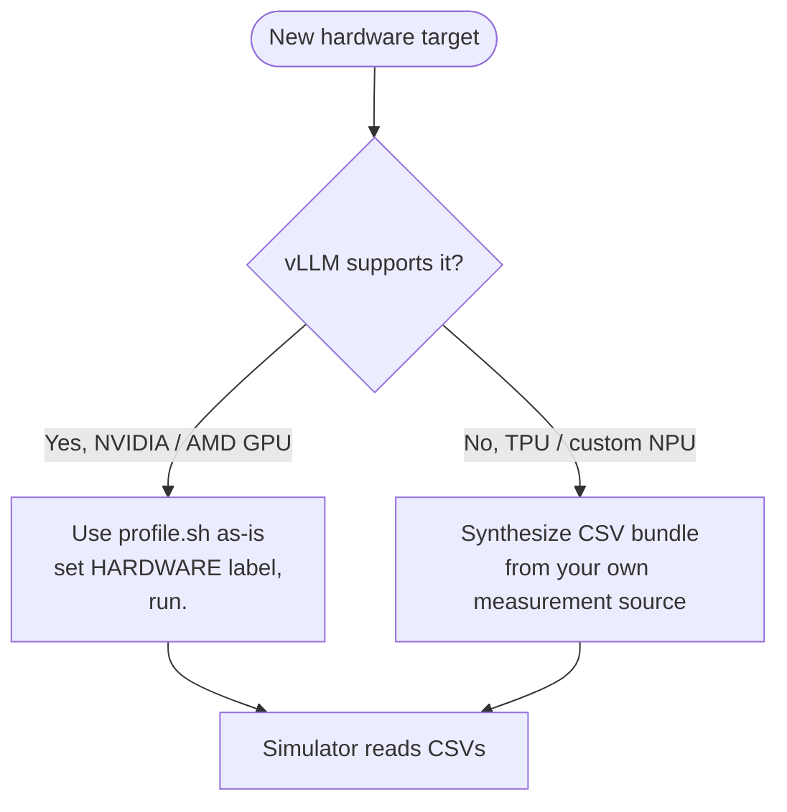

The CSV bundle format described on **[Output bundle](./output-bundle)**
is the contract. Once you produce one, the simulator works the same
way regardless of how the data was collected.

## Adding a new GPU

This is the easy case. The profiler's vLLM-based workflow already
handles it. Three steps:

### 1. Confirm vLLM support

The profiler runs vLLM `0.19.0` by default
(`scripts/docker-vllm.sh` pulls `vllm/vllm-openai:v0.19.0`). Check
that vLLM's release notes mention your GPU.

| GPU family | vLLM 0.19.0 support |
| --- | --- |
| NVIDIA A100, H100, H200 | Yes |
| NVIDIA RTX PRO 6000, RTX 6000 Ada, L40S | Yes |
| NVIDIA Blackwell (B100, B200) | Yes (with CUDA 13.x image: `v0.19.0-cu130`) |
| NVIDIA Hopper SXM | Yes |
| AMD MI300X | Yes (ROCm path; needs `vllm/vllm-rocm`) |
| AMD MI200 / older | Limited; check vLLM matrix |
| Intel Gaudi 3 | Limited (HPU plugin); not supported by this profile path |

If vLLM doesn't support it yet, you have two options: wait for vLLM
to add support, or contribute the backend to vLLM upstream. Neither
is fast.

### 2. Edit `profile.sh`

```bash
HARDWARE="H100"                 # or whatever you want as the folder name
TP_DEGREES="1,2,4,8"
MEASUREMENT_ITERATIONS=3
# ... other knobs as needed
```

`HARDWARE` is just a label, pick something memorable. The simulator
later references this via `cluster_config.hardware`.

For unusual GPU types, you may need to adjust:

- `MAX_NUM_BATCHED_TOKENS` and `MAX_NUM_SEQS` for memory limits
- `ATTENTION_MAX_KV` if KV cache memory is much smaller than HBM
  GPUs of similar generation
- `DTYPE` if the GPU lacks bf16 support (rare on modern GPUs)

### 3. Run

```bash
./profiler/profile.sh
```

Wait. Drink coffee. Output lands in
`profiler/perf/<HARDWARE>/<MODEL>/<variant>/`. See
**[Running → Expected runtime](./running#expected-runtime)** for
ballpark times.

Once it's done, the simulator is ready to use, no further changes.
Update your `cluster_config.json` to set `"hardware": "<HARDWARE>"`
and run.

### AMD ROCm notes

The official `vllm/vllm-rocm` Docker image is the AMD equivalent.
Edit `scripts/docker-vllm.sh` to pull that image instead of
`vllm/vllm-openai`. Beyond the image swap, the profile workflow is
identical.

`HARDWARE="MI300X"` (for example): pick whatever makes sense.

## Adding non-GPU hardware

This is the more involved case. The vLLM-based profiler doesn't
work for hardware vLLM doesn't run on (TPU, Intel Gaudi without HPU
support, custom NPUs / accelerators). But the simulator only cares
about the **CSV bundle format**, not how the data was produced.

The strategy: synthesize CSVs in the
[Output bundle](./output-bundle) format from your own measurement
source.

### Three sources for the data

#### 1. Vendor analytical / cycle-accurate model

Most vendors maintain an internal performance model for their
hardware. If you have access:

- Use the vendor's model to compute kernel-level latencies for the
  layer types the simulator's architecture YAML declares
  (`qkv_proj`, `attention`, `down_proj`, etc.).
- Sweep the same axes the GPU profiler does
  (`tokens`, `(prefill_chunk, kv_prefill, n_decode, kv_decode)`,
  `(tokens, activated_experts)`).
- Write CSVs in the schema documented on
  **[Output bundle](./output-bundle)**.

This produces the most accurate simulator predictions because the
relative latencies between layers reflect your hardware's actual
behavior.

#### 2. External simulator

If you have an analytical compute simulator (GEMM-perf, roofline,
or a cycle-accurate model from a published paper), feed it the
shapes the profiler would have profiled and dump the same CSV format.

The architecture YAMLs at `profiler/models/<model_type>.yaml`
declare which kernels you need to time. For each entry in the
`catalog:` section you need:

- For `dense` category: latency as a function of `tokens`.
- For `per_sequence`: latency as a function of `sequences`.
- For `attention`: 4D table over `(prefill_chunk, kv_prefill,
  n_decode, kv_decode)`.
- For `moe`: 2D table over `(local_tokens, activated_experts)`.

#### 3. Hand-authored from datasheets / public benchmarks

Last resort. If you only have peak FLOPs / memory bandwidth /
latency numbers for your hardware:

1. Compute roofline-style latencies per layer type.
2. Write the CSVs. Keep it coarse, a few rows per axis is enough
   for first-pass sanity checks.
3. Validate against any public benchmark you can find for the same
   hardware × model combo.

This produces optimistic predictions (no realistic kernel overhead),
so use cautiously. The other two paths are strongly preferred.

### What to put in `meta.yaml`

Even when synthesizing, write a `meta.yaml` so the simulator's
runtime warnings work properly:

```yaml
profiler_version: "synthetic-v1"
vllm_version: "n/a"
gpu: "<HARDWARE>"
profiled_at: "<date>"

engine_effective:
  max_num_batched_tokens: <whatever your CSVs cover>
  max_num_seqs: <ditto>
  dtype: bfloat16
  kv_cache_dtype: auto

attention_grid:
  max_kv: <upper bound your attention.csv covers>
  chunks: "<comma-separated chunk values>"
  n_decode: "<comma-separated values>"
  kv: "<comma-separated values>"

skew_fit:
  per_tp:
    1:
      method: "synthetic-constant"
      alpha_default: 0.3   # the pooled constant fallback
```

If you don't have skew measurements (most non-GPU paths won't),
**omit** `skew.csv` and `skew_fit.csv` entirely. The simulator
detects their absence and uses `alpha_default` from `meta.yaml` as a
constant skew correction.

### What you can skip

- `skew.csv` and `skew_fit.csv` if you don't have heterogeneous-decode
  data. Provide `alpha_default` in `meta.yaml::skew_fit.per_tp.<TP>`.
- `moe.csv` if you're not modeling MoE on this hardware (only needed
  when running MoE models).
- TP=N folders for TP degrees you don't need to simulate. The
  simulator only loads the TPs your cluster config asks for.

### What you cannot skip

- `dense.csv`: every model uses dense linears.
- `per_sequence.csv`: `lm_head` and `sampler` always run.
- `attention.csv`: every model has attention.
- `meta.yaml`: without it the simulator can't resolve the variant.

### Validation

Once you've synthesized a CSV bundle:

1. **Smoke test**: run the simulator with a small workload
   (`workloads/example_trace.jsonl`) and a single-instance config
   pointing at your new `HARDWARE`.
2. **Compare against a known reference**: if your hardware has
   published latency numbers for a public model, run a workload that
   matches and check TTFT / TPOT match within reason.
3. **Sanity-check the throughput log**: the per-iteration `prompt_t`
   and `decode_t` values should make rough sense (not 10× too high
   or too low).
4. **Watch for the "extrapolation" warning** at startup. If your
   CSVs are too coarse, the simulator warns; densify the relevant
   axes if accuracy matters.

## Where this gets used

Once your CSV bundle lives at
`profiler/perf/<HARDWARE>/<MODEL>/<variant>/`, the simulator picks
it up automatically when the cluster config names matching values:

```json
{
  "hardware": "<HARDWARE>",
  "model_name": "<MODEL>",
  "tp_size": <N>
}
```

The `--dtype` and `--kv-cache-dtype` CLI flags resolve to the right
`<variant>` folder via `resolve_variant()` (see
**[Simulator → Trace generation](/docs/simulator/trace-generation#variant-resolution)**).

## What's next

- **[Output bundle](./output-bundle)**: schema reference for what
  you need to produce (or have the profiler produce).
- **[Adding a model architecture](./adding-model-architecture)** -
  separate concern, only when the model's `model_type` isn't
  already in `profiler/models/`.

---

<a id="source-26-docs-docs-profiler-adding-model-architecturemd"></a>

## Source: `docs/docs/profiler/adding-model-architecture.md`

---
sidebar_position: 6
title: Adding a model architecture
---

# Adding a model architecture

The profiler dispatches on the HF config's `model_type` field. If
your model's `model_type` already maps to a YAML under
`profiler/models/`, you're done, just run `profile.sh`. If not, you
need to add a YAML.

This page is about that case.

## When you need a new YAML

Run `cat configs/model/<your-org>/<your-model>.json | jq .model_type`
and compare against the bundled architectures:

| `model_type` | YAML | Covers |
| --- | --- | --- |
| `llama` | `llama.yaml` | Llama 3.x dense (8B / 70B / 405B / custom shapes), Mistral 7B, derivatives with the same block structure |
| `qwen3` | `qwen3.yaml` | Qwen3 dense (0.6B / 4B / 7B / 14B / 32B), with per-head `qk_norm` |
| `qwen3_moe` | `qwen3_moe.yaml` | Qwen3 MoE (30B-A3B, 235B-A22B) |
| `mixtral` | `mixtral.yaml` | `MixtralForCausalLM` (8x7B, 8x22B) |
| `phimoe` | `phimoe.yaml` | `PhiMoEForCausalLM` (Phi-3.5-MoE) |

If your `model_type` is one of these, you don't need to do anything
- the existing YAML handles it.

If it's a *new* `model_type` (e.g., `gemma2`, `deepseek_v3`,
`gpt_oss`), you need a new YAML. Read on.

## When you also need simulator code changes

Just adding a YAML is enough when the new model's per-iteration
flow fits the standard pattern:

```
prologue → pre_attn → post_attn → (mlp_dense | mlp_moe) → head
```

If the new model has a genuinely novel block structure, sliding
window attention, multi-latent attention (MLA, like DeepSeek V3),
dual MLP decoders, you'll also need to extend
`serving/core/trace_generator.py` to walk the new sequence and
attach the right collectives. We'll cover that at the end of this
page.

## YAML structure

Each architecture YAML has two top-level sections:

- `catalog:`: maps canonical layer names to vLLM internal class
  names. The profiler uses this to find the right module objects to
  time.
- `sequence:`: declares the order layers run in per iteration. The
  profiler emits one shot per sequence layer; the simulator's
  `trace_generator` walks the same list at trace time.

### Minimal example: `llama.yaml`

```yaml
catalog:
  embedding:
    cls: VocabParallelEmbedding
    category: dense
  layernorm:
    cls: RMSNorm
    category: dense
    tp_stable: true
  qkv_proj:
    cls: QKVParallelLinear
    category: dense
  rotary_emb:
    cls: RotaryEmbedding
    category: dense
  attention:
    cls: Attention
    category: attention
  o_proj:
    cls: RowParallelLinear
    category: dense
    tp_collective: ALLREDUCE
  gate_up_proj:
    cls: MergedColumnParallelLinear
    category: dense
  act_fn:
    cls: SiluAndMul
    category: dense
  down_proj:
    cls: RowParallelLinear
    category: dense
    tp_collective: ALLREDUCE
  final_layernorm:
    cls: RMSNorm
    category: dense
    tp_stable: true
  lm_head:
    cls: ParallelLMHead
    category: per_sequence
  sampler:
    cls: Sampler
    category: per_sequence
    tp_stable: true

sequence:
  prologue:
    - embedding
    - layernorm                   # input rms_norm before block 0
  pre_attn:
    - layernorm
    - qkv_proj
    - rotary_emb
  post_attn:
    - o_proj
    - layernorm                   # post_attention_layernorm
  mlp_dense:
    - gate_up_proj
    - act_fn
    - down_proj
  head:
    - final_layernorm
    - lm_head
    - sampler
```

### `catalog` field reference

| Field | Required | Meaning |
| --- | --- | --- |
| `cls` | ✓ | vLLM class name (used to resolve the module object via attribute lookup) |
| `category` | ✓ | One of `dense` / `per_sequence` / `attention` / `moe` |
| `tp_stable` | optional | `true` if the layer's latency doesn't depend on TP degree (e.g., layernorms, sampler). The writer profiles once at TP=1 and replicates to other `tp<N>/` folders |
| `tp_collective` | optional | If TP > 1, what collective fires after this layer: `ALLREDUCE` for `o_proj` and `down_proj`. Other layers don't need this |

### `sequence` section reference

| Group | Runs | Notes |
| --- | --- | --- |
| `prologue` | Once at the start of each iteration | Embedding lookup + initial input layernorm |
| `pre_attn` | Once per decoder block | qkv_proj + rotary_emb + (qk_norm if Qwen3) |
| `post_attn` | Once per decoder block | o_proj + post_attention_layernorm |
| `mlp_dense` | Once per decoder block (dense models) | gate_up_proj + act_fn + down_proj |
| `mlp_moe` | Once per decoder block (MoE models) | moe (with EP-ALLTOALL surround) |
| `head` | Once at the end of each iteration | final_layernorm + lm_head + sampler |

The `attention` layer always runs between `pre_attn` and `post_attn`
- it's not in `sequence`, it's implicit.

## MoE-specific YAML

MoE architectures add a `moe` entry in the catalog:

```yaml
catalog:
  # ... dense entries ...
  moe:
    cls: FusedMoE
    category: moe
    ep_collective: ALLTOALL    # always ALLTOALL for EP
```

And in `sequence`:

```yaml
sequence:
  # ... same as dense ...
  mlp_moe:
    - moe
  # don't include mlp_dense in MoE models
```

The simulator looks for `mlp_moe` in the YAML and, if present, runs
the EP-ALLTOALL dispatch + combine surround automatically.

See `qwen3_moe.yaml` and `mixtral.yaml` for full MoE YAMLs.

## Step-by-step: adding a new `model_type`

Suppose you want to support `gemma2` (the Google Gemma 2 series).
HF config has `model_type: "gemma2"`. Workflow:

### 1. Inspect the model's vLLM source

Look at `vllm/model_executor/models/<model>.py`. Identify:

- The decoder block class.
- Each layer attribute name (`self.qkv_proj`, `self.attention`, …).
- Whether layernorms are pre-attn / post-attn / both.
- Whether there are any extra layers (some models have post-MLP
  layernorms, etc.).
- For MoE: how experts are arranged.

### 2. Write `profiler/models/gemma2.yaml`

Start from the closest existing YAML (e.g., `llama.yaml` for a
Gemma-style dense model) and adjust:

- Update `cls` names to match the model's vLLM class names.
- Add any extra layers (e.g., Gemma 2's post-MLP layernorm) to the
  catalog and `sequence`.
- Set `tp_stable: true` on layers whose latency doesn't depend on
  TP.

### 3. Try profiling

```bash
MODEL="google/gemma-2-9b" \
HARDWARE="<your-hw>" \
TP_DEGREES=1 \
SKIP_SKEW=1 \
./profiler/profile.sh
```

Start with TP=1 and `SKIP_SKEW=1` for the fastest feedback. The
profiler will:

- Warn loudly if any layer in `sequence` isn't found on the model
  via the `cls` you specified.
- Skip layers it can't find (with a warning), so you can iterate.

If the YAML is right, you'll get clean CSVs. Run a tiny simulation
to confirm.

### 4. Try simulating

In your `cluster_config.json`:

```json
{
  "model_name": "google/gemma-2-9b",
  "hardware": "<your-hw>",
  "tp_size": 1,
  ...
}
```

Run `python -m serving --cluster-config ... --dataset workloads/example_trace.jsonl ...`.

If anything's off (layer not found, infinite loop, missing collective),
the simulator will tell you which layer in your YAML it doesn't know
how to handle. Fix and retry.

### 5. Commit + open a PR

Once it works, send a PR adding `profiler/models/gemma2.yaml`. Make
the PR title `Add gemma2 architecture support` and include:

- The HF model id you used to validate.
- Output of a smoke-test simulation (TTFT / TPOT for a small
  workload).
- Whether MoE was tested (or not, Gemma 2 isn't MoE, but other
  additions might be).

## When you also need to touch `serving/core/trace_generator.py`

Three flags that the YAML alone can't express. Each requires a small
Python addition:

### Sliding-window attention

Some models (Mistral, Llama 3.1 with sliding) limit attention to a
fixed-size window. The simulator's KV-cache budget needs to account
for this, total KV doesn't grow past the window size.

Where: extend the attention category lookup in `trace_generator.py`
to clip `kv_decode` at the window size, and update
`memory_model.py::get_kv` to cap KV blocks per request.

### MLA (Multi-Latent Attention, DeepSeek V3)

DeepSeek V3 compresses KV into a small latent and decompresses on
attention. KV size is much smaller than `num_heads * head_dim *
seq_len` would suggest.

Where: extend `memory_model.py::calculate_sizes` with an MLA case
that uses the latent dim (`kv_lora_rank`) instead of
`num_kv_heads * head_dim`.

### Dual MLP decoders

Some models (e.g., experimental architectures) have two MLPs per
block instead of one. Trace generation needs to know to emit two
`mlp_dense` runs per block.

Where: add a new `sequence` group (e.g., `mlp_dense_2`) and have
`trace_generator._emit_sequence` walk both.

These are all relatively small changes (~30–60 LOC each). The YAML
+ the existing trace generator handles 95% of new architectures
without touching Python.

## Where this gets validated

Once your YAML is in, the bundled `bench/` validation suite is the
sanity check: run vLLM end-to-end on the new model + run the same
workload through the simulator + see how close they match. If
TTFT / TPOT / throughput are all within ~5%, your YAML + (optional)
trace_generator changes are good.

See [`bench/README.md`](https://github.com/casys-kaist/LLMServingSim/tree/main/bench) on
GitHub for the validation methodology and per-model results.

## What's next

- **[Output bundle](./output-bundle)**: what CSVs the profiler
  produces given a working YAML.
- **[Simulator → Trace generation](/docs/simulator/trace-generation)** -
  what trace_generator does at runtime walking your `sequence:`.

---

<a id="source-27-docs-docs-profiler-output-bundlemd"></a>

## Source: `docs/docs/profiler/output-bundle.md`

---
sidebar_position: 3
title: Output bundle
---

# Output bundle

Each profile run produces a directory tree under
`profiler/perf/<HARDWARE>/<MODEL>/<variant>/`. This is **the contract
between the profiler and the simulator**: anything that lands here
in the right format is consumable by
`trace_generator._load_perf_db()`, regardless of how it was produced.

## Folder layout

```
profiler/perf/<HARDWARE>/<MODEL>/<variant>/
├── meta.yaml
└── tp<N>/                        # one folder per profiled TP degree
    ├── dense.csv
    ├── per_sequence.csv
    ├── attention.csv
    ├── moe.csv                   # MoE models only
    ├── skew.csv                  # skew-enabled runs only
    └── skew_fit.csv              # skew-enabled runs only
```

`<variant>` is auto-named from the dtype combination
(`bf16`, `bf16-kvfp8`, `fp8-kvfp8`, …): see
**[Running → Output naming](./running#output-naming)**. Multiple
variants for the same hardware × model live as siblings.

`tp<N>/` exists for each TP in `TP_DEGREES`. Layers tagged
`tp_stable: true` in the architecture YAML (layernorms, sampler) are
profiled once at TP=1 and **replicated** into other TP folders by the
writer.

## Times are microseconds

All `time_us` columns are in **microseconds**. The simulator
multiplies by 1000 and rounds to nanoseconds at load time. If you're
hand-authoring CSVs (see [Adding non-GPU hardware](./adding-hardware#adding-non-gpu-hardware)),
remember to use μs.

## `dense.csv`

```
layer,tokens,time_us
qkv_proj,128,42.3
qkv_proj,256,79.4
qkv_proj,512,154.2
o_proj,128,38.1
...
```

| Column | Meaning |
| --- | --- |
| `layer` | Canonical layer name (must match the architecture YAML's catalog) |
| `tokens` | `total_len` for this shot |
| `time_us` | Measured kernel latency, microseconds |

The simulator does **1D linear interpolation over `tokens`** when
looking up.

Layers it covers: `embedding`, `layernorm`, `qkv_proj`, `qk_norm`,
`rotary_emb`, `o_proj`, `gate_up_proj`, `act_fn`, `down_proj`,
`final_layernorm`. (Anything in the YAML's catalog with category
`dense`.)

## `per_sequence.csv`

```
layer,sequences,time_us
lm_head,1,18.4
lm_head,4,72.1
lm_head,16,289.2
sampler,1,6.7
...
```

| Column | Meaning |
| --- | --- |
| `layer` | `lm_head` or `sampler` |
| `sequences` | `num_requests` for this shot (decode rounds operate per-sequence) |
| `time_us` | Measured kernel latency |

Simulator: **1D linear interpolation over `sequences`**.

## `attention.csv`

The 4D attention table, covers pure-prefill, pure-decode, and mixed
kernel shapes:

```
prefill_chunk,kv_prefill,n_decode,kv_decode,time_us
0,0,1,128,12.4
0,0,1,256,18.7
0,0,4,128,32.1
512,2048,0,0,184.3
512,2048,4,128,221.6
...
```

| Column | Meaning |
| --- | --- |
| `prefill_chunk` | Tokens of the prefill chunk in this iteration. `0` = pure decode |
| `kv_prefill` | KV cache history length the prefill chunk attends to |
| `n_decode` | Number of concurrent decode requests in this iteration. `0` = pure prefill |
| `kv_decode` | KV cache history length the decode requests attend to |
| `time_us` | Measured attention kernel latency |

Simulator does:

- **Nearest-neighbour** on `(prefill_chunk, n_decode)` (discrete axes)
- **Bilinear interpolation** on `(kv_prefill, kv_decode)` (continuous)

The grid is geometric (doubling by default, controlled by
`ATTENTION_CHUNK_FACTOR` and `ATTENTION_KV_FACTOR`). Smaller values
densify; larger values speed up profiling at some accuracy cost.

## `moe.csv` (MoE models only)

```
tokens,activated_experts,time_us
1,8,4.2
4,8,12.8
8,8,21.4
1,16,7.1
...
```

| Column | Meaning |
| --- | --- |
| `tokens` | Local tokens on a single rank after dispatch |
| `activated_experts` | Distinct experts touched on that rank |
| `time_us` | Measured MoE block latency on a single rank |

Simulator: **2D linear interpolation** on `(tokens, activated_experts)`.
Profiled at **TP=1** only, increasing TP doesn't change the
per-rank expert kernel. The simulator handles `ep_size` by adjusting
expert-to-rank assignment, not by re-profiling.

## `skew.csv` (skew-enabled runs)

Raw heterogeneous-decode shots:

```
regime,n,nb,ratio,skew,pc,kp,kvs,kv_big,kv_mean,t_mean_us,t_max_us,t_skew_us,alpha
mixed,8,1,0.125,4.0,512,2048,512,2048,704,38.2,52.1,40.8,0.187
...
```

The columns capture the raw shape of each bimodal batch and the
three measurements:

| Column | Meaning |
| --- | --- |
| `regime` | `pure` (decode-only) or `mixed` (with prefill chunk) |
| `n` | Total decodes in the batch |
| `nb` | Number of "big" decodes (the outlier KV bucket) |
| `ratio` | `nb / n` |
| `skew` | Ratio of big-KV to small-KV (`kv_big / kvs`) |
| `pc` | Prefill chunk size |
| `kp` | KV history of the prefill chunk |
| `kvs` | Small-decode KV |
| `kv_big` | Big-decode KV (`kvs * skew`) |
| `kv_mean` | `(nb * kv_big + (n-nb) * kvs) / n` |
| `t_mean_us` | Latency at all-decodes-uniform-at-mean kv |
| `t_max_us` | Latency at all-decodes-uniform-at-max kv |
| `t_skew_us` | Latency at the actual bimodal mix |
| `alpha` | `(t_skew - t_mean) / (t_max - t_mean)` ∈ [0, 1] |

Methodology: **[Skew & alpha fit](./skew-alpha-fit)**.

## `skew_fit.csv` (skew-enabled runs)

The fitted per-bucket alpha table the simulator actually consumes
at run time:

```
pc,n_label,skew_rate_label,kv_big_label,kp_label,alpha,n_samples
0,n_8,sr_low,kvb_4096,kp_0,0.21,17
0,n_8,sr_low,kvb_4096,kp_2048,0.24,12
512,n_8,sr_high,kvb_8192,kp_2048,0.62,9
...
```

| Column | Meaning |
| --- | --- |
| `pc` | Prefill chunk bucket (raw value) |
| `n_label` | `n_decode` bucket label |
| `skew_rate_label` | Skew-rate bucket label (normalized [0, 1] scheme) |
| `kv_big_label` | Big-KV bucket (log-4× bins) |
| `kp_label` | `kv_prefill` bucket label |
| `alpha` | Fitted weighted-LS alpha for this bucket |
| `n_samples` | Number of `skew.csv` rows that contributed |

Bucket axis definitions live in `meta.yaml::skew_fit.bucket_axes`,
so widening the profile sweep automatically lights up finer
resolution without any simulator code change.

## `meta.yaml`

Sibling of the `tp<N>/` folders. Three groups of metadata:

```yaml
profiler_version: ...
vllm_version: 0.19.0
gpu: "RTXPRO6000"
profiled_at: "2026-04-30T14:23:11Z"

engine_effective:
  max_num_batched_tokens: 2048
  max_num_seqs: 256
  dtype: bfloat16
  kv_cache_dtype: auto

attention_grid:
  max_kv: 16384
  chunk_factor: 2.0
  kv_factor: 2.0
  chunks: "0, 32, 64, 128, 256, 512, 1024, 2048"
  n_decode: "0, 1, 2, 4, 8, 16, 32, 64, 128, 256"
  kv: "0, 32, 64, ..., 16384"

skew_profile:
  factors:
    n: 2.0
    pc: 2.0
    kp: 2.0
    kvs: 2.0
  grid:
    n: "..."
    ratio: "..."
    pc: "..."
    kp: "..."
    kvs: "..."
    skew: "1.5, 2.0, 4.0, 8.0, 16.0"

skew_fit:
  bucket_axes:
    n_label: ["n_2", "n_4", "n_8", "n_16", "n_32", "n_overflow"]
    skew_rate_label: ["sr_low", "sr_mid", "sr_high"]
    kv_big_label: ["kvb_1024", "kvb_4096", "kvb_16384", "kvb_overflow"]
    kp_label: ["kp_0", "kp_2048", "kp_8192", "kp_overflow"]
  per_tp:
    1:
      method: weighted_ls
      n_samples: 13247
      alpha_default: 0.34
      rel_err_p50: 0.027
      rel_err_p90: 0.148
      rel_err_p99: 0.31
      signed_mean: 0.004
      bucket_table: "tp1/skew_fit.csv"
    2:
      ...
```

The simulator reads:

- `engine_effective`: to warn when runtime values exceed profiled
  bounds (lookups will extrapolate).
- `skew_fit.bucket_axes`: to build the bucket key at run time.
- `skew_fit.per_tp[tp].alpha_default`: fallback when a request's
  bucket isn't in `skew_fit.csv`.
- `attention_grid` and `skew_profile` are informational (not
  consumed by the simulator).

Full bucket → α mapping lives in `tp<N>/skew_fit.csv`. The simulator
hydrates the CSV into an in-memory `alpha_by_bucket` map on first
load.

## How the simulator consumes this

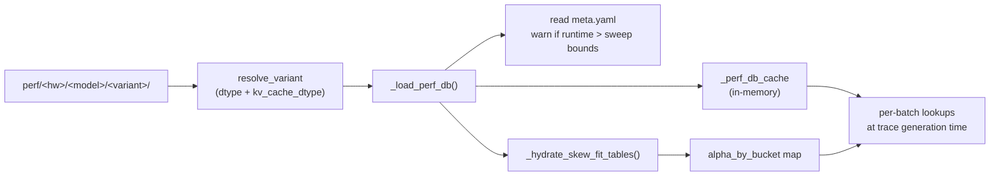

For the simulator-side mechanics, see
**[Simulator → Trace generation](/docs/simulator/trace-generation)**.

## Gotchas

1. **Don't edit CSVs by hand to "tune" simulation results.** The
   simulator interpolates linearly across rows; bogus values produce
   non-monotonic behavior that's hard to debug.
2. **`time_us` is microseconds.** A common mistake when synthesizing
   CSVs from external tools is to put nanoseconds. Triple-check.
3. **Layer names in `dense.csv` must match the architecture YAML.**
   If you add a layer to the YAML and don't profile it, the
   simulator one-shot-warns (and uses 0 latency for that layer,
   silently corrupting results). Re-run profile after YAML edits.
4. **`tp<N>/` folders aren't symlinks.** TP-stable layers are
   physically copied by the writer. Editing `tp1/dense.csv` doesn't
   propagate to `tp2/`.

## What's next

- **[Skew & alpha fit](./skew-alpha-fit)**: methodology behind
  `skew.csv` and `skew_fit.csv`.
- **[Adding non-GPU hardware](./adding-hardware#adding-non-gpu-hardware)**
  synthesize this CSV bundle from your own measurement source.

---

<a id="source-28-docs-docs-profiler-runningmd"></a>

## Source: `docs/docs/profiler/running.md`

---
sidebar_position: 2
title: Running
---

# Running the profiler

The profiler is invoked through `profiler/profile.sh`: an editable
template. You change the variables at the top to whatever you want
to profile, then run it.

> Looking for adding a brand-new hardware target (GPU or non-GPU)?
> See **[Adding new hardware](./adding-hardware)**. This page covers
> the day-to-day "I have a config, I want to profile it" flow.

## Quick start

From inside the vLLM Docker container at `/workspace`:

```bash
# Edit the variables at the top of profiler/profile.sh, then:
./profiler/profile.sh
```

The script auto-resolves the model architecture from the HF
`config.json`'s `model_type` field, you don't specify it on the
command line. The matching architecture YAML must exist under
`profiler/models/<model_type>.yaml`. See
**[Adding a model architecture](./adding-model-architecture)** if it
doesn't.

## What `profile.sh` does, in order

1. Reads `configs/model/<MODEL>.json` (a raw HF `config.json`). If
   absent and `MODEL` is an HF id, downloads from the hub and caches
   there.
2. Picks the matching architecture YAML by `model_type`.
3. Writes the model config to a tmpdir; spins vLLM up against that.
4. Sweeps **dense / per_sequence / attention / moe** shot grids,
   writing CSVs under `perf/<HW>/<MODEL>/<variant>/tp<N>/`.
5. (If `SKIP_SKEW=0`, the default) Runs the heterogeneous-decode
   skew sweep and fits per-bucket alphas to `skew_fit.csv`.
6. Writes `meta.yaml` summarizing the run.

For each TP degree in `TP_DEGREES`, the simulator emulates that TP
on a single GPU by dividing the model's per-rank shapes via
`hf_overrides`. **You only need one GPU** to profile any TP degree.

## Required variables

| Variable | Meaning |
| --- | --- |
| `MODEL` | HF-style `<org>/<name>`. Must have a config at `configs/model/<MODEL>.json` (auto-downloaded on first run) |
| `HARDWARE` | Free-form label that becomes the folder name under `perf/`. Pick something meaningful (e.g., `RTXPRO6000`, `H100`, `MI300X`) |

## Sweep shape

| Variable | Default | Meaning |
| --- | --- | --- |
| `TP_DEGREES` | `1,2,4` | Comma-separated TP degrees. **Must include `1`** (TP-stable layers are profiled once at TP=1 and replicated to other TP folders) |
| `MAX_NUM_BATCHED_TOKENS` | `2048` | Profiler internally bumps this by `+MSQ` for shot-bypass headroom; subtracted back when recording meta |
| `MAX_NUM_SEQS` | `256` | Profile with `MSQ > runtime MSQ` so mixed-regime cases at `n = runtime_MSQ` stay feasible |

## Attention grid

The 4D attention sweep covers `(prefill_chunk, kv_prefill, n_decode,
kv_decode)`. Three knobs control its shape:

| Variable | Default | Meaning |
| --- | --- | --- |
| `ATTENTION_MAX_KV` | `16384` | Upper bound for `kv_prefill` and `kv_decode` axes |
| `ATTENTION_CHUNK_FACTOR` | `2.0` | Geometric factor for `prefill_chunk` axis (doubling) |
| `ATTENTION_KV_FACTOR` | `2.0` | Geometric factor for `kv` axes (doubling) |

Smaller factors densify the axis (more shots, slower); larger factors
coarsen it (fewer shots, faster).

## Measurement averaging

```bash
MEASUREMENT_ITERATIONS=3
```

Number of timed forwards per shot, averaged. A single sample swings
15–25% on large GEMMs due to DVFS / clock jitter. `N=3` cuts that to
~5% at ~3× profile time. Bump to 5 if you need very tight numbers.

## Skew sweep

After the uniform attention grid, the profiler runs a
heterogeneous-decode sweep that drives the simulator's
FlashAttention-varlen skew correction:

| Variable | Default | Meaning |
| --- | --- | --- |
| `SKIP_SKEW` | unset | Set to `1` to skip the skew sweep entirely. Simulator falls back to a pooled constant alpha |
| `ONLY_SKEW` | unset | Set to `1` to run **only** the skew step, leaving dense / per_seq / attention / moe untouched. Useful for refreshing `skew.csv` |
| `SKEW_N_FACTOR` | `2.0` | `n` (total decodes) axis density. Higher = fewer shots |
| `SKEW_PC_FACTOR` | `2.0` | `pc` (prefill chunk) axis |
| `SKEW_KP_FACTOR` | `2.0` | `kp` (prefill history length) axis |
| `SKEW_KVS_FACTOR` | `2.0` | `kvs` (small-decode kv) axis |

The skew sweep fires three shots per case (`t_mean`, `t_max`,
`t_skew`), so coarsening with `>2.0` factors cuts profile time
substantially. See **[Skew & alpha fit](./skew-alpha-fit)** for the
methodology.

## Resume vs force

| Variable | Default | Meaning |
| --- | --- | --- |
| `FORCE` | unset | Set to `1` to wipe every CSV for this variant and re-profile from scratch |

Default is **resume**: existing CSVs are preloaded row by row, and
only shots whose identity key isn't already present get fired. This
lets you extend an earlier sweep after changing feasibility (e.g.,
raising `MAX_NUM_SEQS` from 128 to 256) in **minutes** instead of
hours. Resume applies to every category plus skew; `FORCE=1` nukes
them all.

## Output naming

| Variable | Default | Meaning |
| --- | --- | --- |
| `VARIANT` | auto-derived | Override the variant folder name |

When omitted, `<variant>` is auto-composed from `DTYPE` + `KV_CACHE_DTYPE`:

- `bfloat16` → `bf16`
- `bfloat16` + `fp8` KV → `bf16-kvfp8`
- `fp8` + `fp8` KV → `fp8-kvfp8`

You almost never need to override this. Set explicitly only for
named experimental runs (quantization schemes, ablations).

## Dtype

| Variable | Default | Meaning |
| --- | --- | --- |
| `DTYPE` | `bfloat16` | Model weight dtype: `bfloat16` / `float16` / `float32` / `fp8`. Inferred from `torch_dtype` when unset |
| `KV_CACHE_DTYPE` | `auto` | KV cache dtype: `auto` (inherits `DTYPE`) / `fp8` / etc. `fp8` halves KV memory in the simulator |

## Verbosity

```bash
VERBOSITY="--silent"        # warnings only
VERBOSITY="--verbose"       # DEBUG + vLLM stdout
VERBOSITY=""                # default (INFO)
```

## Multi-model batch sweep: `profile-all.sh`

For bringing up a fresh GPU target across multiple models in one
shot:

```bash
./profiler/profile-all.sh
```

This wraps `python -m profiler profile` in a loop over a canned
list of models (currently `Qwen/Qwen3-32B`,
`Qwen/Qwen3-30B-A3B-Instruct-2507`, `meta-llama/Llama-3.1-8B`) at
TP=1 and TP=2. All knobs from `profile.sh` are recognized as
environment variables:

```bash
HARDWARE=H100 \
TP_DEGREES=1,2,4 \
ATTENTION_CHUNK_FACTOR=1.5 \
./profiler/profile-all.sh
```

To change the model list, edit the `MODELS=( ... )` array at the top
of the script. This file is meant to be copied or tweaked in-place,
not treated as a stable CLI.

## Expected runtime

Rough numbers for a single model + single TP on RTXPRO6000-class
hardware (`MAX_NUM_BATCHED_TOKENS=2048`, `MAX_NUM_SEQS=256`, default
factors):

| Step | Time |
| --- | --- |
| `dense` | seconds |
| `per_sequence` | seconds |
| `attention` (uniform 4D grid) | 5–15 minutes |
| `moe` (MoE only) | 10–30 minutes |
| `skew` sweep | 10–25 minutes |
| `skew_fit` (post-process) | seconds |

A full multi-TP, multi-model sweep with `profile-all.sh` typically
runs **1–4 hours**. Use `SKIP_SKEW=1` for a much faster pass when
you don't need varlen-skew correction.

The Rich-based logger renders per-step progress bars; redirect
stdout with `--silent` for a quieter run.

## Output

Profile data lands at:

```
profiler/perf/<HARDWARE>/<MODEL>/<variant>/
├── meta.yaml
└── tp<N>/
    ├── dense.csv
    ├── per_sequence.csv
    ├── attention.csv
    ├── moe.csv         (MoE models only)
    ├── skew.csv         (skew-enabled runs)
    └── skew_fit.csv     (skew-enabled runs)
```

Schema reference: **[Output bundle](./output-bundle)**.

## Tips

1. **Always start with `SKIP_SKEW=1`** when bringing up a new
   `(hardware, model)` combo, get the uniform grid done first,
   then add skew once you know the rest works.
2. **`profile.sh` is intended for in-place editing.** Don't try to
   parameterize it via flags; copy it for scenarios that diverge
   substantially.
3. **Profile resumption is granular**: if a single shot crashes,
   you can fix the issue and re-run; the previously-completed shots
   stay cached.
4. **Coarsen the attention grid first**. The 4D attention sweep is
   the longest step. Bump `ATTENTION_CHUNK_FACTOR` to `4.0` if you
   only need rough numbers, then re-run with `2.0` later for
   precision.
5. **Don't profile across CUDA driver versions.** Driver upgrades
   change kernel timings by a few percent; either re-profile after
   driver change or accept the drift.

## What's next

- **[Output bundle](./output-bundle)**: schema for the CSVs you
  just produced.
- **[Skew & alpha fit](./skew-alpha-fit)**: what the skew sweep is
  doing under the hood.

---

<a id="source-29-docs-docs-profiler-skew-alpha-fitmd"></a>

## Source: `docs/docs/profiler/skew-alpha-fit.md`

---
sidebar_position: 4
title: Skew & alpha fit
---

# Skew & alpha fit

The uniform attention sweep (`attention.csv`) profiles batches where
all decodes share one KV length. Real serving doesn't look like
that, every iteration mixes long-running requests at high KV with
freshly-arrived ones at low KV. FlashAttention's varlen kernel pays
a real penalty for that heterogeneity (tile-padding + SM-imbalance),
which the uniform grid can't see.

The skew sweep + alpha fit is how the simulator gets that penalty
right.

## The problem in one picture

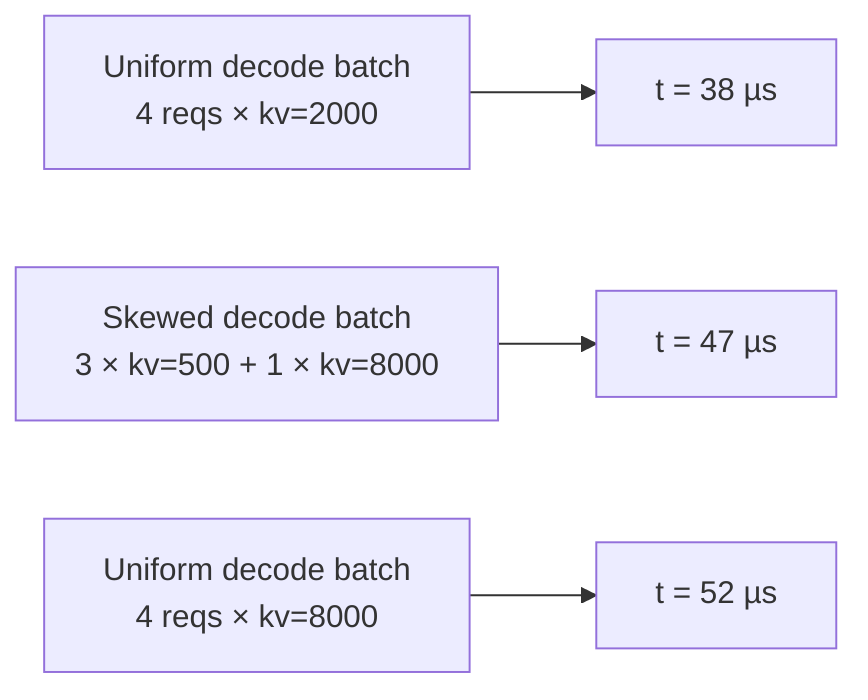

Three batches with the same `n=4` decodes and the same **mean** KV
of 2000 (left and middle) or **max** KV of 8000 (middle and right).
The middle batch's latency lands between the two uniform reference
points, but where, exactly, depends on how skewed the KV
distribution is.

The naive interpolation `t = t(mean_kv)` underestimates the skewed
case (38 µs predicted vs. 47 µs actual). Using `t(max_kv)` would
overestimate (52 µs vs. 47 µs).

## The fix: blend two lookups using a per-bucket alpha

For every shape of skewed batch, we measure the actual latency
**plus** what the uniform-mean and uniform-max latencies would be at
the same shapes. Three numbers per shot:

| Symbol | Batch shape |
| --- | --- |
| `t_mean` | Same `n`, all decodes uniform at the batch's **mean** kv |
| `t_max` | Same `n`, all decodes uniform at the batch's **max** kv |
| `t_skew` | The actual bimodal mix: `nb` decodes at `kv_big` + `(n - nb)` decodes at `kvs` |

From these three:

```
alpha = (t_skew - t_mean) / (t_max - t_mean)   ∈ [0, 1]
```

Alpha is a **normalized position on the t_mean → t_max line**:

- `alpha = 0` → no penalty; skewed batch behaves like uniform-mean.
- `alpha = 1` → full penalty; skewed batch behaves like uniform-max.
- typical values: 0.2–0.5.

At simulation time, the lookup becomes:

```
t_predicted = t_mean_lookup(batch.kv_decode_mean)
            + alpha(batch.shape) × (t_max_lookup(batch.kv_decode_max)
                                    - t_mean_lookup(batch.kv_decode_mean))
```

The simulator does **two** 4D attention lookups and blends them.
That's `_lookup_attention_with_skew` in `serving/core/trace_generator.py`.

## Sweep structure (`skew.csv`)

The skew sweep produces `skew.csv` rows in two tiers:

### Tier 1, factorial over (n, ratio, pc, kp, kvs)

A factorial sweep at one representative skew factor (`_SKEW_REP =
4.0`). Provides the bulk of the rows and covers every
`(pc, n_bin, kv_big_bin, kp_bin, skew_rate_bin)` cell the fit
discriminates on.

Per axis:

- `n` ∈ unique values up to `MAX_NUM_SEQS`
- `ratio = nb / n` ∈ a few sample fractions
- `pc` ∈ prefill chunk grid (including 0 = pure decode)
- `kp` ∈ prefill-history grid
- `kvs` ∈ small-kv grid
- `skew` = 4.0 (fixed)

### Tier 2, skew-axis sweep at anchor pivots

At a handful of anchor pivots (a fixed subset of Tier-1 cells), Tier
2 sweeps `skew ∈ {1.5, 2.0, 4.0, 8.0, 16.0}`. This is the only
source of rows with `skew ≠ 4.0`; covers how `alpha` saturates as
the outlier KV stretches.

Tier 2 catches the "very long context decode joins a short-context
batch" failure mode that Tier 1 alone would miss.

## Density knobs

All five axes are user-controllable via per-axis geometric factors
in `profile.sh` (defaults `2.0` = doubling):

| Variable | Axis | Profiling time impact |
| --- | --- | --- |
| `SKEW_N_FACTOR` | `n` | doubling halves the shots |
| `SKEW_PC_FACTOR` | `pc` | same |
| `SKEW_KP_FACTOR` | `kp` | same |
| `SKEW_KVS_FACTOR` | `kvs` | same |

The skew sweep fires **3 shots per case** (`t_mean`, `t_max`,
`t_skew`), so coarsening compounds quickly. Bumping any factor to
`4.0` quarters the shots on that axis; `8.0` does it again.

The effective values land in `meta.yaml::skew_profile.factors`.

## The fit (`skew_fit.csv`)

Raw `skew.csv` rows are too granular to query at runtime, millions
of `alpha`s, none of which match a runtime batch shape exactly. The
post-process fit groups rows into **buckets** along five axes and
runs a weighted least-squares fit per bucket.

### The 5-axis bucket key

| Axis | Bucket scheme |
| --- | --- |
| `pc` | One bucket per unique `pc` value (raw) |
| `n_label` | One bucket per unique `n` value (`n=0` sentinel + overflow) |
| `skew_rate_label` | Fixed normalized [0, 1] scheme, `sr_low`, `sr_mid`, `sr_high` |
| `kv_big_label` | log-4× bins extended to observed max, `kvb_1024`, `kvb_4096`, `kvb_16384`, `kvb_overflow` |
| `kp_label` | One bucket per unique `kp` value + overflow |

The bucket axis definitions are written to
`meta.yaml::skew_fit.bucket_axes` so the simulator builds the same
bucket key at lookup time. Widening the profile sweep automatically
lights up finer resolution without simulator code changes.

### Storage

- `skew_fit.csv`: full per-bucket alpha mapping. ~1000–5000 rows
  for a typical sweep.
- `meta.yaml::skew_fit.per_tp[tp]`: summary per TP:
  `method`, `n_samples`, `alpha_default`, `rel_err_p50/p90/p99`,
  `signed_mean`, plus a `bucket_table` pointer at
  `tp<N>/skew_fit.csv`.

This split keeps `meta.yaml` to ~100 lines per variant instead of
~3000+.

### Fit accuracy on the bundled profiles

Validation results from the RTXPRO6000 sweep on the bundled models:

| TP | n_samples | rel_err_p50 | rel_err_p90 | rel_err_p99 |
| --- | --- | --- | --- | --- |
| TP=1 | ~13 k | 2.7% | 14.8% | 31% |
| TP=2 | ~12 k | 3.5% | 16.4% | 32% |

p50 and p90 are the relative error of the fitted alpha vs. the
measured alpha across held-out shots. The numbers are
indistinguishable from the previous 3-axis fit at p50 but ~10%
better at p90, because the 5-axis bucket scheme captures the
`(skew_rate, kv_big)` interaction Tier 2 surfaces.

## Skip / refresh modes

| Variable | Effect |
| --- | --- |
| `SKIP_SKEW=1` | Skip the entire skew step. No `skew.csv` or `skew_fit.csv` produced. The simulator falls back to a **pooled constant alpha** at run time |
| `ONLY_SKEW=1` | Run only the skew step, leaving `dense / per_seq / attention / moe` untouched. Useful for refreshing skew after axis-density changes |

The pooled constant alpha fallback is roughly 0.3 across observed
hardware. Without skew correction, predictions skew (heh) low by
single-digit percent on heterogeneous-decode workloads, usually
fine for first-pass sanity checks.

## Gotchas

1. **`skew_fit.csv` is bucket-keyed**, not raw-shape-keyed. A
   runtime batch with no matching bucket falls back to
   `alpha_default`. If your workload pushes shapes outside the
   profiled grid, expect `alpha_default` to dominate, re-profile
   with wider grid bounds.
2. **`alpha < 0` or `alpha > 1` are clipped at fit time.**
   Measurement noise occasionally produces out-of-range raw alphas
   from a single shot; the fit ignores them.
3. **Skew correction only fires for non-trivial batches.** Pure
   prefill (`n_decode == 0`) and pure-uniform decode batches don't
   need correction, the uniform grid is already correct.
4. **MoE doesn't get skew correction.** The simulator's skew path is
   attention-specific. MoE per-rank latency is read directly from
   the 2D `(tokens, activated_experts)` table.

## What's next

- **[Output bundle → `skew_fit.csv`](./output-bundle#skew_fitcsv-skew-enabled-runs)**
  column-by-column reference.
- **[Simulator → Trace generation](/docs/simulator/trace-generation#heterogeneous-decode-skew-correction)**
  how the alpha is applied at simulation time.

---

<a id="source-30-docs-docs-reference-cli-flagsmd"></a>

## Source: `docs/docs/reference/cli-flags.md`

---
sidebar_position: 1
title: CLI flags
---

# `python -m serving` CLI flags

Complete reference for every command-line flag accepted by
`python -m serving`. For the conceptual side of each flag (what it
*does* internally), see **[Simulator](/docs/simulator/architecture)**.

## Cluster topology

| Flag | Type | Default | Description |
| --- | --- | --- | --- |
| `--cluster-config` | path | `configs/cluster/single_node_single_instance.json` | Path to a cluster-config JSON. See **[Cluster config](./cluster-config)** |
| `--network-backend` | choice | `analytical` | Network simulation backend. `analytical` (fast) or `ns3` (detailed, WIP) |

## Batching and scheduling

These flags are deployment defaults. A cluster config can override the
matching runtime knobs per `instances[i]`; see
**[Cluster config](./cluster-config#runtime-overrides-optional)**.

| Flag | Type | Default | Description |
| --- | --- | --- | --- |
| `--max-num-seqs` | int | `128` | Max sequences in a batch. `0` = unlimited |
| `--max-num-batched-tokens` | int | `2048` | Max tokens per iteration across all requests (token budget) |
| `--long-prefill-token-threshold` | int | `0` | Per-request token cap per step for chunked prefill. `0` = disabled |
| `--enable-chunked-prefill` | bool | `True` | Split long prefill across iterations. Use `--no-enable-chunked-prefill` to disable |
| `--prioritize-prefill` | flag | off | Run prefill before decode in the same iteration |
| `--block-size` | int | `16` | KV cache block size in tokens |
| `--skip-prefill` | flag | off | Skip prefill, run decode only |

## Routing

| Flag | Choices | Default | Description |
| --- | --- | --- | --- |
| `--request-routing-policy` | `LOAD` / `RR` / `RAND` / `CUSTOM` | `LOAD` | Cross-instance request routing |
| `--expert-routing-policy` | `BALANCED` / `RR` / `RAND` / `CUSTOM` | `BALANCED` | MoE expert token routing |
| `--enable-block-copy` | bool | `True` | Replay one block's trace across layers (set False for per-layer EP variance) |

## Precision

| Flag | Choices | Default | Description |
| --- | --- | --- | --- |
| `--dtype` | `float16` / `bfloat16` / `float32` / `fp8` / `int8` | model's `torch_dtype`, fallback `bfloat16` | Model weight dtype |
| `--kv-cache-dtype` | `auto` / `fp8` | `auto` (inherits dtype) | KV cache dtype. `fp8` halves KV memory and selects a `*-kvfp8` profile variant |

## Prefix caching and offloading

| Flag | Default | Description |
| --- | --- | --- |
| `--enable-prefix-caching` | `True` | RadixAttention prefix caching. Use `--no-enable-prefix-caching` to disable |
| `--enable-prefix-sharing` | off | Second-tier prefix pool shared across instances within a node |
| `--prefix-storage` | `None` | Where the second-tier pool lives. `None` / `CPU` / `CXL` |
| `--enable-local-offloading` | off | Weight offloading to NPU (counts weight reads in profiling) |
| `--enable-attn-offloading` | off | Attention computation offloading to PIM |
| `--enable-sub-batch-interleaving` | off | Overlap GPU compute with PIM attention. Requires `--enable-attn-offloading` |

## Dataset and output

| Flag | Type | Default | Description |
| --- | --- | --- | --- |
| `--dataset` | path | `None` | JSONL workload file. See **[Workloads → JSONL format](/docs/workloads/jsonl-format)** |
| `--num-reqs` | int | `0` | Entries to load from the dataset (`0` = all). For agentic, each entry is a session |
| `--output` | path | `None` | Per-request CSV output path. Stdout only if `None`. The literal `{run_id}` is replaced with the active run id |

## Run isolation

Each invocation writes ASTRA-Sim intermediates under a run-specific input
root so parallel simulations do not overwrite each other's generated
configs, traces, or Chakra workloads. Generated text traces are removed
after Chakra conversion by default, and the run-specific input root is
removed after a successful simulation by default.

| Flag | Type | Default | Description |
| --- | --- | --- | --- |
| `--run-id` | string | auto-generated | Path-safe id for this simulation run. Used in `astra-sim/inputs/runs/<run-id>` and the `{run_id}` output placeholder |
| `--inputs-root` | path | `astra-sim/inputs/runs/<run-id>` | Override the generated ASTRA-Sim input root, for example to place intermediates on local SSD or tmpfs |
| `--cleanup-inputs` / `--no-cleanup-inputs` | bool | `true` | Remove generated trace files after Chakra conversion and remove the generated run directory after a successful simulation. Use `--no-cleanup-inputs` to preserve traces, Chakra workloads, and input configs for debugging |

## Logging

| Flag | Type | Default | Description |
| --- | --- | --- | --- |
| `--log-interval` | float | `1.0` | Seconds between throughput / memory log lines |
| `--log-level` | choice | `WARNING` | `WARNING` (default) / `INFO` / `DEBUG` |

## Quick reference: which flag for which feature

| Feature | Flag(s) |
| --- | --- |
| Multi-instance (parallelism via cluster config) | (cluster config `num_instances`) |
| Tensor parallel | (cluster config `tp_size`) |
| MoE expert parallel | (cluster config `ep_size`) |
| DP+EP MoE | (cluster config `dp_group`) |
| Prefix caching | `--enable-prefix-caching` (default on), `--enable-prefix-sharing`, `--prefix-storage` |
| Chunked prefill | `--enable-chunked-prefill` (default on), `--long-prefill-token-threshold` |
| PIM attention offload | `--enable-attn-offloading` (cluster config sets `pim_config`) |
| FP8 KV cache | `--kv-cache-dtype fp8` |
| ns3 backend | `--network-backend ns3` |

For the full conceptual treatment of each feature, browse the
**[Simulator](/docs/simulator/architecture)** section. For runnable
examples, see **[Examples](/docs/examples)**.

---

<a id="source-31-docs-docs-reference-cluster-configmd"></a>

## Source: `docs/docs/reference/cluster-config.md`

---
sidebar_position: 1
title: Cluster config
---

# Cluster config schema

Formal field-by-field schema for the JSON file passed via
`--cluster-config`. For a guided walkthrough with examples, see
**[Examples → Cluster config explained](/docs/examples/cluster-config-explained)**.
This page is the **lookup reference**: every field, every type,
every default.

## File location

Configs live at `configs/cluster/<name>.json`. The simulator reads
the file once at startup and `serving/core/config_builder.py`
generates derived ASTRA-Sim input files (`network.yml`,
`system.json`, `memory_expansion.json`).

## Top-level

```json
{
  "num_nodes": 1,
  "link_bw": 16,
  "link_latency": 20000,
  "nodes": [...],
  "cxl_mem": {...}
}
```

| Field | Type | Required | Default | Description |
| --- | --- | --- | --- | --- |
| `num_nodes` | int | ✓ |  | Number of physical nodes in the cluster |
| `link_bw` | float or float[] | ✓ |  | ASTRA-Sim topology link bandwidth in **GB/s**. Scalars apply to every topology dimension; arrays must match the final `network.yml::npus_count` rank |
| `link_latency` | float or float[] | ✓ |  | ASTRA-Sim topology link latency in **ns**. Scalars apply to every topology dimension; arrays must match the final `network.yml::npus_count` rank |
| `nodes` | array | ✓ |  | Length must equal `num_nodes` |
| `cxl_mem` | object | optional | absent | CXL memory expansion (see below) |

Example: if `network.yml` will end up with `npus_count: [4, 2]`, you may set
`link_bw: [900, 100]` and `link_latency: [0, 20000]` to assign different
bandwidth/latency per topology dimension.

## `cxl_mem` (top-level, optional)

```json
"cxl_mem": {
  "mem_size": 1024,
  "mem_bw": 60,
  "mem_latency": 250,
  "num_devices": 4
}
```

| Field | Type | Required | Description |
| --- | --- | --- | --- |
| `mem_size` | float | ✓ | Capacity per device in **GB** |
| `mem_bw` | float | ✓ | Bandwidth per device in **GB/s** |
| `mem_latency` | float | ✓ | Access latency in **ns** |
| `num_devices` | int | ✓ | Number of CXL devices (`cxl:0` through `cxl:N-1`) |

When present, instances can reference `cxl:N` in their `placement`
field.

## Per-node (`nodes[i]`)

```json
{
  "num_instances": 2,
  "cpu_mem": {"mem_size": 512, "mem_bw": 256, "mem_latency": 0},
  "instances": [...],
  "power": {...},
  "cpu_mem.pim_config": "DDR4_8GB_3200_pim"
}
```

| Field | Type | Required | Description |
| --- | --- | --- | --- |
| `num_instances` | int | ✓ | Number of serving instances on this node |
| `cpu_mem` | object | ✓ | Host CPU memory config (see below) |
| `instances` | array | ✓ | Length must equal `num_instances` |
| `power` | object | optional | Power model config (see below) |

### `cpu_mem`

| Field | Type | Required | Description |
| --- | --- | --- | --- |
| `mem_size` | float | ✓ | Host CPU memory capacity in **GB** |
| `mem_bw` | float | ✓ | CPU memory bandwidth in **GB/s** |
| `mem_latency` | float | ✓ | CPU memory latency in **ns** |
| `pim_config` | string | optional | Name of a PIM device config in `configs/pim/`. See **[PIM config](./pim-config)** |

### `power` (optional)

Enables the power model on this node. See **[Examples → Power
modeling](/docs/examples/advanced/power-modeling)** for the full
schema. Top-level structure:

```json
"power": {
  "base_node_power": 60,
  "npu": {"<hardware>": {...}},
  "cpu": {...},
  "dram": {...},
  "link": {...},
  "nic": {...},
  "storage": {...}
}
```

| Sub-field | Required | Description |
| --- | --- | --- |
| `base_node_power` | ✓ | Always-on host platform power in **W** |
| `npu.<hardware>.idle_power` | ✓ | NPU idle wattage |
| `npu.<hardware>.standby_power` | ✓ | NPU post-compute standby wattage |
| `npu.<hardware>.active_power` | ✓ | NPU active compute wattage |
| `npu.<hardware>.standby_duration` | ✓ | Time to stay in standby after compute, in **ns** |
| `cpu.idle_power`, `cpu.active_power`, `cpu.util` | ✓ | CPU baseline + utilization fraction |
| `dram.dimm_size`, `dram.idle_power`, `dram.energy_per_bit` | ✓ | DIMM size, idle power, per-bit energy |
| `link.num_links`, `link.idle_power`, `link.energy_per_bit` | ✓ | Network link power |
| `nic.num_nics`, `nic.idle_power` | ✓ | NIC count and baseline |
| `storage.num_devices`, `storage.idle_power` | ✓ | Storage devices |

## Per-instance (`instances[i]`)

```json
{
  "model_name": "Qwen/Qwen3-32B",
  "hardware": "RTXPRO6000",
  "npu_mem": {"mem_size": 96, "mem_bw": 1597, "mem_latency": 0},
  "num_npus": 2,
  "tp_size": 2,
  "pp_size": 1,
  "ep_size": 1,
  "dp_group": null,
  "pd_type": null,
  "max_num_seqs": 128,
  "max_num_batched_tokens": 2048,
  "placement": {...}
}
```

### Required fields

| Field | Type | Description |
| --- | --- | --- |
| `model_name` | string | HF id. Must match a config at `configs/model/<model_name>.json` (see **[Model config](./model-config)**) |
| `hardware` | string | Hardware label. Must match `profiler/perf/<hardware>/` |
| `npu_mem.mem_size` | float | Per-GPU NPU memory in **GB** |
| `npu_mem.mem_bw` | float | Per-GPU NPU memory bandwidth in **GB/s** |
| `npu_mem.mem_latency` | float | Per-GPU NPU memory latency in **ns** |
| `pd_type` | string \| null | `"prefill"`, `"decode"`, or `null` (combined) |

### Parallelism (at least one of `num_npus` / `tp_size`)

| Field | Type | Default | Description |
| --- | --- | --- | --- |
| `num_npus` | int | inferred from `tp_size * pp_size` | Total GPUs for this instance |
| `tp_size` | int | inferred from `num_npus // pp_size` | Tensor-parallel degree |
| `pp_size` | int | `1` | Pipeline-parallel degree |
| `ep_size` | int | `tp_size` (MoE) / `1` (dense) | Expert-parallel degree |
| `dp_group` | string \| null | `null` | Group ID. Instances with the same string share experts via cross-instance ALLTOALL |

**Constraints:**

- `num_npus == tp_size * pp_size` (always)
- Without `dp_group`: `ep_size <= tp_size`
- For MoE: `ep_size` must divide `num_local_experts`

### Runtime overrides (optional)

These fields override the matching `python -m serving` CLI flag for this
instance only. Omitted fields keep the CLI value; for `dtype`, an omitted CLI
value still falls back to the model config's `torch_dtype`.

| Field | Type | CLI fallback | Description |
| --- | --- | --- | --- |
| `max_num_seqs` | int | `--max-num-seqs` | Max active sequences for this instance. `0` means unlimited |
| `max_num_batched_tokens` | int | `--max-num-batched-tokens` | Per-iteration token budget for this instance. `0` means unlimited |
| `long_prefill_token_threshold` | int | `--long-prefill-token-threshold` | Per-request chunk cap for chunked prefill |
| `block_size` | int | `--block-size` | KV-cache block size in tokens |
| `dtype` | string | `--dtype` | Weight/profile dtype for this instance |
| `kv_cache_dtype` | string | `--kv-cache-dtype` | KV-cache dtype for memory accounting and profile variant selection |
| `enable_chunked_prefill` | bool | `--enable-chunked-prefill` | Enable chunked prefill in this instance's scheduler |
| `enable_prefix_caching` | bool | `--enable-prefix-caching` | Enable this instance's local prefix cache |
| `prioritize_prefill` | bool | `--prioritize-prefill` | Prefer prefill requests when forming batches |
| `enable_local_offloading` | bool | `--enable-local-offloading` | Emit graph conversion with local offloading for this instance |
| `enable_attn_offloading` | bool | `--enable-attn-offloading` | Emit PIM attention offload for this instance |
| `enable_sub_batch_interleaving` | bool | `--enable-sub-batch-interleaving` | Enable sub-batch interleaving for this instance |
| `enable_block_copy` | bool | `--enable-block-copy` | Reuse one block trace across repeated transformer blocks |

### `placement` (optional)

Per-layer / per-block weight + KV-cache placement rules. See
**[Examples → CXL extended memory](/docs/examples/memory-tiers/cxl-memory)**
for a worked example.

```json
"placement": {
  "default": {"weights": "npu", "kv_loc": "npu", "kv_evict_loc": "cpu"},
  "blocks": [
    {"blocks": "0-3", "weights": "cxl:0", "kv_loc": "npu", "kv_evict_loc": "cpu"}
  ],
  "layers": {
    "embedding": {"weights": "cxl:1", "kv_loc": "npu", "kv_evict_loc": "cpu"}
  }
}
```

| Sub-field | Type | Required | Description |
| --- | --- | --- | --- |
| `default` | object | ✓ | Catch-all rule for layers / blocks not in `blocks` or `layers` |
| `blocks` | array | optional | Per-decoder-block-range overrides |
| `layers` | object | optional | Per-named-layer overrides |

Each rule object has three string fields:

| Field | Allowed values | Description |
| --- | --- | --- |
| `weights` | `npu` / `cpu` / `cxl:<id>` | Where this layer's weights live |
| `kv_loc` | `npu` / `cpu` / `cxl:<id>` | Where active KV blocks live (attention layers only) |
| `kv_evict_loc` | `npu` / `cpu` / `cxl:<id>` | Where evicted KV blocks spill |

`blocks` strings are dash-and-comma-separated ranges:
`"0-3"`, `"4-7"`, `"8,9,10"`, `"11-23"`. Layer-name keys must match
canonical layer names from the architecture YAML.

## Validation rules

- `num_nodes == len(nodes)` and per-node `num_instances == len(instances)`.
- Per-instance `weight_per_gpu * num_npus <= npu_mem.mem_size *
  num_npus` (otherwise startup OOM).
- Hardware folder must exist at `profiler/perf/<hardware>/<model_name>/<variant>/tp<tp_size>/`.
- `dp_group` must be a valid string or `null`.
- All instances within the same `dp_group` must share the same
  `ep_size` and `tp_size`.

## What's next

- **[Model config](./model-config)**: schema for the file
  `model_name` resolves to.
- **[PIM config](./pim-config)**: schema for the file
  `cpu_mem.pim_config` resolves to.

---

<a id="source-32-docs-docs-reference-model-configmd"></a>

## Source: `docs/docs/reference/model-config.md`

---
sidebar_position: 2
title: Model config
---

# Model config schema

Model config files live at `configs/model/<org>/<name>.json` and are
**raw HuggingFace `config.json` files**: exactly what
`AutoModelForCausalLM` would download from the hub. The simulator
and profiler read a small subset of fields; the rest are ignored.

This page documents the subset that matters.

## File location

Per model:

```
configs/model/
├── meta-llama/
│   └── Llama-3.1-8B.json
├── Qwen/
│   ├── Qwen3-32B.json
│   └── Qwen3-30B-A3B-Instruct-2507.json
└── ...
```

The instance's `model_name` field in
**[Cluster config](./cluster-config)** references the file
relative to `configs/model/`.

If the file is absent and `model_name` looks like an HF id, the
profiler downloads and caches it on first run. The simulator
**doesn't** auto-download; you need a local file before running.

## Required fields (the subset the simulator reads)

| Field | Type | Used by | Description |
| --- | --- | --- | --- |
| `model_type` | string | profiler | Picks the architecture YAML at `profiler/models/<model_type>.yaml`. e.g. `llama`, `qwen3`, `qwen3_moe`, `mixtral`, `phimoe` |
| `hidden_size` | int | both | Model embedding / hidden dim |
| `num_hidden_layers` | int | both | Number of decoder blocks |
| `num_attention_heads` | int | both | Total attention heads (for TP scaling) |
| `num_key_value_heads` | int | both | Distinct KV heads (for GQA scaling) |
| `intermediate_size` | int | both | MLP intermediate dim |
| `vocab_size` | int | both | Embedding / `lm_head` output dim |
| `head_dim` | int | both | **Important if not `hidden_size / num_attention_heads`** (Qwen3 has explicit `head_dim`) |

When `head_dim` is absent from the config, the simulator falls back
to `hidden_size // num_attention_heads`. This is wrong for Qwen3
(which has `head_dim: 128` and `hidden_size: 2048` /
`num_attention_heads: 32` → would compute 64). Always include
`head_dim` for models that have it in their HF config.

## MoE fields (MoE models only)

| Field | Type | Description |
| --- | --- | --- |
| `num_local_experts` | int | Total experts (Mistral-style: e.g., `num_local_experts: 8` for Mixtral 8x7B) |
| `num_experts` | int | Alternative naming (HF / Qwen-style: e.g., `num_experts: 128` for Qwen3-30B-A3B) |
| `num_experts_per_tok` | int | top-K activations per token. Typical values: 2 (Mixtral), 8 (Qwen3 MoE) |
| `moe_intermediate_size` | int | Per-expert MLP intermediate dim. Often smaller than the dense `intermediate_size` |

The simulator's `config_builder.py` accepts either `num_local_experts`
or `num_experts` and treats them equivalently.

## Optional fields the simulator may consume

| Field | Type | Description |
| --- | --- | --- |
| `torch_dtype` | string | Default weight dtype. Used when `--dtype` isn't passed. e.g. `bfloat16`, `float16`, `float32` |
| `architectures` | array | First entry's class name is informational; the simulator dispatches via `model_type` |
| `mlp_only_layers` | array | Indices of layers using dense MLP (vs MoE). Hybrid MoE/dense models like Qwen3-MoE-Instruct use this |

## Fields the simulator ignores

The HF config has many more fields the simulator doesn't use -
things like `bos_token_id`, `eos_token_id`, `attention_dropout`,
`max_position_embeddings`, `rope_*`, `rms_norm_eps`,
`initializer_range`, `tie_word_embeddings`. Leave them as the HF
config has them; ignored fields don't affect simulation.

## Examples

### Llama 3.1 8B (dense)

```json
{
  "architectures": ["LlamaForCausalLM"],
  "model_type": "llama",
  "hidden_size": 4096,
  "intermediate_size": 14336,
  "num_attention_heads": 32,
  "num_hidden_layers": 32,
  "num_key_value_heads": 8,
  "vocab_size": 128256,
  "torch_dtype": "bfloat16"
}
```

(`head_dim` defaults to `4096 / 32 = 128`, which is correct for
Llama 3.1.)

### Qwen3-32B (dense, explicit `head_dim`)

```json
{
  "architectures": ["Qwen3ForCausalLM"],
  "model_type": "qwen3",
  "hidden_size": 5120,
  "intermediate_size": 25600,
  "num_attention_heads": 64,
  "num_hidden_layers": 64,
  "num_key_value_heads": 8,
  "head_dim": 128,
  "vocab_size": 151936,
  "torch_dtype": "bfloat16"
}
```

(Default would be `5120 / 64 = 80`, but Qwen3 uses 128. Must include
`head_dim`.)

### Qwen3-30B-A3B (MoE)

```json
{
  "architectures": ["Qwen3MoeForCausalLM"],
  "model_type": "qwen3_moe",
  "hidden_size": 2048,
  "intermediate_size": 6144,
  "num_attention_heads": 32,
  "num_hidden_layers": 48,
  "num_key_value_heads": 4,
  "head_dim": 128,
  "num_experts": 128,
  "num_experts_per_tok": 8,
  "moe_intermediate_size": 768,
  "vocab_size": 151936,
  "torch_dtype": "bfloat16"
}
```

## Adding a new model

1. Drop the raw HF `config.json` at
   `configs/model/<org>/<name>.json`.
2. Verify the required fields above are present.
3. **Add `head_dim` explicitly** if the model has it in its HF config.
4. Make sure `profiler/models/<model_type>.yaml` exists. If not,
   you need a new architecture YAML, see
   **[Profiler → Adding a model architecture](/docs/profiler/adding-model-architecture)**.

## Gotchas

1. **`head_dim` fallback is silent.** If you forget to include it
   and the model's actual `head_dim` differs from
   `hidden_size / num_attention_heads`, the simulator runs but
   computes wrong KV-cache sizes. Validate your config against the
   HF model card.
2. **`num_local_experts` vs `num_experts`**: same concept,
   different naming convention across model families. Pick whichever
   the model's HF config uses; the simulator handles both.
3. **`model_type` is case-sensitive** and must match a YAML at
   `profiler/models/<model_type>.yaml` exactly.

## What's next

- **[Cluster config](./cluster-config)**: references model configs
  via `instances[].model_name`.
- **[Profiler → Adding a model architecture](/docs/profiler/adding-model-architecture)** -
  when to write a new `<model_type>.yaml`.

---

<a id="source-33-docs-docs-reference-pim-configmd"></a>

## Source: `docs/docs/reference/pim-config.md`

---
sidebar_position: 3
title: PIM config
---

# PIM config schema

PIM (Processing-In-Memory) device configs live at
`configs/pim/<name>.ini` in **DRAMSim3 INI format**. The
simulator's `pim_model.py` reads these to compute PIM-side attention
latency when `--enable-attn-offloading` is on.

## File location

```
configs/pim/
├── DDR4_8GB_3200_pim.ini
├── HBM2_1GB_2000_pim.ini
├── LPDDR4X_2GB_4266_pim.ini
├── LPDDR5_2GB_6400_pim.ini
└── README.md
```

The cluster config references one of these via the node's
`cpu_mem.pim_config` field (without the `.ini` extension):

```json
"cpu_mem": {
  "mem_size": 512,
  "mem_bw": 256,
  "mem_latency": 0,
  "pim_config": "DDR4_8GB_3200_pim"
}
```

## Bundled configs

| File | Protocol | Capacity | Speed | Notes |
| --- | --- | --- | --- | --- |
| `DDR4_8GB_3200_pim.ini` | DDR4 | 8 GB | 3200 MT/s | Standard DDR4 PIM module |
| `HBM2_1GB_2000_pim.ini` | HBM2 | 1 GB | 2000 MT/s | HBM2 PIM (high-bandwidth) |
| `LPDDR4X_2GB_4266_pim.ini` | LPDDR4X | 2 GB | 4266 MT/s | Mobile-class PIM |
| `LPDDR5_2GB_6400_pim.ini` | LPDDR5 | 2 GB | 6400 MT/s | Mobile-class PIM, faster |

## INI structure

Each PIM config has three sections.

### `[dram_structure]`

```ini
[dram_structure]
protocol = DDR4
bankgroups = 2
banks_per_group = 4
rows = 65536
columns = 1024
device_width = 16
BL = 8
pim_type = SINGLE
```

| Field | Type | Description |
| --- | --- | --- |
| `protocol` | string | DRAM standard. `DDR4`, `DDR5`, `HBM2`, `HBM3`, `LPDDR4`, `LPDDR4X`, `LPDDR5` |
| `bankgroups` | int | Bank groups per device |
| `banks_per_group` | int | Banks per bank group |
| `rows` | int | Rows per bank |
| `columns` | int | Columns per row |
| `device_width` | int | Device data width in bits (typically 4 / 8 / 16) |
| `BL` | int | Burst length |
| `pim_type` | enum | `SINGLE` (one PIM unit per channel) or `DUAL` (two units per channel) |

The simulator computes:

- **Bandwidth** from `device_width × BL × tCK × channel_count`.
- **Capacity** from `rows × columns × device_width × banks × bankgroups`.

### `[timing]`

```ini
[timing]
tCK = 0.63          # clock period in ns
CL = 22             # CAS latency
CWL = 16            # CAS write latency
tRCD = 22           # RAS-to-CAS delay
tRP = 22            # row precharge time
tRAS = 52           # row active time
tRFC = 560          # refresh cycle
tREFI = 12480       # refresh interval
tRRD_S = 9          # row-to-row delay (different bank groups)
tRRD_L = 11         # row-to-row delay (same bank group)
tWTR_S = 4          # write-to-read delay (different bank groups)
tWTR_L = 12         # write-to-read delay (same bank group)
tFAW = 48           # four-activate window
tWR = 24            # write recovery
tRTP = 12           # read-to-precharge delay
tCCD_S = 4          # CAS-to-CAS (different bank groups)
tCCD_L = 8          # CAS-to-CAS (same bank group)
```

All timing parameters are in **clock cycles** unless explicitly named
otherwise (`tCK` is in ns). The full list mirrors DRAMSim3's spec.
The simulator extracts the latency-relevant subset for PIM access
modeling.

For full DRAMSim3 timing semantics, see the [DRAMSim3 docs](https://github.com/umd-memsys/DRAMsim3).

### `[system]`

```ini
[system]
channel_size = 8192
channels = 1
bus_width = 64
address_mapping = rorabgbachco
queue_structure = PER_BANK
row_buf_policy = OPEN_PAGE
```

| Field | Type | Description |
| --- | --- | --- |
| `channel_size` | int | Per-channel capacity in MB |
| `channels` | int | Number of memory channels (PIM compute happens per-channel) |
| `bus_width` | int | Memory bus width in bits |
| `address_mapping` | string | DRAMSim3 address-mapping scheme |
| `queue_structure` | enum | Queueing policy (`PER_BANK`, `PER_CHANNEL`, etc.) |
| `row_buf_policy` | enum | Row buffer policy (`OPEN_PAGE`, `CLOSE_PAGE`) |

`channels` is the most simulator-relevant field: more channels =
more parallel PIM compute per attention step. The trace generator
distributes attention heads across channels for parallel execution.

## Adding a new PIM config

1. Drop a new `.ini` file at `configs/pim/<name>.ini`.
2. Fill the three sections above. Reference the bundled configs for
   the right shape.
3. Reference it from your cluster config:
   `"cpu_mem": {"pim_config": "<name>"}`.
4. Run with `--enable-attn-offloading`.

The DRAMSim3 timing parameters can be sourced from a JEDEC datasheet
or vendor spec for the specific DRAM part you're modeling.

## Where this is used

- **`serving/core/pim_model.py`**: loads the INI and exposes timing
  parameters to the trace generator.
- **`serving/core/trace_generator.py`**: when
  `--enable-attn-offloading` is on, swaps NPU attention for
  PIM attention computed using the loaded model.
- **Power model**: if the cluster config has a `power:` block, PIM
  energy is accounted for via the channel count (one PIM unit per
  channel × per-channel power).

For the full PIM offload mechanics, see
**[Simulator → PIM offload](/docs/simulator/specialized/pim-offload)**.
For a worked example, see
**[Examples → PIM attention offload](/docs/examples/disaggregated/pim-attention-offload)**.

## Gotchas

1. **All four bundled INI files use `pim_type = SINGLE`.** Switching
   to `DUAL` doubles the per-channel PIM compute capacity but also
   needs `pim_type = DUAL` to be supported by the cluster config's
   power model entry.
2. **`channels = N` doesn't mean N independent PIM devices.** The
   simulator models per-channel parallelism within one PIM device.
   For multiple PIM devices, you'd configure multiple nodes, but
   that's a different topology.
3. **The INI is parsed as DRAMSim3 standard.** Don't add custom
   fields the simulator's loader doesn't know about; they'll be
   ignored.

## What's next

- **[Cluster config → `cpu_mem.pim_config`](./cluster-config#cpu_mem)**
  how to wire this file into a cluster.
- **[Simulator → PIM offload](/docs/simulator/specialized/pim-offload)**
  what happens at simulation time.

---

<a id="source-34-docs-docs-reference-trace-formatmd"></a>

## Source: `docs/docs/reference/trace-format.md`

---
sidebar_position: 4
title: Trace file format
---

# Trace file format

The simulator's `trace_generator.py` writes a per-batch text trace
that the Chakra converter then reads to produce the `.et` file
ASTRA-Sim consumes. This page is the **field-by-field spec** of that
text trace.

For the *internals* of how this trace is produced, see
**[Simulator → Trace generation](/docs/simulator/trace-generation)**.

## File location

```
astra-sim/inputs/runs/<run_id>/trace/<hardware>/<model>/instance_<i>_batch_<b>.txt
```

One file per (instance × batch), under the run-specific ASTRA-Sim input
root. Regenerated every iteration and removed after Chakra conversion by
default. Use `--no-cleanup-inputs` to preserve generated traces.

## File structure

```
COLOCATED		model_parallel_NPU_group: {npu_group}
{num_layers}
Layername    comp_time    input_loc    input_size    weight_loc    weight_size    output_loc    output_size    comm_type    comm_size    misc
embedding_0    5621    REMOTE:0    40    LOCAL    1050673152    LOCAL    81920    NONE    0    NONE
layernorm_0    1240    LOCAL    81920    LOCAL    8192    LOCAL    81920    NONE    0    NONE
qkv_proj_0    8324    LOCAL    81920    LOCAL    25165824    LOCAL    245760    NONE    0    NONE
...
sampler_291    25933    LOCAL    2565120    LOCAL    0    REMOTE:0    40    NONE    0    NONE
```

### Header (lines 1–3)

| Line | Content | Meaning |
| --- | --- | --- |
| 1 | `COLOCATED\tmodel_parallel_NPU_group: {npu_group}` | Trace mode marker. `npu_group` is the comma-separated list of NPU IDs in this instance |
| 2 | `{num_layers}` | Number of layer rows that follow |
| 3 | column header (tab-separated) | Field names |

### Layer rows

Each row has 11 tab-separated fields:

| Field | Type | Meaning |
| --- | --- | --- |
| `Layername` | string | Canonical layer name + index (e.g., `qkv_proj_0`, `attention_31`) |
| `comp_time` | int | Computation latency in **nanoseconds** |
| `input_loc` | enum | Where the input tensor lives (see [memory locations](#memory-locations)) |
| `input_size` | int | Input tensor size in bytes |
| `weight_loc` | enum | Where the layer's weights live |
| `weight_size` | int | Weight size in bytes |
| `output_loc` | enum | Where the output tensor will be written |
| `output_size` | int | Output tensor size in bytes |
| `comm_type` | enum | Collective type after this layer (see [communication](#communication-types)) |
| `comm_size` | int | Collective message size in bytes (`0` if `comm_type` is `NONE`) |
| `misc` | string | Misc tag (sub-batch interleaving, etc.; usually `NONE`) |

## Memory locations

The `input_loc`, `weight_loc`, and `output_loc` fields use one of:

| Value | Meaning | Backed by |
| --- | --- | --- |
| `LOCAL` | NPU memory | per-instance NPU |
| `REMOTE:{node_id}` | CPU memory on the named node | per-node `cpu_mem` |
| `CXL:{device_id}` | CXL device memory | top-level `cxl_mem` block |
| `STORAGE` | Storage tier (used by power model only) | (none) |

The numeric IDs match the C++ enum in
`astra-sim/astra-sim/system/AstraMemoryAPI.hh`:

| Symbol | Value |
| --- | --- |
| `LOCAL` | 1 |
| `REMOTE` | 2 |
| `CXL` | 3 |
| `STORAGE` | 4 |

These must stay in sync between the trace and the C++ enum;
mismatches cause silent miscounting.

### First and last layer must use REMOTE

The Chakra converter emits a `MEM_LOAD_NODE` from the **first**
layer's `input_loc` and a `MEM_STORE_NODE` from the **last** layer's
`output_loc`. Both must be `REMOTE:{node_id}` (CPU side): the
simulator models the request entering / leaving the NPU as a
host-side transfer.

This is why `embedding_0` has `input_loc=REMOTE:0` and `sampler_*`
has `output_loc=REMOTE:0` in the example above.

## Communication types

The `comm_type` field selects the collective ASTRA-Sim runs after
this layer:

| Value | Meaning | When emitted |
| --- | --- | --- |
| `NONE` | No collective | Most layers |
| `ALLREDUCE` | All-reduce across the involved dim | After `o_proj` and `down_proj` (TP > 1) |
| `ALLTOALL` | All-to-all dispatch / combine | Around the MoE block (EP-aware) |

### Dimension scoping

For multi-dimensional ASTRA-Sim topologies (DP+EP layouts), the
`comm_type` can include a **dimension scope suffix**:

| Suffix | Meaning |
| --- | --- |
| `ALLREDUCE` | Default, all dims involved |
| `ALLREDUCE:1,0` | Dim 0 = involved (`True`), dim 1 = not (`False`). i.e., TP-only ALLREDUCE in a 2D `[tp, dp]` topology |
| `ALLTOALL:0,1` | Dim 0 = not involved, dim 1 = involved. i.e., EP-only ALLTOALL across the DP group |

The Chakra converter parses these via `_parse_comm_type` and writes
the `involved_dim` BoolList into the `.et` file. ASTRA-Sim's
`Workload::issue_comm()` reads the BoolList and routes the collective
on the named dimensions.

## Special markers

Some layers are wrapped by markers:

### `EXPERT {i}` / `EXPERT END` (MoE)

Wrap the per-rank expert compute:

```
EXPERT 0
moe_expert_local_3_rank0    1842    LOCAL    524288    LOCAL    9437184    LOCAL    524288    ALLTOALL    524288    NONE
EXPERT END
EXPERT 1
moe_expert_local_3_rank1    1804    LOCAL    524288    LOCAL    9437184    LOCAL    524288    ALLTOALL    524288    NONE
EXPERT END
```

ASTRA-Sim runs each `EXPERT {i}` block on rank `i` in parallel,
synchronizing at the surrounding ALLTOALLs.

### `PIM {channel}` / `PIM END` (PIM offload)

Wrap PIM-side attention compute:

```
PIM 0
pim_attention_3    4126    LOCAL    245760    LOCAL    0    LOCAL    245760    NONE    0    NONE
PIM END
```

Multiple `PIM <channel>` blocks can appear back-to-back to model
multi-channel parallel attention.

## Sub-batch interleaving (`misc`)

When `--enable-sub-batch-interleaving` is on, layers carry a batch
tag in `misc`:

```
qkv_proj_3    4128    ...    NONE    0    BATCH_1
pim_attention_3    8264    ...    NONE    0    BATCH_2
o_proj_3    3845    ...    NONE    0    BATCH_1
```

`BATCH_1` and `BATCH_2` halves run in parallel, typically GPU
compute on one half while PIM attention runs on the other.

## Sample full trace (single instance, TP=1, dense model)

```
COLOCATED		model_parallel_NPU_group: 0
228
Layername	comp_time	input_loc	input_size	weight_loc	weight_size	output_loc	output_size	comm_type	comm_size	misc
embedding_0	5621	REMOTE:0	40	LOCAL	1050673152	LOCAL	81920	NONE	0	NONE
layernorm_0	1240	LOCAL	81920	LOCAL	8192	LOCAL	81920	NONE	0	NONE
qkv_proj_0	8324	LOCAL	81920	LOCAL	25165824	LOCAL	245760	NONE	0	NONE
rotary_emb_0	2104	LOCAL	245760	LOCAL	0	LOCAL	245760	NONE	0	NONE
attention_0	18327	LOCAL	245760	LOCAL	0	LOCAL	81920	NONE	0	NONE
o_proj_0	7452	LOCAL	81920	LOCAL	8388608	LOCAL	81920	NONE	0	NONE
... (decoder blocks 1..31 elided) ...
final_layernorm	1240	LOCAL	81920	LOCAL	8192	LOCAL	81920	NONE	0	NONE
lm_head	28341	LOCAL	81920	LOCAL	1050673152	LOCAL	2565120	NONE	0	NONE
sampler_291	25933	LOCAL	2565120	LOCAL	0	REMOTE:0	40	NONE	0	NONE
```

## How the Chakra converter consumes this

The Chakra converter (`astra-sim/extern/graph_frontend/chakra/src/converter/llm_converter.py`)
walks the trace and emits Chakra protobuf nodes:

| Trace row | Chakra node |
| --- | --- |
| First layer | `MEM_LOAD_NODE` for the input transfer |
| Each compute row | `COMP_NODE` keyed by `comp_time` |
| Last layer | `MEM_STORE_NODE` for the output transfer |
| `comm_type != NONE` | `COMM_COLL_NODE` with optional `involved_dim` BoolList |
| `EXPERT {i}` block | Sub-graph run on rank `i` |
| `PIM <channel>` block | Sub-graph routed to the PIM device |

The `.et` file is what `controller.write_flush` then sends to
ASTRA-Sim.

## Gotchas

1. **`comp_time` is nanoseconds in the trace** but the underlying
   profile CSVs use microseconds. The conversion happens in
   `_load_perf_db()` at simulator startup.
2. **Tab-separated, not space.** Mixing tabs and spaces breaks the
   Chakra parser silently.
3. **Don't hand-edit production traces.** They're regenerated every
   iteration; manual edits get clobbered. To inject custom timings,
   modify the profile CSVs or the trace generator.
4. **`comm_size` is the total payload, not per-rank.** ASTRA-Sim
   divides by the number of nodes in the ring internally.

## What's next

- **[Simulator → Trace generation](/docs/simulator/trace-generation)**
  how each row is produced.
- **[Cluster config](./cluster-config)**: `placement` rules
  determine `weight_loc` and `kv_loc`.

---

<a id="source-35-docs-docs-simulator-moe-expert-routingmd"></a>

## Source: `docs/docs/simulator/moe-expert-routing.md`

---
title: MoE expert routing
sidebar_position: 6
---

# MoE expert routing

For Mixture-of-Experts models, every token visiting an MoE layer
needs an answer to two questions: **which experts do I activate** and
**which EP rank holds them**. The first is the model's gate
function; the second is determined by how the simulator assigns
experts to ranks. This page is about both.

> Configuration angle (`--expert-routing-policy` flag, when to use
> which) is on **[Examples → Expert parallel](/docs/examples/parallelism/expert-parallel)**.
> This page is the internal mechanics.

## The piece that does it: `GateRouter`

`serving/core/gate_function.py` defines `GateRouter`. The trace
generator instantiates one per simulation; on every MoE block it
calls:

```python
GateRouter(
    num_local_experts=N,           # total experts in the model
    num_experts_per_token=K,       # top-K activations per token
    routing_policy='BALANCED',     # one of 4 policies, see below
    seed=42,
    block_copy=True,
)

result = router.route(num_tokens=T, tp_rank=r, num_experts_per_token=K)
# → RoutingResult(local_tokens=[...], activated_experts=[...], source_tokens=[...])
```

`local_tokens[i]` is the number of tokens assigned to EP rank `i`
after dispatch. `activated_experts[i]` is the count of distinct
experts touched on that rank. Both feed into the per-rank attention/MLP
latency lookup.

## Four policies

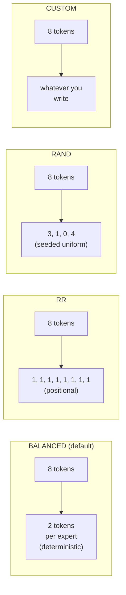

| Policy | Determinism | What it models | When to use |
| --- | --- | --- | --- |
| **BALANCED** (default) | Deterministic | Idealized load-balanced gate (post-aux-loss training) | Most research baselines |
| **RR** | Deterministic | Pure round-robin assignment | Sanity / null-baseline runs |
| **RAND** | Seeded random | Uniform random per token | Worst-case load imbalance studies |
| **CUSTOM** | Plug-in | Whatever you write | Real trained gate weights, ablation |

### BALANCED, closed-form pigeonhole

BALANCED computes the *exact* token distribution that a perfectly
load-balanced gate would produce: for `T` tokens and `E` experts with
top-`K`, each expert gets `T*K/E` tokens (with the remainder split
deterministically across experts to round to integers).

This is what a model with a well-trained auxiliary load-balancing
loss converges to in expectation. It's the simulator's default
because:

1. Real production MoE deployments use auxiliary losses → balanced
   distribution is the realistic baseline.
2. It's deterministic, so simulations are reproducible.
3. It enables the **block copy** optimization (see below).

### RR, round-robin

Token *t* goes to expert `t % num_local_experts`. Same expert each
forward, regardless of token content. Useful as a sanity check or
when you want a "no smart routing" baseline; produces identical
per-rank token counts to BALANCED in expectation.

### RAND, random

Per-token uniform random across experts (using `seed=42` by default
for reproducibility). Produces realistic worst-case load imbalance
- some ranks see more tokens than others, which is what an
*untrained* gate produces. Use this if you want to study the cost of
load imbalance specifically.

### CUSTOM, plug-in

Edit `gate_function.py::GateRouter._custom_routing`. The hook
receives the token list and returns expert assignments per token.
Use this if you want to drive routing from real trained gate weights
or a learned-from-trace model.

## Expert-to-rank assignment

Whatever policy decides "token T goes to expert E", the simulator
also has to know "expert E lives on which rank". This uses **even
partitioning**:

```
rank_for_expert(e) = e * ep_size // num_experts
```

So with 128 experts and `ep_size=2`, experts 0–63 live on rank 0 and
64–127 on rank 1. With `ep_size=4`, each rank holds 32 experts.

The `GateRouter.route()` output collapses per-token assignments into
per-rank token counts that ASTRA-Sim consumes through the trace's
`EXPERT {i}` markers.

## `block_copy`: what it means and when it's safe

By default, `block_copy=True`. The trace generator emits the full
trace for **only the first transformer block** and replays it
across all blocks via a single `block_copy` Chakra instruction.

This is **safe** for:

- Dense models (no MoE, all blocks identical).
- MoE with `BALANCED` (every block routes the same way, since
  BALANCED is deterministic and stateless).

It's an **approximation** for:

- MoE with `RR` (alternating round-robin position differs per layer,
  in practice the per-rank counts are still nearly identical).
- MoE with `RAND` (per-block randomness produces variance the copy
  can't capture).
- MoE with `CUSTOM` (depends entirely on what you wrote).

For research where per-block variance matters, set
`enable_block_copy=False` in the trace generator (or pick a policy
where block_copy is auto-disabled). Simulation runs more slowly but
generates per-block traces.

## Per-rank latency lookup

Every rank's MoE block latency comes from
`profiler/perf/<hw>/<model>/<variant>/tp1/moe.csv` keyed on:

| Key | Meaning |
| --- | --- |
| `local_tokens` | Tokens assigned to this rank after dispatch |
| `activated_experts` | Number of *distinct* experts this rank touches |

Profiled at TP=1 (no tensor splitting in MoE, per-expert weights are
already small). Simulator does 2D linear interpolation across the
two axes.

The full MoE block latency is then **max(rank_latencies)** because
ranks execute in parallel and synchronize at the ALLTOALL barrier.
Whichever rank gets the most tokens × experts dominates.

## What ALLTOALL costs surround the MoE block

Each MoE block in the trace is sandwiched between two
ALLTOALL collectives:

```
input_residue → dispatch ALLTOALL → expert compute → combine ALLTOALL → output_residue
```

- **Dispatch ALLTOALL**: routes input activations from each rank's
  TP shard to the rank holding their assigned expert.
- **Combine ALLTOALL**: gathers expert outputs back to the
  originating ranks.

Both have `comm_size = total_len * hidden_size * fp_size` (full
activation tensor; ASTRA-Sim divides per rank).

For **DP+EP** topologies, the `comm_size` is synchronized to the max
across the DP group, see
**[Parallelism mechanics](./parallelism-mechanics)**.

## Gotchas

1. **`block_copy` defaults to True** and silently produces an
   approximation for non-BALANCED policies. If you're studying load
   imbalance specifically, disable it.
2. **`activated_experts` is per-rank, not per-token.** A rank with
   100 tokens hitting 8 distinct experts reports `activated_experts
   = 8`, not 800. The latency lookup expects this convention.
3. **MoE is profiled at TP=1.** Increasing `tp_size` doesn't change
   the MoE CSV path. Splitting expert weights happens via `ep_size`,
   which the simulator handles by adjusting the rank-to-expert
   mapping, not by re-profiling.
4. **`num_experts_per_tok` (top-K)** is read from the model's HF
   config. Deviating from the trained value is OK at simulation time
   but won't match the real model's behavior.
5. **Dummy batches in DP groups still route through the gate.**
   1-token dummy batches go through routing exactly like real
   batches, so DP+EP results are consistent across waves.

## What's next

- **[Parallelism mechanics](./parallelism-mechanics)**: what the
  ALLTOALLs around the MoE block look like at the network level.
- **[Examples → Expert parallel](/docs/examples/parallelism/expert-parallel)** -
  the configuration angle (when to use which `ep_size`).
- **[Examples → DP+EP MoE](/docs/examples/parallelism/dp-ep-moe)** -
  multi-instance MoE.

---

<a id="source-36-docs-docs-simulator-parallelism-mechanicsmd"></a>

## Source: `docs/docs/simulator/parallelism-mechanics.md`

---
title: Parallelism mechanics
sidebar_position: 5
---

# Parallelism mechanics

This page is the **runtime** side of parallelism: when a batch hits
ASTRA-Sim, what collectives fire, where, and how multi-instance DP
groups synchronize. The cluster-config angle (which fields turn each
of these on) is on
**[Examples → Cluster config explained](/docs/examples/cluster-config-explained)**.

## What the simulator can model

| Style | What's parallelized | Collective | Where it fires |
| --- | --- | --- | --- |
| **TP** (tensor) | Linear weights split along head dim | ALLREDUCE | After `o_proj` and `down_proj` |
| **PP** (pipeline) | Decoder layers split across GPU groups | (point-to-point in `inflight` queue) | At stage boundaries |
| **EP** (expert) | MoE experts split across ranks | ALLTOALL | Around the MoE block |
| **DP+EP** | EP across multiple instances | ALLTOALL | Same, but across instance boundaries with wave-sync |

TP and EP can share the same GPUs. DP+EP requires a `dp_group`
identifier on the cluster config.

## TP, ALLREDUCE on every dense layer

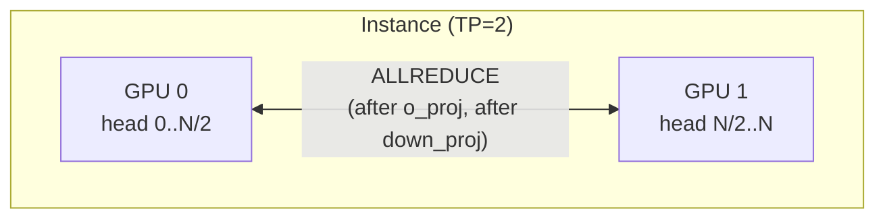

When `tp_size > 1`, the trace generator attaches an ALLREDUCE
`COMM_COLL_NODE` after each TP-aware dense linear:

- `o_proj` (attention output projection)
- `down_proj` (MLP output projection)

These are the two layers where each TP rank holds a different head
slice of the output and needs to sum across ranks.

The `comm_size` on each ALLREDUCE is the full output tensor size
(not per-rank, ASTRA-Sim divides internally based on
`nodes_in_ring`).

`qkv_proj`, `gate_up_proj`, etc. don't need ALLREDUCE because they
*split* the input along the head dim, those layers' output is
already correctly sharded for the next layer. TP's collective cost
is bound by `o_proj` + `down_proj`, two ALLREDUCEs per decoder block.

## PP, pipeline stages and `inflight`

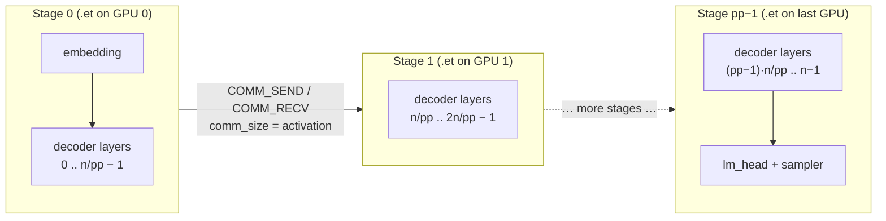

When `pp_size > 1`, the scheduler keeps an `inflight` list capped at
`pp_size` entries. When the pipeline is full, `schedule()` returns
`None` and waits for ASTRA-Sim to drain a stage, the same
back-pressure pattern as Megatron-style 1F1B.

The trace header is stamped with `model_parallel_NPU_group: {pp_size}`.
Chakra's `llm_converter.py` partitions the per-iteration layer list
into `pp_size` contiguous groups (`layers_per_group = num_layers //
pp_size`) and emits one `.et` per NPU. At each stage boundary it pairs
a `COMM_SEND_NODE` on the upstream NPU with a matching
`COMM_RECV_NODE` on the downstream one, sized by the boundary
activation tensor.

Inter-stage P2P latency (link bandwidth, hop count, contention) is
therefore part of the reported iteration time, and pipeline overlap
between in-flight batches falls out from each NPU's independent `.et`
schedule.

## EP, ALLTOALL around the MoE block

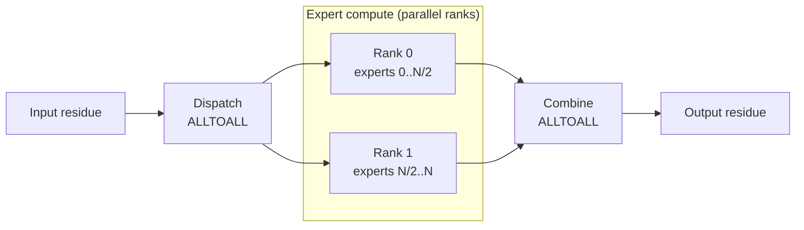

For MoE models, `trace_generator` wraps the MoE block with two
ALLTOALL collectives:

```
... → MoE dispatch ALLTOALL → expert compute → MoE combine ALLTOALL → ...
```

The dispatch ALLTOALL routes each token to its assigned expert's
rank. The combine ALLTOALL gathers expert outputs back to the
originating ranks. Both are scoped to the EP dimension.

Each EP rank gets a per-rank latency from
`profiler/perf/<hw>/<model>/<variant>/tp1/moe.csv` keyed on its
**local** token count (after dispatch) and the **activated experts**
per token. Ranks execute in parallel and synchronize at the ALLTOALL
barrier, slower ranks gate the others.

Token routing decisions come from `gate_function.py`. See
**[MoE expert routing](./moe-expert-routing)** for the policies.

## DP+EP, wave synchronization

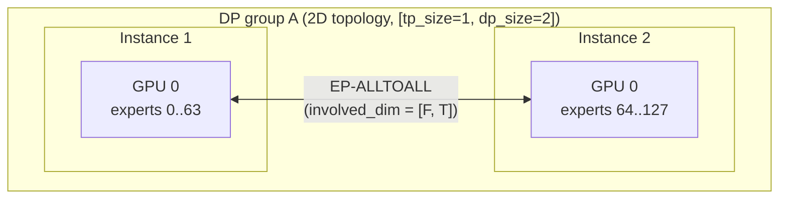

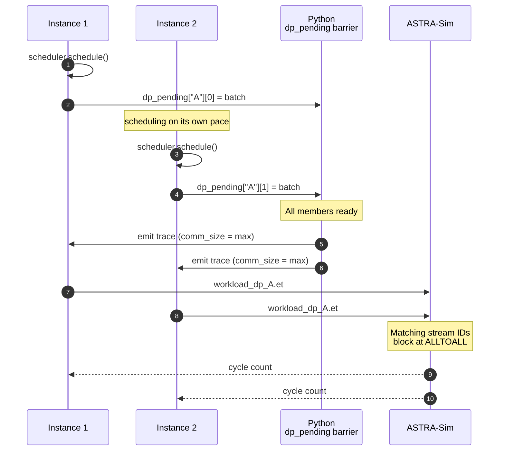

This is where the simulator gets clever. When two or more instances
share a `dp_group`, they form a single coordinated wave. Two
synchronization mechanisms work together:

### 1. Python-side `dp_pending` barrier

In `__main__.py`, a `dp_pending` dict tracks which DP-group members
have scheduled their batches for the current wave. Trace generation
is **deferred** until all members have scheduled. When the last
member arrives:

- The simulator computes `dp_sum_total_len = sum(total_len)` and
  `dp_max_total_len = max(total_len)` across the group.
- `comm_size_alltoall` is set to
  `dp_max_total_len * hidden_size * fp_size`: the *max* across the
  group, matching CUDA-graph padding in production MoE serving.
- All members generate their traces with the same `comm_size`, even
  if their per-instance `total_len` differs.

If one DP member has no pending requests, the scheduler synthesizes a
**dummy batch** (1 decode token) so the wave still runs. When
all of one member's real requests have finished but the others
haven't, the dummy batches keep flowing until the whole group is
done.

### 2. ASTRA-Sim ALLTOALL barrier

All DP-group instances' `.et` files share the same workload folder
(`dp_<group>_batch<bid>/llm.et`) and use **matching stream IDs** on
the ALLTOALL collectives. ASTRA-Sim's runtime sees the matching IDs
and blocks until both NPUs reach the collective, naturally
implementing the wave-sync at the network layer.

So both halves of the sync, Python deferral on submission, ASTRA-Sim
blocking on the collective, together produce a deterministic
wave-synchronous schedule.

## 2D ASTRA-Sim topology and `involved_dim`

`config_builder` generates a 2D ASTRA-Sim network when DP groups are
present. The topology is `npus_count: [tp_size, dp_group_size]`.
Collectives are scoped per dimension via the `involved_dim` BoolList
on each `COMM_COLL_NODE`:

- **TP-ALLREDUCE:** `involved_dim = [True, False]`: dim 0 only.
- **EP-ALLTOALL:** `involved_dim = [False, True]`: dim 1 only when
  EP spans the DP group; `[True, True]` if EP also spans TP.

The `involved_dim` is encoded in the trace's `comm_type` field with
a `:dim0,dim1` suffix:

```
ALLREDUCE:1,0     # TP only
ALLTOALL:0,1      # EP across DP only
```

The Chakra converter parses this via `_parse_comm_type` and writes
the BoolList into the `.et` file. ASTRA-Sim's `Workload::issue_comm`
reads it and dispatches the collective only on the involved dims.

The `system.json` collective implementations need one entry per
topology dim, `config_builder` generates this automatically:
`"all-to-all-implementation": ["ring", "ring"]` for 2D.

## Communication sizes (ASTRA-Sim semantics)

Every `comm_size` in the trace is the **total** data size, not
per-NPU. ASTRA-Sim divides internally by the number of nodes in the
ring (`msg_size = data_size / nodes_in_ring`).

So:

- ALLREDUCE on `o_proj`: pass the **full output tensor size**
  (`total_len * hidden_size * fp_size`).
- ALLTOALL for MoE: pass the **full activation tensor size**
  (`total_len * hidden_size * fp_size`).

If you see surprisingly fast collectives in your trace logs, check
that you're not accidentally passing per-rank sizes, that's a
common mistake when extending the trace generator.

## When to use which

A rough decision tree (the *configuration* angle is on
[Examples → Cluster config explained](/docs/examples/cluster-config-explained)):

- **Single GPU fits the model:** TP=1. Done.
- **Need more GPUs for memory:** start with TP. ALLREDUCE cost grows
  with `tp_size`, so going past 4-8 is rarely worth it.
- **Multiple replicas for throughput:** add `num_instances` (no
  `dp_group`). Independent instances behind a router.
- **MoE model, single instance:** add `ep_size = tp_size`. Same GPUs,
  EP-ALLTOALL replaces TP-ALLREDUCE on the MoE block.
- **MoE, want to scale experts past one instance's GPUs:** DP+EP
  with `dp_group` set. EP spans instances via wave-sync.

## Gotchas

1. **`ep_size > tp_size` requires `dp_group`.** Otherwise the cluster
   config builder rejects the spec. EP needs the 2D topology to scale
   beyond a single instance's GPU count.
2. **Dummy batches are real ASTRA-Sim work.** A DP group with one
   idle instance still pays the ALLTOALL cost on the dummy batch.
   This is what production looks like, wave-sync is wave-sync.
3. **`comm_size` is synchronized to the max.** Even if one DP
   member's batch is much smaller, the ALLTOALL message size matches
   the largest member's. This is *correct* (matches production
   padding) but worth knowing.
4. **PP models inter-stage forwarding via send/recv, not via
   micro-batch splitting inside an iteration.** Activation shipment
   between stages goes through ASTRA-Sim send/recv (so link bandwidth
   and contention show up in the result), but a single iteration is
   not chunked into multiple micro-batches — the overlap benefit
   comes from running up to `pp_size` consecutive iterations
   simultaneously. There's also no knob to pick a pipeline schedule
   (1F1B, interleaved, etc.).

## What's next

- **[MoE expert routing](./moe-expert-routing)**: how tokens get
  distributed across EP ranks before the dispatch ALLTOALL.
- **[Examples → DP+EP MoE](/docs/examples/parallelism/dp-ep-moe)** -
  a worked-out config that exercises this whole machinery.

---

<a id="source-37-docs-docs-simulator-reading-outputmd"></a>

## Source: `docs/docs/simulator/reading-output.md`

---
title: Reading the output
sidebar_position: 8
---

# Reading the output

The simulator produces three kinds of output:

1. **Per-request CSV** at the path passed via `--output`.
2. **Throughput log line** printed every `--log-interval` seconds.
3. **Final power summary** (only if the cluster config has a
   `power:` block).

This page covers what each one means and how to read them.

## Per-request CSV

When you pass `--output outputs/foo.csv`, the simulator writes one
row per finished request:

```csv
instance id,request id,model,input,output,arrival,end_time,latency,queuing_delay,TTFT,TPOT,ITL
0,0,Qwen/Qwen3-30B-A3B-Instruct-2507,1472,133,4059740,1082836204,1078776464,0,51162321,7784955,"[7780422, 7779379, 7779523, ...]"
0,3,meta-llama/Llama-3.1-8B,4,16,570907776,711600111,140692335,3739551,15137413,11414083,"[11043655, 11381158, ...]"
...
```

The bundled `outputs/example_*_run.csv` files (one per scenario in
`serving/run.sh`) are good examples to skim.

### Column reference

| Column | Type | Meaning |
| --- | --- | --- |
| `instance id` | int | Which serving instance ran this request |
| `request id` | int | Monotonic id assigned by the router |
| `model` | string | Model name (e.g., `meta-llama/Llama-3.1-8B`) |
| `input` | int | Prompt tokens (full input length, including any prefix-cache hits) |
| `output` | int | Decode tokens generated (i.e., total length minus `input`) |
| `arrival` | int (ns) | When the request arrived (simulator clock) |
| `end_time` | int (ns) | When the last generated token completed |
| `latency` | int (ns) | End-to-end latency: `end_time - arrival` |
| `queuing_delay` | int (ns) | From arrival to first scheduling step |
| `TTFT` | int (ns) | Time-to-first-token: first-token-completion minus `arrival` |
| `TPOT` | int (ns) | Mean time-per-output-token: `(latency - TTFT) // (output - 1)` (or `0` when `output == 1`) |
| `ITL` | string | Inter-token latencies, ns. Serialized Python list, e.g. `"[7780422, 7779379, ...]"` |

All times are in **nanoseconds**. Divide by `1e9` for seconds, `1e6`
for milliseconds. Column names use spaces, not underscores; quote
them in pandas (`df["instance id"]`).

> **Note:** `Request` objects internally also carry `session_id` /
> `sub_request_index` (for agentic workloads) and per-tier prefix-
> cache hit counters (`prefix_cache_hit`, `npu_cache_hit`,
> `storage_cache_hit`). These are tracked in memory and surfaced in
> the throughput log line, but are **not** written to the per-request
> CSV today. Use the throughput log (with `--log-interval`) to see
> aggregate prefix-hit rates; for per-request agentic accounting,
> read the `Request` objects directly or extend `Scheduler.save_output`.

### Common derived metrics

```python
import pandas as pd
df = pd.read_csv("outputs/foo.csv")

# Wall-clock TTFT in milliseconds
df["TTFT_ms"] = df["TTFT"] / 1e6

# TPOT in milliseconds (already a per-token mean; divide for ms)
df["TPOT_ms"] = df["TPOT"] / 1e6

# End-to-end latency in seconds
df["latency_s"] = df["latency"] / 1e9

# Throughput across the whole run (tokens / second)
total_tokens = (df["input"] + df["output"]).sum()
sim_duration_s = (df["end_time"].max() - df["arrival"].min()) / 1e9
throughput = total_tokens / sim_duration_s

# Per-instance distribution
per_inst = df.groupby("instance id").agg(
    requests=("request id", "count"),
    p50_TTFT_ms=("TTFT", lambda x: x.quantile(0.5) / 1e6),
    p99_TTFT_ms=("TTFT", lambda x: x.quantile(0.99) / 1e6),
)

# Inter-token latency: parse the ITL string back into a list per row
import ast
df["ITL_list"] = df["ITL"].apply(ast.literal_eval)
df["ITL_p50_ms"] = df["ITL_list"].apply(lambda xs: pd.Series(xs).quantile(0.5) / 1e6)
```

## Standard output (log levels)

The simulator's `--log-level` flag controls how much detail lands on
stdout while a run is in progress:

| Level | What you see |
| --- | --- |
| `WARNING` (default) | The throughput log line every `--log-interval` seconds, plus warnings (variant fallback, runtime exceeds profiler sweep, MoE config mismatch, etc.) |
| `INFO` | Adds per-iteration scheduler decisions (which requests entered the batch, prefix-cache hits per request) and the request lifecycle (arrival / first token / completion). Useful for debugging routing and scheduling. |
| `DEBUG` | Adds per-layer memory load / store activity, full `Batch` / `Request` dumps, and `npu_prefix_cache.format_prefix_info()` snapshots. Generates a lot of output; pipe to a file. |

Independently of the level, the simulator always emits:

- A startup banner with the resolved `(hardware, model, variant)`
  and the engine_effective comparison vs. `meta.yaml`.
- The final summary on shutdown (Total requests, mean TTFT / TPOT,
  throughput, plus the **power summary** below if `power:` is
  configured).

The throughput log line itself is identical regardless of level,
the only difference is what surrounds it.

## Throughput log line

Every `--log-interval` seconds the simulator prints a one-line
status update. The format adapts to which features are enabled:

### Single-instance baseline

```text
[INFO] step=42 batch=8 prompt_t=1.2k tok/s decode_t=420 tok/s npu_mem=88.4 GB
```

| Field | Meaning |
| --- | --- |
| `step` | Iteration number this interval ended on |
| `batch` | Batch size in requests |
| `prompt_t` | Prompt-side throughput (input tokens/sec, includes prefix hits) |
| `decode_t` | Decode-side throughput (generated tokens/sec) |
| `npu_mem` | NPU memory footprint at this moment |

### Multi-instance

```text
[INFO] step=21 inst0_batch=6 inst1_batch=4 prompt_t=2.5k tok/s decode_t=860 tok/s
       npu_mem=[63.2 GB, 63.2 GB]
```

`inst0_batch` / `inst1_batch` are per-instance batch sizes; `npu_mem`
is per-instance.

### Prefill / decode split

```text
[INFO] step=15 P=8 D=12 prompt_t=3.1k tok/s decode_t=620 tok/s
       npu_mem=[55.4 GB, 71.2 GB]
```

`P=` and `D=` are batch sizes on the prefill and decode instances.

### With prefix sharing

```text
[INFO] step=20 inst0_batch=6 inst1_batch=4 prompt_t=2.4k tok/s decode_t=820 tok/s
       prefix_hit=78% (npu=42%, cpu=36%)
```

The `prefix_hit` field shows the cache hit rate across the interval,
broken down by tier.

### With DP+EP MoE

```text
[INFO] step=8 batch=4+4 prompt_t=1.4k tok/s decode_t=520 tok/s
       npu_mem=[81.2 GB, 81.2 GB] alltoall=512 KB
```

`batch=4+4` shows per-DP-member batches. `alltoall` is the
wave-synchronized ALLTOALL message size.

### With PIM offload

```text
[INFO] step=10 batch=8 prompt_t=1.1k tok/s decode_t=520 tok/s
       npu_mem=63.4 GB pim_busy=72%
```

`pim_busy` is the fraction of the interval the PIM device was active.
At ~100% PIM is your bottleneck.

### With CXL memory

```text
[INFO] step=10 batch=4 prompt_t=620 tok/s decode_t=180 tok/s
       npu_mem=12.4 GB cxl_mem=[3.2 GB, 3.1 GB, 3.1 GB, 3.2 GB]
```

`cxl_mem` is per-device usage; `npu_mem` drops because weights are
on CXL.

### With power model

```text
[INFO] step=42 batch=8 prompt_t=1.2k tok/s decode_t=420 tok/s
       npu_mem=88.4 GB power=712 W
```

`power` is the **current** total system power.

## Final power summary

When `--output` is set and the cluster config has a `power:` block,
the simulator emits a per-node energy breakdown at the end:

```text
─────── Power summary (node 0) ───────
   NPU active     :   12,453 J  (78%)
   NPU standby    :    1,012 J   (6%)
   NPU idle       :       89 J   (1%)
   CPU            :    1,233 J   (8%)
   DRAM           :      442 J   (3%)
   Link           :      388 J   (2%)
   Base + NIC + storage : 332 J  (2%)
   ─────────────────────────────────
   Total energy   :   15,949 J
```

For multi-node runs you get one block per node plus a cluster total.
The breakdown is what makes power numbers actionable for
energy-efficiency research, you can see which component dominates.

## Common patterns to look for

### High waiting count, low NPU memory

The throughput log shows large `batch` counts but `npu_mem` is far
below the cluster config's `npu_mem.mem_size`. Likely cause: the
token budget (`--max-num-batched-tokens`) is the bottleneck, not
memory. Bump it.

### Decode TPOT spikes during prefill bursts

A prefill-heavy moment lands in the same batch as ongoing decodes,
the budget gets eaten by prefill, and decode latency stretches.

Mitigations:
- `--enable-chunked-prefill` (default) splits long prefills.
- `--long-prefill-token-threshold N` caps prefill tokens per
  step.
- `--prioritize-prefill` runs prefill first within a budget, trades
  TPOT for TTFT.

### Prefix hit rate near 0%

Either the workload genuinely has no shared prefixes, or you forgot
to pre-tokenize. Check that `input_tok_ids` is populated in the
JSONL (see [Workloads → JSONL format](/docs/workloads/jsonl-format)).

### MoE per-rank latency varies wildly

Set `--expert-routing-policy BALANCED` (default). RR or RAND can
produce uneven loads on small batches. With BALANCED, per-rank
latency should be uniform within ~1%.

### CXL latency dominates TPOT

Weights placed on CXL pay the round-trip on every decode step. If
TPOT looks far worse than expected, check the `placement` block -
moving cold layers (embedding, lm_head) to CXL helps; moving every
decoder block hurts.

## Validation against known references

LLMServingSim is validated end-to-end against real vLLM with sub-3%
error on TTFT / TPOT / throughput on the bundled hardware × model
combos. The validation methodology and per-model results live in
**[bench/](https://github.com/casys-kaist/LLMServingSim/tree/main/bench)**
on GitHub.

## What's next

- **[Reference → CLI flags](/docs/reference/cli-flags)**: every
  flag that affects the output.
- **[Examples](/docs/examples)**: worked configurations to compare
  your output against.

---

<a id="source-38-docs-docs-simulator-request-lifecyclemd"></a>

## Source: `docs/docs/simulator/request-lifecycle.md`

---
title: Request lifecycle
sidebar_position: 2
---

# Request lifecycle

This page follows a single request from the JSONL file all the way to
its row in the output CSV. Same main loop as
[Architecture overview](./architecture), but from the request's
perspective.

> Need the *configuration* angle (how to enable each feature)?
> See **[Examples](/docs/examples)**.

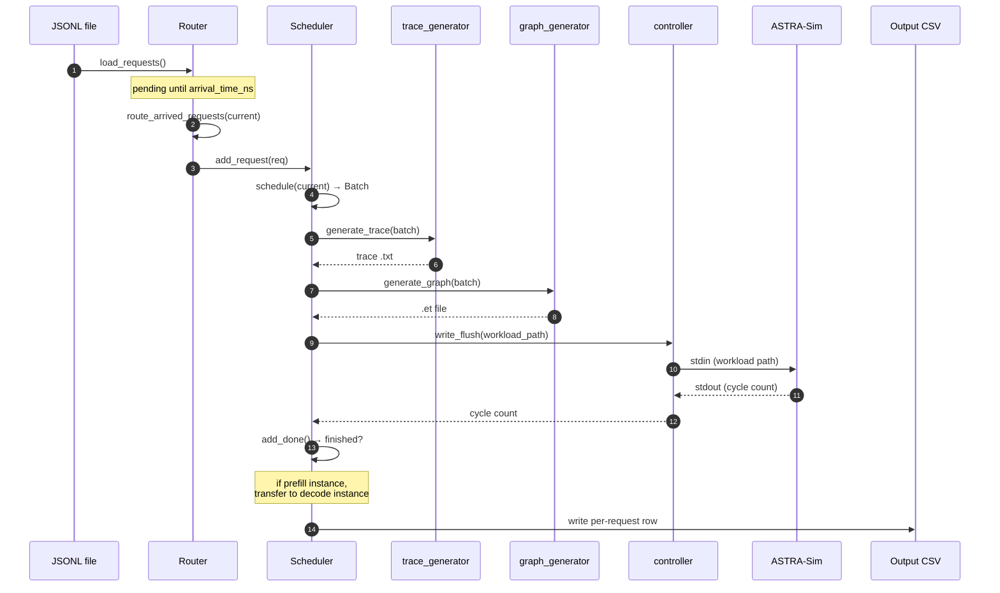

## Stage 1, Loaded into the Router

When `python -m serving --dataset workloads/foo.jsonl` starts up,
`router.load_requests()` parses the JSONL line by line and builds
`Request` objects:

```python
class Request:
    id: int
    model: str
    arrival_time_ns: int
    input_tokens: int        # prompt length
    output_tokens: int       # max decode length
    instance_id: int | None  # set on routing
    pd_type: str | None      # "prefill" or "decode" once routed
    session_id: str | None   # for agentic sessions
    sub_request_index: int   # 0 for flat, increments for sub-requests
    input_tok_ids: list[int] | None   # for prefix caching
    # ...metrics filled in later: ttft_ns, first_token_time_ns, etc.
```

Two formats supported in the same file:

- **Flat:** one JSONL entry = one independent request.
- **Agentic sessions:** one JSONL entry = one session with multiple
  chained sub-requests. Only the first sub-request is enqueued; the
  rest live in `Router._deferred_sessions` until released.

Requests with `arrival_time_ns > 0` are **not** routed yet, they
land in `Router._pending_requests`, sorted by arrival time.

## Stage 2, Waiting for arrival time

The simulator clock (`current` in `__main__.py`, in ns) marches
forward as ASTRA-Sim returns cycle counts. Once `current >=
request.arrival_time_ns`, `router.route_arrived_requests(current)`
pulls the request out of `_pending_requests`.

If all instances are idle but there are pending requests in the
future, `__main__.py` advances `current` directly to the next pending
arrival time to avoid busy-looping.

## Stage 3, Routed to an instance

The router applies its policy (`--request-routing-policy`):

| Policy | Behavior |
| --- | --- |
| `LOAD` (default) | vLLM-style: pick instance with smallest `waiting * 4 + running` score |
| `RR` | Pure round-robin |
| `RAND` | Random uniform |
| `CUSTOM` | Pluggable in `serving/core/router.py` |

For **prefill/decode disaggregation**, the router only considers
prefill instances at this stage. Decode instances receive the
request later via `transfer_prefill_request`.

Once routed, the request goes into the chosen
`Scheduler`'s waiting queue (`scheduler.add_request(req)`).

## Stage 4, Picked up by the scheduler

Each iteration, `scheduler.schedule(current, sys)` decides which
requests to include in the next `Batch`. The constraints:

- `len(batch) <= --max-num-seqs` (sequence count cap)
- `sum(tokens_to_run) <= --max-num-batched-tokens` (token budget)
- per-request `tokens_this_step <= --long-prefill-token-threshold`
  *(if set, gates chunked prefill)*

There are two scheduling paths:

- **Without prefix caching** (`schedule_base`): pure FIFO + token
  budget.
- **With prefix caching** (`schedule_with_prefix`): same plus
  RadixCache lookup that returns `hit_len` for each request.

The full mechanics are on
**[Continuous batching](./scheduling/continuous-batching)**.

## Stage 5, Wrapped in a Batch

`Batch` aggregates the chosen requests:

```python
class Batch:
    batch_id: int
    instance_id: int
    fired: list[bool]    # one entry per NPU; only first NPU emits trace
    total_len: int       # sum of tokens this iteration
    kv_len: int          # sum of KV-cache tokens after this step
    hit_len: int         # sum of prefix-cache hits across requests
    num_prefill: int
    num_decode: int
    q_list: list[int]    # query lengths per request
    k_list: list[int]    # KV lengths per request
    # ...
```

The `fired` list ensures multi-NPU instances only generate the trace
once (on rank 0); other ranks just read back the cycle count.

## Stage 6, Trace generated

`trace_generator.generate_trace(batch, hardware, tp_size, ...)` walks
the model's architecture YAML and looks up per-layer latencies in the
profile DB:

- Dense layers (qkv, mlp, etc.) → 1D linear lookup over `total_len`.
- Per-sequence layers (`lm_head`, `sampler`) → 1D over
  `num_requests`.
- Attention → 4D nearest-neighbour + bilinear over
  `(prefill_chunk, kv_prefill, n_decode, kv_decode)`. Skew correction
  blends two lookups using a per-bucket `alpha`.
- MoE → 2D over `(local_tokens, activated_experts)`, profiled at
  TP=1.

The output is a tab-separated text trace at
`astra-sim/inputs/runs/<run_id>/trace/<hw>/<model>/instance_{i}_batch_{b}.txt`.
The text trace is an intermediate input to the Chakra converter and is
removed after the `.et` graph is generated unless `--no-cleanup-inputs`
is set.
Full mechanics on **[Trace generation](./trace-generation)**.

## Stage 7, Converted to Chakra graph

`graph_generator.generate_graph` shells out to Chakra's text→protobuf
converter, producing
`astra-sim/inputs/runs/<run_id>/workload/<hw>/<model>/instance_{i}_batch_{b}/llm.et`.
Chakra workloads remain available while ASTRA-Sim consumes them; the
run directory is removed after a successful simulation unless
`--no-cleanup-inputs` is set.

The Chakra converter creates:

- `MEM_LOAD_NODE` for the first layer's input (CPU → NPU).
- `COMP_NODE` for each computation layer.
- `MEM_STORE_NODE` for the last layer's output (NPU → CPU).
- `COMM_COLL_NODE` for ALLREDUCE / ALLTOALL collectives, with
  optional `involved_dim` BoolList for multi-dimensional topologies.

## Stage 8, Submitted to ASTRA-Sim

`controller.write_flush(process, workload_path)` sends the path over
stdin. ASTRA-Sim reads the `.et` file, simulates compute + comm
according to the network topology, and emits:

```
Waiting <sys=0> id=42 cycle=178654321
```

`controller.read_wait` blocks until that line appears.

For **DP groups**, both instances' `.et` files share the same workload
folder and matching stream IDs on the ALLTOALL collectives. ASTRA-Sim
blocks until both NPUs reach the collective, naturally
wave-synchronizing them.

## Stage 9, Marked done

`scheduler.add_done(npu_id, sys, current)` consumes the cycle count:

- Updates per-request running totals (cycles spent in this iteration
  attributed to each request based on `q_list`).
- For requests that finished decoding this step
  (`request.num_computed_tokens >= request.input + request.output`):
  records `last_token_time_ns`, computes `latency_ns`, marks done.
- Returns `(prompt_throughput, decode_throughput, finished_requests)`
  to the main loop.

For prefill instances (`pd_type="prefill"`), finished requests are
**transferred** to a decode instance via
`router.transfer_prefill_request`. The KV cache transfer cost is
modeled as inter-link bandwidth based on KV size.

## Stage 10, Output

Once all requests finish (and no agentic sub-requests are deferred),
the simulator writes the per-request CSV at the path you passed via
`--output`. One row per request:

```
request_id, arrival_ns, first_token_ns, last_token_ns,
prompt_toks, decode_toks, ttft_ns, tpot_ns, latency_ns,
prefix_hit_len, npu_cache_hit, storage_cache_hit, instance_id,
session_id, sub_request_index
```

(Exact columns depend on the version. Validation methodology and
column-by-column interpretation live on
**[Reading the output](./reading-output)**.)

## Agentic sessions: when stage 10 is not the end

For agentic JSONL entries (sessions with `sub_requests`), finishing
sub-request *N* triggers `router.notify_request_completed`, which:

1. Schedules sub-request *N+1* with arrival time =
   `completion_time + tool_duration_ns`.
2. Inserts it into `_pending_requests` (sorted by arrival).
3. Goes back to **Stage 2** for that sub-request.

`Router.has_deferred_sessions()` keeps the main loop from exiting
early while sessions are still in flight.

## What's next

- **[Continuous batching](./scheduling/continuous-batching)** -
  Stage 4 in detail.
- **[Trace generation](./trace-generation)**: Stage 6 in detail.
- **[Parallelism mechanics](./parallelism-mechanics)**: what
  happens at Stages 7-8 for TP / EP / DP+EP setups.

---

<a id="source-39-docs-docs-simulator-scheduling-continuous-batchingmd"></a>

## Source: `docs/docs/simulator/scheduling/continuous-batching.md`

---
title: Continuous batching
sidebar_position: 1
---

# Continuous batching

The scheduler is the heart of each serving instance. Every iteration
of the main loop calls `scheduler.schedule(current, sys)` and gets
back a `Batch` (or `None`). The scheduler enforces the same
constraints vLLM does: token budget, sequence count cap, and
optionally chunked prefill. This page walks through the rules.

> Need the configuration knobs? See
> **[Reference → CLI flags](/docs/reference/cli-flags)** for the flag
> list. This page explains *what each flag does internally*.

## Two scheduling paths

Depending on whether `--enable-prefix-caching` is on (default), the
scheduler takes one of two code paths inside `serving/core/scheduler.py`:

| Flag | Method | What changes |
| --- | --- | --- |
| `--no-enable-prefix-caching` | `schedule_base` | Pure token-budget scheduler. Each request always runs from token 0. |
| `--enable-prefix-caching` (default) | `schedule_with_prefix` | Same plus a RadixCache lookup that returns `hit_len` per request. |

In both paths, the constraints are the same:

- **Sequence cap:** `len(batch) <= --max-num-seqs`. Default `128`.
  Set to `0` for unbounded.
- **Token budget:** `sum(tokens_to_run_this_step) <=
  --max-num-batched-tokens`. Default `2048`.
- **Per-request cap (chunked prefill):**
  `tokens_for_this_request_this_step <= --long-prefill-token-threshold`.
  Default `0` = disabled.

`schedule_with_prefix` additionally maintains the per-instance
`MemoryModel.npu_prefix_cache` (RadixCache). Details on
**[Prefix caching](./prefix-caching)**.

## What the scheduler picks each step

```mermaid
flowchart TD
    START([Iteration start]) --> INIT[remaining_budget = max_num_batched_tokens<br/>batch = []]
    INIT --> NEXT{More requests<br/>in queue?}
    NEXT -->|No| RETURN[Return Batch or None]
    NEXT -->|Yes| CAP{batch size<br/>>= max_num_seqs?}
    CAP -->|Yes| RETURN
    CAP -->|No| NEED[Compute needs:<br/>prefill chunk OR decode 1 token]
    NEED --> MIN[cap = min remaining_budget,<br/>long_prefill_threshold,<br/>tokens_needed]
    MIN --> CHECKCAP{cap > 0?}
    CHECKCAP -->|No| NEXT
    CHECKCAP -->|Yes| MEM{Memory fits<br/>after eviction?}
    MEM -->|No| NEXT
    MEM -->|Yes| ADD[Add to batch<br/>budget -= cap]
    ADD --> NEXT
```

Conceptually, the loop is:

```
remaining_token_budget = max_num_batched_tokens
batch = []
for request in queue (FIFO, prefill-first if prioritized):
    if len(batch) >= max_num_seqs: break

    needs_to_run = how_many_tokens_this_request_needs(request)
    cap = min(remaining_token_budget,
              long_prefill_token_threshold or remaining_token_budget,
              needs_to_run)
    if cap <= 0:
        continue       # try the next request

    schedule(request, tokens=cap)
    remaining_token_budget -= cap
    batch.append(request)

return Batch(batch) if batch else None
```

The "how many tokens this request needs" function differs by request
state:

- **Prefill, no chunk yet:** input length minus any prefix cache hit.
- **Prefill, mid-chunk:** remaining prompt tokens.
- **Decode:** always 1.

## Chunked prefill

`--long-prefill-token-threshold N` (or `--enable-chunked-prefill`
which sets a sensible default) lets the scheduler split a long prefill
across multiple iterations. Without it, a single 32k-token request
hogs the whole budget and TPOT for other in-flight requests
collapses.

Concretely, a request whose remaining prefill is 8000 tokens with
`--long-prefill-token-threshold 1024` runs as eight separate
8x1024-token chunks across eight scheduler iterations. The
`Request.num_computed_tokens` field tracks progress; on each
iteration the scheduler bumps it by however many tokens were just
processed.

Decode steps continue to run *concurrently* in the same batch, the
chunked prefill just keeps long prompts from monopolizing.

## Prefill priority

By default, prefill and decode requests share the same FIFO queue.
With `--prioritize-prefill`, the scheduler reorders the batch so all
prefill requests land first, then decodes fill the remaining budget.

This trades some TPOT for lower TTFT under bursty arrivals, useful
in deployments where users care more about "first token latency"
than steady-state generation rate.

## Pipeline depth (PP)

For `pp_size > 1` instances, the scheduler also keeps an `inflight`
list of batches currently traversing the pipeline. Its length is
capped at `pp_size`: when the pipeline is full, the scheduler
returns `None` until ASTRA-Sim drains a stage.

This makes the simulator's PP behavior match production training
frameworks (e.g., Megatron) where micro-batches stream through the
pipeline.

## Where the scheduler stops

The simulator exits when, simultaneously:

- Every scheduler returns `None` (no eligible requests).
- `Router.has_pending_requests()` returns `False` (no future arrivals).
- `Router.has_deferred_sessions()` returns `False` (no agentic sessions
  waiting on tool calls).

If only the third is non-empty, the main loop fast-forwards `current`
to the next pending arrival time and resumes.

## What the scheduler hands back

`scheduler.add_done(npu_id, sys, current)` is called once per
iteration when ASTRA-Sim reports completion. It returns:

```python
(prompt_throughput, decode_throughput, finished_requests)
```

- `prompt_throughput` counts **all input tokens including prefix
  cache hits**, matching vLLM's reporting (which also counts cached
  tokens). `decode_throughput` counts only newly generated tokens.
- `finished_requests` is the list of requests that completed during
  this iteration.

For prefill instances under P/D disaggregation, the main loop hands
`finished_requests` to `router.transfer_prefill_request` so the
decode instance picks them up.

## Gotchas

1. **Prefill plus prefix caching** doesn't double-count: `hit_len` is
   subtracted from the tokens the scheduler actually runs, but
   *added* to `prompt_throughput`. So a 1000-token request with 600
   tokens of prefix hit consumes 400 tokens of budget and reports
   1000 tokens of prompt throughput.

2. **`--max-num-seqs 0` means unlimited**, not zero. Useful when you
   want pure token-budget gating, but watch memory.

3. **The token budget is shared across prefill + decode.** A batch
   with 64 in-progress decodes and a 1500-token prefill chunk runs
   1564 tokens this step. Decode contributions count.

4. **Pipeline parallelism caps `inflight` at `pp_size`.** Chakra splits
   each iteration's layers across stages with send/recv between them,
   so inter-stage P2P latency *is* modeled.

## What's next

- **[Prefix caching](./prefix-caching)**: what `hit_len` means and
  how the RadixCache decides it.
- **[KV cache & memory](./kv-cache-and-memory)**: how the scheduler
  knows when memory is full.

---

<a id="source-40-docs-docs-simulator-scheduling-kv-cache-and-memorymd"></a>

## Source: `docs/docs/simulator/scheduling/kv-cache-and-memory.md`

---
title: KV cache & memory
sidebar_position: 3
---

# KV cache & memory

Each `Scheduler` owns a `MemoryModel` that tracks how many bytes of
NPU and CPU (and optionally CXL) memory are in use at any moment.
This is what tells the scheduler when to stop accepting new requests
and what triggers prefix-cache evictions.

> Looking for memory-tier *configuration*? See
> **[Examples → CXL extended memory](/docs/examples/memory-tiers/cxl-memory)**
> for placement rules and
> **[Examples → Prefix caching](/docs/examples/memory-tiers/prefix-caching)**
> for the second-tier pool. This page is the byte-accounting side.

## Memory tiers

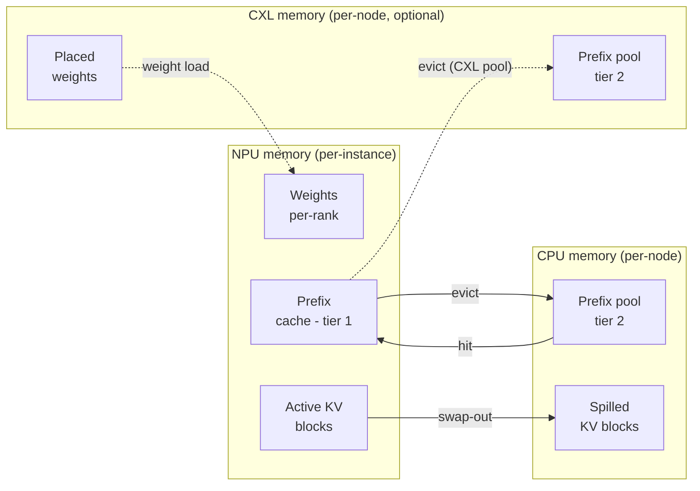

Three tiers, each represented by a separate counter on the
`MemoryModel`:

| Tier | Object | Capacity from | Holds |
| --- | --- | --- | --- |
| **NPU** | `npu_used` | `npu_mem.mem_size` × `num_npus` | Weights (per-rank), active KV cache, NPU prefix cache |
| **CPU** | `cpu_used` | `cpu_mem.mem_size` (per node) | CPU prefix pool, evicted KV blocks, model weight staging |
| **CXL** *(optional)* | `cxl_used[device_id]` | `cxl_mem.mem_size` × `num_devices` | CXL-resident weights / KV / prefix pool depending on placement |

Capacity comes from the cluster config; usage is tracked at runtime.
Exceeding capacity at startup (e.g., `weight_per_gpu > npu_mem`) is
a fatal error. Exceeding it at runtime triggers eviction (for the
prefix cache) or scheduler back-pressure (for active KV).

## What's in NPU memory

Two big consumers, in this order of priority:

### 1. Model weights (per-GPU)

Computed at scheduler init via
`MemoryModel.get_weight()`. The size is the model's full parameter
count divided by `tp_size` (and for MoE: experts further divided by
`ep_size`), times the dtype byte size:

```
weight_bytes_per_gpu = (
    dense_params / tp_size
    + moe_params / ep_size  # if MoE
) * fp_size_in_bytes
```

`fp_size` is 2 bytes for `bfloat16` / `float16`, 4 for `float32`,
1 for `int8` and `fp8`. Actually loading is done via `get_weight()`,
which reads the model config and accounts for shared embeddings,
tied weights, etc.

This bytes amount is reserved on every NPU at startup and never
freed. If `weight_per_gpu > npu_mem.mem_size`, the simulator exits
with a clear error message, the typical fix is to bump `tp_size`,
add CXL placement rules, or pick a smaller model.

### 2. Active KV cache

Per-request KV cache, tracked at block granularity. The block size
is `--block-size` tokens (default 16):

```
bytes_per_block = (
    2                                         # K and V
    * num_layers
    * num_key_value_heads / tp_size           # GQA shards by TP
    * head_dim
    * block_size
    * kv_fp_size
)
```

Where `kv_fp_size` is:

- 2 bytes for `--kv-cache-dtype auto` (inherits from `--dtype`).
- **1 byte for `--kv-cache-dtype fp8`**: halves KV memory.

The scheduler reserves `ceil(tokens / block_size)` blocks per active
request and frees them when the request completes (or when chunked
prefill / prefix caching has different lifecycle, see below).

### 3. NPU prefix cache

A subset of the active KV blocks that the prefix cache keeps around
even after their original requests finish. When a new request walks
into the cache and matches a stored prefix, those blocks are
"reactivated", added back to active KV without recomputation.

Eviction happens when NPU memory pressure forces it: the prefix
cache is the first thing to release blocks. If the CPU or CXL
second-tier pool exists, evicted blocks **spill** there rather than
disappearing.

Full mechanics: **[Prefix caching](./prefix-caching)**.

## What's in CPU / CXL memory

Per-node CPU memory (and per-device CXL memory) hold:

- The shared **second-tier prefix cache** if
  `--enable-prefix-sharing` is on.
- **Spilled KV blocks** from NPU evictions (when offloading is
  enabled).
- **Weights placed there explicitly** via the `placement` field in
  the cluster config (e.g., `"weights": "cxl:0"` for some decoder
  blocks on CXL device 0). See
  **[Examples → CXL memory](/docs/examples/memory-tiers/cxl-memory)**
  for the placement rule syntax.

Unlike NPU memory, CPU/CXL accounting is **per node**, not per
instance. Multiple instances on the same node share the same
`cpu_used` counter.

## How the scheduler uses this

Every iteration, before adding a request to the batch, the scheduler
estimates the memory it would consume:

```python
new_kv_blocks_needed = (request.num_computed_tokens
                       + tokens_to_run_this_step
                       - already_reserved_blocks * block_size) / block_size
new_kv_bytes = new_kv_blocks_needed * bytes_per_block
if memory.npu_used + new_kv_bytes > npu_mem_total:
    # try eviction; if still doesn't fit, skip this request
```

If the prefix cache can free enough blocks via eviction, the request
runs and the cache loses some entries. Otherwise, the scheduler
**skips** this request and tries the next one in the queue. The
deferred request stays in the queue and is retried on the next
iteration.

This is what produces the bursty memory-usage pattern you see in
long-context workloads: the cache fills, evicts, refills, and the
scheduler's effective batch size oscillates with available memory.

## Per-instance vs per-node accounting (gotcha)

The `npu_used` and the NPU prefix cache are **per-instance**. Two
instances on the same node have completely separate NPU accounting,
even though they're on the same physical GPU.

`cpu_used` is **per-node**. Two instances on the same node share one
CPU memory budget. If both have spilled prefix blocks to CPU, they
compete for the same `cpu_mem.mem_size` capacity.

This matters for multi-instance configs: `num_instances: 4` with
each instance reserving 60 GB of NPU memory implies each instance
gets its own GPU; but they all share the node's `cpu_mem.mem_size`
GB of host memory.

## Reading memory in the throughput log

The throughput log line emitted every `--log-interval` seconds shows
running memory usage:

```
[INFO] step=42 batch=8 prompt_t=1.2k tok/s decode_t=420 tok/s
       npu_mem=88.4 GB cpu_mem=12.4 GB
```

For multi-instance setups it lists per-instance NPU usage:

```
       npu_mem=[88.4 GB, 87.9 GB] cpu_mem=24.8 GB
```

If you're using CXL:

```
       npu_mem=12.4 GB cxl_mem=[3.2 GB, 3.1 GB, 3.1 GB, 3.2 GB]
```

(`12.4 GB` is the surviving NPU active KV + cache, with weights now on
CXL.)

## Gotchas

1. **OOM at startup** is always a weights-vs-NPU-capacity issue. The
   error message points at exact byte counts; bump `tp_size` or
   reduce model size.
2. **OOM mid-run** is unusual but possible if CXL placement is
   misconfigured. Check the per-device CXL counter in the throughput
   log.
3. **`block_size` matters for memory granularity, not throughput.**
   Smaller blocks = finer accounting but more overhead per request.
   Default 16 is what vLLM uses.
4. **FP8 KV cache halves the KV byte budget**, but you also need a
   profile bundle for the `*-kvfp8` variant
   (e.g., `bf16-kvfp8`). Without it, the simulator errors out with a
   variant-not-found message.
5. **Weight memory is fixed for the run.** It doesn't grow when you
   add more requests; only KV cache does. The "weight ceiling"
   visible at the top of the throughput log line stays constant.

## What's next

- **[Trace generation](../trace-generation)**: how the latency for
  each iteration is calculated *given* a memory state.
- **[Examples → Prefix caching](/docs/examples/memory-tiers/prefix-caching)**
  and **[CXL memory](/docs/examples/memory-tiers/cxl-memory)**: the
  configuration angle.

---

<a id="source-41-docs-docs-simulator-scheduling-prefix-cachingmd"></a>

## Source: `docs/docs/simulator/scheduling/prefix-caching.md`

---
title: Prefix caching
sidebar_position: 2
---

# Prefix caching

Prefix caching is the simulator's RadixAttention implementation
(adapted from [SGLang](https://github.com/sgl-project/sglang)). When
two requests share a common token prefix, the second one's prefill
work for that prefix can be skipped entirely, the KV blocks computed
for the first request are reused.

> Looking for "how do I enable it" / "what flags should I set"?
> See **[Examples → Prefix caching](/docs/examples/memory-tiers/prefix-caching)**.
> This page explains the underlying RadixCache mechanics.

## RadixCache in one paragraph

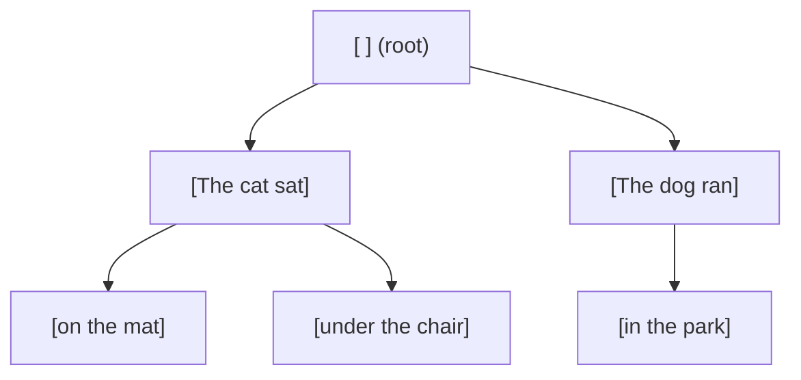

A **RadixCache** is a token-prefix tree. Each node represents one
contiguous run of tokens; children diverge on the next token. On
insert, you walk the tree until you can no longer extend, then split
or extend nodes as needed. On lookup, `match(token_list)` walks the
tree as far as it can and returns `(matched_node, hit_length)` -
the longest prefix of `token_list` that's already in the tree.

The simulator stores **block IDs** (KV-cache blocks), not the actual
KV tensors, block accounting is the simulator's currency. A block
holds `block_size` tokens (default 16 on NPU; finer-grained on the
CPU pool, see below).

## Two tiers

The scheduler has up to two RadixCaches per instance:

| Tier | Object | Lives in | Page size | Required? |
| --- | --- | --- | --- | --- |
| **NPU cache** | `MemoryModel.npu_prefix_cache` | NPU memory | `--block-size` (default 16) | Always on if `--enable-prefix-caching` (default) |
| **Second-tier pool** | `MemoryModel.second_tier_prefix_cache` | CPU or CXL | 1 | Optional, `--enable-prefix-sharing` |

The NPU cache is **per-instance**: a request that lands on instance B
can't reuse a prefix cached on instance A.

The second-tier pool is **shared across instances on the same node**
when `--enable-prefix-sharing` is on. That's what makes prefix caching
useful in multi-instance deployments, without it, each instance has
its own private cache.

`--prefix-storage` selects where the second-tier pool lives:
- `None` → no second tier (default; just NPU cache).
- `CPU` → CPU memory (uses the node's `cpu_mem` budget).
- `CXL` → CXL memory (requires a `cxl_mem` block in the cluster
  config).

## Lookup flow

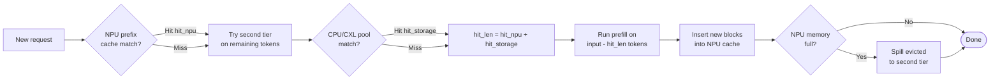

When the scheduler picks up a request:

1. Compute `input_hash_ids`: per-block hashes of the input tokens.
   Done once at JSONL load time (in `router.load_requests`).
2. **`npu_prefix_cache.match(token_list)`** → `(node, npu_hit)`.
3. If a second-tier cache exists, **also** match against it:
   `second_tier_prefix_cache.match(remaining_tokens)` →
   `storage_hit`.
4. Total `hit_len = npu_hit + storage_hit`.
5. Subtract `hit_len` from the prefill tokens the scheduler needs to
   run.

Each component is recorded on the `Request`:

```python
request.prefix_cache_hit   # total hit
request.npu_cache_hit      # tier-1 only
request.storage_cache_hit  # tier-2 only (CPU or CXL)
```

These show up in the throughput log line and the per-request CSV.

## What insertion looks like

When the scheduler decides to run a request:

1. The scheduler reserves the *non-cached* tokens' KV blocks in NPU
   memory (the `hit_len` tokens are already there).
2. After the iteration's prefill chunks finish, the freshly computed
   KV blocks are inserted into the NPU cache via
   `npu_prefix_cache.add_prefix(token_list, node_id)`.

That insert is what makes the *next* request with the same prefix
benefit. The first request always pays the full prefill cost; later
ones reuse what it produced.

## Eviction and the second-tier flow

When NPU memory pressure forces an eviction:

1. The NPU cache's LRU evicts a block.
2. If a second-tier pool exists, the evicted block is **spilled** to
   it (latency-modeled as a CPU/CXL write).
3. Future requests can hit the spilled block from the second tier
   instead of recomputing.

The second-tier pool itself can also evict (it's bounded by
`cpu_mem.mem_size` or the CXL capacity). When that happens, the block
is gone, recomputed on the next hit.

## Block events stream

`RadixCache(enable_kv_cache_events=True)` emits an event stream
recording every insert / remove / clear. The simulator uses these
events for two things:

- **Block-aware throughput accounting**: `prompt_t` counts cache
  hit tokens, matching vLLM.
- **Optional debugging output** at `--log-level DEBUG`, which dumps
  per-iteration `npu_prefix_cache.format_prefix_info()`.

If you're modifying the prefix cache or building a new visualization,
the event stream is the API to consume.

## Page size differences

The NPU cache and the CPU/CXL cache use **different page sizes**:

- NPU cache: `block_size` (default 16). Matches the actual KV-block
  granularity on the GPU side.
- CPU/CXL cache: 1. Finer-grained because spilling already-computed
  blocks shouldn't lose precision when the second-tier serves a
  *partial* match.

This means a single NPU block can correspond to up to 16 entries in
the CPU pool. The match logic accounts for this; you don't need to
reason about it unless you're modifying the cache itself.

## What gets reported

Every iteration's `add_done` call updates these counters:

| Counter | Where |
| --- | --- |
| Per-request `prefix_cache_hit` | per-request CSV `prefix_hit_len` |
| Per-iteration prompt-throughput hits | throughput log `prefix_hit=...` |
| Per-instance pool size | throughput log `prefix_pool=...` (when `--enable-prefix-sharing`) |
| Hit-rate breakdown (NPU vs CPU) | throughput log `prefix_hit=78% (npu=42%, cpu=36%)` |

## Gotchas

1. **Prefix caching is on by default.** Use
   `--no-enable-prefix-caching` if you specifically want a baseline
   without it (research baseline comparisons, etc.).
2. **The hash is over input token IDs.** If your dataset stores raw
   text and the simulator tokenizes them differently from your
   inference engine, hits won't match. Pre-tokenize (provide
   `input_tok_ids` in the JSONL) for stable hashing.
3. **NPU eviction triggers immediately when memory is full**, not
   lazily. If you see surprising memory plateaus during a long run,
   that's the eviction policy keeping NPU memory bounded.
4. **The CPU/CXL pool doesn't free itself on instance shutdown.**
   This is intentional (so a long-running multi-stage workload can
   keep reusing the pool), but leftover entries are visible in the
   final summary.

## What's next

- **[KV cache & memory](./kv-cache-and-memory)**: how the underlying
  block accounting works.
- **[Examples → Prefix caching](/docs/examples/memory-tiers/prefix-caching)** -
  the configuration / flag-level walkthrough.

---

<a id="source-42-docs-docs-simulator-specialized-pim-offloadmd"></a>

## Source: `docs/docs/simulator/specialized/pim-offload.md`

---
title: PIM offload
sidebar_position: 1
---

# PIM offload

Processing-in-memory (PIM) puts compute units physically inside DRAM,
turning a traditionally memory-bandwidth-bound kernel into a
compute-on-data-path operation. LLMServingSim models PIM as a
separate device that can take over **attention** specifically, the
rest of the layer still runs on the GPU.

This page describes how the PIM path lives inside the simulator. The
*configuration* angle (what flag to pass, how to wire up a PIM
device in the cluster config) is on
**[Examples → PIM attention offload](/docs/examples/disaggregated/pim-attention-offload)**.

## What gets offloaded, and what doesn't

When `--enable-attn-offloading` is on:

| Layer | Where it runs |
| --- | --- |
| `embedding`, `layernorm`, `qkv_proj`, `qk_norm`, `rotary_emb` | NPU |
| `attention` | **PIM** |
| `o_proj`, `gate_up_proj`, `act_fn`, `down_proj` | NPU |
| `final_layernorm`, `lm_head`, `sampler` | NPU |
| MoE block (if applicable) | NPU |

So only attention itself moves to PIM. The KV cache for attention
moves with it, KV blocks live in PIM memory rather than NPU memory,
which frees up NPU memory for weights or larger batches.

Token streams cross from NPU to PIM via memory writes (input
activation), then from PIM back to NPU via memory reads (attention
output). These crossings are modeled as memory transfers in the
trace.

## How it shows up in the trace

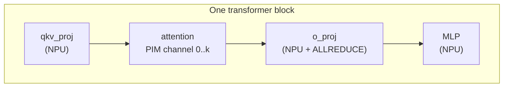

`trace_generator._emit_sequence` walks the architecture YAML's layer
list. When it sees an `attention` layer **and**
`enable_attn_offloading=True`, it swaps in a PIM block before the
NPU attention kernel:

```
... qkv_proj_3 ... (NPU)
PIM 0
pim_attention_3   (PIM device, modeled latency)
PIM END
... o_proj_3 ... (NPU, ALLREDUCE if TP > 1)
```

The `PIM 0` / `PIM END` markers tell the Chakra converter that the
contained operation runs on the PIM device with channel 0. The
converter emits a `COMP_NODE` for the PIM compute with memory access
patterns reflecting the PIM substrate.

The `pim_attention_<i>` entry's latency comes from the PIM model
(see below), not from the NPU attention CSV.

## The PIM model

`serving/core/pim_model.py` defines `PIMModel`. It's instantiated per
node when the cluster config has a
`cpu_mem.pim_config: "<config_name>"` field. The constructor reads
DRAMSim3 INI files at `configs/pim/<config_name>/`:

```
configs/pim/DDR4_8GB_3200_pim/
├── DDR4_8Gb_x16.ini    # DRAM device parameters
├── system.ini          # bus / channel layout
└── pim.ini             # PIM compute parameters
```

The INI files specify:

- **DRAM timing**: `tCAS`, `tRCD`, `tRP`, refresh interval, etc.
- **Layout**: banks per chip, channel count, row size, column size.
- **PIM compute**: operations per cycle per bank, instruction set
  caps.

`PIMModel` exposes the timing parameters to the trace generator,
which uses them to compute per-attention latency on PIM. The model
is intentionally simple, it's not a cycle-accurate DRAM model, but
captures bandwidth, parallelism (banks × channels), and operation
throughput well enough to compare PIM-vs-NPU attention paths.

## Multiple PIM channels

A node's PIM device can have multiple channels. Each channel has its
own bank-level parallelism, so different attention heads can run on
different channels in parallel. The trace generator distributes
attention work across channels by:

```
channel_for_head(h) = h * num_channels // num_attention_heads
```

This becomes the `PIM <channel>` marker in the trace. ASTRA-Sim sees
multiple `PIM 0`, `PIM 1`, ... blocks and runs them in parallel.

## KV cache in PIM memory

When PIM offload is on, KV blocks live in PIM memory (per-channel)
rather than NPU memory. The memory model accounts for this:

- `npu_used` drops by the KV-cache footprint.
- `pim_used` rises by the same amount.
- KV evictions go from PIM → CPU (or wherever `kv_evict_loc` is
  pointing) instead of NPU → CPU.

This is what makes PIM offload memory-attractive for long-context
workloads: the GPU's HBM is freed up to hold larger weights or more
in-flight requests.

## Why TPOT often improves but TTFT regresses

- **Decode** is memory-bandwidth-bound. PIM has high *aggregate*
  bandwidth (compute is co-located with the bytes), even if its raw
  GB/s per channel is lower than HBM. On long-context decode, PIM
  attention often beats GPU attention.
- **Prefill** is compute-bound on attention (long sequences scaled
  quadratically). PIM's narrower compute per channel doesn't help -
  in fact, it hurts. Workloads with mostly-prefill traffic regress
  on PIM offload.

The standard fix is **sub-batch interleaving**: overlap GPU compute
on one half of the batch with PIM attention on the other half. See
[Examples → Sub-batch interleaving](/docs/examples/advanced/sub-batch-interleaving).

## Throughput log additions

When PIM is active, the throughput log gains a `pim_busy=` field per
node:

```
[INFO] step=10 batch=8 prompt_t=1.1k tok/s decode_t=520 tok/s
       npu_mem=63.4 GB pim_busy=72%
```

`pim_busy` is the fraction of simulated time the PIM device was
running attention work in the last log interval. When this saturates
near 100%, PIM is your bottleneck, try multi-channel PIM, or revert
to NPU attention for prefill-heavy phases.

## Gotchas

1. **PIM offload is per-node.** `cpu_mem.pim_config` lives on the
   node, not the instance. Multiple instances on the same node share
   the same PIM device.
2. **`--enable-attn-offloading` is the CLI default.** Individual
   instances can override it with `enable_attn_offloading` in the
   cluster config, but any node that uses PIM offload still needs a
   `cpu_mem.pim_config`.
3. **The PIM CSV bundle isn't a thing.** Unlike NPU, PIM attention
   latency is computed analytically from the DRAMSim3 parameters
   plus `pim_model.py`'s arithmetic. Profiling a real PIM device is
   future work.
4. **Sub-batch interleaving requires PIM offload.** Without
   `--enable-attn-offloading`, `--enable-sub-batch-interleaving` is a
   no-op (everything's on NPU, there's nothing to overlap).
5. **DRAMSim3 INI tweaks land at next startup.** The simulator reads
   them once at boot. Changing parameters mid-run requires a
   restart.

## What's next

- **[Examples → PIM attention offload](/docs/examples/disaggregated/pim-attention-offload)** -
  the configuration walkthrough.
- **[Power model](./power-model)**: PIM has its own idle / active
  power parameters in the node `power` block.

---

<a id="source-43-docs-docs-simulator-specialized-power-modelmd"></a>

## Source: `docs/docs/simulator/specialized/power-model.md`

---
title: Power model
sidebar_position: 2
---

# Power model

When you add a `power:` block to a node in the cluster config, the
simulator tracks system power per-component and integrates over
simulated time to produce a final energy number. This page is the
internal mechanics; the configuration angle is on
**[Examples → Power modeling](/docs/examples/advanced/power-modeling)**.

## What's modeled

`serving/core/power_model.py::PowerModel` tracks per-node power across
six categories:

| Component | Parameters | When it draws |
| --- | --- | --- |
| **Base node** | `base_node_power` (W) | Always (host platform overhead) |
| **NPU** | `idle_power`, `standby_power`, `active_power`, `standby_duration` (per hardware) | Idle when idle, standby for `standby_duration` after compute, active during compute |
| **CPU** | `idle_power`, `active_power`, `util` | `idle + (active - idle) × util` continuously |
| **DRAM** | `dimm_size`, `idle_power` per DIMM, `energy_per_bit` | Idle baseline + per-byte access energy |
| **Link** | `num_links`, `idle_power`, `energy_per_bit` | Idle + per-byte network traffic |
| **NIC** | `num_nics`, `idle_power` | Always (idle baseline) |
| **Storage** | `num_devices`, `idle_power` | Always (idle baseline) |

Each per-node `power:` block in the cluster config sets these
parameters. See the bundled `single_node_power_instance.json` and
`single_node_pim_instance.json` for full examples.

## How the math works

Energy is the integral of power over time. The simulator does this
in nanosecond ticks: every iteration it computes the elapsed time
since the last power update, multiplies by current power, and adds
to the running energy total:

```
ΔE = P(current_state) × Δt    [Joules = Watts × seconds]
total_energy += ΔE
```

The trick is **per-component tracking**. NPU power depends on
whether it's actively running a kernel (active_power), recently
finished (standby_power for `standby_duration` ns, then back to
idle), or idle. The model tracks `last_compute_end_ns` per NPU and
applies the right wattage based on `current_ns - last_compute_end_ns`.

CPU, DRAM, link, NIC, storage are simpler: each has a constant
background draw plus a per-event energy increment for traffic /
access bytes.

## NPU states

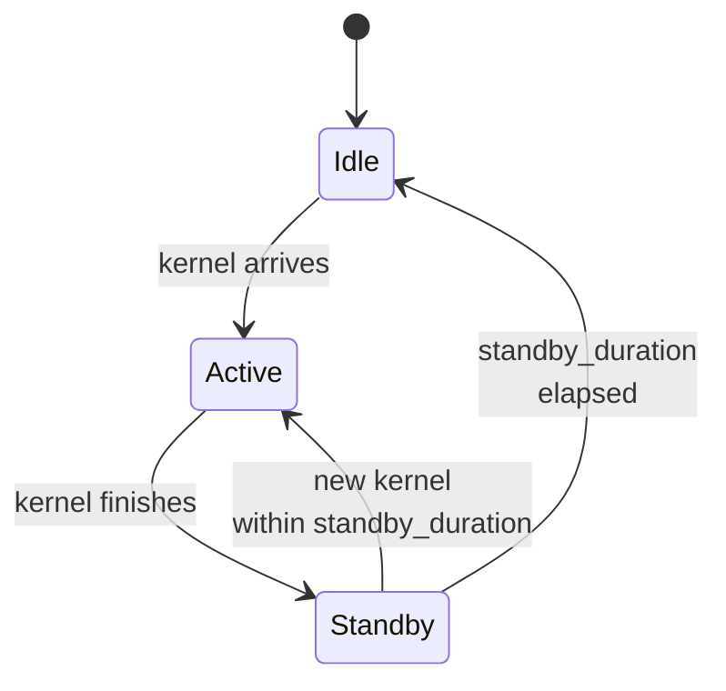

The NPU is the most nuanced component. Three states with the
power coefficient that applies in each:

| State | Power | When |
| --- | --- | --- |
| **Active** | `active_power` | Kernel running |
| **Standby** | `standby_power` | Within `standby_duration` ns of last kernel finish |
| **Idle** | `idle_power` | More than `standby_duration` since last kernel |

`standby_duration` (ns) controls how long the NPU stays in the
standby state after a compute finishes. This models the post-kernel
overhead before the device drops back to idle (FP32 result drains,
DMA flushes, etc.). For RTXPRO6000 the bundled config has
`standby_duration: 18` ns; for H100 it's larger (e.g., ~30 ns).

If a new kernel arrives within `standby_duration`, the NPU never hits
idle, it goes active again from standby. This matters for steady-
state workloads where the NPU is more or less always busy.

## Where power gets reported

### Periodic throughput log

Every `--log-interval` seconds, the throughput log line gains a
`power=` field:

```
[INFO] step=42 batch=8 prompt_t=1.2k tok/s decode_t=420 tok/s
       npu_mem=88.4 GB power=712 W
```

`power` is the **current** total system power, the sum of every
component's instantaneous wattage at this moment.

### Final summary

When the simulation ends, `power_model.print_power_summary()` writes
a per-node energy breakdown:

```
─────── Power summary (node 0) ───────
   NPU active     :   12,453 J  (78%)
   NPU standby    :    1,012 J   (6%)
   NPU idle       :       89 J   (1%)
   CPU            :    1,233 J   (8%)
   DRAM           :      442 J   (3%)
   Link           :      388 J   (2%)
   Base + NIC + storage : 332 J  (2%)
   ─────────────────────────────────
   Total energy   :   15,949 J
```

This gets emitted regardless of `--log-level`. The breakdown is what
makes power modeling useful for energy-efficiency research: you can
see which components dominate.

## Multi-node power

Each node has its own `power:` block. The simulator runs all node
power models in parallel and the throughput log line shows them
together:

```
       power=[node0=712 W, node1=689 W]
```

The final summary prints a per-node breakdown plus a cluster total.

## Where the per-NPU active power comes from

`active_power` per NPU is keyed by the `hardware:` field on the
instance:

```json
"power": {
  "npu": {
    "RTXPRO6000": {
      "idle_power": 35,
      "standby_power": 300,
      "active_power": 600,
      "standby_duration": 18
    }
  }
}
```

For multi-hardware clusters, list multiple entries:

```json
"power": {
  "npu": {
    "RTXPRO6000": { ... },
    "H100": { ... }
  }
}
```

The simulator looks up the right entry per instance based on its
`hardware:` field. If your config uses a hardware tag with no
matching power entry, the simulator skips power tracking for that
NPU (with a warning at startup).

## Gotchas

1. **No `power:` block = no power model.** The simulator runs
   normally, just doesn't emit power numbers. Add the block to
   enable; remove it for a slightly faster run.
2. **Power values are estimates.** They're meant for *relative*
   comparison ("does PIM offload save energy vs HBM attention?"),
   not absolute datacenter accounting.
3. **`standby_duration` matters more than you'd think.** Bursty
   workloads with long idle gaps see lots of idle-state energy, while
   steady-state workloads stay in active or standby. If your numbers
   look surprising, check the standby vs idle breakdown in the final
   summary.
4. **Per-event energy is per-byte, not per-operation.** Link energy
   scales with traffic bytes, not collective count. Reducing
   `comm_size` is the lever, not reducing collective frequency.
5. **`--log-interval 0.1` makes the power log very noisy.** Default
   `1.0` is usually right for tracking trends; finer intervals
   produce smoother curves at the cost of longer log files.

## What's next

- **[Examples → Power modeling](/docs/examples/advanced/power-modeling)** -
  configuration walkthrough.
- **[PIM offload](./pim-offload)**: PIM has its own active /
  standby power parameters that integrate with this model.

---

<a id="source-44-docs-docs-simulator-trace-generationmd"></a>

## Source: `docs/docs/simulator/trace-generation.md`

---
title: Trace generation
sidebar_position: 4
---

# Trace generation

`trace_generator.generate_trace(...)` is the bridge between the
**profiled latency database** (CSV files produced by the profiler)
and the **per-batch execution trace** that ASTRA-Sim consumes.

It's the page where "the model has 32 decoder blocks, each block has
qkv + attention + o_proj + mlp" turns into "this batch takes
1.78 ms".

> Looking for the trace file format spec? See
> **[Reference → Trace file format](/docs/reference/trace-format)**.
> Looking for how the profiler *produces* the latency database in the
> first place? See **[Profiler → Output bundle](/docs/profiler/output-bundle)**.
> This page is about how the simulator *consumes* it.

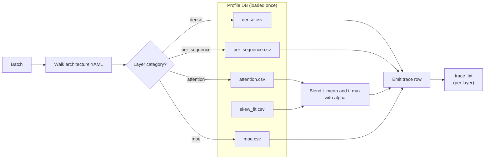

## The data the simulator consumes

The profiler writes per-category CSVs at:

```
profiler/perf/<hardware>/<model>/<variant>/tp<N>/{
  dense.csv,
  per_sequence.csv,
  attention.csv,
  moe.csv,           # MoE models only
  skew.csv,          # if heterogeneous-decode sweep is on
  skew_fit.csv       # ditto, the fitted alpha table
}
meta.yaml
```

Where `<variant>` encodes the dtype combination, e.g., `bf16` or
`bf16-kvfp8` or `fp8-kvfp8`. The simulator resolves the variant at
runtime via `resolve_variant(dtype, kv_cache_dtype, model_config)`.

The CSVs hold `time_us` (microseconds). The simulator multiplies by
1000 and rounds to ns at load time, every internal latency is in ns.

## Loading the perf DB

`_load_perf_db(hardware, model, variant)` is called once per
unique `(hardware, model, variant)` triple over the simulator's
lifetime; results are cached in `_perf_db_cache`. Calling it on every
batch would be way too slow.

On first load, the simulator also:

1. Reads `meta.yaml` and compares the runtime's
   `--max-num-batched-tokens` and `--max-num-seqs` against the
   profiled sweep bounds. If you exceed them, you get a one-shot
   warning that lookups will **extrapolate** rather than clamp.
2. Hydrates the skew_fit table (`alpha_by_bucket` map) from
   `skew_fit.csv`.

## Per-category lookup

Each layer in the model's architecture YAML is tagged with a
**category**: dense, per_sequence, attention, or moe. Each category
has its own lookup function:

| Category | Lookup function | Key | Interpolation |
| --- | --- | --- | --- |
| `dense` | `_lookup_dense` | `total_len` (sum of tokens in batch) | 1D linear |
| `per_sequence` | `_lookup_per_sequence` | `num_requests` | 1D linear |
| `attention` | `_lookup_attention` | `(prefill_chunk, kv_prefill, n_decode, kv_decode)` | nearest-neighbour on `(pc, n_dec)`, bilinear on `(kv_pre, kv_dec)` |
| `moe` | `_lookup_moe` | `(local_tokens, activated_experts)` (per rank, profiled at TP=1) | 2D linear |

All lookups **extrapolate** outside the profiled grid (via linear
extension), so a runtime value larger than the largest profiled
sample doesn't fail, it produces a (less reliable) extrapolated
latency. The startup warning above tells you when this is happening.

The `time_us` value at each grid point is converted to ns at load
time, so lookups directly yield ns.

## Variant resolution

`resolve_variant(dtype, kv_cache_dtype, model_config)` mirrors the
profiler's `effective_variant`:

```
dtype           dtype-from-CLI or torch_dtype from model config
                  (default 'bfloat16')

kv_cache_dtype  CLI value, default 'auto' (inherits from dtype)

variant         f"{short(dtype)}"                       # if kv_cache_dtype == 'auto'
                f"{short(dtype)}-kv{short(kv_cache_dtype)}"  # otherwise
```

So:

- `--dtype bfloat16` → `bf16`
- `--dtype bfloat16 --kv-cache-dtype fp8` → `bf16-kvfp8`
- `--dtype fp8 --kv-cache-dtype fp8` → `fp8-kvfp8`

If the resolved folder doesn't exist under `profiler/perf/...`, the
simulator raises a clear `FileNotFoundError` pointing at the missing
variant. Either profile that combo with `--variant <name>` on the
profiler, or pick a different dtype combination.

## Heterogeneous-decode skew correction

FlashAttention's varlen kernel pays tile-padding and SM-imbalance
costs when a decode batch has non-uniform KV lengths. The plain
attention grid can't see that, it's profiled with uniform
`kv_decode` per shot. So the profiler runs a **second sweep** on
bimodal batches (`skew.csv`) and fits a per-bucket
**alpha** ∈ [0, 1] that says how far along the mean→max line a
skewed batch lands:

```
alpha = (t_skew - t_mean) / (t_max - t_mean)
```

At runtime, `_lookup_attention_with_skew` does **two** 4D attention
lookups, one at the batch's `kv_decode_mean`, one at `kv_decode_max`
- and blends them:

```
t_attention = t_mean + alpha * (t_max - t_mean)
```

The bucket key is built from five axes:
`pc | n_label | skew_rate_label | kv_big_label | kp_label`

- `pc`: prefill chunk size (bucket per profiled value).
- `n_label`: `n_decode` value (bucket per profiled value).
- `skew_rate_label`: normalized skew rate, fixed [0,1] scheme.
- `kv_big_label`: log-4× bins of the long KV.
- `kp_label`: `kv_prefill` value (bucket per profiled value).

The bucket axis definitions live in
`meta.yaml::skew_fit.bucket_axes`, so widening the profile sweep
lights up finer resolution without any simulator code change.

If the skew sweep wasn't run (`SKIP_SKEW=1` at profile time), the
simulator falls back to a pooled constant alpha. The profile angle
of skew correction is documented on
**[Profiler → Skew & alpha fit](/docs/profiler/skew-alpha-fit)**.

## Walking the architecture YAML

Each model has an architecture YAML at
`profiler/models/<model_type>.yaml` (e.g., `llama.yaml`,
`qwen3_moe.yaml`). The YAML has:

- A `catalog:` mapping canonical layer names (e.g., `qkv_proj`,
  `attention`, `moe`) to vLLM class names.
- A `sequence:` describing the per-iteration layer order:
  `prologue → pre_attn → post_attn → (mlp_dense | mlp_moe) → head`.

`trace_generator._emit_sequence` walks the sequence list and emits
one trace row per layer. It also:

- Attaches **TP-ALLREDUCE** after `o_proj` and `down_proj` when
  `tp_size > 1`.
- Wraps the MoE block with **EP-ALLTOALL** markers when MoE is
  active.
- Swaps in PIM attention before the NPU attention kernel when
  `--enable-attn-offloading` is on.
- One-shot-warns when a sequence layer is missing from the profile
  CSVs (so you know to extend the profile).

## Where DP groups change things

When instances are in a `dp_group`, trace generation is **deferred**
until all DP members have scheduled their batches for the current
iteration. The simulator collects each member's `total_len`, takes
the **max** across the group, and uses that for the EP-ALLTOALL
`comm_size`:

```
comm_size_alltoall = max(total_len_per_member) * hidden_size * fp_size
```

Each member's trace still uses its own per-instance `total_len` for
the dense and attention kernels, only the ALLTOALL is synchronized.
This matches what production MoE serving does (vLLM CUDA-graph
padding to the max in the wave).

The full DP+EP wave-sync mechanics live on
**[Parallelism mechanics](./parallelism-mechanics)**.

## Block copy optimization

For models with `num_hidden_layers > 1` (i.e., all of them), the
trace's transformer blocks are identical except for layer index.
Generating each layer's row separately is wasteful, so by default
`enable_block_copy=True`:

- Generate the full trace for **block 0** only.
- For blocks 1..N-1, emit a single Chakra `block_copy` instruction
  that replays block 0's compute pattern with adjusted layer indices.

This is **always** safe for dense models. For MoE with
`--expert-routing-policy BALANCED` (the default), it's also safe
because the policy is deterministic and every layer produces the
same `(local_tokens, activated_experts)` pair. For `RR` / `RAND`,
per-layer variance is small once the batch saturates, so block-copy
remains a harmless approximation; `CUSTOM` policies that need
per-layer variance can disable it via `block_copy=False` in the
gate router constructor.

## Per-rank latency for MoE

MoE uses `EXPERT {i}` / `EXPERT END` markers in the trace, with one
`COMP_NODE` per EP rank. Each rank's latency comes from the MoE CSV
keyed on its **local** token count and activated experts (profiled
at TP=1). Ranks execute in parallel and synchronize at the
ALLTOALL barrier.

Expert-to-rank assignment uses even partitioning:
`expert_id * ep_size // num_experts`.

## Gotchas

1. **`time_us` in CSV is microseconds.** The simulator converts to
   ns at load time. If you're cross-referencing a CSV row against
   a simulator log line, multiply by 1000.
2. **No calibration scaling.** Profiled latencies are used directly,
   not rescaled. If your profiles look off, re-profile rather than
   tweaking a "scale factor", there isn't one.
3. **First-load is slow** (perf DB parsing); subsequent loads hit
   `_perf_db_cache`. Restarting the simulator pays the parse cost
   again.
4. **Variant folder must exist.** Mismatched dtype + KV combo →
   `FileNotFoundError`. Either profile that combo or pick a different
   `--dtype` / `--kv-cache-dtype` pair.
5. **Skew correction only fires when the skew sweep was profiled.**
   Otherwise you get a single pooled alpha, which is correct on
   average but loses heterogeneity sensitivity.

## What's next

- **[Parallelism mechanics](./parallelism-mechanics)**: what
  TP-ALLREDUCE / EP-ALLTOALL actually look like in the trace.
- **[Reference → Trace file format](/docs/reference/trace-format)**
  the field-by-field spec of the text trace this page produces.

---

<a id="source-45-docs-docs-validationmd"></a>

## Source: `docs/docs/validation.md`

---
title: Validation
sidebar_position: 3
description: How LLMServingSim's output compares against real vLLM
---

# Validation

LLMServingSim is validated end-to-end against real vLLM on the
**bundled `(hardware, model)` combos**. The numbers below come from
running a 300-request ShareGPT replay through both vLLM v0.19.0 and
the simulator on RTXPRO6000, then comparing the per-request and
per-tick metrics with `python -m bench validate`.

> **Want to validate your own change?** See
> **[For Contributors → Validating your changes](/docs/contributor/validating-changes)**
> for the regression workflow.

## Setup

| Knob | Value |
| --- | --- |
| **Workload** | 300 ShareGPT-derived requests, ~10 sps Poisson arrivals |
| **Hardware** | RTXPRO6000 (single node, profile bundle in `profiler/perf/RTXPRO6000/`) |
| **vLLM version** | `v0.19.0` (the pin used by the bench container) |
| **Block size** | 16 |
| **Engine flags** | Defaults except where the cluster config dictates otherwise |
| **Cluster configs** | `bench/examples/configs/<model>.json` |

Inputs and outputs (vLLM token IDs, sampling params, per-request
timings) are pinned via `bench`'s strict-replay path so both runs
process exactly the same prompts in the same order.

## Headline numbers

Mean error vs. real vLLM, per metric, on the three currently bundled
configurations:

| Model | Parallelism | TTFT mean | TPOT mean | Latency mean |
| --- | --- | --- | --- | --- |
| Llama-3.1-8B                | TP=1 dense       | -0.3% | +0.7% | +0.4% |
| Qwen3-32B                   | TP=2 dense       | +2.4% | +1.7% | +2.0% |
| Qwen3-30B-A3B-Instruct-2507 | DP=2 × EP=2 MoE  | -1.5% | +1.1% | +0.9% |

Across all three, **TTFT / TPOT / latency means stay within ~2.5%
of vLLM**, and the DP+EP MoE path tracks vLLM as tightly as the
dense TP path. Per-percentile numbers (P50 / P90 / P95 / P99) are in
the per-model `summary.txt` files under
[`bench/examples/`](https://github.com/casys-kaist/LLMServingSim/tree/main/bench/examples).

## Per-model results

### Llama-3.1-8B (TP=1 dense)

Throughput timeline, vLLM (orange) vs. simulator (blue):


Headline error vs. vLLM:

| Metric | vLLM | Sim | Diff |
| --- | --- | --- | --- |
| TTFT mean    |  7.10 s   |  7.07 s   | **-0.3%** |
| TTFT P99     | 19.76 s   | 19.96 s   | +1.0% |
| TPOT mean    | 32.5 ms   | 32.7 ms   | **+0.7%** |
| TPOT P99     | 37.3 ms   | 38.1 ms   | +2.1% |
| Latency mean | 28.20 s   | 28.31 s   | **+0.4%** |
| Latency P99  | 37.64 s   | 37.96 s   | +0.8% |

Single-instance dense Llama is the simplest configuration. The
simulator matches TTFT mean to within 0.3% and tracks TPOT and
end-to-end latency within ~1%.

### Qwen3-32B (TP=2 dense)

Throughput timeline:


Headline error vs. vLLM:

| Metric | vLLM | Sim | Diff |
| --- | --- | --- | --- |
| TTFT mean    | 36.91 s    | 37.81 s    | **+2.4%** |
| TTFT P99     | 93.35 s    | 95.25 s    | +2.0% |
| TPOT mean    |  80.3 ms   |  81.7 ms   | **+1.7%** |
| TPOT P99     |  97.1 ms   |  99.2 ms   | +2.2% |
| Latency mean | 90.41 s    | 92.23 s    | **+2.0%** |
| Latency P99  | 126.34 s   | 129.30 s   | +2.3% |

TP=2 exercises the dense ALLREDUCE collective on `o_proj` /
`down_proj`. Means and P99s land within ~2.5%; the simulator
slightly over-predicts because per-iteration dense compute now
accounts for chunked-prefill token counts more aggressively.

### Qwen3-30B-A3B-Instruct-2507 (DP=2 × EP=2 MoE)

Throughput timeline:


Headline error vs. vLLM:

| Metric | vLLM | Sim | Diff |
| --- | --- | --- | --- |
| TTFT mean    |  1.09 s    |  1.07 s    | **-1.5%** |
| TTFT P99     |  9.59 s    | 10.04 s    | +4.7% |
| TPOT mean    | 47.3 ms    | 47.8 ms    | **+1.1%** |
| TPOT P99     | 53.3 ms    | 54.7 ms    | +2.7% |
| Latency mean | 32.34 s    | 32.64 s    | **+0.9%** |
| Latency P99  | 43.90 s    | 44.26 s    | +0.8% |

This is the disaggregated path: data-parallel across two instances,
expert-parallel within each instance, with wave-synchronized
ALLTOALL on the 2D ASTRA-Sim topology. TTFT P50 is noisier (the
simulator finishes very short prefills slightly faster), but means
and tail latencies align with vLLM within ~3%.

## Reproducing locally

The bench module ships with reproduction scripts that re-run the
simulator side and re-run the comparison against the committed vLLM
artifacts:

```bash
# Sim side: writes bench/examples/<model>/outputs/sim.csv
./bench/examples/run.sh Llama-3.1-8B
./bench/examples/run.sh Qwen3-32B
./bench/examples/run.sh Qwen3-30B-A3B-Instruct-2507

# Compare: writes bench/examples/<model>/validation/{summary.txt, *.png}
./bench/examples/validate.sh Llama-3.1-8B
./bench/examples/validate.sh Qwen3-32B
./bench/examples/validate.sh Qwen3-30B-A3B-Instruct-2507
```

The validation step regenerates the throughput / latency / requests
plots and the headline summary. To rerun vLLM itself (instead of
reusing the committed artifacts under
`bench/examples/<model>/vllm/`), use `python -m bench run` from
inside the vLLM container; see
[`bench/README.md`](https://github.com/casys-kaist/LLMServingSim/blob/main/bench/README.md)
for the full layout.

## What's next

- **[For Contributors → Validating your changes](/docs/contributor/validating-changes)**:
  the three-tier check (smoke → scenario → bench validate) you run
  before opening a PR, plus what regression to flag.
- **[Simulator → Reading the output](/docs/simulator/reading-output)**:
  what every column in the per-request CSV means and how to derive
  your own metrics from it.

---

<a id="source-46-docs-docs-workloads-agentic-sessionsmd"></a>

## Source: `docs/docs/workloads/agentic-sessions.md`

---
sidebar_position: 4
title: Agentic sessions
---

# Agentic sessions

A standard inference benchmark like ShareGPT models *independent*
prompts: each request is one prompt → one response, and the next
request is unrelated to the previous one. Real production traffic
for **agents** doesn't look like this.

A coding agent (Cursor, Aider, or SWE-bench solvers) runs a tight
loop: ask the LLM what to do → run a tool (compile, test, search) →
feed the result back → ask the LLM the next thing → run another tool
→ ... A request budget for "1000 SWE-bench problems" is really 1000
*sessions*, each with 5–50 chained LLM calls and tool waits in
between.

That's what the **agentic** workload format is for.

## The format

Each JSONL line is one session:

```json
{
  "session_id": "session_42",
  "arrival_time_ns": 4059740,
  "sub_requests": [
    {"input_toks": 1472, "output_toks": 133, "tool_duration_ns": 127348767},
    {"input_toks": 1582, "output_toks": 125, "tool_duration_ns": 197295027},
    {"input_toks": 1734, "output_toks": 77,  "tool_duration_ns": 0}
  ]
}
```

Three sub-requests, with `tool_duration_ns` between each, that's the
simulated time spent running tools (test runner, web fetch, file
search) between LLM calls. The simulator doesn't simulate the tool
itself, it just waits.

Full schema reference is on
**[JSONL format → Agentic format](./jsonl-format#agentic-format)**.

## How the simulator handles dependency chains

When the workload is loaded, **only the first sub-request** of each
session is added to `Router._pending_requests`. The rest live in
`Router._deferred_sessions`, keyed by session id.

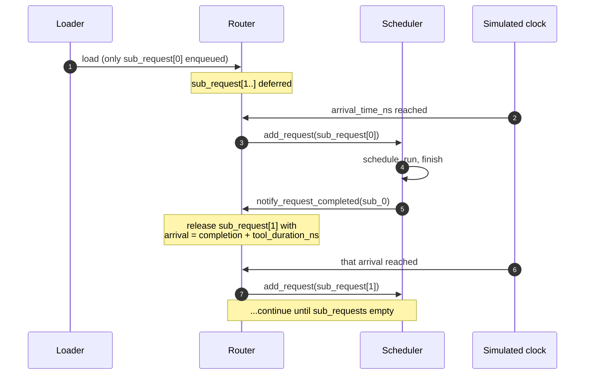

`Router.has_deferred_sessions()` keeps the main loop from exiting
while sessions are still active (otherwise a workload with a long
final tool_duration could exit prematurely between sub-requests).

For the full lifecycle, see
**[Simulator → Request lifecycle](/docs/simulator/request-lifecycle#agentic-sessions-when-stage-10-is-not-the-end)**.

## Bundled SWE-bench example

The repo ships
`workloads/swe-bench-qwen3-30b-a3b-50-sps0.2.jsonl`: 50 SWE-bench
sessions for `Qwen3-30B-A3B-Instruct-2507`, arriving at 0.2
sessions/second.

A typical session in this file has 8-15 sub-requests with input
lengths in the 1000-3000 token range and tool durations of 50-300 ms
(the wait while pytest runs, etc).

Run it with the bundled DP+EP MoE config:

```bash
python -m serving \
  --cluster-config 'configs/cluster/single_node_moe_dp_ep_instance.json' \
  --dtype bfloat16 --block-size 16 \
  --dataset 'workloads/swe-bench-qwen3-30b-a3b-50-sps0.2.jsonl' \
  --output 'outputs/swebench_run.csv' \
  --num-req 1
```

`--num-req 1` means one *session* (which expands to 8-15
sub-requests). Bump it for longer runs.

## Building your own agentic workload

There's no bundled generator for agentic format, chain extraction
depends on your data source. The pattern:

1. **Extract sessions from your trace source.** For SWE-bench, that's
   one session per problem; for browser-agent traces, one session per
   user task.
2. **For each session, extract the per-call (prompt, response) pairs
   and tool durations.** Tool duration is wall-clock time between
   the assistant message and the next user message in the trace.
3. **Tokenize prompts** with the simulator's target model's
   tokenizer. Optionally tokenize responses too if you want
   downstream analysis.
4. **Write one JSONL line per session** with the schema from
   [JSONL format → Agentic](./jsonl-format#agentic-format).

A minimal Python sketch:

```python
import json
from transformers import AutoTokenizer

tok = AutoTokenizer.from_pretrained("Qwen/Qwen3-30B-A3B-Instruct-2507")

with open("workloads/my-agentic.jsonl", "w") as f:
    for session_id, calls in extract_sessions_from_my_data():
        sub_requests = []
        for prompt, response, next_call_delay_ns in calls:
            ids_in = tok.encode(prompt)
            ids_out = tok.encode(response)
            sub_requests.append({
                "input_toks": len(ids_in),
                "output_toks": len(ids_out),
                "input_tok_ids": ids_in,
                "output_tok_ids": ids_out,
                "tool_duration_ns": next_call_delay_ns,
            })
        # last sub-request has no follow-up
        if sub_requests:
            sub_requests[-1]["tool_duration_ns"] = 0

        f.write(json.dumps({
            "session_id": session_id,
            "arrival_time_ns": session_start_ns(session_id),
            "sub_requests": sub_requests,
        }) + "\n")
```

Adjust the `extract_sessions_from_my_data()` and
`session_start_ns()` to your dataset.

## Picking arrival rates

Agentic workloads are usually **much sparser** than ShareGPT-style
workloads in arrival rate, because each session lasts much longer
in simulator-time:

| Workload | Typical sps | Why |
| --- | --- | --- |
| ShareGPT | 5-20 | Each request finishes in 1-5 seconds; high arrival rate keeps the scheduler busy |
| Agentic SWE-bench | 0.1-0.5 | Each session can run for 30-120 seconds; even 0.2 sps overlaps many sessions |

The bundled SWE-bench file uses `sps=0.2`. With 50 sessions arriving
over 250 simulator-seconds and each running ~60 seconds, you get
~12 sessions active concurrently, a realistic load.

## Mixing flat + agentic in one file

The loader handles per-line auto-detection, so you can have:

```jsonl
{"input_toks": 100, "output_toks": 50, "arrival_time_ns": 0}
{"session_id": "s0", "arrival_time_ns": 1000000, "sub_requests": [{"input_toks": 200, "output_toks": 100, "tool_duration_ns": 0}]}
{"input_toks": 150, "output_toks": 80, "arrival_time_ns": 2000000}
```

Useful when you want a sanity-baseline of independent prompts mixed
with agentic sessions.

## Gotchas

1. **Last sub-request's `tool_duration_ns` should be 0** (or just
   omitted in your generator if you treat 0 as default). Non-zero
   keeps the session "alive" past its real end and the simulator
   waits unnecessarily.
2. **Session arrival_time_ns is for the *first* sub-request.**
   Subsequent sub-requests have their arrival times computed at run
   time as `previous_completion + tool_duration_ns`.
3. **Pre-tokenize for prefix caching.** Agentic sessions usually have
   *very* high prefix overlap between sub-requests (each call shares
   the system prompt + previous turns). Without
   `input_tok_ids`, you lose the bulk of the savings.
4. **Sessions are scheduled to whichever instance is least loaded
   at the time of *each* sub-request's release.** A long agent run
   could hop between instances in a multi-instance config. If you
   want sticky session-to-instance affinity, use `CUSTOM` routing
   (see `serving/core/router.py`).

## What's next

- **[Simulator → Request lifecycle](/docs/simulator/request-lifecycle)**
  what happens at runtime when the simulator processes a session.
- **[Examples → DP+EP MoE](/docs/examples/parallelism/dp-ep-moe)** -
  uses the bundled SWE-bench agentic workload.

---

<a id="source-47-docs-docs-workloads-jsonl-formatmd"></a>

## Source: `docs/docs/workloads/jsonl-format.md`

---
sidebar_position: 2
title: JSONL format
---

# JSONL format

Workload files are line-delimited JSON (`.jsonl`). Each line is a
JSON object representing **either** an independent request (flat
format) or a session with chained LLM calls (agentic format). The
two formats can coexist in the same file, the loader auto-detects
per line.

## Flat format

Every line is one independent request:

```json
{"input_toks": 1472, "output_toks": 133, "arrival_time_ns": 4059740, "input_tok_ids": [1, 2, 3, ...], "output_tok_ids": [4, 5, 6, ...]}
```

### Fields

| Field | Type | Required | Meaning |
| --- | --- | --- | --- |
| `input_toks` | int | ✓ | Number of prompt tokens |
| `output_toks` | int | ✓ | Number of tokens to generate |
| `arrival_time_ns` | int | ✓ | When the request arrives in nanoseconds (relative to start of simulation) |
| `input_tok_ids` | list&lt;int&gt; | optional | Pre-tokenized prompt IDs (enables prefix-cache hashing, see [below](#why-token-ids-matter)) |
| `output_tok_ids` | list&lt;int&gt; | optional | Pre-tokenized output IDs (used internally for output-side analysis; usually fine to omit) |

If `input_tok_ids` is provided, `len(input_tok_ids)` must equal
`input_toks` (same for output).

### When to use flat

- ShareGPT-style benchmarks (independent prompts).
- Production trace replay (each prompt is its own request).
- Stress tests with a fixed Poisson arrival pattern.

## Agentic format

Every line is one **session** with multiple chained LLM calls. Each
call's arrival time is determined by the previous call's completion
plus the `tool_duration_ns` between them, the simulator respects
this dependency chain:

```json
{
  "session_id": "session_0",
  "arrival_time_ns": 4059740,
  "sub_requests": [
    {"input_toks": 1472, "output_toks": 133, "tool_duration_ns": 127348767},
    {"input_toks": 1582, "output_toks": 125, "tool_duration_ns": 197295027},
    {"input_toks": 1734, "output_toks": 77,  "tool_duration_ns": 0}
  ]
}
```

### Top-level fields

| Field | Type | Required | Meaning |
| --- | --- | --- | --- |
| `session_id` | string | ✓ | Unique identifier for the session |
| `arrival_time_ns` | int | ✓ | When the **first** sub-request arrives |
| `sub_requests` | list&lt;object&gt; | ✓ | Ordered chain of LLM calls. Length ≥ 1 |

### Sub-request fields

| Field | Type | Required | Meaning |
| --- | --- | --- | --- |
| `input_toks` | int | ✓ | Prompt tokens for this LLM call |
| `output_toks` | int | ✓ | Generated tokens |
| `tool_duration_ns` | int | ✓ | Time to wait **after** this call completes before the next sub-request becomes eligible |
| `input_tok_ids` | list&lt;int&gt; | optional | Same as flat format |
| `output_tok_ids` | list&lt;int&gt; | optional | Same as flat format |

The last sub-request typically has `tool_duration_ns: 0` (nothing to
wait for after the session ends).

### When to use agentic

- **Tool-using agents** (browser agents, code agents, RAG with retrieval steps).
- **SWE-bench-style benchmarks** where each session involves multiple
  edits + tests + retries.
- **Multi-turn dialog** with simulated user think time between turns.

The simulator handles the chain via `Router._deferred_sessions` -
only the first sub-request is queued initially; the rest are released
as their predecessors complete. See
**[Simulator → Request lifecycle](/docs/simulator/request-lifecycle#agentic-sessions-when-stage-10-is-not-the-end)**
for the runtime mechanics.

## Mixing formats

A single `.jsonl` file can contain both flat and agentic entries.
The loader inspects each line:

- Has `sub_requests` key? → agentic.
- Otherwise → flat.

This is occasionally useful: an agentic SWE-bench workload can
include a few flat "baseline" requests for sanity-checking.

## Why token IDs matter

The optional `input_tok_ids` field is what makes prefix caching
work end-to-end:

- Without it, the simulator just knows "prompt has N tokens" but
  can't recognize when two prompts share a prefix.
- With it, the router computes a per-block hash of the token IDs at
  load time. The scheduler then matches requests against the
  RadixCache at run time using those hashes.

For ShareGPT-style traces where many requests share a system prompt,
having token IDs makes prefix-cache hit rates 5-10× higher than
without. **Pre-tokenize when you can.** The bundled generator does
this for you.

If your dataset only has raw text, you have two options:

1. Run a tokenizer at workload-generation time to populate
   `input_tok_ids`. The ShareGPT generator does this.
2. Skip token IDs entirely. Prefix caching still works for *exact*
   prefix matches based on `input_toks` alone, but matches are much
   coarser and miss most opportunities.

**Tokenize with the same model the simulator runs.** A workload
generated with the Llama tokenizer won't produce useful prefix hits
in a Qwen3 simulation, the token streams are entirely different.

## Validation

The loader (`router.load_requests`) checks at startup:

- All required fields present.
- `len(input_tok_ids) == input_toks` if provided (same for output).
- `arrival_time_ns >= 0` and any order is fine, the loader sorts
  by arrival time anyway.
- Agentic: at least one sub-request, `tool_duration_ns >= 0`.

Validation errors are printed with the offending line number and
field name; the loader exits before any simulation work starts.

## Gotchas

1. **`arrival_time_ns` is the simulator clock**, not wall-clock. A
   workload generated at 10 sessions/s has arrival times spanning
   30 seconds for 300 sessions, that's 30 simulator-seconds, not 30
   real seconds.
2. **Token IDs are integers, not strings.** Whatever your tokenizer
   outputs (`tokenizer.encode(...).ids`) goes here directly.
3. **Output token IDs are usually unused at runtime**: the simulator
   doesn't need them to compute decode timing. Provided generators
   include them for downstream analysis tools.
4. **Mixing tokenizers across workloads is fine, but mixing inside
   one file is not.** All `input_tok_ids` should come from the same
   tokenizer.

## What's next

- **[ShareGPT generator](./sharegpt-generators)**: produce flat
  workloads from real ShareGPT traces with proper tokenization.
- **[Agentic sessions](./agentic-sessions)**: deeper dive on the
  agentic format and how to build your own chains.

---

<a id="source-48-docs-docs-workloads-sharegpt-generatorsmd"></a>

## Source: `docs/docs/workloads/sharegpt-generators.md`

---
sidebar_position: 3
title: ShareGPT generator
---

# ShareGPT generator

ShareGPT is the de facto standard inference benchmark, a curated
dataset of real human ↔ ChatGPT conversations spanning a wide range
of prompt lengths and use cases. The bundled generator turns ShareGPT
(or any compatible Hugging Face text dataset) into the JSONL format
the simulator consumes, with proper tokenization for prefix caching.

## Quick run

From the vLLM Docker container at `/workspace`:

```bash
python -m workloads.generators sharegpt \
  --model meta-llama/Llama-3.1-8B \
  --source shibing624/sharegpt_gpt4 \
  --num-reqs 300 --sps 10 --seed 42 \
  --output workloads/sharegpt-llama-3.1-8b-300-sps10.jsonl
```

That produces a flat-format workload with 300 requests arriving at
10 sessions/second on average, tokenized with the Llama-3.1-8B
tokenizer.

`workloads/examples/` contains ready-to-edit templates for the
bundled models, copy and tweak:

```bash
ls workloads/examples/
# gen-llama-3.1-8b.sh
# gen-qwen3-30b-a3b.sh
# gen-qwen3-32b.sh
```

## Why use the vLLM container

The generator imports `transformers` for tokenization and (optionally)
`vllm` for free-generation mode. Both are pre-installed in the vLLM
Docker image. Run from inside `scripts/docker-vllm.sh` and you don't
need to manage Python deps yourself.

For gated models (Llama 3.x, etc.), set `HF_TOKEN` before launching
the container, see
**[Installation → vLLM setup](/docs/getting-started/installation/vllm)**.

## Options, grouped

### Source and model

| Flag | Default | Meaning |
| --- | --- | --- |
| `--model` | (required) | HuggingFace model id; used for tokenization (and optionally free-generation) |
| `--source` | `shibing624/sharegpt_gpt4` | HF dataset id or local path. Any dataset with `conversations` field works |

### Sampling

| Flag | Default | Meaning |
| --- | --- | --- |
| `--num-reqs` | (required) | How many requests / sessions to emit |
| `--sps` | (required) | Sessions per simulated second (Poisson arrival) |
| `--seed` | `42` | RNG seed for sampling and arrival times |
| `--first-arrival-sec` | `0` | Offset for the first request's arrival time |

### Length filters

Drop requests outside these ranges from the source dataset:

| Flag | Default | Meaning |
| --- | --- | --- |
| `--min-input-toks` | `0` | Minimum prompt tokens (after tokenization) |
| `--max-input-toks` | `16384` | Maximum prompt tokens |
| `--min-output-toks` | `0` | Minimum output tokens |
| `--max-output-toks` | `16384` | Maximum output tokens |
| `--max-kv-toks` | `16384` | Cap `input + output` tokens (KV-cache footprint) |
| `--max-sessions` | `5000` | Cap the number of source sessions sampled before filtering |

A reasonable starting point: `--min-input-toks 256 --min-output-toks
512` filters out very short conversations that aren't representative
of real serving traffic.

### Fixed-length mode

For controlled stress tests, fix the prompt and output lengths:

| Flag | Default | Meaning |
| --- | --- | --- |
| `--fix-len` | off | Enable fixed-length mode |
| `--fix-input-length` | `128` | Prompt tokens |
| `--fix-output-length` | `512` | Output tokens |

In this mode, the generator still pulls real conversations from the
source dataset for prefix-cache realism, but truncates / pads each
to the fixed lengths.

### Pulse arrival pattern

A burst-mode arrival pattern that approximates the "everyone hits
the API at the top of the hour" production phenomenon:

| Flag | Default | Meaning |
| --- | --- | --- |
| `--pulse` | off | Enable pulse mode |
| `--pulse-n` | `10` | Number of requests per pulse |
| `--pulse-delay-sec` | `60` | Time between pulses |
| `--pulse-poisson` | off | Within each pulse, use Poisson arrivals at the configured `--sps` instead of all-at-once |

Without `--pulse-poisson`, pulse arrivals all fire at the start of
each pulse window, useful for testing the simulator's burst-handling
behavior.

### vLLM free-generation mode (optional)

Instead of using the source dataset's response field for output
tokens, **regenerate** outputs with vLLM. This produces outputs
matching the model you'll run in the simulator:

| Flag | Default | Meaning |
| --- | --- | --- |
| `--use-vllm` | off | Use vLLM to free-generate outputs |
| `--vllm-tp` | `1` | TP degree for vLLM |
| `--vllm-dtype` | `bfloat16` | vLLM weight dtype |

With `--use-vllm`:

1. The prompt is taken from ShareGPT.
2. vLLM generates a fresh response with that model.
3. Both prompt and response are tokenized; `input_tok_ids` and
   `output_tok_ids` are populated.

Without `--use-vllm`:

- Both prompt and response come from the ShareGPT entry as text.
- Only the prompt is re-tokenized with `--model`'s tokenizer for
  `input_tok_ids`.

Use `--use-vllm` when you specifically want output token IDs to
match what the model would actually produce. For most simulator
runs this isn't needed (the simulator doesn't generate text, it
just counts tokens), but it's useful for downstream evaluation or if
you want fully self-consistent traces.

## Output format

The generator writes one JSONL line per request:

```json
{"input_toks": 1472, "output_toks": 133, "arrival_time_ns": 4059740, "input_tok_ids": [...], "output_tok_ids": [...]}
```

Always **flat format**: ShareGPT entries don't have dependency
chains. For agentic workloads see
**[Agentic sessions](./agentic-sessions)**.

The output filename convention is
`sharegpt-<model-short>-<n>-sps<rate>.jsonl` (matches the bundled
files).

## Tips

1. **Tokenize with the same model the simulator will run.** Otherwise
   the prefix-cache hit rate in the simulator won't match what
   production would see. The bundled JSONL files use this convention
   and are paired with their respective models.
2. **`--max-sessions` caps the source sample, not the output.**
   Increase it if you're applying tight length filters and not
   getting enough surviving requests. Default 5000 is enough for most
   `--num-reqs` values.
3. **Pulse mode is great for sanity tests.** A clean burst pattern
   exposes scheduler behavior that smooth Poisson arrivals can hide
   (queue buildup, fairness, head-of-line blocking).
4. **Generation speed.** Without `--use-vllm`, generation is
   tokenization-bound and finishes in seconds. With `--use-vllm`, you
   pay real vLLM inference cost, minutes to hours depending on
   `--num-reqs`. Cache the output JSONL.
5. **Reuse JSONL across simulator runs.** Generate once, simulate
   many times. The file is small (~MB) and self-contained.

## What's next

- **[JSONL format](./jsonl-format)**: schema reference for what the
  generator produces.
- **[Agentic sessions](./agentic-sessions)**: for closed-loop
  workloads. The ShareGPT generator only produces flat workloads.

---

<a id="source-49-docs-src-pages-changelogmd"></a>

## Source: `docs/src/pages/changelog.md`

---
title: Changelog
description: LLMServingSim release history
---

All notable changes to this project are documented in this file.
This project follows [Keep a Changelog](https://keepachangelog.com/en/1.0.0/) conventions.

## [Unreleased]

### Added
- Public Docusaurus 3 documentation site at
  [llmservingsim.ai](https://llmservingsim.ai), built from `docs/` and
  deployed via GitHub Actions Pages. Replaces the old `docs/index.html`
  placeholder and shifts long-form content (CLI flag tables, dataset
  schema, profiler walkthroughs, validation plots, etc.) off the README.
  The repo's `README.md` is now a minimal front door (About / Getting
  Started / Publications / Citation) that links to the website. The
  `README and docs split` policy is documented in `AGENTS.md` /
  `CLAUDE.md`.
- Local search on the docs site via
  `@easyops-cn/docusaurus-search-local`. Indexes all `/docs/*` and
  top-level page routes (Contact, Changelog) at build time. Access via
  the navbar input or Ctrl/Cmd-K once the production build runs (dev
  mode does not generate the index — `pnpm build && pnpm serve` to test
  locally).
- Module helper `full_cluster_kv_bytes_per_token(model, fp, kv_cache_dtype)`
  in `serving/core/memory_model.py`. Computes full-cluster KV bytes per
  token directly from a HuggingFace-style config, avoiding the per-rank
  floor-division roundoff in `MemoryModel.get_kv(1) * num_npus`. Used by
  `__main__.py` to size shared prefix pools at startup, before any
  `MemoryModel` exists.

### Changed
- Trace-level PP modeling write-up overhauled in
  `docs/docs/simulator/parallelism-mechanics.md` — explicitly describes
  the Chakra layer split + `COMM_SEND` / `COMM_RECV` between stages,
  with a stage-split figure. Replaces the previous
  "scheduling-only / lower bound" framing which underdescribed what
  the simulator actually models.
- `--expert-routing-policy` default documented as `BALANCED`
  everywhere (expert-parallel example, troubleshooting,
  trace-generation, `AGENTS.md`) — the earlier docs referenced a
  non-existent `COPY` default. `CUSTOM` listed under both request- and
  expert-routing options; `--enable-block-copy` decoupled from routing
  policy in the docs.
- `LOAD` request-routing scoring (`waiting * 4 + running`) documented
  in the multi-instance example. Policy lists reformatted into bullets
  across affected pages.
- `MemoryModel.get_weight` now divides the transformer-block weight by
  `pp_size` (heaviest-rank conservative bound:
  `embedding + n_layer//pp × per_block + final_layernorm + lm_head`).
  Required adding a `pp_size` parameter to `MemoryModel.__init__`
  (threaded through from `Scheduler`). PP=1 behavior unchanged — fix
  only affects future PP > 1 runs (no current cluster config exercises
  PP > 1).
- `MemoryModel.apply_kv_cache_events` now drains the second-tier event
  queue for CXL prefix storage and CPU + prefix-sharing modes (in
  addition to the previously-handled CPU non-sharing case). The CPU
  non-sharing branch keeps bridging events into `cpu_used`; the other
  paths just drain the queue (no accounting impact — pool memory usage
  is already tracked via `total_size * kv_size` in `total_memory_usage`).
  Prevents unbounded growth of the event queue over the simulation
  lifetime.

### Fixed
- Chunked prefill double-counted prefix-cache hits. In
  `schedule_with_prefix`, `chunk_size = original_input - num_computed_tokens`
  already excludes prefix-cached tokens (because `num_computed_tokens`
  is bumped to `prefix_cache_hit` on the first `prefix_match`). The
  scheduler then accumulated `hit_len += prefix_hit` on top of that,
  and `_build_batch_ctx` (trace_generator.py) subtracted the prefix
  hit a second time — collapsing `total_len` to 1 for any prefill
  chunk with prefix caching on. Dense-layer latency and TP collective
  sizing were both being looked up at 1 token instead of `chunk_size`.
  Fix: drop the second subtraction; sub-batch interleaving and the
  `Batch.hit_len` field were removed as part of the cleanup.
- `_make_sub_batch` (sub-batch interleaving) was not chunked-prefill
  aware: it used `req.is_init` (later chunks have `is_init=False` and
  would be misclassified as decode), `req.input` (full prompt length
  instead of this step's chunk), and `prefill_k_list=0` (ignoring KV
  already produced by prior chunks). It also failed to reset
  `prefill_q_list` / `prefill_k_list` / `decode_k_list` between the
  two sub-batches, leaking batch1 state into batch2. Now reads
  `batch.scheduled_tokens` (set by the scheduler), keys off
  `req.is_prefill()`, and uses `req.num_computed_tokens` for KV
  already in cache.
- `MemoryModel.evict_prefix_cache` over-evicted the second-tier
  (CPU/CXL) cache by `num_npus`× because `space_needed` was computed
  with the per-rank `self._bytes_per_token` while each second-tier
  token represents full-cluster bytes (`per-rank × num_npus`). Now
  uses the cache's own `kv_size` for the per-token bytes (per-rank for
  NPU, full-cluster for second-tier). TP=1 unaffected; TP>1 prefix
  hit rates were collapsing as the storage tier was over-evicted on
  every spill.
- `MemoryModel.evict_prefix_cache` early-return guard required *both*
  `not enable_prefix_caching` AND `bytes <= 0`. Changed to `or` — the
  intent is to return early if either condition holds.
- NPU→CPU offload alloc/free in `scheduler.py` used per-rank bytes
  while prefix-cache events tracked full-cluster bytes
  (`get_kv(tlen) * num_npus`). At TP>1 `cpu_used` drifted between
  the two paths. Offload paths now scale by `num_npus` to match the
  existing CPU accounting convention so `cpu_used` is consistently
  full-cluster bytes per instance.
- `MemoryModel.storage_cache_evicted_req` called
  `npu_prefix_cache.inc_lock_ref(new_last_node)` where
  `new_last_node` belongs to the **second-tier** prefix tree.
  Walking up parents from a foreign-tree node never reaches
  `npu_prefix_cache.root_node` and ultimately dereferences `None`,
  crashing the simulator when evicting from NPU to CPU/CXL storage
  with prefix caching on. Now uses the correct tree (PR #25).
- `MemoryModel.avail_size` returned `RadixCache.avail_size() *
  self._bytes_per_token`, but `RadixCache.avail_size()` already
  returns bytes (`capacity - total_memory_usage()`). The extra
  multiplication produced a meaninglessly large value, making
  scheduler decisions based on it (e.g.
  `avail_size + evictable_size`) under-conservative even at TP=1.
  Now passes the byte value through unchanged (PR #25).
- Hardcoded `131072` bytes-per-token (Llama-3.1-8B bf16-specific)
  in five sites in `serving/__main__.py` (prefix-pool creation +
  CPU/CXL usage display) replaced with model-aware values: pools
  now build via `full_cluster_kv_bytes_per_token` at startup, and
  display lines use each `RadixCache`'s own `kv_size`. Fixes
  utilization readout for non-Llama-3.1-8B models (Qwen3 family,
  etc.).
- Tuple-unpacking crash in the CXL + prefix-sharing display path:
  `for i, cxl_id, cxl_pool in enumerate(prefix_pools):` would
  raise `ValueError: not enough values to unpack` because
  `enumerate()` yields 2-tuples. Replaced with proper 2-element
  unpacking.
- Refreshed validation baselines + website plots after the
  chunked-prefill + prefix-cache fix. Means / P99s now slightly
  over-predict vLLM instead of slightly under-predicting (the
  prior under-prediction came from dense layers being looked up
  at 1 token whenever a prefill chunk had any prefix-cache hit).
  All three bundled configurations still land within ~2.5% on
  TTFT / TPOT / latency means.

### Security
- Bump `fast-uri` to ≥3.1.2 (CVE-2026-6321 path traversal via
  percent-encoded dot segments + CVE-2026-6322 host confusion via
  percent-encoded authority delimiters, both rated High). Pinned in
  `pnpm.overrides` since the package ships as a transitive
  Docusaurus dependency.
- Bump `@babel/plugin-transform-modules-systemjs` to ≥7.29.4
  (GHSA-fv7c-fp4j-7gwp, CVE-2026-44728, High). Arbitrary code
  generation when compiling malicious input; affects 7.12.0–7.29.3.
  We shipped 7.29.0 via `@docusaurus/preset-classic`. Pinned in
  `pnpm.overrides`.
- Bump `serialize-javascript` to ≥7.0.5 (Dependabot, XSS via
  deferred function / regexp serialization). Pulled in transitively
  by `copy-webpack-plugin` and `css-minimizer-webpack-plugin` in
  Docusaurus 3.10.
- Bump `uuid` to ≥14.0.0 (Dependabot, missing buffer bounds check
  in v3/v5/v6 when `buf` is provided). Replaces both transitive
  8.3.2 (via `sockjs`) and 11.1.1.

## [v1.1.0] - 2026-04-26

### Added
- New vLLM-based layerwise profiler (`profiler/`) replacing the old `llm_profile/`
  module. Uses vLLM's built-in `layerwise_profile()` via a worker extension class to
  capture per-layer CUDA kernel timings from real vLLM execution paths. Architecture
  is dispatched by the HF config's `model_type` against YAML catalogs under
  `profiler/models/`, and each run emits a per-category CSV bundle
  (`dense.csv`, `per_sequence.csv`, `attention.csv`, and `moe.csv` for MoE) under
  `perf/<hw>/<model>/<variant>/tp<N>/`, with latencies in microseconds.
  The base layerwise-profile methodology — driving a real vLLM engine via a worker
  extension class and emulating TP=N on a single GPU by sharding `hf_overrides` — is
  adapted from [@waneon](https://github.com/waneon).
- Unified 4D attention profiling (`attention.csv`) replacing the earlier
  prefill/decode-separated scheme with a single table over
  `prefill_chunk × kv_prefill × n_decode × kv_decode` that matches what
  vLLM's chunked-prefill scheduler actually produces each step.
  Geometric axes with `ATTENTION_CHUNK_FACTOR` / `ATTENTION_KV_FACTOR`
  (default 2.0 = doubling) tune density against profile time
- Skew profiling + 5-axis alpha fit for heterogeneous-decode attention
  (`profiler/core/skew.py`, `fit_alpha.py`). The sweep fires bimodal
  decode batches and measures `(t_mean, t_max, t_skew)` per case; `fit_alpha`
  then groups rows by a 5-axis key `pc | n_label | skew_rate_label |
  kv_big_label | kp_label` and runs weighted least-squares per cell.
  At query time the simulator blends two uniform-attention lookups via the
  fitted alpha to recover the FlashAttention tile-padding / SM-imbalance
  penalty the uniform grid can't see (`serving/core/trace_generator.py`
  `_lookup_attention_with_skew` / `_skew_alpha`). Axis ablation on the
  widened ~13k-sample dataset picked the 5-axis scheme over the earlier
  3-axis fit (test p50/p90 ≈ 2.7% / 14.8% vs 3.5% / 16.4% on TP=1)
- Data-derived bucket axes for the skew fit. `n` and `kp` buckets are one
  per unique profiled value (+ `kp=0` sentinel + overflow); `kv_big` uses
  log-4x bins adapted to the observed max; `skew_rate` is a fixed
  normalised [0, 1] scheme; `pc` is keyed raw. Derived axes are written
  to `meta.yaml::skew_fit.bucket_axes` and the simulator reads them from
  there, so widening `MAX_NUM_SEQS` or `ATTENTION_MAX_KV` lights up finer
  resolution without any simulator code change
- Per-axis skew density knobs: `SKEW_N_FACTOR` / `SKEW_PC_FACTOR` /
  `SKEW_KP_FACTOR` / `SKEW_KVS_FACTOR` (CLI: `--skew-*-factor`, default
  2.0 = doubling). Crank higher to coarsen a given axis and cut profile
  time; effective values land in `meta.yaml::skew_profile.factors`
- Per-TP `skew_fit.csv` file spills the full per-bucket alpha table out
  of `meta.yaml` so the latter stays readable (~100 lines vs ~3100 lines
  for Qwen3-32B at 2 TPs). `meta.yaml::skew_fit.per_tp[tp].bucket_table`
  points at `tp<N>/skew_fit.csv`; the simulator hydrates it back into
  `alpha_by_bucket` on `_load_perf_db()`
- Compact `attention_grid` / `skew_profile` grid specs in `meta.yaml`
  (e.g. `"0, 16-2048 x2"` instead of the full value list)
- RTXPRO6000 (NVIDIA RTX PRO 6000 Blackwell) hardware support: 96 GB, 1597 GB/s,
  600W TDP
- DP+EP (Data Parallel + Expert Parallel) support with ASTRA-Sim ALLTOALL synchronization
  via `involved_dim` dimension scoping. Instances with the same `dp_group` share a single
  ASTRA-Sim process; the 2D topology `[tp_size, dp_group_size]` enables per-dimension
  collective routing (ALLREDUCE on TP dim, ALLTOALL on DP dim)
- Wave synchronization for DP groups: Python-side `dp_pending` barrier ensures all instances
  schedule before trace generation. ALLTOALL `comm_size` synchronized to `max(total_len)`
  across the group. Dummy batches keep idle instances participating in ALLTOALL sync
- `single_node_moe_dp_ep_instance.json` cluster config for MoE with DP+EP
  (2 instances, TP=1, EP=2, same DP group)
- Agentic session support for closed-loop workloads (e.g., SWE-bench). The new JSONL
  format uses `sub_requests` arrays with `tool_duration_ns` to model dependency chains
  where each LLM call waits for the previous one to complete plus tool execution time.
  The router dynamically releases sub-requests as their predecessors finish, enabling
  accurate simulation of multi-step agentic workflows
- `--num-reqs` CLI argument (replaces `--num-req`), default changed from 100 to 0
  (load all entries from dataset). For agentic datasets, counts sessions not sub-requests
- Example SWE-bench agentic dataset (`workloads/swe-bench-qwen3-30b-a3b-50-sps0.2.jsonl`)
- Qwen3-32B and Qwen3-30B-A3B-Instruct-2507 model configs with explicit `head_dim`
  support for models where `head_dim != hidden_size // num_attention_heads`
- FP8 KV cache simulation support (`--kv-cache-dtype fp8`): selects `profile_fp8.csv`
  for compute latency lookup and halves KV cache memory usage in the memory model
- FP8 KV cache profiling support (`kv_cache_dtype: "fp8"` in receipts, outputs
  `profile_fp8.csv`)
- Chunked prefill support (enabled by default, matching vLLM v1) with
  `--long-prefill-token-threshold` for per-request token cap per step
  (chunked prefill core by [@HyunsuYEE](https://github.com/HyunsuYEE))
- Chunked prefill compatible with prefix caching (RadixAttention)
- Prefix cache lock tracking (`_prefix_locked`) to prevent incorrect eviction during
  multi-chunk prefill
- Non-Docker vLLM installer (`scripts/install-vllm.sh`) using `uv` with
  precompiled vLLM 0.19.0 wheels ([@junwha](https://github.com/junwha))
- End-to-end vLLM benchmark + simulator validation suite (`bench/`,
  invoked as `python -m bench {run,validate}`). `bench run` replays a
  workload through a real vLLM `AsyncLLM` engine with `output_toks`
  pinned via `SamplingParams(min_tokens=N, max_tokens=N, ignore_eos=True)`
  so results are bit-for-bit comparable to the simulator's view of the
  same dataset. A custom `vllm.v1.metrics.loggers.StatLoggerBase` writes
  per-tick scheduler / iteration stats; `RequestStateStats` from
  `vllm.v1.metrics.stats` lands in `requests.jsonl`. `bench validate`
  loads a finished run plus the simulator's `sim.csv` / `sim.log` and
  emits throughput, running/waiting, and TTFT/TPOT/latency-CDF plots
  plus a numeric diff% summary
- Workload generators (`workloads/generators/`, invoked as
  `python -m workloads.generators sharegpt …`). Multi-turn ShareGPT
  parser with running context accumulation; default source
  `shibing624/sharegpt_gpt4`. Runs in tokenizer-only mode by default
  (output IDs from the assistant turn) or with `--use-vllm` to drive an
  offline batched `vllm.LLM` for free-generated outputs at maximum
  throughput. Optional `--fix-len` (random fixed-length tokens) and
  `--pulse` (bursty arrivals) modes
- Per-model invocation templates under `workloads/examples/`
  (`gen-llama-3.1-8b.sh`, `gen-qwen3-30b-a3b.sh`, `gen-qwen3-32b.sh`)
- Module READMEs for `bench/`, `scripts/` (top-level wrappers for the
  vLLM and simulator container launchers, the bare-metal vLLM installer,
  and the ASTRA-Sim build)
- Rich-backed logger shared between simulator, profiler, and bench
  (`serving/core/logger.py`, `profiler/core/logger.py`,
  `bench/core/logger.py`).
  Keeps the original `[HH:MM:SS.mmm] [Component] [node=X,inst=Y] LEVEL msg`
  line shape via a custom ``_RichSimHandler`` (public API unchanged —
  ``configure_logger`` / ``get_logger`` / the ``ComponentLoggerAdapter``
  still work for every existing call site) and adds:
  - ``.success()`` (green ✓ at INFO) and ``.summary()`` (verbatim,
    no prefix) on the adapter, plus module-level ``print_banner()`` /
    ``print_input_config()`` / ``print_markup()`` / ``print_rule()``
    and ``stage(title)`` / ``progress(label, total)`` context managers
    mirroring the profiler's helpers.
  - Rich theme + ``soft_wrap=True`` so colour renders in interactive
    terminals, long lines stay on one logical row, and redirected
    files (``> out.log``, ``nohup`` …) get clean plain-text logs
    with no stray ANSI escape bytes. ``FORCE_COLOR=1`` still forces
    colour when an IDE terminal doesn't self-identify as a TTY.
  - Banner / logo / input-config / simulation-results blocks in
    `serving/__main__.py` migrated to the new helpers (with `bench/__main__.py`
    using the same banner / stage / progress conventions); heartbeat status tree
    (``├─`` / ``└─``) now builds each line as a string and emits
    via Rich markup for consistent colouring.
  - ``RadixCache.format_prefix_info()``,
    ``Scheduler.print_result()``, and
    ``PowerModel.print_power_summary()`` rewritten around the new
    helpers. ``serving/utils.py`` loses its ANSI colour
    wrappers (``cyan`` / ``bold`` / ``ANSI_*`` / …) and the logo /
    input-config renderers now live in ``logger.py``
- READMEs for `configs/model/`, `configs/pim/`, `workloads/`, `serving/`
- `.gitignore` entries for AI agent cache files (`.claude/`, `.cursor/`, `.copilot/`,
  `.codex/`, `.aider*`, `.continue/`)

### Fixed
- Skew sweep feasibility filter used strict `n_reqs >= max_num_seqs` and
  dropped every `n = MSQ` case (including the pure-decode corner the
  attention sweep was already allowing). Relaxed to `>` to match
  attention and unlock pure `n = MSQ` shots. Mixed-regime `n = MSQ`
  (requires MSQ+1 requests) still filtered; profile with `MAX_NUM_SEQS`
  one above runtime MSQ to cover that corner too
- Missing `prefix_match` call on non-chunked prefill path: prefix cache hits were not
  detected for full prefill requests, preventing prefix caching benefits when chunked
  prefill was disabled ([@junwha](https://github.com/junwha))
- Typo in timer reference in legacy Mixtral profiler model
  ([@junwha](https://github.com/junwha))
- Prompt throughput now includes prefix cache hit tokens. Previously only actually
  computed prefill tokens were counted, making throughput appear lower than vLLM's
  reported prompt throughput when prefix caching was active
- Prefix cache `is_init` never cleared for full prefix cache hits, causing
  `total_requested_tokens` to inflate on every decode step and `lock_ref` leaks
- Prefix cache `lock_prefix` not called for full prefix hits, causing memory leaks
  at simulation end
- MoE expert latency aggregated both EP ranks onto one GPU (2x overestimate);
  now each GPU uses only its own rank's tokens and activated experts
- MoE weight calculation in `memory_model.py` now uses `ep_size` (not `tp_size`)
  for expert weight sharding
- Status print timing: only prints on start NPU to avoid transient "0 running" states
- `system.json` collective implementations now match topology dimensions (2 entries
  for 2D topologies) — previously 1 entry caused ASTRA-Sim to create only 1 dimension
- DP group termination: instances wait for all DP members to finish before marking done
- `argparse` `allow_abbrev=False` to prevent silent prefix matching of wrong arguments
- Add missing `return parser.parse_args()` in legacy profiler layers/main.py
  (reported and fixed by [@junwha](https://github.com/junwha), [@gleb-kun](https://github.com/gleb-kun))

### Changed
- `--fp` flag replaced with `--dtype` (vLLM-style: `float16`, `bfloat16`, `float32`,
  `int8`)
- `--gen` flag replaced with `--skip-prefill` for clarity
- `--request-routing-policy` default changed from `RR` to `LOAD` (vLLM-style weighted
  least-loaded). Requests are now routed in real-time based on current system state
  instead of upfront assignment
- `--expert-routing-policy` `FAST` renamed to `COPY` for clarity (enables block copy)
- Cluster config: `npu_num`/`npu_group` replaced with `tp_size`/`pp_size`/`ep_size`/`dp_group`.
  Partial configs supported (e.g., `num_npus=4, tp_size=2` infers `pp_size=2`).
  TP and EP share the same GPU set; DP via multiple instances with same `dp_group`
- MoE modeling: per-EP-rank latency lookup (`key_0=local_tokens, key_1=activated_experts`),
  even expert-to-rank partitioning, ASTRA-Sim ALLTOALL with `involved_dim` for cross-DP sync
- MoE `calculate_sizes`: uses `moe_intermediate_size` (per-expert FFN dim) separate from
  `intermediate_size` (dense FFN dim)
- `calculate_sizes` parameter renamed: `tp` → `parallel` (generic for TP or EP)
- Trace `comm_type` now supports dimension scoping: `ALLREDUCE:1,0`, `ALLTOALL:0,1`
- Network topology for DP groups: `npus_count: [tp_size, dp_group_size]` with per-dimension
  collective implementations in `system.json`
- Removed analytical ALLTOALL workaround functions (`_inflate_comm_size`,
  `_ring_alltoall_time_ns`, `_bw_gb_to_bpns`) — replaced by native ASTRA-Sim ALLTOALL
- `link_bw`/`link_latency` removed from `TraceCtx` and `generate_trace` (no longer needed
  for analytical fallback)
- Latency lookup extrapolates beyond profiled range instead of clamping for improved
  accuracy on large batch sizes
- Profiler rewritten from PyTorch Profiler + scikit-learn predictor to direct vLLM
  `layerwise_profile()` approach. Architecture yamls live in `profiler/models/`
  keyed on the HF config's `model_type`; CLI flags match vLLM (`--dtype`,
  `--kv-cache-dtype`, `--max-num-batched-tokens`, `--max-num-seqs`, `--tp`,
  `--variant`). Docker pinned to vLLM v0.19.0 (`vllm/vllm-openai:v0.19.0` or
  `v0.19.0-cu130` for CUDA 13.x)
- Old profiler preserved under `profiler/v0/` for reference
- Layer names unified between profiler and simulator: `qkv_projection`, `o_projection`,
  `ffn1`, `ffn2`, `attention`, `layernorm` (old names removed)
- `memory_model.py` updated to use explicit `head_dim` and `q_dim`/`kv_dim` for correct
  tensor size computation on models like Qwen3
- `trace_generator.py` rewritten with composable helpers (`TraceCtx`, `BatchCtx`,
  `_emit_layer`, `_emit_pre_attn_layers`, `_emit_post_attn_layers`) and unified profile
  CSV lookup with 2D bilinear interpolation
- Sampler output location changed to `REMOTE` (was on `lm_head`) to match Chakra
  converter's MEM_STORE node placement
- Removed `--enable-attn-prediction` flag (scikit-learn predictor replaced by direct
  profiled latency lookup)
- Cluster configs updated to RTXPRO6000 hardware specs
- `AGENTS.md` expanded with full repo structure, simulation flow, trace format
  documentation, and additional pitfalls
- `--max-batch` renamed to `--max-num-seqs` (default: 128, matching vLLM);
  now limits total running requests across inflight batches
- `--enable-chunked-prefill` now enabled by default (matching vLLM v1);
  use `--no-enable-chunked-prefill` to disable
- `--enable-prefix-caching` now enabled by default (matching vLLM v1);
  use `--no-enable-prefix-caching` to disable
- Scheduler rewritten to use vLLM-style token-budget-based allocation for both
  chunked and non-chunked prefill paths (`schedule_base`, `schedule_with_prefix`)
- KV cache block allocation uses vLLM-style cumulative ceiling division
- Radix tree `cache_unfinished_req` now uses `num_computed_tokens` instead of
  `req.input`, enabling correct incremental caching across chunks
- Prefix cache memory accounting changed to free-before-allocate order
- Hash-to-length map in `memory_model.py` changed from `{hash: tlen}` to
  `{hash: [tlen, refcount]}` to handle duplicate block hashes
- All `Request` attributes now properly initialized in `__init__`; removed
  `getattr` fallbacks throughout scheduler and radix tree
- Directory restructuring:
  - `cluster_config/` → `configs/cluster/`
  - `model_config/` → `configs/model/`
  - `pim_config/` → `configs/pim/`
  - `dataset/` → `workloads/` (the directory holds ShareGPT-style
    request workloads consumed by the simulator and bench)
  - `output/` → `outputs/`
  - `script/` → `scripts/`
  - `llm_profile/` → `profiler/legacy_profiler/` (later moved to `profiler/v0/`)
- Top-level package layout finalized as Python-style sibling modules:
  - `inference_serving/` → `serving/` with internals under `serving/core/`
    (every `.py` previously at the package root now lives one directory
    deeper); entrypoint `main.py` becomes `serving/__main__.py` and is
    invoked as `python -m serving …`.
  - `llm_profiler/` → `profiler/` (collapses the duplicated
    `llm_profiler/profiler/` package layer) with internals under
    `profiler/core/` and `profiler/core/hooks/`.
  - `bench/` added with the same shape (`bench/core/`).
  - `workloads/` ships the ShareGPT generator under
    `workloads/generators/sharegpt.py` (invoked as
    `python -m workloads.generators sharegpt …`) with per-model
    invocation templates under `workloads/examples/`. The package
    deliberately avoids the name `datasets/` so the HuggingFace
    `datasets` library imports cleanly.
  - Module-specific shell scripts live at the module home (e.g.
    `profiler/profile.sh`, `bench/bench.sh`, `serving/run.sh`); only
    cross-cutting environment / build helpers stay in `scripts/`
    (`docker-vllm.sh`, `docker-sim.sh`, `install-vllm.sh`, `compile.sh`).
- Evaluation configs moved from `config/` to `configs/` subdirectories within each
  figure folder
- `run.sh` updated with reorganized examples and commented out unavailable MoE config

### Removed
- `internal/` directory (debug docs and scheduler tests moved or removed)
- `scripts/` batch experiment scripts (superseded by `run.sh` examples)
- `evaluation/` directory (preserved on `ispass26-artifact` branch)
- `--enable-attn-prediction` flag and scikit-learn attention predictor
- `--fp` flag (replaced by `--dtype`)
- `--gen` flag (replaced by `--skip-prefill`)
- `--expert-routing-policy FAST` (renamed to `COPY`)
- `serving/attn_utils.py` (stale scikit-learn attention feature helper)
- `npu_num`/`npu_group` config fields (replaced by `tp_size`/`pp_size`/`ep_size`)
- `--num-req` flag (replaced by `--num-reqs`)
- Analytical ALLTOALL workaround functions (`_inflate_comm_size`, `_ring_alltoall_time_ns`)
- `evaluation/` directory (preserved on `ispass26-artifact` branch)

---

## [v1.0.0] - 2026-02-25

### Added
- Multi-instance simulation with configurable request routing policies (Round Robin, Random, Custom)
- Prefill/Decode (P/D) disaggregation support across instances
- Mixture of Experts (MoE) support with expert parallelism, expert offloading, and configurable
  routing policies (Round Robin, Random, Fast, Custom)
- Prefix caching using RadixAttention (based on SGLang), with support for second-tier prefix cache
  pooling across CPU and CXL memory (`--enable-prefix-caching`, `--enable-prefix-sharing`)
- Sub-batch interleaving to overlap prefill and decode phases within an iteration
  (`--enable-sub-batch-interleaving`)
- Attention latency predictor using scikit-learn for real-time per-request estimation
  (`--enable-attn-prediction`)
- Power and energy modeling per node covering NPU, CPU, DRAM, interconnect, NIC, and storage
- CXL memory expansion support with configurable bandwidth and latency
- Enhanced PIM (Processing-In-Memory) model with per-device INI configuration (`configs/pim/`)
- Cluster-level configuration system (`configs/cluster/*.json`) that consolidates all hardware,
  topology, and placement parameters into a single file
- Per-layer weight, KV cache, and expert placement rules in cluster config
- Additional latency metrics: ITL (Inter-Token Latency) and p99 for TTFT, TPOT, ITL
- Hardware performance profiles for TPU-v6e-1
- Batch experiment scripts for systematic evaluation (`scripts/`)
- Artifact evaluation scripts and reference results (`evaluation/`)
- `llm_profile` integrated as a local module with support for MoE models and power profiling

### Changed
- All hardware and topology parameters are now specified via `cluster_config` JSON files;
  per-invocation hardware arguments (`--model_name`, `--hardware`, `--npu_num`, etc.) are removed
- Command-line argument style changed from underscore to hyphen (e.g., `--cluster-config`,
  `--num-req`, `--block-size`)
- Dataset format changed from `.tsv` to `.jsonl`
- Build process consolidated into `./compile.sh` and `./docker.sh`
- Performance model directory relocated from `perf_model/` to `llm_profile/perf_models/`
- `serving/` modules renamed for clarity:
  - `control.py` → `controller.py`
  - `generate_graph.py` → `graph_generator.py`
  - `generate_trace.py` → `trace_generator.py`
  - `config_generator.py` → `config_builder.py`
  - `pim.py` → `pim_model.py`
- Fix incorrect `evict_size` accumulation

### Removed
- `trace_test/` directory (superseded by `evaluation/` scripts)
- Direct per-invocation hardware arguments (`--model_name`, `--hardware`, `--npu_num`,
  `--npu_group`, `--npu_mem`, `--remote_bw`, `--link_bw`)

---

## [v0.2.1] - 2025-07-18

### Added
- `llm_profile` module with PyTorch Profiler for GPU layer and attention latency measurement
- Llama-3.1-8B-Instruct model support (replaces GPT-3 6.7B as the default model)
- Hugging Face model configuration support for easy addition of new models

### Changed
- Function names standardized to snake_case (e.g., `createNetworkConfig` → `create_network_config`,
  `calculateSizes` → `calculate_sizes`)
- Model configuration files updated to Llama-3.1-8B-Instruct format

### Fixed
- Collective operation stall caused by unresolved dependencies in the ASTRA-Sim workload graph
- Network dimension calculation for full pipeline parallelism (`npus_per_dim` formula corrected)

---

## [v0.2.0] - 2025-06-04

### Changed
- ASTRA-Sim submodule updated to latest version (branch `v0.2.0`)
- Chakra updated to latest version
- Network configuration format changed from JSON to YAML
- `local_bw` and `remote_bw` parameters replaced with `link_latency`
- Conda environment dependencies updated and simplified

---

## [v0.1.0] - 2025-01-03

### Added
- GPU performance model based on TensorRT-LLM profiling (replaces NPU simulator)
- Auto config generator for network and memory configurations
- New parameters: `--hardware`, `--local_bw`, `--remote_bw`, `--link_bw`, `--fp`
- Additional metrics: `queuing_delay`, TTFT, TPOT
- Verbose logging option for detailed execution output

### Changed
- ASTRA-Sim submodule branch updated from `artifact` to `v0.1.0`
- Output format changed from TSV to CSV

### Removed
- Polymath and codelets_src submodules (NPU simulator components replaced by performance model)

---

## [artifact] - 2024-06-23

### Added
- Initial project release as IISWC 2024 artifact: "LLMServingSim: A HW/SW Co-Simulation Infrastructure for LLM Inference Serving at Scale"
- NPU simulator-based co-simulation infrastructure (ASTRA-Sim + Polymath + codelets_src)
- Evaluation scripts and benchmark results
- Conda environment configuration (`environment.yml`)

---

<a id="source-50-profiler-readmemd"></a>

## Source: `profiler/README.md`

# profiler

vLLM-based layerwise profiler for LLMServingSim. Drives a real vLLM
engine with synthetic batches and records per-layer CUDA kernel
latency. Output CSVs feed the simulator's trace generator.

## Directory layout

```
profiler/                     Python package — `python -m profiler ...`
  __init__.py                 package marker + _typeshed shim for vLLM
  __main__.py                 CLI entry (profile / slice subcommands)
  core/                       internals
    runner.py                 Orchestration loop
    config.py                 Architecture + ProfileArgs + engine defaults
    engine.py                 vLLM lifecycle (spin_up, probe_limits, spin_down)
    categories.py             Dense / PerSequence / Attention / Expert categories
    skew.py                   Heterogeneous-decode skew sweep (skew.csv writer)
    fit_alpha.py              5-axis alpha fit with data-derived bucket axes
    writer.py                 CSV + meta.yaml writer (incl. skew_fit.csv spill)
    logger.py                 Rich-based logging & progress
    hooks/                    vLLM-internal-API touchpoints
      extension.py            worker extension class
      batch.py                synthetic SchedulerOutput builder
      timings.py              layerwise_profile tree parser
      moe_hook.py             FusedMoE forced-routing patch
  models/                     architecture catalogs (one YAML per HF model_type)
    llama.yaml
    qwen3.yaml
    qwen3_moe.yaml
    mixtral.yaml
    phimoe.yaml
  power/                      nvidia-smi / IPMI power-logging helpers
  perf/                       output root (one folder per hw/model/variant)
  profile.sh                  editable user-run script — edit MODEL/HARDWARE/… then run
  profile-all.sh              helper template: sweep several MODELs × TP degrees

scripts/                      shared environment / build entry points (top-level)
  docker-vllm.sh              launches the vLLM container (mounts repo root)
  install-vllm.sh             local (non-Docker) uv venv setup
```

## Quick start

### 1. Launch the Docker container

```bash
./scripts/docker-vllm.sh
```

The official vLLM image (`vllm/vllm-openai:v0.19.0`, or `:v0.19.0-cu130`
for CUDA 13.x GPUs — edit `scripts/docker-vllm.sh`) already includes every
dependency the profiler needs: vllm, pydantic, pyyaml, rich,
huggingface_hub. No extra pip installs.

The container mounts the **LLMServingSim repo root** as `/workspace`
and starts there. Set your HuggingFace token in
`scripts/docker-vllm.sh` (`-e HF_TOKEN=…`) so gated configs (Llama
etc.) can be fetched automatically on first run.

### 2. Edit `profiler/profile.sh` for your run

The script is a template — open it, change `MODEL` and `HARDWARE`, and
optionally tweak the rest. Every knob below maps to a CLI flag on
`python -m profiler profile`; shell variables left unset stay at the
profiler's built-in defaults.

#### Required

```bash
MODEL="meta-llama/Llama-3.1-8B"     # HF-style <org>/<name>. A raw HF config.json
                                    # must live at configs/model/<MODEL>.json
                                    # (auto-downloaded on first run).
HARDWARE="RTXPRO6000"               # Free-form label → folder name under perf/.
```

#### Sweep shape

```bash
TP_DEGREES="1,2,4"                  # must include 1; profiled one TP at a time on one GPU
MAX_NUM_BATCHED_TOKENS=2048         # vLLM's --max-num-batched-tokens (advisory: the
                                    # profiler internally bumps by +MSQ for shot-bypass
                                    # headroom and subtracts back when recording meta)
MAX_NUM_SEQS=256                    # vLLM's --max-num-seqs. Profile with MSQ > runtime MSQ
                                    # (e.g. profile 256 for a runtime targeting 128) so the
                                    # n = runtime_MSQ mixed corner is feasible.
```

#### Attention grid

```bash
ATTENTION_MAX_KV=16384              # upper bound for kv_prefill / kv_decode axes
ATTENTION_CHUNK_FACTOR=2.0          # geometric factor for prefill_chunk axis (doubling)
ATTENTION_KV_FACTOR=2.0             # geometric factor for kv axes (doubling)
```

Smaller factors densify that axis; larger factors coarsen it.

#### Measurement averaging

```bash
MEASUREMENT_ITERATIONS=3            # timed forwards per shot, averaged. A single sample
                                    # swings 15–25% on large GEMMs due to DVFS / clock
                                    # jitter; N=3 cuts that to ~5% at ~3× profile time.
```

#### Skew sweep

After the uniform attention grid the profiler runs a heterogeneous-decode
sweep that drives the simulator's FlashAttention-varlen skew correction
(`skew.csv` + `skew_fit.csv`). Four per-axis geometric factors and two
mode switches control it:

```bash
SKIP_SKEW=1                         # skip the sweep entirely — simulator falls back
                                    # to the pooled constant alpha.
ONLY_SKEW=1                         # run ONLY the skew step (dense / per_seq /
                                    # attention / moe untouched). Useful when the
                                    # uniform sweep is already done and you just want
                                    # to refresh skew.csv or change the factors.

SKEW_N_FACTOR=2.0                   # n (total decodes) axis — 2.0 = doubling.
SKEW_PC_FACTOR=2.0                  # pc (prefill chunk) axis.
SKEW_KP_FACTOR=2.0                  # kp (prefill history length) axis.
SKEW_KVS_FACTOR=2.0                 # kvs (small-decode kv) axis.
```

Crank any factor above 2.0 to coarsen that axis and cut profile time
(skew fires 3 shots per case, so coarsening compounds). Drop below 2.0
for denser sampling in axes where accuracy matters. The effective
values land in `meta.yaml::skew_profile.factors`.

#### Resume vs force

```bash
FORCE=1                             # wipe every CSV for this variant and re-profile
                                    # from scratch.
```

Default is **resume**: existing CSVs are preloaded row by row, and only
shots whose identity key isn't already present get fired. This lets you
extend an earlier sweep after changing feasibility (e.g. raising
`MAX_NUM_SEQS` from 128 to 256 so mixed `n=128` corners become feasible)
in minutes instead of hours. Resume applies to every category plus
skew; `FORCE=1` nukes them all.

#### Output naming

```bash
VARIANT="my_experiment"             # override the auto-derived <variant> folder name.
```

When omitted, `<variant>` is composed from the effective DTYPE + KV
dtype — `bf16`, `bf16-kvfp8`, `fp8-kvfp8`, etc. — so you never collide
when profiling multiple precisions. Set this explicitly only for named
runs (quantization schemes, experiments).

#### Dtype

```bash
DTYPE="bfloat16"                    # bfloat16 / float16 / float32 / fp8. Inferred
                                    # from the model's torch_dtype when unset.
KV_CACHE_DTYPE="fp8"                # auto / fp8 / fp16 / bf16 — defaults to "auto"
                                    # (inherits DTYPE). `fp8` produces a `-kvfp8`
                                    # suffix on the variant folder and halves KV
                                    # cache memory in the simulator.
```

#### Verbosity

```bash
VERBOSITY="--silent"                # warnings only
VERBOSITY="--verbose"               # DEBUG + vLLM stdout
```

### 3. Run

```bash
./profiler/profile.sh
```

The profiler:

1. Reads `configs/model/<MODEL>.json` (a raw HF `config.json`). If the
   file is absent and `MODEL` is an HF-style id, the config is
   downloaded from the hub and cached at that path automatically.
2. Picks the matching architecture yaml under `models/` by
   `model_type` (the config's field must equal the yaml filename).
   Fails with a clear error and an "available architectures" list if
   nothing matches.
3. Writes the model config to a temp directory and spins vLLM up
   against it — no HF round-trip is needed after the first fetch.
4. Sweeps dense / per-sequence / attention (and MoE if applicable)
   shot grids, writing CSVs under `perf/<HW>/<MODEL>/<variant>/tp<N>/`.

`<variant>` is auto-named from the weight + KV dtype (`bf16`,
`bf16-kvfp8`, `fp8-kvfp8`, …) so different precisions land in
different folders without collisions. Override via `VARIANT=<name>`
only for named runs (quantization schemes, experiments).

### 4. Use in simulation

The simulator's `trace_generator.py` reads from
`profiler/perf/<hardware>/<model>/<variant>/tp<N>/*.csv`
automatically when the cluster config names a matching hardware and
the CLI selects a matching model.

### Sweeping several models: `profiler/profile-all.sh`

Helper template that wraps `python -m profiler profile` in a loop over
a few canned models. Current list: `Qwen/Qwen3-32B`,
`Qwen/Qwen3-30B-A3B-Instruct-2507`, `meta-llama/Llama-3.1-8B` — each
profiled at TP=1 and TP=2 on the same hardware. Useful for bringing
up a fresh GPU target in one shot.

```bash
./profiler/profile-all.sh
```

All knobs are environment variables (no argparse). Defaults match
`profiler/profile.sh`; override inline when you need something else:

```bash
HARDWARE=H100 \
TP_DEGREES=1,2,4 \
ATTENTION_CHUNK_FACTOR=1.5 \
./profiler/profile-all.sh
```

Recognised variables:
`HARDWARE`, `TP_DEGREES`, `MAX_NUM_BATCHED_TOKENS`, `MAX_NUM_SEQS`,
`ATTENTION_MAX_KV`, `ATTENTION_CHUNK_FACTOR`, `ATTENTION_KV_FACTOR`,
`SKEW_N_FACTOR`, `SKEW_PC_FACTOR`, `SKEW_KP_FACTOR`, `SKEW_KVS_FACTOR`,
`SKIP_SKEW`, `ONLY_SKEW`, `MEASUREMENT_ITERATIONS`, `DTYPE`,
`KV_CACHE_DTYPE`, `VARIANT`, `VERBOSITY`.

To change the model list, edit the `MODELS=( ... )` array at the top
of the script. This file is meant to be copied or tweaked in-place,
not treated as a stable CLI.

## Output schema

Each `perf/<hw>/<model>/<variant>/` directory contains one `meta.yaml`
(profiler / vLLM version, GPU, timestamps, effective engine kwargs,
compact sweep specs, skew fit summary) and one `tp<N>/` subfolder per
profiled TP degree:

```
tp<N>/
  dense.csv              layer, tokens, time_us
  per_sequence.csv       layer, sequences, time_us
  attention.csv          prefill_chunk, kv_prefill, n_decode, kv_decode, time_us
  moe.csv                tokens, activated_experts, time_us          (MoE only)
  skew.csv               raw heterogeneous-decode shots (regime, n, nb, ratio,
                         skew, pc, kp, kvs, kv_big, kv_mean, t_mean_us,
                         t_max_us, t_skew_us, alpha)                  (skew-enabled runs)
  skew_fit.csv           fitted per-bucket alpha table (pc, n_label,
                         skew_rate_label, kv_big_label, kp_label,
                         alpha, n_samples)                            (skew-enabled runs)
```

Times are in microseconds. Attention is a single 4D table covering
pure-prefill, pure-decode, and mixed kernel shapes (what vLLM's
chunked-prefill scheduler actually produces each step). The axes grow
geometrically — `prefill_chunk` and the kv axes by `ATTENTION_CHUNK_FACTOR`
and `ATTENTION_KV_FACTOR` respectively (both default 2.0), and
`n_decode` always on doubling.

`meta.yaml` contains three groups of sweep metadata:

- `attention_grid` — the 4D attention sweep's caps (`max_kv`),
  geometric factors (`chunk_factor`, `kv_factor`), and compact spec
  strings for the `chunks` / `n_decode` / `kv` axes.
- `skew_profile` — per-axis factors (`n`, `pc`, `kp`, `kvs`) and
  compact grid specs for the skew sweep. `factors` appears above
  `grid` so you can see the density knobs before the values they
  produced.
- `skew_fit` — the fit summary per TP (`method`, `n_samples`,
  `alpha_default`, `rel_err_p50/p90/p99`, `signed_mean`,
  `bucket_table` pointer) plus the shared `bucket_axes` block. The
  full per-bucket alpha mapping lives in each TP's `skew_fit.csv`.

## Skew profiling & alpha fit

FlashAttention's varlen kernel pays a tile-padding + SM-imbalance
penalty when a decode batch's kv lengths aren't uniform. The uniform
attention grid can't see that — every shot there has all decodes at
the same kv — so we run a second, narrower sweep on purpose-built
bimodal batches:

```
t_mean   — all decodes uniform at the batch's mean kv
t_max    — all decodes uniform at the batch's max kv
t_skew   — the actual skewed batch [nb × kv_big, (n-nb) × kvs]
```

From these three we get a normalised alpha per case:

```
alpha = (t_skew - t_mean) / (t_max - t_mean) ∈ [0, 1]
```

which the simulator then applies at query time:

```
t_predicted = t_mean_lookup(batch.mean_kv) +
              alpha(batch.shape) × (t_max_lookup(batch.max_kv) − t_mean_lookup(batch.mean_kv))
```

### Sweep structure

Two tiers make up `skew.csv`:

- **Tier 1** — factorial over `(n, ratio, pc, kp, kvs)` at a single
  representative skew factor (`_SKEW_REP = 4.0`). Gives the bulk of the
  rows and covers every (pc, n_bin, kv_big_bin, kp_bin, skew_rate_bin)
  cell the fit discriminates on.
- **Tier 2** — skew-axis sweep at a handful of anchor pivots with
  `skew ∈ {1.5, 2.0, 4.0, 8.0, 16.0}`. The only source of rows with
  `skew ≠ 4.0`; covers how alpha saturates as the outlier decode
  stretches.

(A former Tier 3 for the kvs axis was removed once T1 grew dense
enough along kvs.)

### Density knobs

All five axes are user-controllable via per-axis geometric factors
(defaults 2.0 = doubling):

| Variable | Axis | Effect |
|---|---|---|
| `SKEW_N_FACTOR` | `n` (total decodes) | coarsen to fire fewer batch sizes |
| `SKEW_PC_FACTOR` | `pc` (prefill chunk) | coarsen to skip prefill-chunk scales |
| `SKEW_KP_FACTOR` | `kp` (prefill history) | coarsen long-context anchors |
| `SKEW_KVS_FACTOR` | `kvs` (small-decode kv) | coarsen the kv sweep |

Higher values → fewer points → faster sweep. Lower → denser grid →
more accurate alpha near the fine structure. The effective values
hit `meta.yaml::skew_profile.factors` so you can tell later which
density produced which CSV.

### 5-axis alpha fit

`fit_alpha.py` runs right after profiling and groups rows by a
5-tuple bucket key:

```
pc | n_label | skew_rate_label | kv_big_label | kp_label
```

Each cell gets a weighted-LS alpha. Axis ablation on the widened
~13k-sample dataset selected this 5-axis scheme (test p50 / p90 /
p99 ≈ 2.7 / 14.8 / 44.1 % on TP=1 vs 3.5 / 16.4 / 39.9 for the
previous 3-axis fit).

**Bucket axes are data-driven.** `n` and `kp` bins are derived one
per unique profiled value (with a sentinel-bin for `kp=0` and an
overflow bin for runtime values beyond the sweep); `kv_big` uses a
log-4x doubling scheme adapted to the observed max; `skew_rate` is a
normalised [0, 1] metric with fixed bin edges; `pc` is used raw (not
bucketed) so every profiled grid point becomes its own alpha column.
This means widening the sweep (raising `MAX_NUM_SEQS` above 128 or
`ATTENTION_MAX_KV` above 16k) lights up proper resolution on the
affected axis without any code change — the fitter writes the axes it
used into `meta.yaml::skew_fit.bucket_axes` and the simulator reads
them from there.

### Disabling / re-fitting

- Set `SKIP_SKEW=1` to skip the sweep entirely (uniform attention
  grid only; simulator will use the module-level fallback alpha).
- Set `ONLY_SKEW=1` to skip every other category and refresh just
  `skew.csv` + `skew_fit.csv` — useful after widening the grid or
  tweaking factors.

## Architecture yamls

`models/<model_type>.yaml` describes one vLLM model family's class
structure — embedding, layernorm, qkv_proj, attention, etc. The file
name equals the HuggingFace `model_type` value (`llama`, `qwen3`,
`qwen3_moe`, `mixtral`, `phimoe`). Catalog entries bind a canonical
name to a vLLM class, with an optional `within:` parent to
disambiguate duplicate class names:

```yaml
catalog:
  dense:
    qkv_proj:
      vllm: QKVParallelLinear
    layernorm:
      vllm: RMSNorm
      within: LlamaDecoderLayer    # disambiguates from final_layernorm
      tp_stable: true
    …
  per_sequence:
    lm_head:
      vllm: LogitsProcessor
    sampler:
      vllm: Sampler
      tp_stable: true
  attention:
    attention:
      vllm: Attention
  moe:                             # present only for MoE families
    moe:
      vllm: Qwen3MoeSparseMoeBlock
```

`tp_stable: true` marks layers whose kernel cost doesn't change with
TP (layernorms, sampler). They're profiled once at TP=1 and replicated
to other tp folders by the writer.

## Adding a new model

1. **Drop its HF `config.json`** at `configs/model/<org>/<name>.json`.
   (Or let the profiler auto-download on first run if `HF_TOKEN` is
   set in the container.)
2. **If the model's `model_type` is already supported** (llama / qwen3
   / qwen3_moe / mixtral / phimoe), you're done — edit `MODEL=` in
   `profiler/profile.sh` and run.
3. **If it's a new architecture family** (e.g., `gemma2`, `deepseek_v3`):
   * Create `models/<model_type>.yaml` mapping the new family's vLLM
     classes to canonical names.
   * Cross-reference the model's source under
     `../vllm/vllm/model_executor/models/<name>.py` to identify
     decoder / attention / MLP class names.
   * Run the profiler — the new yaml will be picked up automatically.

## Custom model shapes

To profile hypothetical shapes (e.g., "Llama-300B":
16384 hidden × 128 heads × 80 layers), just drop a custom config into
`configs/model/custom/my-model.json` with the desired dimensions and
a recognized `model_type`:

```json
{
  "architectures": ["LlamaForCausalLM"],
  "model_type": "llama",
  "hidden_size": 16384,
  "intermediate_size": 53248,
  "num_attention_heads": 128,
  "num_hidden_layers": 80,
  "num_key_value_heads": 16,
  "vocab_size": 128256,
  "max_position_embeddings": 32768,
  "rms_norm_eps": 1e-05,
  "rope_theta": 500000.0,
  "tie_word_embeddings": false,
  "hidden_act": "silu"
}
```

Set `MODEL="custom/my-model"` in `profile.sh` and run. The profiler
writes this exact config into a temp dir for vLLM, so no HF repo has
to exist for the shape you want to measure.

## Verbosity

```
(default)                    INFO — TP limits, stage timings, progress.
--silent                     WARNING — warnings only.
--verbose                    DEBUG + vLLM stdout/stderr.
--log-level {DEBUG,INFO,…}   explicit override.
```

Set via `VERBOSITY="--silent"` / `"--verbose"` in `profiler/profile.sh`,
or pass `--log-level X` to `python -m profiler profile` directly.

## Slice-refresh (partial re-profile)

After the first full sweep, iterate on one category (e.g., tune the
attention grid) without redoing everything:

```bash
python -m profiler slice meta-llama/Llama-3.1-8B \
    --hardware RTXPRO6000 --tp-refresh 1 --group attention
```

Overwrites only that `tp1/attention.csv` and refreshes `meta.yaml`.

---

<a id="source-51-profiler-v0-readmemd"></a>

## Source: `profiler/v0/README.md`

# llm_profile v0 (Pytorch profiler)

A PyTorch-based profiling tool for measuring LLM layer latencies, attention latencies, and
GPU/system-level power consumption. The outputs are used by LLMServingSim as performance and
power models.

To profile a new model or hardware target for use with LLMServingSim, follow the steps below.
See also the [Adding a New Model & Hardware](../README.md#adding-a-new-model--hardware) section
in the top-level README.

## Overview

`llm_profile` loads models from Hugging Face and inserts PyTorch profiler hooks into key
layers to measure execution time on GPU. It supports dense and MoE architectures and
produces per-layer latency CSVs and a scikit-learn-based attention latency predictor.
GPU and system-level power consumption are measured via `nvidia-smi` and `ipmitool`,
and the results feed into LLMServingSim's power model.

## Usage

### 1. Environment

Run inside the provided Docker container or a native PyTorch + CUDA environment:

```bash
./docker.sh
```

For models that require access approval (e.g., LLaMA), provide your Hugging Face token
as described in `docker.sh`.

### 2. Profile layers and attention

```bash
./profile_layers.sh    # Measures compute latency for non-attention layers
./profile_attn.sh      # Measures attention latency across batch sizes and sequence lengths
```

To reduce profiling time and memory usage, decrease the number of layers via `--num-layer`
in the respective profiling scripts.

### 3. Profile power (optional)

For power measurement, we provide example scripts under `profiler/power/` that use
`nvidia-smi` to measure GPU power consumption and `ipmitool` to measure system-level power:

```bash
./profiler/power/profile_gpu_power.sh      # GPU power via nvidia-smi
./profiler/power/profile_server_power.sh   # System-level power via ipmitool
```

Power profiling results are used by LLMServingSim's power model when a cluster config with
power settings is provided (e.g., `cluster_config/single_node_power_instance.json`).

### 4. Build the attention predictor

```bash
./build_predictor.sh
```

This trains a scikit-learn model on the profiled attention data to support real-time latency
prediction during simulation (`--enable-attn-prediction`). The inference space covered by
the predictor can be controlled via `--max-batch` and `--max-len`.

## Output structure

Results are written to:

```
perf_models/{hardware}/{model}/tp{tp_size}/
  layers.csv                              # Per-layer compute latency
  attention.csv                           # Attention latency by (batch_size, seq_len)
  predictions/
    attn_decode_predictions.csv           # Predictor output for decode attention
    attn_prefill_predictions.csv          # Predictor output for prefill attention
```

These files are loaded automatically by LLMServingSim at runtime.

## Supported models

Model-specific profiling code is located in `models/`:

- `llama.py` — Llama architecture (Llama-3.1-8B, Llama-3.1-70B)
- `mixtral.py` — Mixtral-8x7B (MoE)
- `phimoe.py` — Phi-mini-MoE-instruct (MoE)

## Adding a new model or hardware

1. Add a model profiling script in `models/` following the existing examples.
2. Set the target hardware name and model identifier in the profiling shell scripts.
3. Run the profiling and predictor build steps above.
4. Create a `cluster_config` entry referencing the new hardware name.

---

<a id="source-52-scripts-readmemd"></a>

## Source: `scripts/README.md`

# scripts

Shared environment / build entry points. Module-specific run scripts
(e.g. `profiler/profile.sh`, `bench/bench.sh`, `workloads/examples/*.sh`)
live with their module — only setup and build helpers are here.

## Files

| File | Purpose |
| --- | --- |
| `docker-vllm.sh`  | Launch the vLLM Docker container (profiler + bench + workloads.generators). Mounts repo root as `/workspace`, uses official `vllm/vllm-openai:v0.19.0` image, and pre-installs `datasets` + `matplotlib` on first start. |
| `docker-sim.sh`   | Launch the simulator Docker container (ASTRA-Sim + sim Python deps). |
| `install-vllm.sh` | Bare-metal vLLM install via `uv venv` for environments without Docker. Brings in vLLM 0.19.0 plus `datasets` and `matplotlib`. |
| `compile.sh`      | Build ASTRA-Sim's analytical backend and install the Chakra trace converter. |

## Typical first-time setup

Inside Docker (recommended):

```bash
./scripts/docker-vllm.sh   # for profiling, benchmarking, dataset generation
./scripts/docker-sim.sh    # for simulation
./scripts/compile.sh       # one-time ASTRA-Sim + Chakra build (inside docker-sim)
```

Bare metal (vLLM side only):

```bash
./scripts/install-vllm.sh
```

## Editing notes

* `docker-vllm.sh` ships with a placeholder `HF_TOKEN="<your_token>"`.
  Set it to a real HuggingFace token before running so gated configs
  (Llama, etc.) auto-download on first use.
* `--gpus all` is the default; constrain via `--gpus '"device=0,1"'`
  if you want to share the host with other workloads.

---

<a id="source-53-serving-readmemd"></a>

## Source: `serving/README.md`

# serving

LLMServingSim simulator core. Run as `python -m serving --cluster-config <...> [...]`.

## Layout

```
serving/                        Python package
├── __init__.py                 module map
├── __main__.py                 simulation entry point + main loop
├── core/                       internals (every .py module documented below)
│   ├── scheduler.py            vLLM-style continuous batching scheduler
│   ├── trace_generator.py      builds execution traces from profiled latencies
│   ├── memory_model.py         memory tracking, KV cache, tensor sizes
│   ├── graph_generator.py      Chakra protobuf graph generation
│   ├── controller.py           IPC with ASTRA-Sim subprocess
│   ├── router.py               request routing across instances
│   ├── gate_function.py        MoE expert token routing
│   ├── config_builder.py       cluster config -> ASTRA-Sim input files
│   ├── power_model.py          power / energy estimation
│   ├── pim_model.py            PIM device model
│   ├── request.py              Request / Batch data classes
│   ├── radix_tree.py           prefix-cache radix tree (from SGLang)
│   ├── logger.py               Rich-based logger + stdio capture
│   └── utils.py                model config loading, formatting helpers
└── run.sh                      example invocations across cluster configs
```

## Architecture

The simulation loop in `serving/__main__.py` orchestrates these modules per iteration:

1. **Router** dispatches incoming requests to instances
2. **Scheduler** forms batches under memory and token budget constraints
3. **Trace generator** looks up profiled latencies and emits execution traces
4. **Graph generator** converts traces to Chakra protobuf graphs
5. **Controller** feeds graphs to ASTRA-Sim and reads back timing results
6. **Memory model** tracks KV cache allocation, eviction, and prefix cache hits

### Trace generation pipeline

The trace generator constructs per-iteration execution traces by walking the
ordered ``sequence:`` section of the architecture yaml (
`profiler/models/<model_type>.yaml`). For a standard decoder-only model:

```
prologue (embedding)
  → [pre_attn (layernorm → qkv_proj → [qk_norm] → rotary_emb → attention)
     → post_attn (o_proj[ALLREDUCE] → layernorm)
     → mlp_dense (gate_up_proj → act_fn → down_proj[ALLREDUCE])
        or mlp_moe (moe[ALLTOALL])
    ] × N_layers
  → head (final_layernorm → lm_head → sampler)
```

Latencies come from the profiler's per-category CSVs under
`profiler/perf/<hardware>/<model>/<variant>/tp<N>/` — `dense.csv` (keyed on
`tokens`), `per_sequence.csv` (`sequences`), `attention.csv` (4D grid on
`prefill_chunk, kv_prefill, n_decode, kv_decode`), and `moe.csv`
(`tokens, activated_experts`). The simulator resolves the `<variant>` folder
name from `--dtype` + `--kv-cache-dtype` (or the model config's `torch_dtype`
when `--dtype` is omitted) so it matches the folder the profiler wrote.

`meta.yaml` next to each variant records the engine flags the profiler swept
(notably `max_num_batched_tokens` and `max_num_seqs`); the simulator warns at
startup when the runtime values exceed them, signalling that lookups will
extrapolate.

### Head dimension

Some models (e.g., Qwen3) have `head_dim != hidden_size // num_attention_heads`. The
codebase always uses the explicit `head_dim` from model config:

```python
head_dim = config.get('head_dim', n_embd // n_head)
q_dim = n_head * head_dim        # NOT n_embd
kv_dim = kv_head * head_dim      # NOT n_embd // group
```

### Working directory

`serving/__main__.py` changes cwd to `astra-sim/` early in execution. All relative paths in the
simulator resolve from `astra-sim/`, not the repo root. Paths to `configs/`, `workloads/`,
`profiler/` are prefixed with `../` in code.

## Modules

All modules below live under `serving/core/`. Imports inside the
subpackage use relative form (`from .X import ...`); external callers
use `from serving.core.X import ...`.

### `request.py`
Defines the `Request` and `Batch` data classes. Tracks per-request state and latency
metrics (TTFT, TPOT, ITL).

### `scheduler.py`
Per-instance scheduler implementing vLLM-style continuous batching. Manages request queuing,
memory-constrained batch formation, KV cache block eviction and swapping to CPU, and prefix
cache lookup. Add custom scheduling policies here.

### `router.py`
Routes incoming requests across instances in real-time based on current system state.
Default policy `LOAD` uses vLLM-style weighted least-loaded scoring (`waiting * 4 + running`).
Requests are routed at their arrival time during the simulation loop, not upfront.
Handles request transfer in Prefill/Decode disaggregation mode.

### `gate_function.py`
Routes tokens to MoE experts according to configurable policies (Copy, Round Robin, Random,
Custom). `COPY` (default) enables block copy optimization. Provides EP-aware routing via
`route_ep()` with even expert-to-rank partitioning for per-rank latency lookup.

### `memory_model.py`
Tracks NPU, CPU, and CXL memory usage. Manages KV cache block allocation and the RadixCache
for prefix caching. Contains `calculate_sizes(parallel=)` and `get_weight` for per-layer
tensor size computation. The `parallel` parameter is TP degree for dense layers and EP degree
for MoE experts. MoE expert weights are sharded by `ep_size`. Modify these when adding a new
model architecture.

### `radix_tree.py`
Radix tree data structure for token-level prefix matching, used by the prefix cache. Ported
from SGLang.

### `trace_generator.py`
Core performance estimator. Loads the profiler's per-category CSVs under
`profiler/perf/<hardware>/<model>/<variant>/tp<N>/` plus the architecture
yaml (`profiler/models/<model_type>.yaml`) and walks the yaml's
``sequence:`` section to emit each iteration's layers. Composable helpers:

- `resolve_variant()` / `_load_perf_db()` / `_load_architecture()` — turn
  `(hardware, model, dtype, kv_cache_dtype)` into a loaded DB with category
  tables and sequence order.
- `_lookup_dense()` / `_lookup_per_sequence()` / `_lookup_attention()` /
  `_lookup_moe()` — category-specific lookups with 1D linear interpolation
  (dense/per_sequence), 4D nearest-neighbour-on-(prefill_chunk,n_decode) plus
  bilinear on (kv_prefill, kv_decode) for attention, and 2D for MoE.
- `_lookup_attention_with_skew()` / `_skew_alpha()` — skew correction on
  the attention kernel: two 4D lookups (at the batch's mean and max
  decode kv) blended via a bucket-specific alpha resolved from
  `meta.yaml::skew_fit`. Bucket axes (`n`, `skew_rate`, `kv_big`, `kp`;
  `pc` used raw) are read from meta so the simulator automatically
  picks up whatever resolution the profiler ended up with. When meta
  predates the skew_fit block a pooled fallback constant is used —
  the simulator stays usable against older profile runs.
- `_hydrate_skew_fit_tables()` — on load, walks each TP's
  `bucket_table:` pointer and reads `tp<N>/skew_fit.csv` into the
  in-memory `alpha_by_bucket` map that `_skew_alpha` consults.
- `TraceCtx` / `BatchCtx` / `PowerAccumulator` — data classes for context passing
- `_emit_layer()` — single-layer emission that dispatches by catalog category
- `_emit_sequence()` — walks a list of canonical names from the yaml; attaches
  TP ALLREDUCE to `o_proj`/`down_proj` and swaps in PIM attention before
  the NPU attention kernel when offloading is enabled. Emits a one-shot warning
  when a sequence layer is missing from the profile CSVs.
- `_emit_prologue()` / `_emit_pre_attn_layers()` / `_emit_post_attn_layers()` /
  `_emit_final_layers()` — per-section wrappers over `_emit_sequence`.
- `_synthesize_interleaved_trace()` — alternates two `BatchCtx` objects for
  sub-batch interleaving.

Handles tensor parallelism (ALLREDUCE placement), MoE expert routing with
`involved_dim` dimension scoping for DP+EP, PIM attention offloading, and
sub-batch interleaving. The `comm_type` field supports dimension scoping
(e.g., `ALLTOALL:0,1`) for multi-dimensional ASTRA-Sim topologies. To add a
new model architecture, add an `profiler/models/<model_type>.yaml` with a
matching `sequence:` rather than editing this file.

### `config_builder.py`
Parses the user-provided cluster config JSON from `configs/cluster/` and generates the
ASTRA-Sim input files under `astra-sim/inputs/runs/<run_id>/`: `network/network.yml`,
`memory/memory_expansion.json`, and `system/system.json`.
Per-iteration text traces are removed after Chakra conversion by default, and the
generated run directory is removed after a successful simulation by default. Use
`--no-cleanup-inputs` to preserve traces, Chakra workloads, and input configs for
debugging.
For DP groups, generates a 2D network topology `[tp_size, dp_group_size]` and sets
`system.json` collective implementations to match the number of topology dimensions.
Computes `tp_dim`/`ep_dim` per instance for `involved_dim` scoping.

### `power_model.py`
Estimates power and energy consumption per node, covering NPU, CPU, DRAM, interconnect, NIC,
and storage.

### `controller.py`
Manages the IPC protocol with the ASTRA-Sim subprocess. Writes workload graph paths to
ASTRA-Sim stdin and parses iteration timing from stdout.

### `graph_generator.py`
Invokes the Chakra converter to transform text-format execution traces into protobuf workload
graphs consumed by ASTRA-Sim.

### `pim_model.py`
Parses PIM device INI configuration files from `configs/pim/`. Derives bandwidth, latency, and
power parameters used by the trace generator for PIM-offloaded attention.

### `utils.py`
Helper functions for loading model configs, constructing workload paths, and formatting
terminal output.

### `logger.py`
Configures the LLMServingSim logger. Log level is set via `--log-level` on the
`python -m serving` CLI.

---

<a id="source-54-workloads-readmemd"></a>

## Source: `workloads/README.md`

# workloads

Request workloads consumed by `python -m serving --dataset <...>` and by
`python -m bench run --dataset <...>`. Static `.jsonl` files live at the
top level; the `generators/` subpackage produces fresh ones on demand
and the `examples/` folder ships ready-to-edit invocation templates.

## Layout

```
workloads/
├── *.jsonl                    workload files (flat or agentic; see Format)
├── generators/                JSONL generators
│   ├── __main__.py            python -m workloads.generators <name> ...
│   └── sharegpt.py            multi-turn ShareGPT parser (tokenizer + optional vLLM)
└── examples/                  ready-to-edit per-model invocation templates
    ├── gen-llama-3.1-8b.sh
    ├── gen-qwen3-30b-a3b.sh
    └── gen-qwen3-32b.sh
```

## Format

Datasets are stored as `.jsonl` files (one JSON object per line). Two formats are supported:

### Flat requests (e.g., ShareGPT)

Each line is an independent request:

| Field | Type | Description |
| --- | --- | --- |
| `input_toks` | Integer | Number of input (prompt) tokens |
| `output_toks` | Integer | Number of output (generated) tokens |
| `arrival_time_ns` | Integer | Request arrival time in nanoseconds |
| `input_tok_ids` | List[Integer] | (optional) Token IDs of the input sequence for prefix cache matching |
| `output_tok_ids` | List[Integer] | (optional) Token IDs of the output sequence |

```json
{"input_toks": 128, "output_toks": 512, "arrival_time_ns": 0, "input_tok_ids": [1, 2, 3]}
```

### Agentic sessions (e.g., SWE-bench)

Each line is a session with chained LLM calls. The simulator respects dependency chains:
each sub-request is submitted only after the previous one completes plus the tool duration.

| Field | Type | Description |
| --- | --- | --- |
| `session_id` | String | Unique session identifier |
| `arrival_time_ns` | Integer | Session start time in nanoseconds |
| `sub_requests` | List[Object] | Ordered chain of LLM calls |

Each sub-request has:

| Field | Type | Description |
| --- | --- | --- |
| `input_toks` | Integer | Number of input tokens for this LLM call |
| `output_toks` | Integer | Number of output tokens for this LLM call |
| `tool_duration_ns` | Integer | Time to wait after this call completes before the next can start (0 for last) |
| `input_tok_ids` | List[Integer] | (optional) Token IDs for prefix cache matching |
| `output_tok_ids` | List[Integer] | (optional) Token IDs of the output |

```json
{
  "session_id": "task-0-run0",
  "arrival_time_ns": 4059740,
  "sub_requests": [
    {"input_toks": 1472, "output_toks": 133, "tool_duration_ns": 127348767},
    {"input_toks": 1582, "output_toks": 125, "tool_duration_ns": 0}
  ]
}
```

Both formats can coexist in the same file. Format is auto-detected by the presence
of the `sub_requests` key.

## Provided datasets

### ShareGPT traces

Generated on demand by `python -m workloads.generators sharegpt --model <hf-id>
--num-reqs <n> --sps <r>` (see `generators/`). Output files land directly in
this directory and follow the flat-request format above with `input_tok_ids`
populated for prefix-cache hashing.


### SWE-bench agentic traces
Agentic sessions derived from real SWE-bench coding tasks with LLM calls chained
by tool calls (bash, grep, file edits). Each session is a complete coding task
consisting of multiple LLM sub-requests (6--20 per session) interleaved with tool
executions.

| File | Sessions | Sub-reqs | Avg sub-reqs/sess | Rate (sess/s) | Model |
| --- | --- | --- | --- | --- | --- |
| `swe-bench-qwen3-30b-a3b-50-sps0.2.jsonl` | 50 | 765 | 15.3 | 0.2 | Qwen3-30B-A3B |

### Other
| File | Description |
| --- | --- |
| `example_trace.jsonl` | Small example trace for quick testing |

## Generating workloads

Workloads are produced via the `generators/` subpackage, which uses the
target model's tokenizer to populate `input_tok_ids` (so prefix-cache
hashes are stable) and Poisson-distributed arrivals at the requested
rate. The default source dataset is `shibing624/sharegpt_gpt4` (HF
hub); pass `--source` to override with another HF id or a local file.

The simplest path is to copy one of the templates under `examples/`,
edit the model / sps / num-reqs as needed, and run it from inside the
vLLM Docker (`scripts/docker-vllm.sh`):

```bash
./workloads/examples/gen-qwen3-32b.sh
# or override the model on the command line:
MODEL="my-org/my-model" ./workloads/examples/gen-qwen3-32b.sh
```

For ad-hoc invocations:

```bash
python -m workloads.generators sharegpt \
    --model Qwen/Qwen3-32B \
    --num-reqs 300 --sps 10 --seed 42 \
    --output workloads/sharegpt-qwen3-32b-300-sps10.jsonl \
    --use-vllm --vllm-tp 2 --vllm-dtype bfloat16
```

`--use-vllm` drives a real vLLM `LLM` engine in offline batched mode to
fill `output_tok_ids` with the model's natural responses (free
generation). Without it, `output_tok_ids` come straight from the
ShareGPT assistant turn.

To create a workload manually, write JSON objects to a `.jsonl` file
following the format above and pass the file path via `--dataset` to
`python -m serving` or `python -m bench run`.
