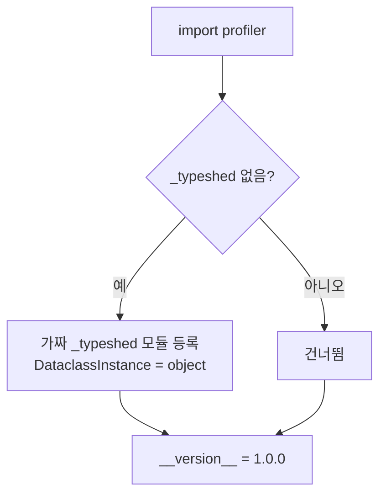

# `profiler/__init__.py` 분석

**프로파일러 패키지 초기화 + `_typeshed` shim**입니다. LLMServingSim용 layerwise
프로파일러의 진입 패키지이며, vLLM import 경로가 참조하는 `_typeshed` 스텁 모듈을
가짜로 등록하여 import 실패를 막습니다.

## 개요

| 항목 | 내용 |
| --- | --- |
| 역할 | 패키지 docstring(모듈 맵) + `_typeshed` shim 설치 |
| 실행 시점 | 어떤 것보다 먼저 실행(호스트 + 모든 vLLM 워커 프로세스) |
| 산출 | `perf/<hw>/<model>/<variant>/tp<N>/` CSV(시뮬레이터가 직접 소비) |

## 블록 다이어그램

## 참고

- vLLM은 런타임에 `_typeshed.DataclassInstance`를 참조하는데, `_typeshed`는
  타이핑 전용 스텁이라 실제 모듈이 없어 import가 실패합니다. 이 shim이 vLLM이
  건드리는 최소 속성만 담은 가짜 모듈을 등록합니다.
- `profiler/__init__.py`에 두어 호스트(`spin_up()`이 `vllm.LLM` 생성 전)와 워커
  프로세스(`worker_extension_cls` 로드 전) 양쪽을 자동으로 커버합니다.
- 모듈 맵: `__main__`(CLI), `core/`(runner/config/engine/categories/skew/fit/writer/
  logger/hooks), `models/`(아키텍처 yaml), `perf/`(출력 루트).
