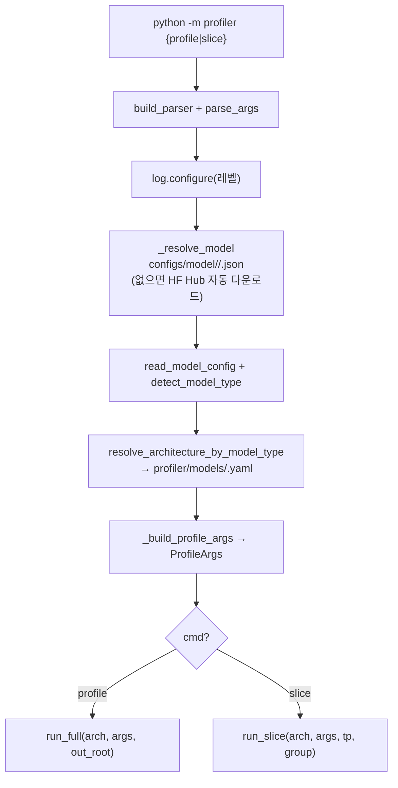

# `profiler/__main__.py` 분석

**프로파일러 CLI 진입점**입니다(`python -m profiler ...`). 모델을 해석하고
아키텍처 yaml을 찾고 `ProfileArgs`를 구성하여 `profile`(전체 스윕) 또는
`slice`(단일 tp×카테고리 갱신) 서브커맨드로 디스패치합니다.

## 개요

| 항목 | 내용 |
| --- | --- |
| 역할 | CLI 파싱 + 모델/아키텍처 해석 → runner 디스패치 |
| 서브커맨드 | `profile <model>`(전체), `slice <model> --tp-refresh N --group G`(부분) |
| 모델 해석 | `configs/model/<model>.json` → model_type → `profiler/models/<model_type>.yaml` |

## 블록 다이어그램

## 주요 구성 요소

| 요소 | 역할 |
| --- | --- |
| `build_parser` | `profile`/`slice` 서브파서 + 공통 플래그 구성 |
| `_add_common_flags` | hardware/tp/variant/dtype/attention grid/skew factor/force 등 공통 인자 |
| `_resolve_model` | HF-style id 또는 명시적 .json 경로 해석(로컬 없으면 Hub fetch) |
| `_fetch_hf_config` | HF Hub에서 `config.json` 다운로드·캐시(HF_TOKEN 인식) |
| `_parse_tp` | `"1,2,4"` → TP 리스트(반드시 1 포함) |
| `_build_profile_args` | argparse 네임스페이스 → `ProfileArgs` |
| `_resolve_log_level` | `--silent`/`--verbose`/`--log-level` 해석 |
| `main` | 전체 오케스트레이션 및 서브커맨드 디스패치 |

## Verbosity

- 기본 `INFO`(TP 한계·단계 타이밍·카테고리 진행), `--silent`→WARNING,
  `--verbose`→DEBUG + vLLM stdout, `--log-level`로 명시 override.

## 참고

- `<model>`은 `vllm.LLM(model=...)`에 그대로 전달됩니다(HF id; vLLM이 tokenizer 등
  보조 파일을 Hub에서 다운로드).
- 모델 전체 config는 spin-up 시 tmpdir에 기록되어 vLLM이 Hub 왕복 없이 로드합니다.
