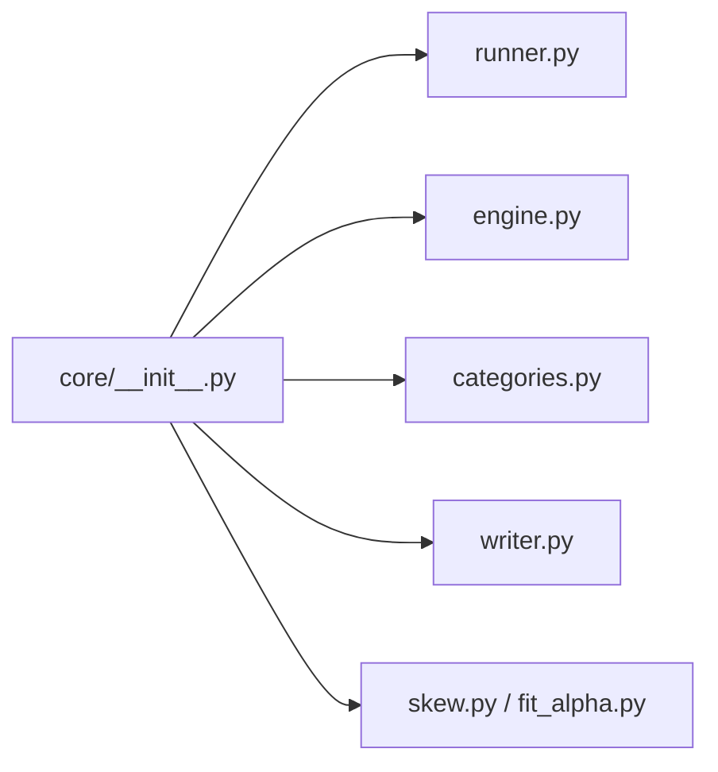

# `profiler/core/__init__.py` 분석

**프로파일러 내부 서브패키지 마커**입니다. runner·engine lifecycle·categories·
writer·skew/fit 등 프로파일러 내부 구현을 담는 패키지의 초기화 파일입니다.

## 개요

| 항목 | 내용 |
| --- | --- |
| 역할 | `profiler.core` 서브패키지 선언(docstring만) |
| 내용 | 실행 코드 없음 |

## 블록 다이어그램

## 참고

- 코드 없이 docstring만 있어 서브패키지 임포트를 가능하게 하는 표준 파일입니다.
