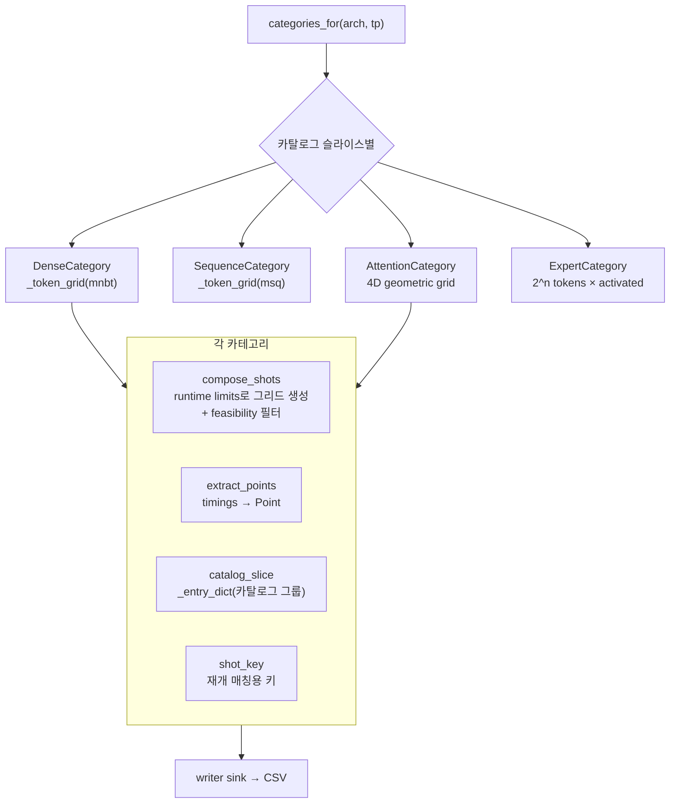

# `profiler/core/categories.py` 분석

**프로파일 카테고리 정의**입니다. 각 카테고리는 (1) 스윕 shot 생성
(`compose_shots`), (2) 원시 레이어 타이밍 → CSV Point 변환(`extract_points`),
(3) 카탈로그 슬라이스 선택(`catalog_slice`)을 담당합니다.

## 개요

| 항목 | 내용 |
| --- | --- |
| 역할 | 카테고리별 스윕 그리드 생성 + 타이밍 → Point 변환 |
| 기반 클래스 | `Category`(ABC) |
| 구체 카테고리 | Dense, Sequence, Attention(4D), Expert(MoE) |
| Point 타입 | `DensePoint`/`SequencePoint`/`AttentionPoint`/`ExpertPoint` |

## 블록 다이어그램

## 주요 구성 요소

| 요소 | 역할 |
| --- | --- |
| `Category`(ABC) | `compose_shots`/`extract_points`/`catalog_slice`/`shot_key` 인터페이스 |
| `DenseCategory` | 토큰 선형 레이어(embedding/qkv_proj/MLP/layernorm), `tokens` 키 |
| `SequenceCategory` | 시퀀스 선형 레이어(lm_head/sampler), `sequences` 키 |
| `AttentionCategory` | prefill+decode+mixed 통합 4D 그리드(`pc, kp, n_dec, kv_dec`) |
| `ExpertCategory` | MoE 블록, `(tokens, activated_experts)` 키(tp=1만) |
| `_token_grid` | 저역 촘촘·고역 성긴 토큰 그리드(1~15 전수, 16~63 step4, 64~ step16) |
| `_geometric_grid` | `[0, start, start*f, ...]` 기하 그리드(0=축 부재 sentinel) |
| `categories_for` | (arch, tp)에 실행할 카테고리 선택(빈 슬라이스·MoE tp≠1·tp_stable 제외) |
| `CATEGORY_BY_NAME` | `slice` 서브커맨드용 이름→클래스 맵 |

## Attention feasibility 필터

- **합 상한(advisory)**: `chunk + n_dec ≤ MNBT + MSQ`.
- **요청 수 하드캡**: `n_reqs ≤ max_num_seqs`(vLLM V1 input_batch 버퍼 경계).
- **시퀀스 길이**: `chunk+kv_p+1 ≤ max_model_len`, decode도 `1+kv_d+1 ≤ max_model_len`.
- **KV 블록 예산**: 블록 정렬(`_aligned`) 합이 `num_cache_tokens` 이하.
- decode는 정의상 이전 history가 있어야 하므로 `n_dec>0 & kv_d==0`는 제외.

## 참고

- `catalog_slice`는 host↔worker RPC 경계를 넘으므로 pydantic이 아닌 plain dict를
  반환합니다(`_entry_dict`).
- MoE 파라미터(`num_experts`/`top_k`)는 yaml이 아닌 live HF config(`RuntimeLimits`)에서
  옵니다.
