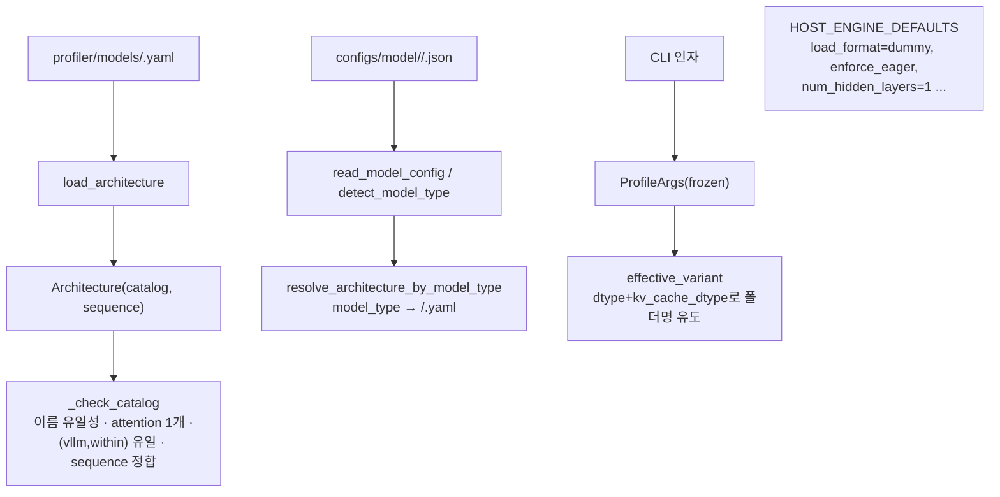

# `profiler/core/config.py` 분석

**아키텍처 스펙 로더 + 프로파일 세션 인자**입니다. 매 실행마다 정적 아키텍처
카탈로그(`Architecture`)와 세션별 설정(`ProfileArgs`) 두 상태를 결합합니다.

## 개요

| 항목 | 내용 |
| --- | --- |
| 역할 | 아키텍처 yaml 로드·검증 + 세션 인자 + vLLM 엔진 기본값 |
| 클래스 | `Architecture`/`Catalog`/`LayerEntry`/`Sequence`(pydantic), `ProfileArgs`(dataclass) |
| 검증 | canonical 이름 유일성, attention 정확히 1개, sequence 이름 정합성 |
| 상수 | `SHARD_FIELDS`, `HOST_ENGINE_DEFAULTS`, MoE 키 변형 |

## 블록 다이어그램

## 주요 구성 요소

| 요소 | 역할 |
| --- | --- |
| `LayerEntry` | 카탈로그 한 행: canonical 이름 → vLLM 클래스(`vllm`, `within`, `tp_stable`) |
| `Catalog` | dense/per_sequence/attention/moe 4그룹 카탈로그, `all_entries` 평탄화 |
| `Sequence` | 시뮬레이터 trace_generator가 순회하는 파이프라인(prologue/pre_attn/... /head) |
| `Architecture` | 카탈로그+시퀀스, `_check_catalog` 검증, `has_moe`/`has_tp_dependent_work` |
| `load_architecture` / `architecture_hash` | yaml 파싱, provenance용 SHA-256 |
| `detect_model_type` / `read_model_config` | config.json에서 model_type 추출·전체 로드 |
| `resolve_architecture_by_model_type` | model_type → 아키텍처 yaml 경로 |
| `probe_moe_params` | HF config에서 `(num_experts, top_k)` 추출(모델 계열별 키 변형 탐색) |
| `ProfileArgs` | 세션 설정(model/hardware/tp/dtype/attention grid/skew factor/force) |
| `effective_variant` | variant 폴더명 유도(dtype + kv_cache_dtype short form) |

## 상수

- **`SHARD_FIELDS`**: TP로 나눠 단일 랭크를 에뮬레이트할 HF config 필드
  (`intermediate_size`, `num_attention_heads`, `num_key_value_heads`, `vocab_size`).
- **`HOST_ENGINE_DEFAULTS`**: 프로파일링 핵심 vLLM 기본값(`load_format=dummy`,
  `enforce_eager=True`, `enable_prefix_caching=False`, `num_hidden_layers=1` 등).

## 참고

- `LayerEntry`/`Catalog` 등은 `extra="forbid"`로 yaml 오타를 조기에 잡습니다.
- 단일 decoder 레이어(`num_hidden_layers=1`)만 프로파일하여 블록당 비용을 저렴하게
  포착합니다.
