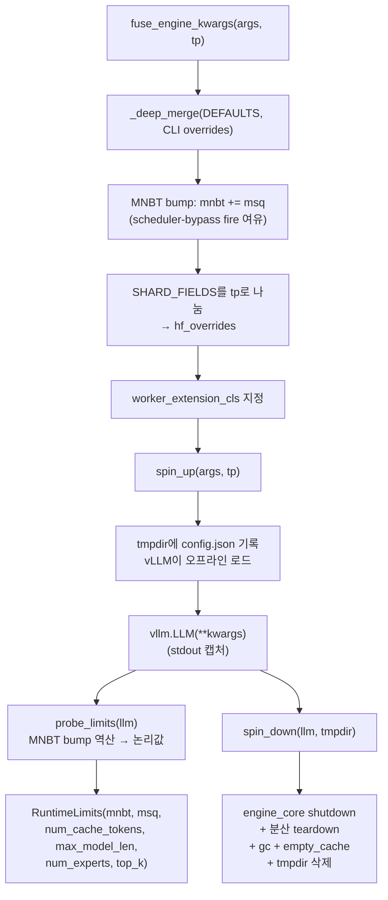

# `profiler/core/engine.py` 분석

**vLLM 엔진 lifecycle 관리**입니다. 프로파일러 기본값과 CLI 인자를 병합하고, TP
차수에 맞게 모델 config를 축소(hf_overrides)하며, 엔진을 띄우고 런타임 한계를
읽어오고 깨끗이 정리합니다. 순수 호스트 오케스트레이션(CUDA/vLLM 내부 없음).

## 개요

| 항목 | 내용 |
| --- | --- |
| 역할 | engine kwargs 융합 + spin_up/probe_limits/spin_down |
| TP 에뮬레이션 | 항상 단일 GPU(`tp=1`), `SHARD_FIELDS`를 TP로 나눠 per-rank shape 재현 |
| 데이터 | `RuntimeLimits`(엔진이 실제 수용한 shape) |

## 블록 다이어그램

## 주요 구성 요소

| 요소 | 역할 |
| --- | --- |
| `RuntimeLimits` | 엔진이 실제 수용한 shape 스냅샷(그리드 상한에 사용) |
| `_deep_merge` | dict 재귀 병합(override 우선) |
| `_profile_engine_overrides` | CLI의 non-None 엔진 필드만 추출 |
| `fuse_engine_kwargs` | 최종 `vllm.LLM()` kwargs 구성(defaults→CLI→TP shard) |
| `spin_up` | tmpdir에 config.json 기록 후 엔진 생성 → `(llm, kwargs, tmpdir)` |
| `probe_limits` | 엔진의 실제 shape 읽기, MNBT bump 역산 |
| `spin_down` | 엔진 종료 + 분산 teardown + CUDA 캐시 정리 + tmpdir 삭제 |

## 핵심 설계

- **단일 GPU TP 에뮬레이션**: `tensor_parallel_size=1`을 유지하고 `SHARD_FIELDS`를
  TP로 나눠 `hf_overrides`에 넣어, 실제 `tp=N` 배포의 한 랭크가 볼 kernel shape를
  재현합니다. collective 타이밍은 ASTRA-Sim이 해석적으로 처리.
- **MNBT bump**: 엔진을 `mnbt + msq`로 부팅해 attention/skew grid의 경계 shot이
  `MNBT + MSQ`까지 제출돼도 input_batch 버퍼를 넘지 않게 하고, `probe_limits`가
  이를 역산해 논리값을 복원합니다.

## 참고

- vLLM v1은 `EngineCore`를 서브프로세스로 돌려 GPU 메모리를 독립 보유하므로,
  `spin_down`은 여러 종료 훅·분산 teardown·2회 gc/empty_cache로 TP 간 메모리를
  확실히 해제합니다.
- 모델 전체 config를 tmpdir에 기록해 HF Hub 접근 없이 커스텀 shape 프로파일이
  파일 편집만으로 가능합니다.
