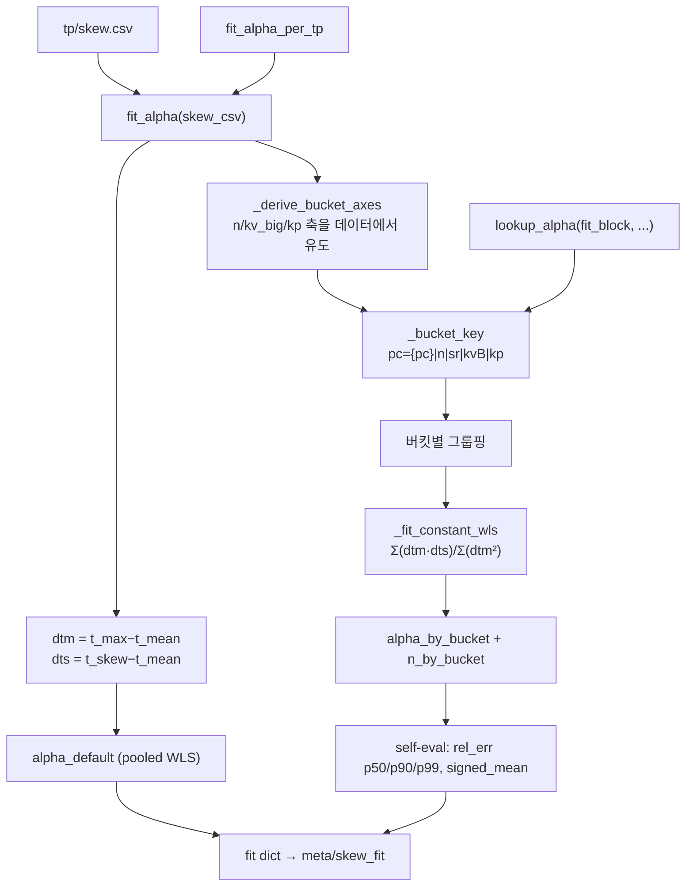

# `profiler/core/fit_alpha.py` 분석

**`skew.csv`로부터 버킷별 alpha를 fit**하는 모듈입니다. 5축(pc, n, skew_rate,
kv_big, kp) 버킷마다 가중 최소자승(WLS)으로 alpha를 구하고, 버킷 축을 데이터에서
유도하여 프로파일 스윕이 넓어지면 자동으로 해상도가 올라가게 합니다.

## 개요

| 항목 | 내용 |
| --- | --- |
| 역할 | skew.csv → 버킷별 alpha 테이블 + pooled 기본값 |
| 축 | pc(raw), n(값당 버킷), skew_rate(고정), kv_big(log-4x), kp(값당 버킷) |
| fit | 버킷 내 `alpha = Σ(dtm·dts)/Σ(dtm²)` (WLS 닫힌 형식) |
| 진입점 | `fit_alpha`(단일 TP), `fit_alpha_per_tp`(전 TP), `lookup_alpha`(조회) |

## 블록 다이어그램

## 주요 구성 요소

| 요소 | 역할 |
| --- | --- |
| `fit_alpha` | 단일 TP skew.csv → 버킷 fit dict(method/n_samples/alpha_default/축/테이블/오차) |
| `fit_alpha_per_tp` | 모든 `tp{N}/skew.csv` fit → `per_tp` 맵 |
| `lookup_alpha` | fit_block에서 특정 배치의 alpha 해석(시뮬레이터 재사용용) |
| `_derive_bucket_axes` | n/kv_big/kp 축을 데이터에서 유도(skew_rate는 고정) |
| `_derive_n_axis` / `_derive_kp_axis` | 프로파일된 값당 1버킷 + overflow |
| `_derive_kv_big_axis` | log-4x doubling(1k,4k,16k,...)로 셀 수 관리 |
| `_bucket_key` | 5축 문자열 키 `pc={pc}|{n_label}|{sr_label}|{kvB_label}|{kp_label}` |
| `_fit_constant_wls` | 버킷 내 WLS 스칼라 alpha 닫힌 형식 |
| `_bucket_label` | `(bins[i], bins[i+1]]` 우측 포함 버킷 조회 |

## 5축 선택 근거

- axis ablation(5-fold CV): 5축(pc, n_bin, kv_big_bin, skew_rate_bin, kp_bin)이
  test p50/p90 ≈ 2.7%/14.8%로 이전 α=0(4.1%/17.9%)·4축(2.9%/16.1%)보다 우수.
- 각 축의 의미: (pc, n)=계산 shape regime, skew_rate=skew 분포, kv_big=outlier의
  tile padding/SM 불균형 확장, kp=prefill KV와 decode skew의 상호작용.

## 데이터 기반 축

- `n`/`kp`는 프로파일된 값당 1버킷(+overflow), `kv_big`은 연속적으로 변해 log-4x
  bin, `skew_rate`는 정규화 [0,1]이라 고정 bin.
- 유도된 축은 `meta.yaml::skew_fit.bucket_axes`에 기록되어 시뮬레이터가 읽으므로,
  스윕을 넓혀도 코드 변경 없이 해상도가 올라갑니다.

## 참고

- `skew_rate = (kv_mean − kv_min)/(kv_max − kv_min)`이며 bimodal 케이스에선 `nb/n`과
  정확히 일치합니다.
- WLS는 신호가 약한(작은 dtm) 점의 가중치를 자연스럽게 낮추고 신호가 강한 점을
  높입니다.
