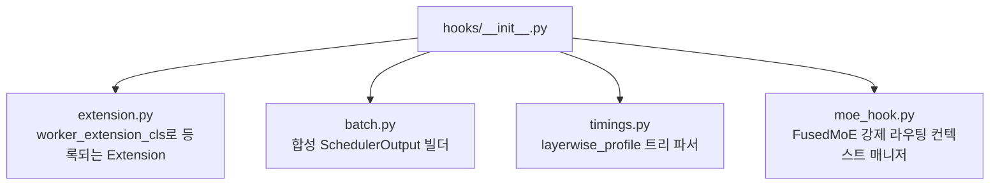

# `profiler/core/hooks/__init__.py` 분석

**vLLM 내부 API 통합 계층 마커**입니다. 이 서브패키지의 모든 모듈은 vLLM의
**내부**(비공개) API에 결합됩니다. vLLM 업그레이드로 프로파일러가 깨지면 수정은
거의 항상 이곳에 있습니다.

## 개요

| 항목 | 내용 |
| --- | --- |
| 역할 | vLLM 내부 API 터치포인트 서브패키지 선언 |
| 결합 대상 | `SchedulerOutput`, `FusedMoE.forward_native`, `model_runner`, `layerwise_profile` |

## 블록 다이어그램

## 참고

- 여기 모인 모듈들이 vLLM 비공개 표면과 격리되어 있어, 버전 호환성 문제를 한
  곳에서 관리할 수 있습니다.
