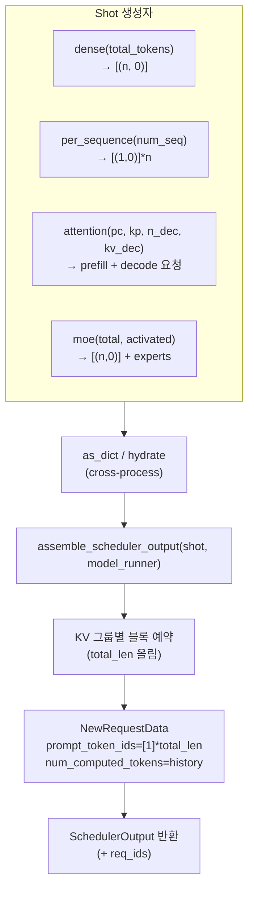

# `profiler/core/hooks/batch.py` 분석

**프로파일링 shot의 합성 배치 구성**입니다. `Shot`은 vLLM 워커에 넘기는 작업
단위(요청별 `(new_tokens, history)` 쌍 + 선택적 MoE 힌트)이며,
`assemble_scheduler_output`이 이를 vLLM 스케줄러를 우회해 완전한
`SchedulerOutput`으로 만들어 그리드가 요청한 정확한 shape를 보장합니다.

## 개요

| 항목 | 내용 |
| --- | --- |
| 역할 | Shot 정의 + 합성 SchedulerOutput 조립(스케줄러 우회) |
| 클래스 | `Shot`(dataclass) |
| 핵심 트릭 | `num_computed_tokens = history`로 "history 토큰 KV 프리로드됨" 위장 |
| 직렬화 | `as_dict`/`hydrate`(collective_rpc pickle 전송용) |

## 블록 다이어그램

## 주요 구성 요소

| 요소 | 역할 |
| --- | --- |
| `Shot` | 배치 최소 기술(`requests`, 선택적 `experts`) |
| `Shot.dense`/`per_sequence`/`attention`/`moe` | 카테고리별 편의 생성자 |
| `Shot.as_dict` / `Shot.hydrate` | 직렬화/역직렬화(RPC 전송) |
| `assemble_scheduler_output` | Shot → `SchedulerOutput`(블록 예약, 요청 데이터 구성) |

## 핵심 트릭

- `num_computed_tokens = history` + `prompt_token_ids = [1]*(new+history)`로 엔진에게
  "앞의 `history` 토큰은 계산됨, KV는 캐시에 있음"을 알립니다. 실제 prefill 없이
  임의의 `(prefill_chunk, kv_cache)` 어텐션 shape를 스윕할 수 있게 합니다.
- vLLM 스케줄러를 우회하여 그리드가 요청한 shape가 split/chunk/reorder되지
  않도록 보장합니다.

## 참고

- vLLM 내부 심볼(`NewRequestData`, `SchedulerOutput` 등)은 함수 내부에서 지연
  임포트하여 워커에 실제 설치된 vLLM 버전에서 로드합니다.
- 다중 KV-cache 그룹(cross-layer/hybrid 아키텍처)을 워커의 live block_table로 존중합니다.
