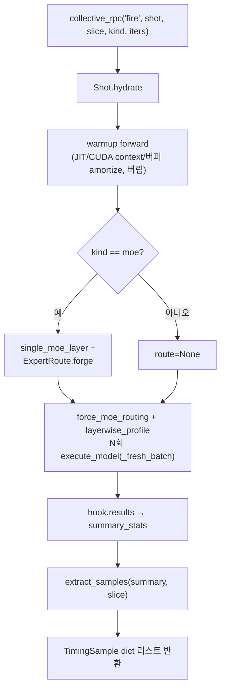

# `profiler/core/hooks/extension.py` 분석

**vLLM 워커 확장 클래스**입니다. `worker_extension_cls`로 등록되어 각 TP 랭크
워커 프로세스에 하나씩 인스턴스화되며, `llm.collective_rpc`로 메서드가 노출됩니다.
유일한 공개 메서드 `fire()`가 합성 배치를 `layerwise_profile` 하에 실행해
레이어별 CUDA 타이밍을 반환합니다.

## 개요

| 항목 | 내용 |
| --- | --- |
| 역할 | 워커 측 프로파일링 진입점(RPC로 호출) |
| 클래스 | `Extension`(vLLM이 `model_runner` 주입) |
| 측정 | warmup 1회(버림) + N회 timed forward(평균) |
| N | 기본 3(DVFS/boost jitter로 단일 샘플 15~25% 변동 완화) |

## 블록 다이어그램

## 주요 구성 요소

| 요소 | 역할 |
| --- | --- |
| `Extension.fire` | shot 실행 → 레이어별 타이밍 반환(warmup + N회 측정 평균) |
| `_fresh_batch`(내부) | 매 forward마다 SchedulerOutput 재구성(이전 KV/state 누출 방지) |

## 측정 프로토콜

1. **warmup 1회**: JIT 컴파일·CUDA context·paged 버퍼 할당 비용 amortize(결과 버림).
2. **N회 timed forward**: `layerwise_profile` 내에서 실행. hook이 `cuda_time_us`를
   invocation 수만큼 누적하고 `extract_samples`가 나눠 per-call 평균 반환.

## 참고

- `vllm.profiler.layerwise_profile`은 함수 내부에서 지연 임포트하여 패키지 임포트
  시점에 vLLM 프로파일러 가용성을 요구하지 않습니다.
- MoE는 `ExpertRoute.forge`로 강제 라우팅하여 `(tokens, activated_experts)` 그리드를
  깨끗이 커버합니다.
