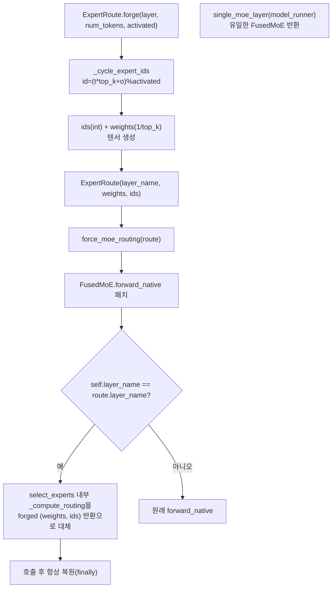

# `profiler/core/hooks/moe_hook.py` 분석

**MoE 강제 라우팅 훅**입니다. `(tokens, activated_experts)` 그리드를 깨끗이
프로파일하기 위해, 학습된(더미 가중치) gate 대신 어떤 expert가 토큰을 받을지를
직접 제어합니다. `FusedMoE.forward_native`를 컨텍스트 동안 monkey-patch합니다.

## 개요

| 항목 | 내용 |
| --- | --- |
| 역할 | MoE expert 활성화 수를 강제하여 그리드 커버리지 확보 |
| 클래스 | `ExpertRoute`(dataclass) |
| 패치 대상 | `FusedMoE.forward_native`, `router.select_experts`/`_compute_routing`(vLLM 내부 API) |
| 진입점 | `ExpertRoute.forge`, `force_moe_routing`(컨텍스트 매니저), `single_moe_layer` |

## 블록 다이어그램

## 주요 구성 요소

| 요소 | 역할 |
| --- | --- |
| `ExpertRoute` | 강제 라우팅 텐서(`layer_name`, `weights`, `ids`) |
| `ExpertRoute.forge` | 단일 FusedMoE용 `weights`/`ids` 할당(top_k ≤ activated ≤ tokens·top_k 검증) |
| `_cycle_expert_ids` | 정확히 `activated_experts`개 구별 id를 토큰 차원에 순환 배정 |
| `force_moe_routing` | `forward_native` 패치 컨텍스트(layer-scoped, 종료 시 복원) |
| `single_moe_layer` | 모델의 유일한 FusedMoE 레이어 반환(num_hidden_layers=1 전제) |

## 패치 세부

- **layer-scoped**: `layer_name`이 일치하는 FusedMoE만 영향, 다른 MoE는 정상 forward.
- **`_compute_routing` 대체**: `select_experts`의 정규화/검증은 유지하고 내부
  `_compute_routing`만 forged 값 반환으로 교체 후 `finally`로 복원.

## 참고

- 지연 = 활성 expert 수에만 의존하고 어떤 expert인지는 무관하므로 가장 단순한
  배정 패턴을 사용합니다.
- 패치 대상은 vLLM 내부 API라 버전 업그레이드 시 심볼 재명명 대응이 필요할 수
  있습니다.
