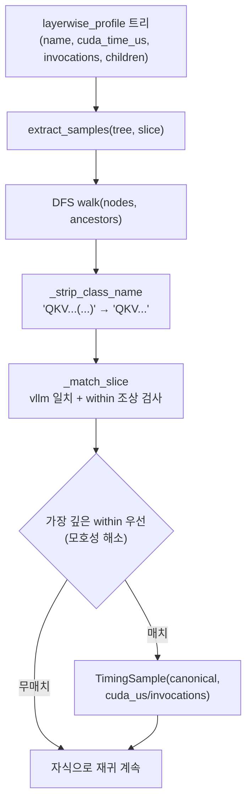

# `profiler/core/hooks/timings.py` 분석

**vLLM layerwise-profile 트리에서 canonical 레이어 타이밍 추출**입니다. vLLM의
`layerwise_profile()`이 반환하는 nn.Module 호출별 중첩 트리를 DFS로 순회하며,
클래스 이름을 카탈로그 슬라이스와 매칭해 `TimingSample`(레이어명, per-call us)을
생성합니다.

## 개요

| 항목 | 내용 |
| --- | --- |
| 역할 | 프로파일 트리 → canonical 레이어별 per-call 타이밍 |
| 클래스 | `TimingSample`(dataclass) |
| 진입점 | `extract_samples(tree, slice_)` |
| 매칭 | `node_class == entry.vllm` AND (`within` None 또는 조상에 존재) |

## 블록 다이어그램

## 주요 구성 요소

| 요소 | 역할 |
| --- | --- |
| `TimingSample` | 레이어 CUDA 타이밍(`layer`, `microseconds`=per-call) |
| `_strip_class_name` | `ClassName(repr)` → `ClassName` |
| `_match_slice` | 노드 클래스+조상을 카탈로그 슬라이스와 매칭(가장 깊은 within 우선) |
| `extract_samples` | 트리 DFS 순회, 매칭 노드마다 샘플 생성 |

## 매칭 규칙

- 카탈로그 항목이 노드에 매칭하려면 `node_class == entry.vllm`이고
  `entry.within`이 None이거나 조상 클래스 중 하나여야 합니다.
- **모호성 해소**: 여러 항목이 매칭하면 `within`이 조상 체인에서 **가장 깊은** 것이
  승리. 예: Qwen3의 두 RMSNorm(DecoderLayer 내 layernorm vs Attention 내 qk_norm)을
  YAML 순서와 무관하게 안쪽 매칭이 바깥 항목에 흡수되지 않게 구분.

## 참고

- `microseconds`는 이미 invocation 수로 나뉜 per-call 비용입니다.
- 매칭 후에도 항상 자식으로 재귀합니다(부모 클래스로 정의된 항목의 실제 kernel
  시간이 leaf에 있을 수 있음).
