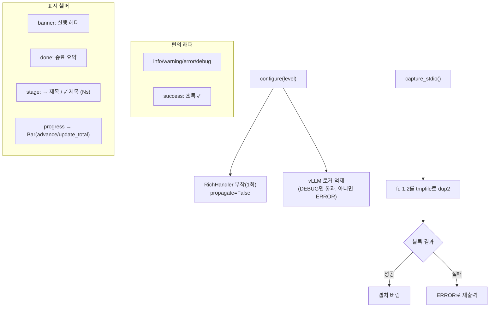

# `profiler/core/logger.py` 분석

**프로파일러 로거 + 진행 UI**입니다. 모든 사용자 대면 출력이 이 모듈을 거칩니다.
verbosity 제어, 컬러 출력, vLLM의 시끄러운 stdout/stderr 캡처, 진행 바 렌더링을
한 곳에서 관리합니다. 관례상 `from profiler.core import logger as log`로 임포트합니다.

## 개요

| 항목 | 내용 |
| --- | --- |
| 역할 | 통합 로깅 + 진행 바 + vLLM stdio 캡처 |
| 기반 | 표준 `logging` + `rich`(vLLM 의존성 재사용) |
| 특징 | C-레벨 fd(1,2) 리다이렉트로 CUDA/torch C++ 출력까지 캡처 |
| 진입점 | `configure`, `capture_stdio`, `info/warning/...`, `banner`, `progress` |

## 블록 다이어그램

## 주요 구성 요소

| 요소 | 역할 |
| --- | --- |
| `configure` | 로거 초기화(멱등), RichHandler 부착, vLLM 로거 억제 |
| `capture_stdio` | C-레벨 stdout/stderr(fd 1,2)를 tmpfile로 캡처(DEBUG면 no-op) |
| `info`/`warning`/`error`/`debug`/`success` | 표준 레벨 래퍼(+초록 ✓) |
| `banner` / `done` | 실행 시작 헤더 / 종료 요약 |
| `stage` | 초 단위 단계 브래킷(→/✓/✗) |
| `progress` / `Bar` | Rich 진행 바(TTY 아니면 평문 폴백), `update_total`로 총량 정정 |

## 핵심 설계

- **C-레벨 캡처**: vLLM 엔진 부팅은 C++(pybind11/torch)·CUDA lib 초기화에서 출력하여
  `sys.stdout`을 우회하므로, fd 1/2를 tmpfile로 `dup2`해야 침묵시킬 수 있습니다.
  성공 시 버리고, 실패 시 ERROR로 재출력해 post-mortem을 돕습니다.
- **verbosity**: 표준 로그 레벨. DEBUG면 vLLM 출력·캡처를 모두 통과시킵니다.

## 참고

- 콘솔은 stdout으로 흘려 `> out.log` 하나로 로그를 캡처할 수 있습니다(CSV writer는
  자체 파일 I/O).
- Rich 자동 감지로 TTY는 컬러, 리다이렉트는 평문(`FORCE_COLOR=1`로 강제 가능).
