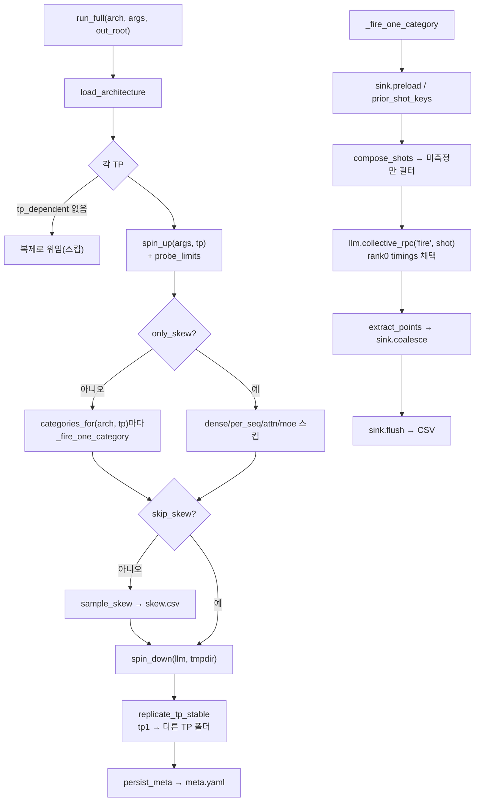

# `profiler/core/runner.py` 분석

**프로파일러 최상위 오케스트레이션**입니다. vLLM 엔진 부팅, 카탈로그 슬라이싱,
shot 발사, sink 병합, tp_stable 복제를 조율합니다. `run_full`(전체)과
`run_slice`(단일 tp×카테고리)이 대부분의 로직을 공유합니다.

## 개요

| 항목 | 내용 |
| --- | --- |
| 역할 | 엔진 lifecycle + 카테고리 shot 발사 + CSV 기록 조율 |
| 진입점 | `run_full`, `run_slice`(둘 다 `__main__.py`에서 호출) |
| 공유 | `_fire_one_category`(shot 발사 + 포인트 수집 + flush) |
| 재개 | `--force` 없으면 기존 CSV 프리로드 후 미측정 shot만 발사 |

## 블록 다이어그램

## 주요 구성 요소

| 요소 | 역할 |
| --- | --- |
| `run_full` | 아키텍처×모델의 모든 (tp, category) 프로파일 + skew + 복제 + meta |
| `run_slice` | 단일 (tp, group) 재프로파일(전체 재실행 없이) |
| `_fire_one_category` | 카테고리 shot 발사, 재개 필터, sink 병합·flush |
| `_variant_root` | `<out_root>/<hardware>/<model>/<variant>/` 경로 구성(HF org/model 레이아웃 보존) |

## 재개 동작

- `--force` 미지정 시 기존 CSV를 sink에 프리로드하고, 이미 측정된 shot 키는
  건너뜁니다. flush 시 보존 행 + 신규 측정 행을 함께 기록합니다.

## 참고

- `collective_rpc("fire", ...)`는 TP 랭크별 결과를 반환하나 타이밍은 랭크 간 동일하여
  rank0 것을 채택합니다.
- `tp_stable` 레이어(layernorm/sampler 등)는 tp1에서만 측정 후 다른 TP 폴더로
  복제됩니다(`replicate_tp_stable`).
- tp=1 slice 갱신은 이전 복제를 무효화할 수 있어 복제를 다시 수행합니다.
