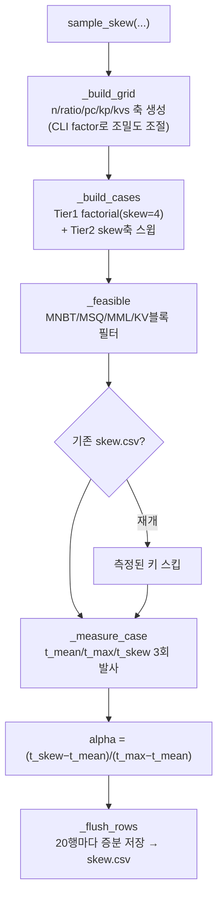

# `profiler/core/skew.py` 분석

**Skew 프로파일링**입니다. decode 배치의 kv 분포가 비균일할 때 FlashAttention
kernel 비용이 어떻게 변하는지 측정합니다. 각 skew 케이스마다 동일 지점에서 세
지연(`t_mean`, `t_max`, `t_skew`)을 재고 정규화 보간 계수 alpha를 유도합니다.

## 개요

| 항목 | 내용 |
| --- | --- |
| 역할 | 비균일 decode kv의 alpha 측정 → `skew.csv` |
| alpha | `(t_skew − t_mean) / (t_max − t_mean) ∈ [0, 1]` |
| 진입점 | `sample_skew(llm, arch, args, limits, tp, tp_root)` |
| 후속 | `fit_alpha`(버킷 fit) → `writer.persist_meta`(skew_fit.csv/meta) → 시뮬레이터 |

## 블록 다이어그램

## 주요 구성 요소

| 요소 | 역할 |
| --- | --- |
| `SkewCase` | 한 케이스(n/ratio/skew/pc/kp/kvs → nb/kv_big/kv_mean 유도) |
| `_build_grid` | CLI 상한·기하 factor로 축 값 생성(n/pc/kp/kvs) |
| `_doubling` | `start`~`max_val` 기하 그리드(factor로 조밀도 조절) |
| `_tier2_pivots` | skew축 스윕 앵커(pure/mixed, 극단/균형 ratio) |
| `_build_cases` | Tier1(factorial, skew=4) + Tier2(skew축) 케이스 합성·dedup |
| `_feasible` | attention 카테고리와 동일한 feasibility 필터 |
| `_measure_case` | mean/max/skew 3배치 측정 → alpha 계산 |
| `sample_skew` | 전체 오케스트레이션(재개/force, 증분 저장, regime별 요약) |

## 측정 구조

- **t_mean**: 모든 decode를 배치 평균 kv로 균일하게.
- **t_max**: 모든 decode를 배치 최대 kv로 균일하게.
- **t_skew**: 실제 bimodal 배치(`nb×kv_big + (n−nb)×kvs`).
- 시뮬레이터는 `t = t_mean(mean_kv) + alpha(shape)·(t_max(max_kv) − t_mean(mean_kv))`로
  예측합니다.

## Tier 구조

- **Tier 1**: 대표 skew(4.0)에서의 factorial. `_NB_ABSOLUTE=(1,2,3,4)`로 "소수 heavy
  outlier" 영역(alpha가 물리적으로 최대)을 모든 n에서 보장.
- **Tier 2**: 소수 앵커에서 skew축(`{1.5,2,4,8,16}`) 스윕 — skew≠4 데이터의 유일 출처.

## 참고

- 20행마다 증분 저장하여 크래시로 인한 데이터 손실을 방지합니다.
- 축 factor(`--skew-*-factor`)를 2.0보다 높이면 조밀도가 낮아져(빠름) 보간 간격이
  넓어지고, 낮추면 조밀해집니다.
