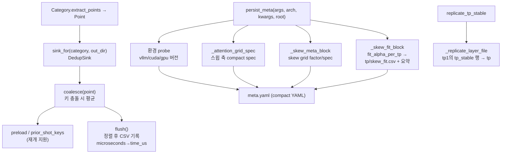

# `profiler/core/writer.py` 분석

**CSV + meta.yaml 기록**입니다. 카테고리가 생성한 모든 Point는 `DedupSink`(중복
측정을 평균하는 인메모리 누적기)를 거쳐 정렬된 결정적 CSV로 기록됩니다. 또한
per-variant `meta.yaml` 작성과 `tp_stable` 레이어 복제를 담당합니다.

## 개요

| 항목 | 내용 |
| --- | --- |
| 역할 | Point → CSV(중복 평균) + meta.yaml + tp_stable 복제 |
| 클래스 | `DedupSink`, `_CompactDumper` |
| 진입점 | `sink_for`, `persist_meta`, `replicate_tp_stable` |
| 스키마 | dataclass 필드명에서 CSV 컬럼 자동 유도 |

## 블록 다이어그램

## 주요 구성 요소

| 요소 | 역할 |
| --- | --- |
| `DedupSink` | Point 누적·중복 평균·정렬 CSV flush(재개용 preload 포함) |
| `sink_for` / `_KEY_FIELDS_BY_CATEGORY` | 카테고리별 스키마 sink 생성, 키 필드 매핑 |
| `persist_meta` | per-variant meta.yaml 작성(버전·GPU·engine·grid·skew) |
| `_skew_fit_block` | TP별 alpha fit → `skew_fit.csv` spill + 요약(bucket_axes 승격) |
| `_write_skew_fit_csv` | 버킷 키를 5개 컬럼으로 분해해 CSV 기록 |
| `_skew_meta_block` / `_attention_grid_spec` | 실제 사용된 grid factor·축을 compact spec으로 |
| `_geometric_spec` | 기하 수열을 `"<start>-<end> x<factor>"` 문자열로 압축 |
| `replicate_tp_stable` / `_replicate_layer_file` | tp1의 tp_stable 행을 다른 TP로 복제 |
| `_CompactDumper` | primitive 리스트를 flow style로 → meta.yaml 크기 축소 |

## DedupSink 규약

- **중복 키**: `microseconds`를 제외한 모든 필드가 키. 충돌 시 평균.
- **재개**: `preload`로 기존 CSV를 버킷에 시드, `prior_shot_keys`로 이미 측정된
  shot을 스킵.
- **flush**: 키 필드 사전순 정렬, `microseconds`→`time_us`, 6 sig figs.

## meta.yaml 크기 최적화

- 버킷 alpha 테이블(TP당 1k+ 행)은 `tp<N>/skew_fit.csv`로 spill하고, meta에는
  요약(method/n_samples/alpha_default/오차/포인터)만 남깁니다.
- `bucket_axes`는 모든 TP가 일치하면 블록 최상위로 승격(중복 제거).

## 참고

- attention/MoE는 kernel 비용이 TP에 실제 의존해 tp_stable로 표시되지 않으므로,
  복제는 dense/per_sequence에만 적용됩니다.
- `engine_effective`의 MNBT는 bump 역산하여 논리값을 기록합니다.
