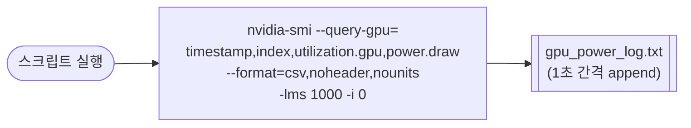

# `profiler/power/profile_gpu_power.sh` 분석

`nvidia-smi`로 **GPU 전력 소비를 로깅**하는 한 줄짜리 헬퍼입니다. 전력 모델
캘리브레이션을 위한 측정 데이터를 수집합니다.

## 개요

| 항목 | 내용 |
| --- | --- |
| 목적 | GPU 전력/사용률을 1초 간격으로 CSV 로깅 |
| 도구 | `nvidia-smi --query-gpu` |
| 대상 GPU | 인덱스 0 (`-i 0`) |
| 출력 | `gpu_power_log.txt` |

## 블록 다이어그램

## 분석

- `--query-gpu=timestamp,index,utilization.gpu,power.draw` — 타임스탬프, GPU 인덱스,
  사용률(%), 전력(W)을 조회합니다.
- `--format=csv,noheader,nounits` — 헤더/단위 없는 CSV 형식으로 파싱하기 쉽게 출력합니다.
- `-lms 1000` — 1000ms(1초) 간격으로 반복 측정합니다.
- `-i 0` — GPU 0만 대상으로 합니다.
- `> gpu_power_log.txt` — 결과를 파일로 리다이렉트합니다.

## 참고

- 프로파일 대상 워크로드와 **병렬로** 실행하여 전력 타임라인을 캡처합니다(중지는
  `Ctrl-C`).
- 결과는 LLMServingSim 전력 모델의 참조 데이터로 사용됩니다. 시스템 전체 전력은
  `profile_server_power.sh`(IPMI)를 함께 사용하세요.
