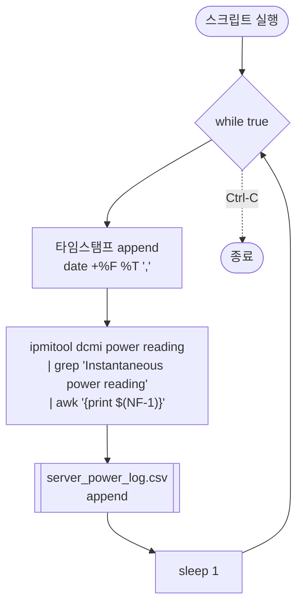

# `profiler/power/profile_server_power.sh` 분석

`ipmitool`로 **서버(시스템) 전체 전력을 로깅**하는 헬퍼입니다. GPU 전력만 재는
`profile_gpu_power.sh`와 짝을 이루어 노드 수준 전력을 측정합니다.

## 개요

| 항목 | 내용 |
| --- | --- |
| 목적 | 시스템 수준 순간 전력을 1초 간격으로 CSV 로깅 |
| 도구 | `ipmitool dcmi power reading` |
| 출력 | `server_power_log.csv` (타임스탬프, 전력값) |
| 구조 | 무한 루프(`while true`) |

## 블록 다이어그램

## 단계별 분석

1. **무한 루프** — `while true`로 계속 반복하며, 사용자가 `Ctrl-C`로 중지할 때까지
   실행됩니다.
2. **타임스탬프 기록** — `date +"%F %T"`(예: `2026-07-16 12:34:56`)와 콤마를
   개행 없이(`echo -n`) CSV에 append합니다.
3. **전력 판독** — `ipmitool dcmi power reading` 출력에서 "Instantaneous power
   reading" 라인을 `grep`으로 찾고, `awk '{print $(NF-1)}'`로 끝에서 두 번째
   필드(전력값, 단위 Watts 앞의 숫자)를 추출해 같은 줄에 append합니다.
4. **1초 대기** — `sleep 1` 후 루프를 반복합니다.

## 참고

- IPMI 접근 권한(BMC)이 필요하며 보통 root/sudo로 실행합니다.
- 프로파일 대상 워크로드와 병렬 실행하여 노드 전력 타임라인을 확보합니다.
- GPU 전력(`profile_gpu_power.sh`)과 합쳐 전력 모델의 base/NPU 소비를 분리 추정합니다.
