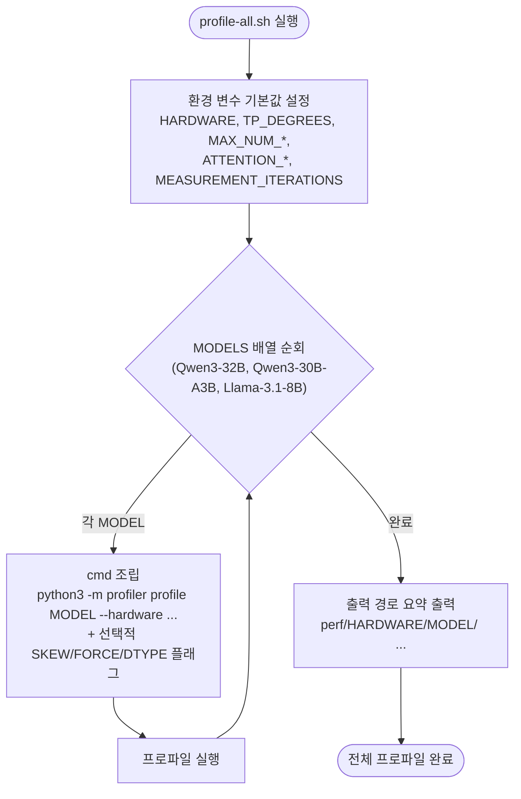

# `profiler/profile-all.sh` 분석

**여러 모델을 한 번에 프로파일**하는 배치 스윕 스크립트입니다. 미리 정해진 모델
목록을 TP=1, TP=2로 순회하며 `profile.sh`와 동일한 프로파일러를 반복 호출합니다.
`profile.sh`가 파일 편집형인 반면, 이 스크립트는 **환경 변수**로 제어합니다.

## 개요

| 항목 | 내용 |
| --- | --- |
| 목적 | 새 GPU 타깃을 여러 모델에 대해 한 번에 준비 |
| 실행 위치 | vLLM Docker 컨테이너 내부(`/workspace`) |
| 모델 목록 | Qwen3-32B, Qwen3-30B-A3B-Instruct-2507, Llama-3.1-8B |
| 제어 방식 | 환경 변수(`${VAR:-기본값}`) |

## 블록 다이어그램

## 단계별 분석

1. **환경 변수 기본값** — `HARDWARE="${HARDWARE:-RTXPRO6000}"` 형태로, 인라인
   오버라이드가 없으면 기본값을 사용합니다. `profile.sh`와 동일한 노브를 모두
   환경 변수로 노출합니다.
2. **모델 목록 정의** — `MODELS=( ... )` 배열에 프로파일할 모델을 나열합니다. 목록
   변경은 이 배열을 편집합니다.
3. **루프 실행** — 각 모델에 대해 `cmd` 배열을 조립하고, 필수 플래그(TP,
   max-num-*, attention-*)는 항상 추가하며, 선택 플래그(SKEW_*, FORCE, DTYPE,
   VARIANT, VERBOSITY)는 설정 시에만 조건부로 추가합니다.
4. **요약 출력** — 모든 프로파일 완료 후 각 모델의 출력 경로를 요약합니다.

## 참고

- 인라인 오버라이드 예: `HARDWARE=H100 TP_DEGREES=1,2,4 ./profiler/profile-all.sh`.
- 단일 모델은 `profile.sh`를 사용하세요.
- 전체 스윕은 보통 1~4시간 소요됩니다. `SKIP_SKEW=1`로 대폭 단축할 수 있습니다.
