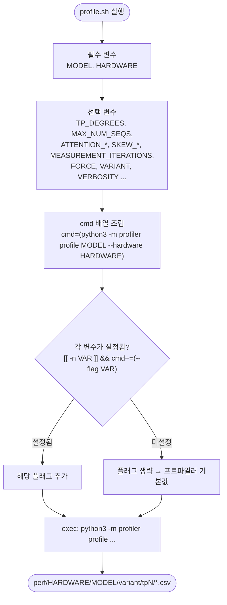

# `profiler/profile.sh` 분석

**단일 모델 프로파일 실행 스크립트**입니다. 상단의 변수를 직접 편집한 뒤 실행하도록
설계된 템플릿으로, 설정된 변수만 골라 `python -m profiler profile` 명령을 동적으로
조립해 호출합니다.

## 개요

| 항목 | 내용 |
| --- | --- |
| 목적 | 하나의 `(모델, 하드웨어)` 조합을 프로파일하여 perf CSV 번들 생성 |
| 실행 위치 | vLLM Docker 컨테이너 내부(`/workspace`) |
| 편집 방식 | 파일 상단 변수를 직접 수정(REQUIRED / OPTIONAL 구역) |
| 아키텍처 선택 | 모델 config의 `model_type`으로 자동 해석(직접 지정 불필요) |
| 핵심 패턴 | 설정된 변수만 CLI 플래그로 조건부 추가 |

## 블록 다이어그램

## 주요 변수

### 필수
| 변수 | 의미 |
| --- | --- |
| `MODEL` | HF 스타일 모델 id. `configs/model/<MODEL>.json`에 config 필요 |
| `HARDWARE` | `perf/` 아래 출력 폴더 이름이 되는 자유 형식 라벨 |

### 선택 (스윕 형태)
| 변수 | 기본값 | 의미 |
| --- | --- | --- |
| `TP_DEGREES` | `1,2` | 프로파일할 TP 차수(반드시 1 포함) |
| `MAX_NUM_BATCHED_TOKENS` / `MAX_NUM_SEQS` | 2048 / 256 | vLLM 엔진 kwargs |
| `ATTENTION_MAX_KV` | 16384 | kv 축 상한 |
| `ATTENTION_CHUNK_FACTOR` / `ATTENTION_KV_FACTOR` | 2.0 | 어텐션 그리드 기하 계수 |
| `MEASUREMENT_ITERATIONS` | 3 | shot당 측정 횟수(DVFS 지터 완화) |
| `SKEW_{N,PC,KP,KVS}_FACTOR` | 2.0 | skew 스윕 축별 밀도 계수 |
| `SKIP_SKEW` / `ONLY_SKEW` / `FORCE` / `VARIANT` / `VERBOSITY` | (미설정) | 모드/출력 제어 |

## 단계별 분석

1. **변수 정의** — REQUIRED 구역에서 `MODEL`/`HARDWARE`를 설정하고, OPTIONAL 구역에서
   나머지를 필요 시 주석 해제·조정합니다.
2. **명령 조립** — `cmd=(python3 -m profiler profile "$MODEL" --hardware "$HARDWARE")`로
   시작하여, `[[ -n "${VAR:-}" ]] && cmd+=(--flag "$VAR")` 패턴으로 **설정된 변수만**
   플래그로 추가합니다. 미설정 변수는 생략되어 프로파일러 내장 기본값이 적용됩니다.
3. **실행** — `"${cmd[@]}"`로 조립된 명령을 실행합니다.

## 참고

- `set -euo pipefail`과 `${VAR:-}` 패턴으로 미정의 변수를 안전하게 처리합니다.
- 기본값은 **resume**(기존 CSV 재사용)이며, `FORCE=1`로 처음부터 재프로파일합니다.
- 첫 실행은 `SKIP_SKEW=1`로 균일 그리드만 빠르게 뽑은 뒤 skew를 추가하는 것이
  권장됩니다.
