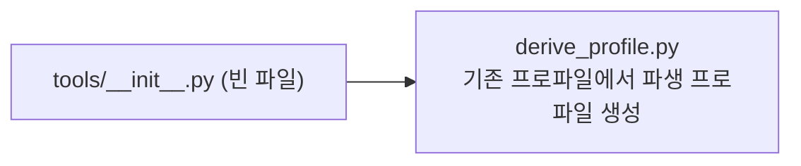

# `profiler/tools/__init__.py` 분석

**`profiler.tools` 서브패키지 마커**입니다. 파일 내용이 비어 있으며(빈
`__init__.py`), 프로파일러 보조 도구(`derive_profile.py` 등)를 담는 패키지임을
선언하는 역할만 합니다.

## 개요

| 항목 | 내용 |
| --- | --- |
| 역할 | `profiler.tools` 패키지 선언(빈 파일) |
| 내용 | 코드/docstring 없음 |

## 블록 다이어그램

## 참고

- 빈 `__init__.py`는 해당 디렉터리를 임포트 가능한 패키지로 만드는 표준 관용입니다.
