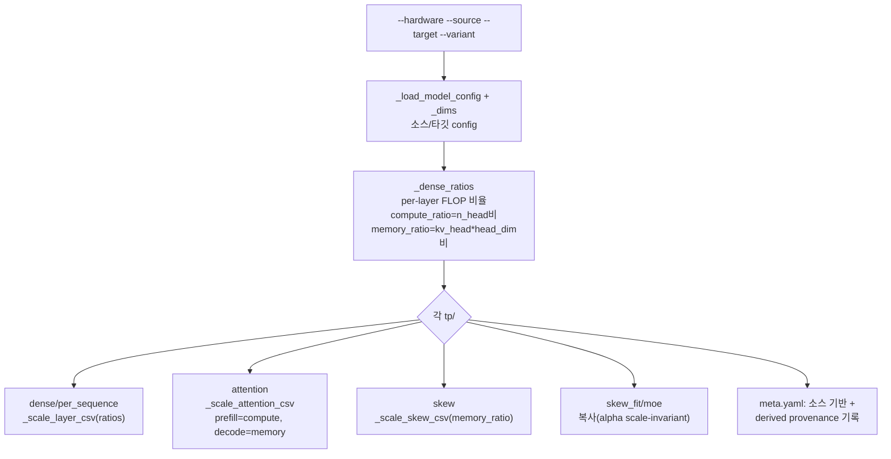

# `profiler/tools/derive_profile.py` 분석

**측정된 모델로부터 타깃 모델의 근사 프로파일 유도**입니다. 실제 프로파일이 없을
때(예: 부팅할 만큼 큰 GPU 없음), 측정된 소스 모델 프로파일을 해석적 per-layer
compute/memory 모델로 스케일하여 *derived* 프로파일을 합성합니다.

## 개요

| 항목 | 내용 |
| --- | --- |
| 역할 | 소스 프로파일 → 타깃 프로파일(FLOP/byte 스케일링) |
| 실행 | `python -m profiler.tools.derive_profile --source ... --target ...` |
| 주의 | 실제 프로파일 대체 아님(launch overhead/tensor-core tiling 무시) |
| provenance | 생성된 `meta.yaml`의 `derived:`에 기록 |

## 블록 다이어그램

## 주요 구성 요소

| 요소 | 역할 |
| --- | --- |
| `_dims` | config에서 hidden/inter/q_dim/kv_dim/n_head/kv_head/head_dim/vocab 유도 |
| `_dense_ratios` | dense/per_sequence 레이어별 per-token FLOP 비율(target/source) |
| `_scale_layer_csv` | dense/per_sequence CSV의 `time_us`를 레이어별 비율로 스케일 |
| `_scale_attention_csv` | prefill 행은 compute_ratio, decode 행은 memory_ratio로 스케일 |
| `_scale_skew_csv` | skew의 t_*_us를 memory_ratio로 스케일(alpha는 불변) |
| `main` | 전체 파이프라인 + derived meta.yaml 작성 |

## 스케일링 규칙

- **dense**: per-layer FLOPs(qkv/o/gate_up/down/embedding/norm/rotary).
- **per_sequence**: lm_head ~ hidden×vocab, sampler ~ vocab.
- **attention**: prefill(`pc>0`)=compute-bound ~ n_head, decode(`pc==0`)=KV-read-bound
  ~ kv_head×head_dim.
- **skew/skew_fit**: alpha는 scale-invariant라 skew_fit은 그대로 복사, skew raw는
  decode(memory) factor로 스케일.

## 참고

- per-layer count는 스케일하지 않습니다(CSV는 per-layer이고 시뮬레이터가 런타임에
  타깃 config의 `num_hidden_layers`를 곱함).
- kernel 지연이 FLOPs/KV bytes에 비례한다는 근사에 기반하므로, 측정 프로파일이
  가용해지면 교체해야 합니다.
