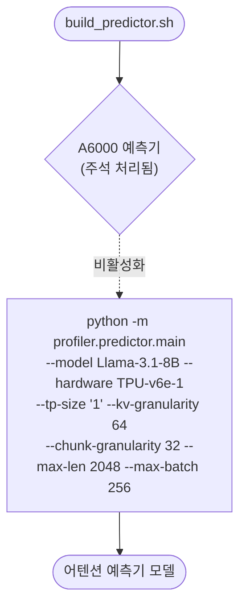

# `profiler/v0/build_predictor.sh` 분석

레거시(v0) 프로파일러의 **어텐션 지연 예측기(scikit-learn)를 학습**하는
스크립트입니다. 프로파일된 어텐션 데이터로 모델을 학습하여 시뮬레이션 중 실시간
지연 예측을 지원했습니다.

## 개요

| 항목 | 내용 |
| --- | --- |
| 목적 | 어텐션 지연 예측기 학습(실시간 예측용) |
| 모듈 | `profiler.predictor.main` (레거시) |
| 활성 대상 | TPU-v6e-1, TP=1 |
| 주석 대상 | A6000, TP=1·2 (참조용) |
| 상태 | 레거시(참조용) |

## 블록 다이어그램

## 주요 인자

| 인자 | 값 | 의미 |
| --- | --- | --- |
| `--hardware` | TPU-v6e-1 | 대상 하드웨어 |
| `--tp-size` | `1` | TP 차수 |
| `--kv-granularity` / `--chunk-granularity` | 64 / 32 | 예측 공간 격자 해상도 |
| `--max-len` / `--max-batch` | 2048 / 256 | 예측기 커버 범위 |

## 참고

- 상단의 A6000(TP=1,2) 예측기 블록은 주석 처리되어 있고, 하단 TPU-v6e-1(TP=1)만
  활성화되어 있습니다.
- 학습된 예측기는 레거시 `--enable-attn-prediction` 플래그로 시뮬레이터가
  사용했으나, 신규 버전에서는 직접 프로파일된 지연 조회로 대체되어 제거되었습니다.
