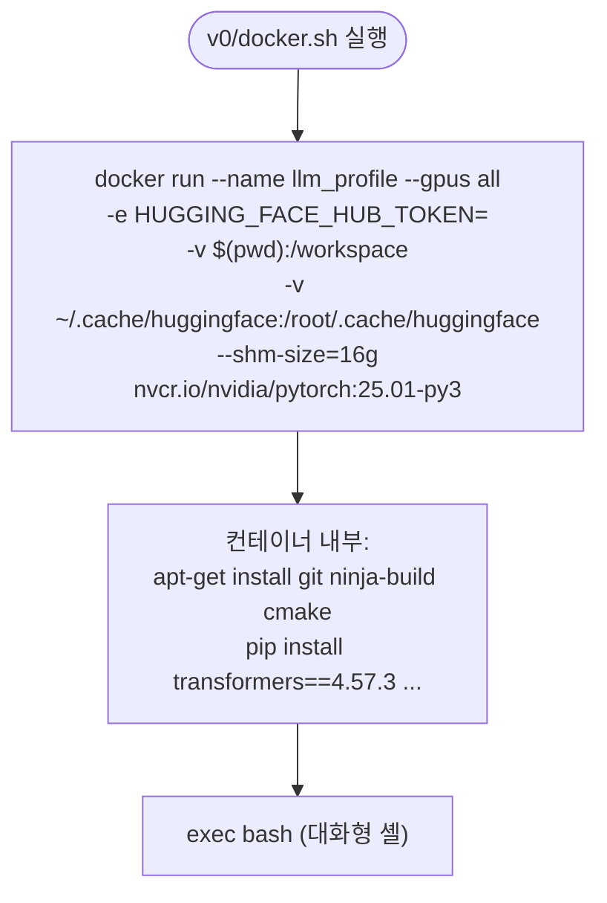

# `profiler/v0/docker.sh` 분석

레거시(v0) PyTorch 기반 프로파일러용 **PyTorch Docker 컨테이너**를 실행하는
런처입니다. 현행 프로파일러는 vLLM 기반(`scripts/docker-vllm.sh`)이며, 이 스크립트는
`profiler/v0/`의 이전 방식을 위한 참조용입니다.

## 개요

| 항목 | 내용 |
| --- | --- |
| 목적 | 레거시 PyTorch Profiler 실행 환경 기동 |
| 이미지 | `nvcr.io/nvidia/pytorch:25.01-py3` |
| GPU | `--gpus all` |
| 마운트 | 현재 디렉터리 → `/workspace`, HF 캐시 공유 |
| 상태 | 레거시(참조용) |

## 블록 다이어그램

## 단계별 분석

1. **컨테이너 실행** — NVIDIA PyTorch 이미지를 `llm_profile` 이름으로 실행하고,
   현재 작업 디렉터리를 `/workspace`에 마운트하며 HF 캐시를 공유합니다.
2. **초기화 명령** — `bash -lc`로 `set -euo pipefail` 하에 빌드 도구(`git`,
   `ninja-build`, `cmake`)를 설치하고 `transformers==4.57.3` 등 Python 패키지를
   업그레이드한 뒤 대화형 셸로 진입합니다.

## 참고

- `HUGGING_FACE_HUB_TOKEN="<your_token>"`의 자리 표시자를 실제 토큰으로 교체해야
  게이트 모델을 사용할 수 있습니다.
- 신규 작업에는 vLLM 기반 프로파일러(`scripts/docker-vllm.sh` +
  `profiler/profile.sh`)를 사용하세요.
